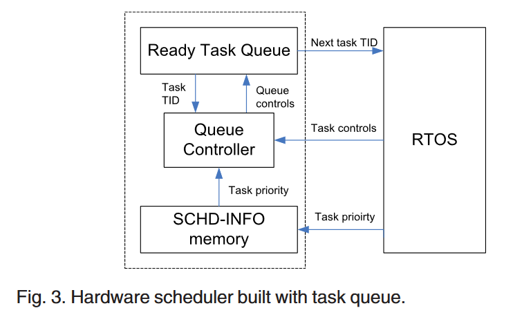

# A Hardware Scheduler Based on Task Queues for FPGA-Based Embedded Real-Time Systems

#### 赵方亮笔记

## Introduction

RTOS 加速技术已被证明可以减少计算开销并提高系统可预测性。

调度是影响实时系统行为的关键因素之一。

硬件调度器的主要缺点是硬件使用量增加和算法不灵活。

## Related Works

1.  Bitmap Scheduler 每个优先级只能存在一个任务。
2.  多级反馈队列：多个 FIFO 队列
3.  动态优先级实现复杂，可能引入较大的最快情况计算开销但任务抢占率较低

如果将任务调度从中央处理器中分离出来，它可以更快、更可预测。

协处理器：

两个独立系统之间的通信和同步问题，以及资源和功耗问题，CPU 上需要专门的协处理器接口。

## Hardware Task Queues

硬件队列难以直接删除某个任务（除了出队、入队操作外，可能还存在需要删除任务的操作）

### Task Queue VS. Packet Queue

Task Queue 需要增加 remove 操作。

1.  复杂的算法可能要求调度程序不断访问任务的 SCHD-INFO，而数据包队列只能通过出队控制来访问。
2.  任务队列（在小型嵌入式系统中）需要比数据包队列更小的队列长度，因此总线负载问题变得不那么重要。
3.  网络队列需要考虑峰值到达率，而任务控制通常以相当低的速率到达。
4.  任务的SCHD-INFO可能有很宽的索引范围（截止时间调度），而网络队列只使用少量的优先级位。

网卡上的数据包队列通常不考虑资源占用和功耗。
