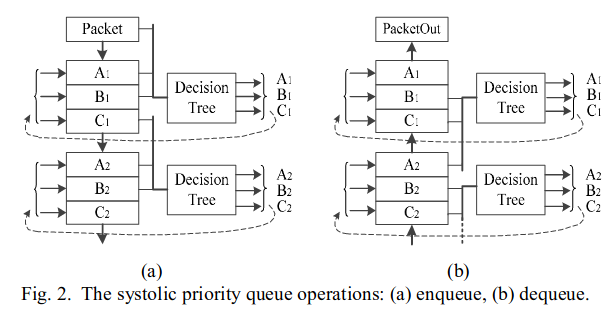
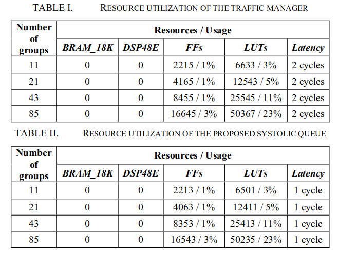
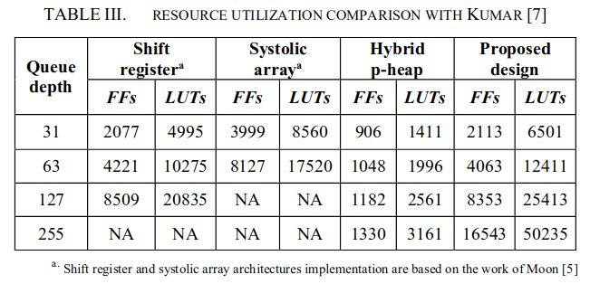
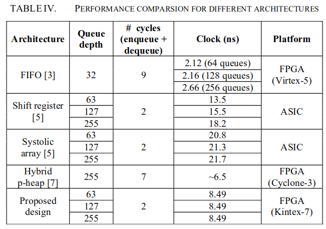

# A fast systolic priority queue architecture for a flow-based Traffic Manager

#### 赵方亮笔记

## Introduction

使用 Systolic Array，出队入队需要 2 个时钟周期，且使用 C 语言实现，较为灵活。

## The Systolic Array priority queue

入队：新包将与顶部的两个包参与决策，决定存储的内容，以此向下传递。

出队：顶部的包直接出队，上下的两个包与下一组顶部的包进行决策

## Experimental Results

 

#### 可能的缺点：开发板能不能支撑 Queue 深度增加后占用的资源与 RISC-V 软核占用的资源
