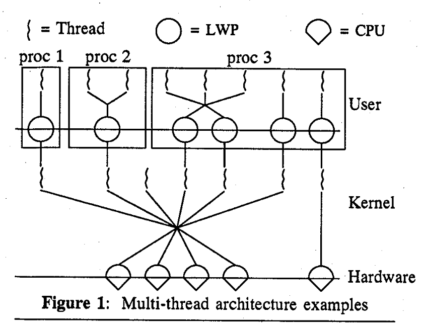
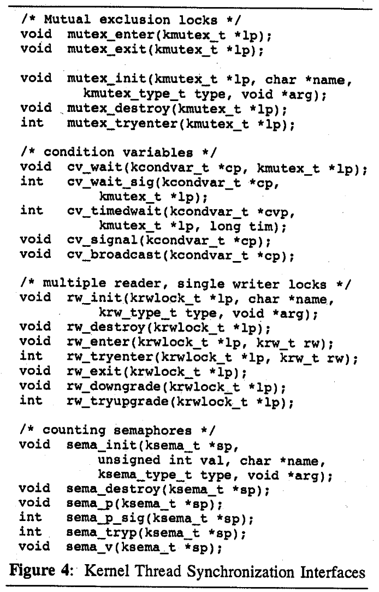

# Beyond Multiprocessing: Multithreading the SunOS Kernel

## Abstract

内核围绕线程进行重构。

内核完全抢占且能够实时响应。

## Introduction

在紧密耦合的对称多处理器上具有高度的并发性是很重要的。

在用户进程中支持多个线程。

## Overview of the Kernel Architecture

使用内核线程提供异步的内核活动。

中断也使用内核线程处理。

用户线程、lwp、内核线程以及硬件的对应关系：

允许用户进程能够有用上千个线程，而不占用内核资源。

### Data Structures

使用一个寄存器来保存 current 信息

## Synchronization Architecture

## Interrupts as Threads

将中断视为线程 ，可以使用标准的同步原语。

传统的中断处理：直接借用被中断进程的内核栈，或者使用独立的中断栈，并且必须执行完成。
