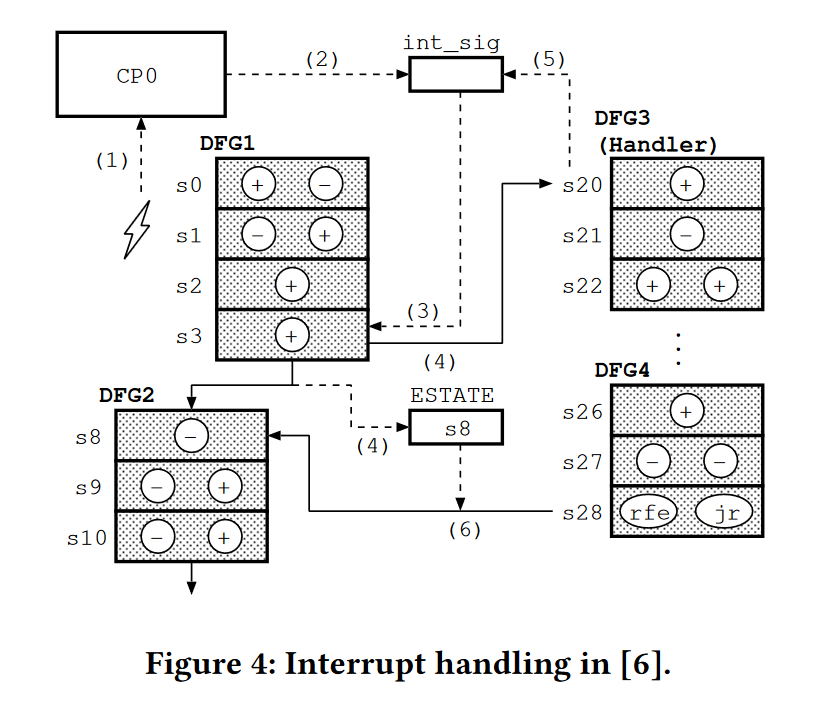
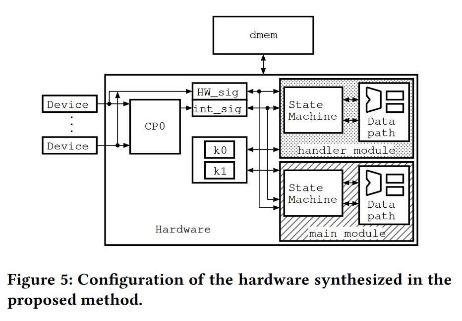
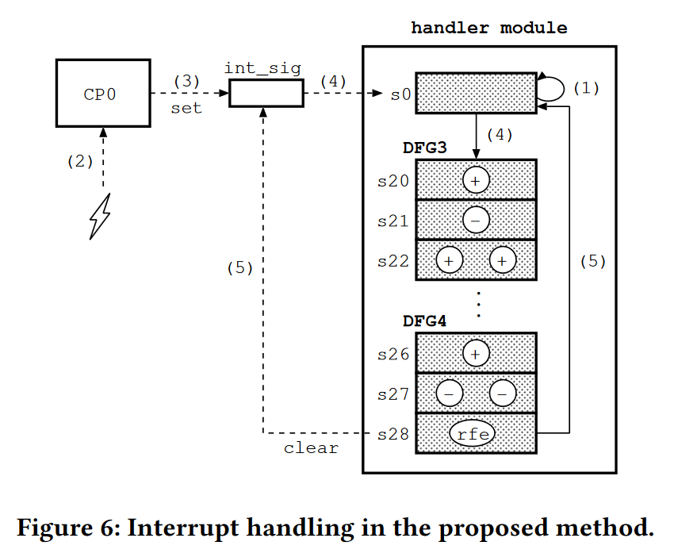

# Binary synthesis implementing external interrupt handler as independent module

#### 赵方亮笔记

## Introduction

二进制综合\[2]是一种高级综合，它以二进制代码而不是高级编程语言的程序作为输入。

即使在硬件上，寄存器的保存/恢复也需要时间，因为它会导致顺序内存访问。

主进程和中断处理程序被合成为单独的硬件模块。\
相当于使用一个专门的核来进行中断处理，通过这种方式消除保存和恢复寄存器。

## Binary Synthesis of MIPS Interrupt Handling

将二进制转化成对应的硬件加速逻辑。

### Systhesis from Binary Codes Containing Interrupt Handler

1.  中断信号发送给 CP0，被锁存在 int\_sig 寄存器中
2.  在 DFG1 的 S3结束后，检测到 int\_sig 中的中断信号，下一个阶段的状态 S8 被保存在 ESTATE 寄存器中，硬件跳转至 S20
3.  清除 int\_sig 寄存器
4.  在执行结束进入 S28 状态后，恢复寄存器

在这种方法中，合成的硬件必须像CPU一样保存/恢复寄存器。由于这是以顺序的内存访问结束的，因此，即使是硬件也需要几乎和CPU一样多的周期。

## Synthesizing Interrupt Handler into Separate Hardware

将中断处理例程与主程序分别运行在两个不同的部件上，不需要保存/恢复寄存器。

限制条件：

1.  只支持外部中断。
2.  中断处理例程不能使用引起中断的指令地址、不能访问指令存储器
3.  不支持中断嵌套

### Flow of Interrupt Processing

1.  S0 轮询 int\_sig 寄存器，等待中断信号
2.  中断信号发送给 CP0，CP0 将中断信号锁存在 int\_sig 寄存器中
3.  handler 模块跳转至 S20 执行中断处理例程
4.  当中断处理例程结束后，handler 模块返回到 S0

### Mutual Exclusion and System Call

将主核上的程序延迟，直到中断处理例程结束。

将 syscall 转化成以下流程：

1.  检测 handler 模块是否正在执行任务，若是，则跳转至 2，否则跳转至 3
2.  等待中断处理例程结束，跳转至 1
3.  等待中断模块完成系统调用的处理，进入下一个状态，期间发生的外部中断都被忽略。
