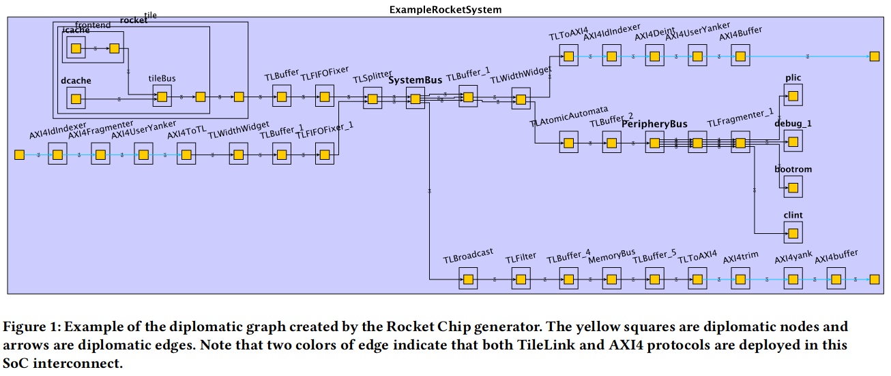
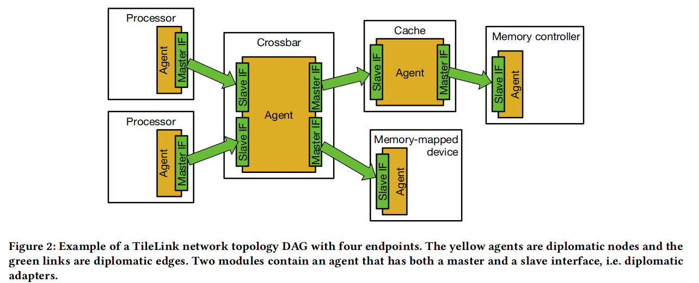
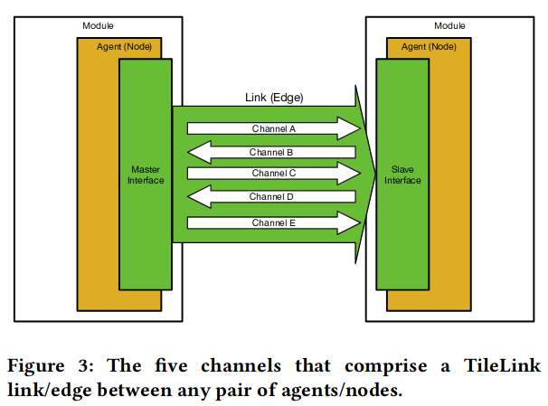

# Diplomatic Design Patterns: A TileLink Case Study

### 摘要

**背景**：现代片上系统 (SoC) 包含大量且数量不断增加的专用硬件单元，这些单元必须通过共享总线拓扑集成到统一的地址空间中。

**问题**：RISC-V 模块化带来的设计生产力收益因需要集成处理器变体、总线排序行为和从设备功能的叉积而受到瓶颈。

**解决方案**：Diplomacy、TileLink

### Diplomacy

节点和边组成的有向图。

#### Diplomacy Adapter Parameters

1.  source 连接到特定 sink
2.  sink 连接到特定 source
3.  master 类型和操作大小
4.  slave 类型与操作大小
5.  特定地址范围允许的类型与操作大小
6.  其他属性（可执行性、可缓存性）
7.  边缘操作的排序要求
8.  控制线中的某些字段
9.  控制线或数据线中的字段宽度

#### Diplomacy Negotiation

1.  source 节点参数向外流至所有 sink 节点
2.  sink 节点参数流至所有 source 节点

Diplomacy 外交是独立于总线协议的，因为任何具有参数化功能的协议都可以使用外交原语进行模板化，并与其他外交协议实现一起部署。

### TileLink

TileLink 设计用于部署在片上系统 (SoC) 中，以连接通用多处理器、协处理器、加速器、缓存、DMA 引擎、内存控制器以及简单或复杂的外围设备。

#### Five logical channels

为了避免死锁，TileLink 指定了必须严格执行的通道消息的优先级。

A « B « C « D « E

通道是定向的，因为每个通道都从主接口到从接口或从从接口到主接口传递消息。

##### 内存访问操作通道

A：传输操作请求，访问或缓存数据

D：传输数据响应，或向请求放发送 ack 消息

##### 附加通道，保证缓存一致性

B：传输在主代理缓存的地址的请求，访问或写回缓存的数据

C：传输数据或确认消息，写回脏的缓存数据

E：传输来自原始请求者的缓存块传输的最终确认，用于序列化

内存访问的合法性必须由发送放在事务发起之前确定。

TileLink 死锁保证源自：

1.  协议接口通用性
2.  层次扩展性（有向无环图）
3.  严格优先级通道
4.  通过 decoupled 接口转发

### Design Patterns

#### DRYing Out Parameterization

参数化生成器提高了传统 HDL 的生产力，但参数本身也成为了非正交复杂性的来源。

使用 Diplomacy 不需要显示指定参数，可从有向无环图中推断出参数信息。

#### Hardware Generation with A View

主节点可以查看其内存映射地址可见的所有从节点的功能。

相反，从站可以看到所有操作可以到达他们的主站的能力。

当某些主设备需要缓存时，可以使用五个通道；当不需要缓存时，可以省略其余的通道，按需使用。

### Correct By Composition

1.  combinational composition: 可以通过组合多个小型适配器来创建更大的逻辑适配器，以实现完整的功能，而各个适配器可以相互独立地进行单元测试和验证。
2.  sequential composition
3.  hierarchical composition
