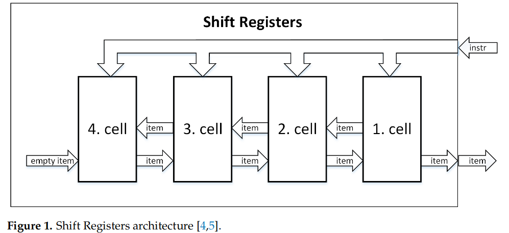
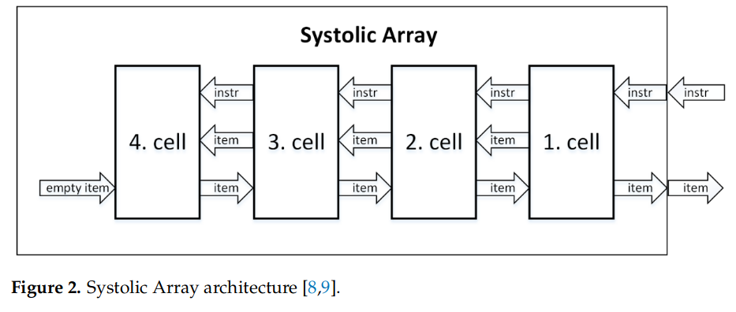
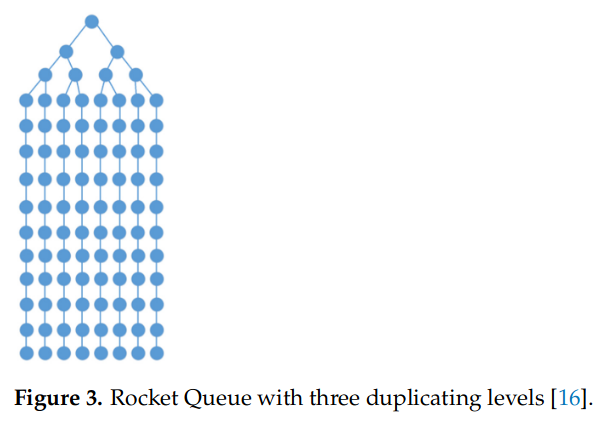
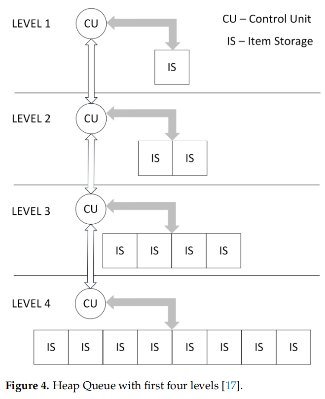
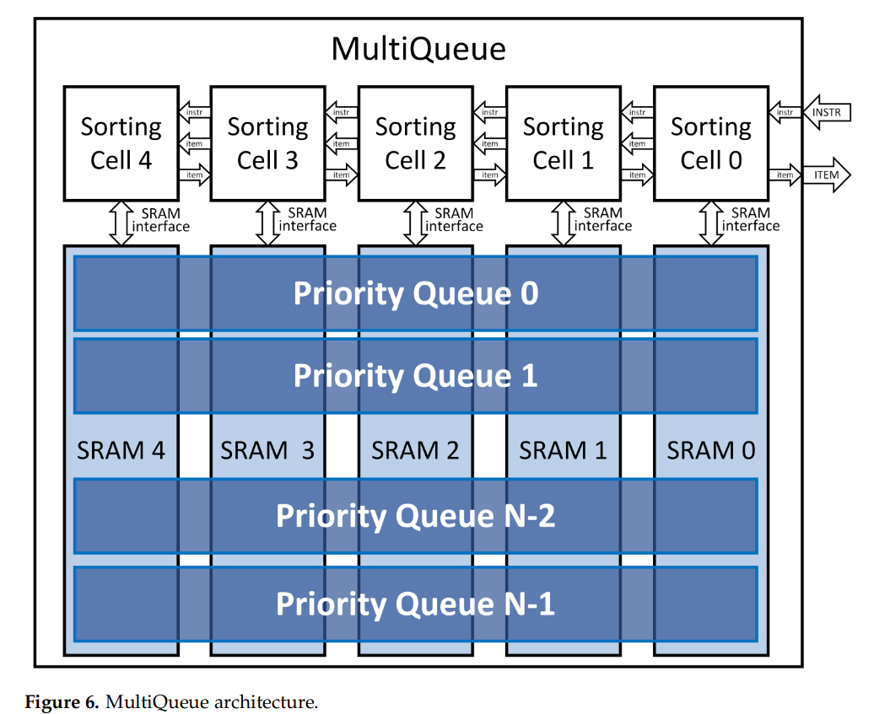
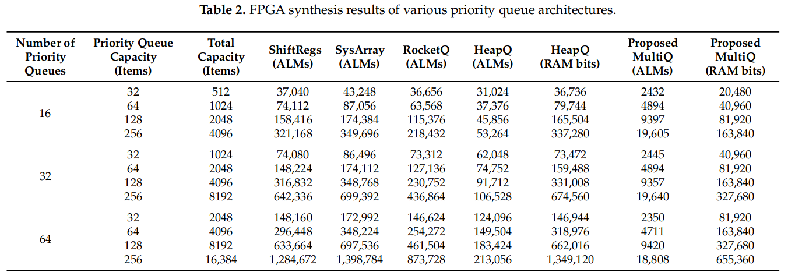

# Efficiency of Priority Queue Architectures in FPGA

#### 赵方亮笔记

基于 shift register、systolic array 和 SRAM memories。

## Introduction and Motivation

尽管软件实现通常足以满足许多应用程序的需要，但在某些情况下，有必要以更快的速度对更多数据进行排序/排队或保证恒定的响应时间。

硬件优先级队列的应用场景

1.  操作系统任务调度
2.  网络
3.  CPU 指令乱序执行
4.  图论加速

目标：减少多个优先级队列时使用的资源，并且在只访问一个优先级队列时保持相同的性能和恒定的响应时间。

## Priority Queue Requirements

SORT\_DATA（排序依据）、ID（数据包的唯一标识，也可以是指针或者地址）、VALID

通过指令控制队列

1.  nop: 00
2.  insert：01，插入单个元素
3.  remove：10，移除单个元素
4.  insrem：11，insert 和 remove 组合版

优先级队列参数

1.  MAX：1bit 指示队列是最小队列还是最大队列
2.  SD\_W：与 SORT\_DATA 的范围相关，SD\_W = log2(SORT\_DATA)
3.  ID\_W：直接表示 ID 字段的位宽
4.  SIGNED：表示 SORT\_DATA 是否有符号
5.  CAPACITY：可容纳的最大元素数量

优先级队列的属性：

1.  常数响应时间
2.  高吞吐量
3.  低占用面积和低功耗

## Related Work

1.  FIFO：当容量大时，MUX 比较树的复杂性增加，效率低下
2.  shift register 只能适用小容量的场景，一旦容量增加，关键路径更长
3.  DP RAM Heapsort：元素存储在双端口 RAM 中，不能单独执行 insert 或 pop 指令，因此不能用于实现优先级队列
4.  systolic array：每个时钟周期一个单元的速度从第一个单元到最后一个单元顺序移动。每条指令需要两个时钟周期。
5.  Rocket Queue：比 systolic array 节约 41% 的逻辑资源。由 systolic array 和 DP RAM Heapsort 演变而来。由 duplicating 和 merge level 组成（duplicating level 不宜超过5层）。公用比较器
6.  Heap Queue：每层由 CU（control unit）和IS（Item Storage）组成。

## MultiQueue

使用 SRAM 存储元素，而不是寄存器；

多个 shift register 和 systolic array 公用同一套组合逻辑，每次只能访问一个队列。

SRAM 为一列，可以存放不同的优先级，一列中的排序模块与 systolic array 中的相同。

缺点：

1.  SRAM 的深度与 N 相同，且必须为 2 的次方；
2.  并且这里假设每个队列的容量都相等，现实情况不一定与假设相等

每个指令需要 2 个时钟周期，在 FPGA 和 ASIC 上的 SRAM 的最小深度要求不同

## Design Verification

500000 测试，755条指令，1/3 插入，1/3删除，1/3insrem，16个队列，8bit itemID，每个队列256个元素，32bit SORT\_DATA

## FPGA Synthesis Results

对于 100 MHz 时钟和 32 位项目，所有这些解决方案（堆队列、Rocket 队列、脉动阵列和 MultiQueue）的性能均为 1.6 Gbits/s。
