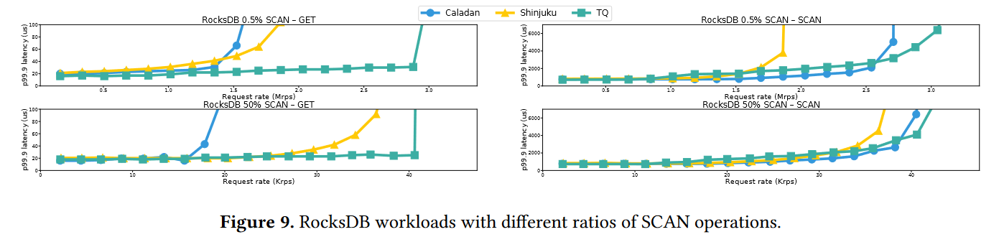
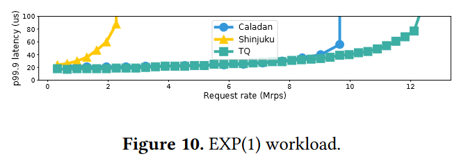
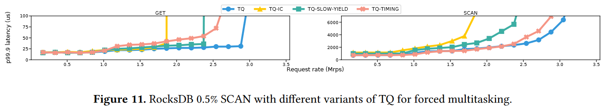
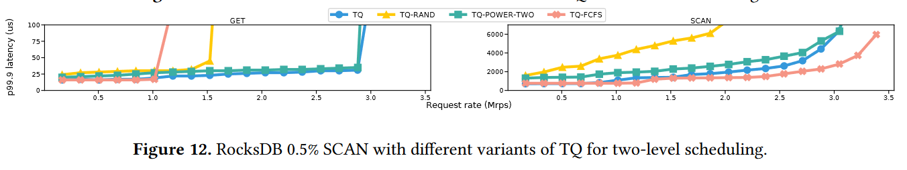
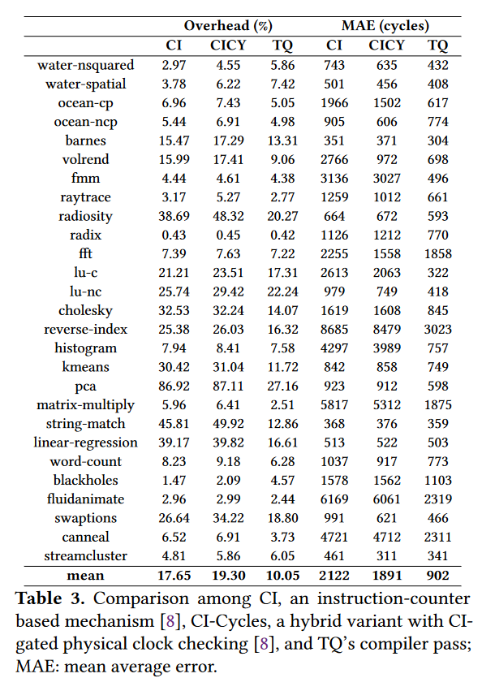
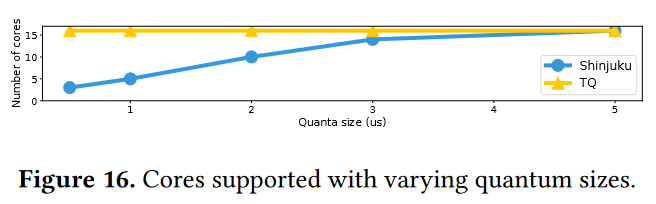

***

tags: \[] parent: 'Efficient Microsecond-scale Blind Scheduling with Tiny Quanta' collections: - 调度 version: 16012 libraryID: 1 itemKey: U8MWHNB8

***

# Efficient Microsecond-scale Blind Scheduling with Tiny Quanta

## Abstract

在基于数据中心的应用程序中，一个长期存在的性能挑战是如何高效处理接收到的客户端请求，这些请求会产生许多非常短（微秒级）的作业，必须以高吞吐量和低尾部延迟来处理这些作业。

对于没有对单个任务的持续时间进行假设，或者任务持续时间的分布，盲目调度和频繁有效的抢占，对微秒级的任务是无法扩展的。

本文提出 TQ，一个能高效盲调度微秒级工作负载的系统。

TQ 实现了较低的尾部延迟，同时吞吐量是之前盲调度系统的 1.2 倍至 6.8 倍。

## Introduction

很多先进的工作基于对请求负载的时间或者分布有所了解，因此会限制系统的通用性。

如果服务时间分布不广，大多数工作的持续时间相似，那么类似 FCFS 的调度就足够了。

本文不对工作负载进行假设，称之为 “blind scheduling”。

为了避免队头阻塞，需要让调度器能够即使抢占，让后续的任务能够执行，而需要知道当前的任务还需要多久执行时间。

由于缺少当前任务剩余执行时间，调度系统通常围绕着处理器共享的概念进行设计。在运行下一个任务时，会为任务分配一定的时间片。为了尽可能避免队头阻塞，需要设置时间片尽可能小，但每次切换存在固定开销，时间片又尽可能大，这两种需求存在矛盾。

使用 5 微秒以下的时间片来保持高吞吐量所需的条件。

第一个挑战：之前的做法依赖于抢占式多线程调度，但在时间片较小时，切换开销会较大。shinjuku 存在 1 微秒的线程中断延迟。协作式多任务面临的问题是如何在消耗了最小服务量之后主动让权。

第二个挑战是如何使调度框架可扩展。（选取下一个任务的总工作量随着抢占次数增加而线性增加，而抢占次数大致为最小服务量的倒数）。shinjuku 的中心化调度器成为了性能瓶颈。

第三个挑战：以更细粒度交错执行任务，会造成 CPU 缓存被污染，造成额外开销。需要研究在 5 微秒的抢占情况下的缓存行为。

TQ 的核心思路：

1.  使用协程 + 编译器插桩实现强制多任务，并且将基于指令计数的编译器插桩修改为基于物理时钟的插桩，更加高效。
2.  使用两级调度架构支持调度器扩展，避免了中心化调度器成为瓶颈。per-CPU 调度器使用 blind scheduler，保证了任务在这个 CPU 上运行，保证了亲和性，而 job dispatcher 使用 JSQ(join-the-shortest-queue) 负载均衡策略。
3.  在 TQ 中使用较小的最小服务量不会由于缓存污染导致性能下降。

## The Case for Tiny Quanta and the Need for Low Overhead

基于抢占没有开销展开。

若减少了抢占的开销，则减小时间片非常有价值。

（17个核，一个核充当中心化调度器，16个核从各自的队列上取出任务）

当时间片越小（0.5微秒）时，slowdown 最小。

（不同的抢占开销下，不同的时间片下能达到的吞吐量）

减少时间片可使系统以较低的尾部延迟承受更高的负载，但前提是开销必须足够小。

## Design

1.  dispatcher 从网卡轮询收到的包
2.  根据每个 worker 的工作负载将收到的包分发到 worker
3.  worker 根据 blind scheduling 交错执行各自的任务
4.  一旦任务完成，worker 直接发送响应，不需要经过 dispatcher
5.  dispatcher 从 worker 处获取负载数据，作为负载均衡的依据

### Forced multitasking

在用户态使用协程让权，不需要执行系统调用也不需要切换虚拟内存映射。

有栈协程可以以 10 纳秒的时间尺度让权，而无栈协程则可以在几纳秒的时间尺度让权。

协程让权是主动的并且不需要依赖外部中断。

如何保证及时主动让权？

1.  微秒级的任务在设计上很少有明显的让出点
2.  开发人员很难计算插入让出点的位置，以及连续让出点之间的间隔

解决方案：编译器插入让出点，不给开发人员带来负担。

挑战是在何处插入让出点：（因为访问内存等指令需要的时间不同）

TQ 会将探针放在可能的让出点，但是否让出在运行时进行决策。在运行时，一旦到达探针位置，将会检查自从上一个让出点到探针之间经过的时钟周期数是否达到最小服务量，一旦达到，则会调用 yield 让权。（需要确保精准抢占以及合理的探测开销）

之前的插桩方式：编译器维护一个带有探针的指令计数器，在每个基本程序块结束时检测探针。将目标时间片转化为目标指令数，如指令计数器的值大于目标指令数，则会产生结果。

TQ 基于物理时钟进行探测，即使读取物理时钟使用的 CPU 周期数更多。但这会带来以下好处：

1.  灵活的插桩点：在程序中的任意位置都能正常工作，而不必考虑执行流的问题（基于指令计数的方式需要考虑到执行流，需要放置更多的探针），由于乱序执行，读硬件时钟（rdtsc）指令与其他指令并行，因此开销较小，而由于减少的探针数量，因此综合起来，这种方式的开销更小。
2.  抢占时间精度更高

TQ 使用指令计数来保证插桩密度，但是否让出由物理时钟决定。

### Two-level scheduling

挑战：

1.  可扩展性、当缩小时间片时，调度器自身的开销不能成为性能瓶颈；
2.  调度器在各个核之间进行负载均衡，保证，低延迟和高吞吐

已有的工作：集中式调度，可扩展性差

在极端双模工作负载中的长作业，中心化调度不如两级调度。要维持性能，则必须增加专用调度核的数量。

基于 forced-multitasking 和 blind scheduling，调度核只需要做很少的事情，不会成为性能瓶颈，可以处理更小的时间片。TQ 中只负责进行负载均衡。

worker 的调度策略以及 dispatcher 的负载均衡策略共同构成了两级调度。

worker 采用 PS 策略，对于重尾服务时间分布是最优的，dispatcher 采用 JSQ 负载均衡策略，实现的开销最小，且 JSQ-PS 组合策略对于平均停留时间是接近最优的。

JSQ 的实现方式：naive（random）会导致将长作业分配给一个已经有长作业的核心之上，这会导致这两个长作业来回切换，导致性能下降。MSQ 方式会挑选出为当前任务使用了最多时间片的核心，并且期望该核心的剩余处理时间较少。

  

（在没有抢占开销时，CT 在仿真中的表现更好，但 TLS 可以得到有效支持，使得 TQ 的实际表现优于 shinjuku）

此外，两级调度的缓存亲和性较好。

## Implementation

### Compiler-instrumented yielding

### Networking

DPDK：dispatcher——RX，worker——TX

buffers：dispatcher——consumer，worker——producer

### Dispatcher

worker：任务计数、已经使用的时间片数量

### Worker

初始状态时执行调度程序，idle 协程会轮询调度器中待处理的任务，一旦检测到，则会恢复执行协程（对称协程）。

两个任务计数器都在缓存中，由 dispatcher 读取。

### Critical section

不允许抢占

## Evaluation

针对以下指标：

1.  多小的时间片？
2.  与之前的支持 blind scheduling 的系统相比，TQ 的性能如何？
3.  TQ 的不同组件对性能的影响如何？
4.  小时间片的情况下，高速缓存的影响如何？
5.  forced-multitasking 和 两级调度的性能如何？

### workloads

仿真负载：高双模负载和极端双模负载，测试 TQ 如何有效防止队头阻塞。

实际负载：在 RocksDB 上构建的内存键值存储，采用了不同的 SCAN 操作比例（0.5% 和 50%），并测试 TQ 是否能确保在高吞吐量情况下 GET 的低延迟。

比较：Caladan、Shinjuku

Caladan

Caladan 采用 FCFS 调度策略，利用 RSS 哈希将数据包导向 worker，并让 worker 运行作业直至完成。worker 进行工作窃取。使用 IOKernel core 与网卡交互。

Shinjuku

利用中断来抢占 worker，执行其他任务

#### client

使用了**开环负载发生器**生成以工作负载平均服务时间为中心的泊松分布，使用 UDP  传输请求。

对于每种请求率，实验运行 10 秒钟，并丢弃前 10% 的样本消除预热效应，且所有 client 设置相同。

#### Latency metrics

end-to-end latency：包括网络往返时延，用于不同的系统之间的比较

sojourn time：由 server 统计收到请求到完成请求之间的时间，用于 TQ 的不同配置的影响

#### Testbed

Caladan 在一个核上运行 IOKernel、TQ 运行 dispatcher，都是用 16 个核运行 worker。

### Benefits of small quanta

使用 Extreme Bimodal 工作负载对 TQ 进行了评估，时间片大小从 10μs 到 0.5μs，并测量了不同请求率下的 99.9% 延迟。

（横轴展示出吞吐率，纵轴展示出尾部延迟）

2微秒能够达到10微秒时间片的吞吐量，当时间片大于 0.5 微秒时，不同时间片下达到的吞吐量相当。

TQ 的 forced-multitasking 机制的开销，足以支撑 1 微秒的时间片。TQ 的两级调度机制可以 0.5 微秒的时间片进行调度。

### Comparison with Caladan and Shinjuku

TQ 的性能表明，它的吞吐量是 Shinjuku 和 Caladan 的 1.2 倍到 6.8 倍，且在所有工作负载下，延时更小。

#### Extreme Bimodal

Caladan 虽然可以为长任务维持较高的吞吐量，但短任务的延迟较差（因为采用 FCFS 策略）。

Shinjuku 不能维持高吞吐量（由于大量抢占开销），尽管小负载时延迟很低。

TQ：

1.  短作业：在吞吐量达到 4.5 Mrps 之前，延迟都小于 50 微秒，吞吐量是 Caladan 的 2.1 倍，Shinjuku 的 2.6 倍。

2.  长作业：吞吐量是 Caladan 的 1.2 倍，Shinjuku 的 1.8 倍。

    **在中等负载情况下，Caladan 的长作业延迟比 TQ 低，这是意料之中的，因为 FCFS 优先调度长作业。**

#### Hign Bimodal（请求率和分散比例更低）

Shinjuku 由于抢占，相较于 Caladan 可以实现更高的吞吐量且端到端延时在 50 微秒以下。

TQ

1.  短作业：吞吐量分别是 Caladan 和 Shinjuku 的 1.65 倍和 1.33 倍。

2.  长作业：最高吞吐量，延时与 Shinjuku 相当，但

    **延时高于 Caladan（FCFS 策略），增加了抢占开销**

#### TPC-C（不同系统对于不同规模的作业的处理）

Shinjuku 可以降低短作业的延迟（抢占式调度）；

Caladan 对于长作业能够达到更高的吞吐量；

TQ 针对了各自的缺点进行了优化。在 10 倍总体减速预算下，TQ 的吞吐量是 Caladan 的 1.29 倍，是 Shinjuku 的 1.18 倍。

#### RocksDB

在 0.5% SCAN 的操作，对于 GET 操作，TQ 能够达到 Shinjuku 和 Caladan 1.93x、2.07x 的吞吐量。

在 50% SCAN 的操作，对于 GET 操作，TQ 能够达到 Shinjuku 和 Caladan 1.28x、2.21x 的吞吐量。

对于 SCAN 操作（开销较大），TQ 相较于 Shinjuku，在 0.5%、50% 的 SCAN 操作下，TQ 的吞吐量是 1.63x 和 1.13x。

#### Exponential

TQ 的端到端延时在 50 微秒之下的情况下，吞吐量是 Shinjuku 的 6.85x，Caladan 的 1.21x。

### Breakdown of TQ’s performance

（TQ 自己内部的比较）

#### Forced-multitasking

每个不同的组件都对 TQ 的性能有重大的影响。

TQ-IC：使用基于指令计数器的插桩，由于探针的开销较大，吞吐量为 TQ 的 62%

TQ-SLOW-YIELD：在协程让权时，增加 1 微秒的延迟，吞吐量是 TQ 的 81%，对于需要更多抢占的场景下，吞吐量的差距更大

TQ-TIMING：对于 GET 和 SCAN 使用 1微秒 和 3微秒模拟不准确的抢占，吞吐量为 TQ 的81%，但 GET 操作由于时间片过小导致队头阻塞的情况更严重。

#### Two-level scheduling

（前两个针对 dispatcher（负载均衡），后一个针对 worker，采用 FCFS 调度策略）

TQ-RAND：GET 操作在 50 微秒的延迟下，吞吐量为 TQ 的 53%

TQ-POWER-TWO：吞吐量相当，但延时稍高

TQ-FCFS：吞吐量与 Caladan 相当，只能达到 TQ 的 34%（由于队头阻塞问题），对于长作业，FCFS 更友好。

### Cache behavior at microsecond scale

1.  时间片对缓存的影响
2.  两级调度以及中心化调度对缓存的影响

### Performance of TQ’s components

1.  基于物理时钟的探针是否始终优先于基于指令计数器的方法？
2.  两级调度是否允许轻易的扩展？

#### Compiler instrumentation

与 CI 相比，TQ 的编译器传递平均减少了 43% 的探测开销和 57% 的产出时序平均误差 (MAE)。主要由于 **TQ 有策略的放置探针**。

#### Two-level scheduling

客户端生成一个仅由 1 毫秒作业（减小由于 dispatcher 的数据包处理开销）组成的工作负载，Shinjuku 和 TQ 尝试按照一些时间片大小大小进行调度。

最后的评价指标是一个 dispatcher 能够支持的最大的 worker 数量。

当时间片大小从 5μs 下降到 3μs 时，Shinjuku 的 dispatcher 无法支持 16 个 workers。TQ 始终可以支持 16 个 workers。

## Limitations and Discussion

### Dispatcher throughput

不需要解析包的内容来决定转发，而不维护队列，dispatcher 能够达到 14Mrps 的吞吐量，其他的系统只能达到 5Mrps（需要增加 dispatcher 的数量）。

### Synthetic cache evaluation

对缓存行为的仿真不足以解释真实负载下的行为。真是负载对缓存的影响更多。因此需要更多的真实负载来测试缓存对性能的影响。

### Reentrancy

需要防止不安全的重入，可能的解决方案是：在不可重入的函数张不插桩。

## Related work

### 微秒级调度

1.  基于对工作负载有了解
2.  使用中断进行盲目抢占，开销过大
3.  Concord 使用共享缓存行来取代中断，但使用了中心化调度

### Compiler-instrumented yields

之前的工作探针的开销过大，且抢占不准确。

使用编译器插桩来实现定时器中断，与 TQ 相似。但 TQ 的探针数量更少，减小了开销。

### Hardware-assisted user-level interrupt

UINTR 的开销约为 2000 个周期，不适用于小时间片（小于 5 微秒）的调度。LibPreemptible 支持的最小时间片为 3 微秒。而 TQ 可以支持 1微秒。

### Two-level scheduling

TQ 利用 MSQ 打破捆绑来减少长作业的延迟。

## 评价：

1.  并且对于插桩的细节进行了很多剪枝优化。
2.  对于调用的外部库或者系统调用，编译器不知道执行的细节，这种方式需要额外的开销
3.  Concord 也采用了这种编译器强制协作的方式，在相关工作中提到了 Concord 的工作，但没有进行两者的对比
4.  文中对于 Caladan 的延时和吞吐量的解释，都是用 FCFS 更适合于长作业任务来解释，可能比较乏力；但 TQ 内部对比了不同的插桩计数之间的差距对比
5.
