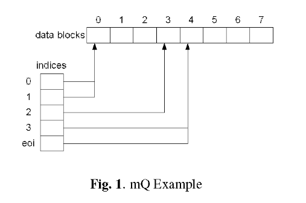

# Efficient Priority-Queue Data Structure for Hardware Implementation

## Introduction

硬件任务调度器（优先级队列）提供：

1.  快速调度时间
2.  减少 CPU 周期性时钟 tick 负载
3.  低抖动

## Relative work

介绍了二叉树、多 FIFO、移位寄存器、脉冲阵列等优先级队列的缺点。

## Architecture

mQ：将多个优先级队列实现在单个 array 中。（即可以容纳的元素数量）

array 头部保存数据，indices 0，1，2，3指向的为优先级为0，1，2，3的队列头部位置。

每个优先级队列的开始由其优先级索引值确定，结束由下一个优先级索引的值确定。

### 入队

入队在末尾添加元素，后续的元素全部右移。后续的索引值全部 + 1

### 出队

直接从队头移出元素，后续索引值全部 - 1

## Hardware Implementation

读：从 data\_out 读出数据，并拉高 shift left out，将右侧的数据移动至左侧邻居。

写：从 data\_in 输入数据，拉高shift right out，将左侧的数据移动至右侧邻居。

其余的信号是用于同时读写。

选择了 index 用于读，将输出 position 用于选择在 array 中的正确元素，拉高count\_down\_out，将后续的索引 - 1；

选择下一个队列的 index，输出 position，拉高 count\_up\_out 将后续的索引值 + 1。

## Analysis

dequeue 操作需要 24 个时钟周期
