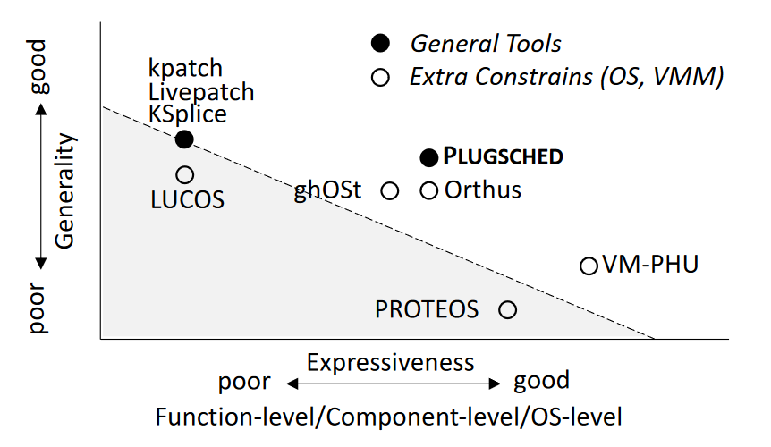
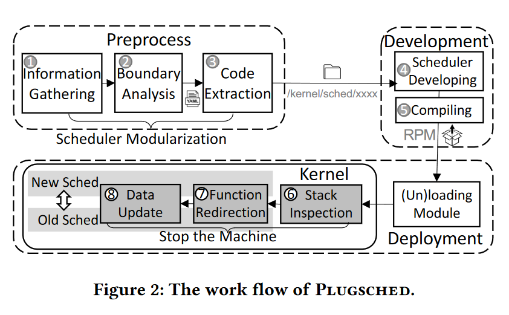

# Efficient Scheduler Live Update for Linux Kernel with Modularization

## Abstract

调度程序是操作系统 （OS） 的关键组件，与 Linux 紧密耦合。

生产级云通常托管各种工作负载，这些工作负载需要不同的调度器才能实现高性能。

在不重新启动操作系统的情况下实时更新调度程序的能力对于生产环境至关重要。

Plugsched 以模块化的思想，将调度器与 Linux 内核解耦为一个独立的模块;

Plugsched 使用数据重建技术将状态从旧调度器迁移到新调度器。

Plugsched 允许开发人员通过重建技术更新整个调度器子系统并修改内部调度器数据。

## Introduction

由于调度器依赖于复杂的同步原语，如RCU（Read Copy Update）和中断，并与其他子系统（如操作系统中的内存管理）进行交互，因此它对调度延迟、CPU利用率等有直接影响。

不同的调度器对应用程序的性能存在不同的影响。

使用新调度器的简单方法是使用新调度器重新编译内核，重新启动操作系统，重新初始化硬件，并重新启动上层应用程序。

1.  直接将应用程序迁移到使用合适的调度器的节点，但花费的时间比直接更新更多
2.  打包工具直接更新程序，插入新代码，但只适用于少量代码更新，例如函数级别的代码更新

PLUGSCHED 的做法

1.  模块化：动态更新的前提
2.  数据重建：将旧调度器的数据状态迁移到新的调度器（一些研究工作不考虑数据重建，或者使用对象替换/影子数据结构避免数据状态迁移）

先提出了边界分析方法，通过静态分析来分析模块的依赖关系。

四个基本设计原则：

1.  使用内核调用图来分析调度器与剩余内核之间的明确边界
2.  充分利用多核来优化栈检查方法
3.  将原函数重定向为新函数，\_\_schedule() 函数使用 stack-pivot 和 ROP
4.  使用重建的方法来处理数据迁移

## DESIGN GOALS

1.  Adequate expressiveness
2.  High generality
3.  Achieve both short downtime and safety
4.  Easy-to-use

## SYSTEM DESIGN

堆栈检查是为了将栈上的函数调用关系替换成升级后的函数

使用工具，通过静态分析与代码生成将调度器放到一个单独的模块中。

更新需要在安全的时机进行。

### Scheduler Modularization

以函数为粒度来进行模块化划分，将函数分为三种类型：

1.  F

    interface

    ：调度器与内核其他部分的边界

2.  F

    internal

    ：调度器内部，只能被内部函数或边界函数调用

3.  F

    external

    ：与调度器无关的函数

Fscheduler = Finterface ∪ Finternal = F - Fexternal

数据分为两类：

1.  D

    internal

    ：调度器内部，不能被 D

    external 

    引用

2.  D

    external

    ：在调度器和内核的其他部分使用
