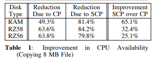
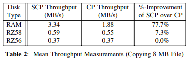

# Exploiting In-Kernel Data Paths to Improve I/O Throughput and CPU Availability

## Abstract

增加 splice 系统调用，异步的从文件描述符表示的对象中迁移数据，优化了数据拷贝和上下文切换的开销，从而增加 IO 吞吐量和 CPU 利用率。

## Design Goals

通过提供新的系统调用 splice，不影响标准UNIX I/O体系结构和接口。

1.  与 read 和 write 相同，不将数据移入或移除用户地址空间。不基于内存的接口。（会涉及到地址空间，需要vmm机制。）
2.  异步

## Interface

参数：

1.  src\_fd：源
2.  dst\_fd：目的地
3.  size：数据量

若两个 fd 中的任意一个启用了 FASYNC 标志，则异步运行。调用程序通过 SIGIO 来检测异步拼接的完成情况。

## Implementation

### Implementation and Operational Details

1.  从 gnode 中获取源文件的大小
2.  动态分配 splice 描述符来记录数据传输的状态信息，记录所有的必要信息，保证可以在不需要在进程上下文的环境下进行
3.  通过 bmap 获取源文件的物理块号并存放在 splice 描述符中
4.  目的文件的处理类似，但使用了 bmap 的优化版

### Read-Side Operation

源文件和目的文件之间的数据传输必须无阻塞的进行。bread 函数可以发起读请求，并马上返回，不需要等待缓冲区完成。通过设置缓冲区的 B\_CALL 和 b\_iodone 标记，在读请求完成后，将调用读处理函数，读处理函数在系统调度队列表的头部放置写处理程序来调度写操作。

### Write-Side Operation

通过带有锁的缓冲区 callout 列表（包含从源文件中读取出的有效数据），使用 callout 列表使得读写可以分离，同时进行（一边从源文件中读，一边写到目的文件中）。缓冲区中新增了字段来标记逻辑块的序号，因此可以支持乱序。读写共用缓冲区。

设置 b\_ionode 标记来设置读处理函数，并由 bawrite 函数发起异步读操作。在读操作完成之后，调用读处理函数，调用 brelease 函数释放缓冲区。

### Flow Control

基于写请求完成率来进行流量控制。splice 描述符中维护了待处理的读写请求的计数，当下降到阈值后，将发出额外的请求。

## Experiments

目的：IO吞吐量优化、CPU 利用率（减少了使用 read/write 系统调用的数据拷贝和上下文切换开销）

### CPU Availability Test

在三种环境下进行测试完成一组固定操作需要的时间：

1.  IDLE：不进行其他的操作
2.  CP：文件拷贝（从一个物理块拷贝到其他的物理块）
3.  SCP：使用 splice 完成文件拷贝

在越快速的设备上，splice 的优化效果越明显

### Throughput Tests

由于设备速度降低，磁盘处理的时间为主，splice 的优化较小。

### Discussion

1.  缩短数据路径需要消除数据到用户空间的需求
2.  绕过上下文切换开销，并且将流控与数据块顺序控制转移到内核中
