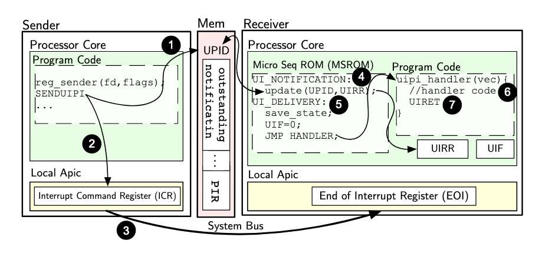
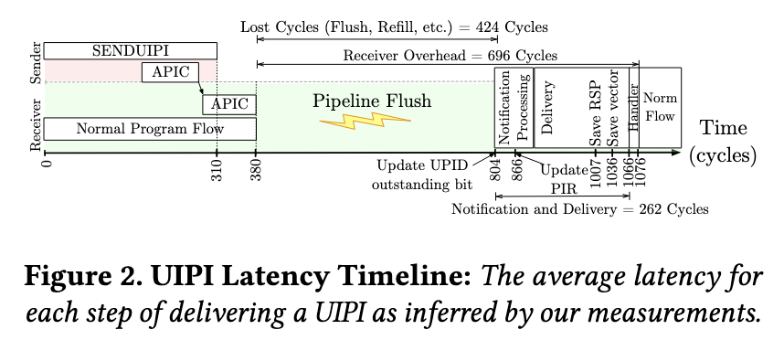
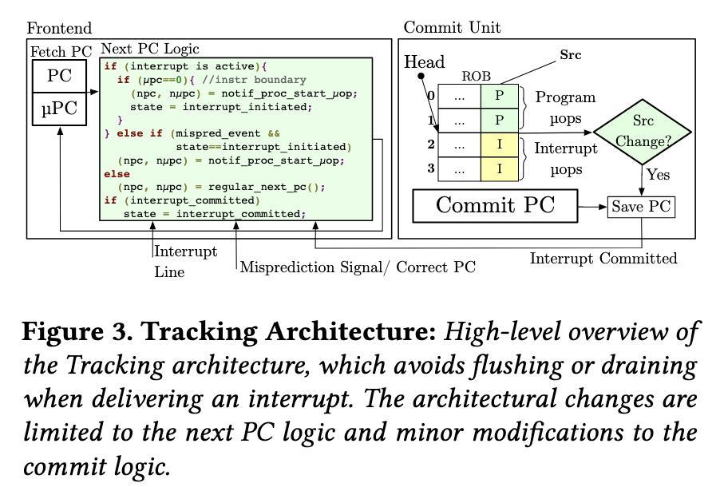
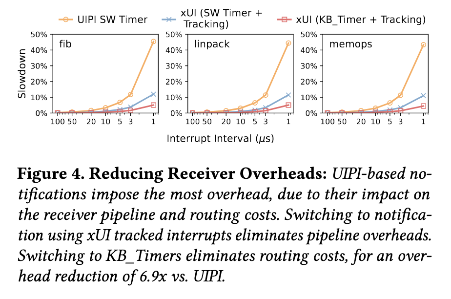
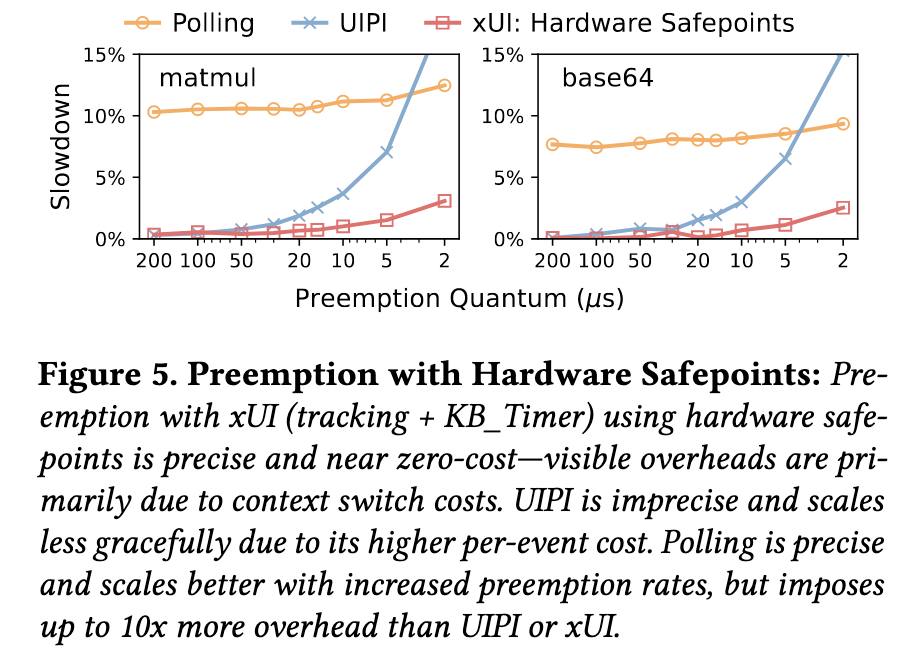
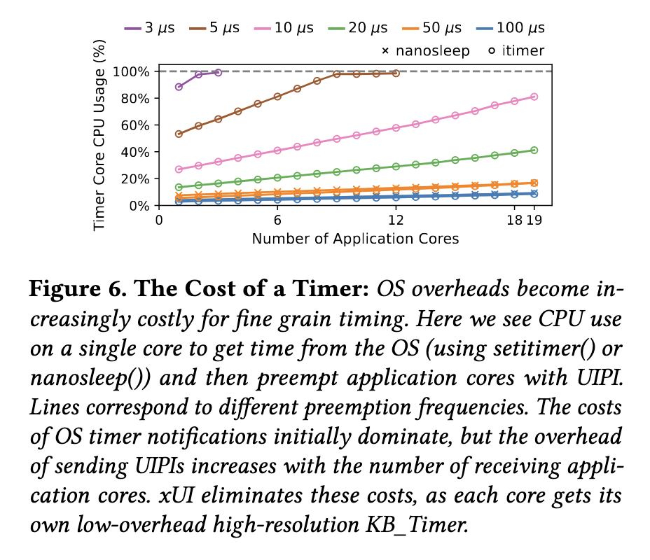
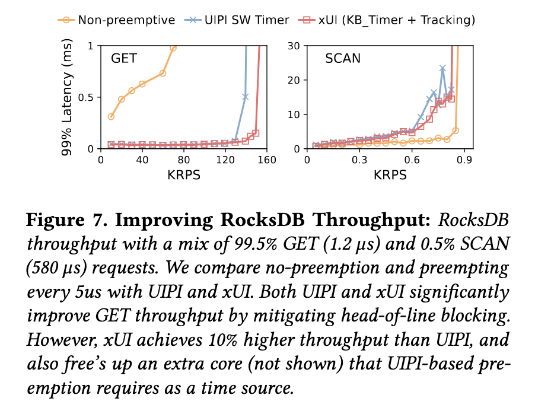
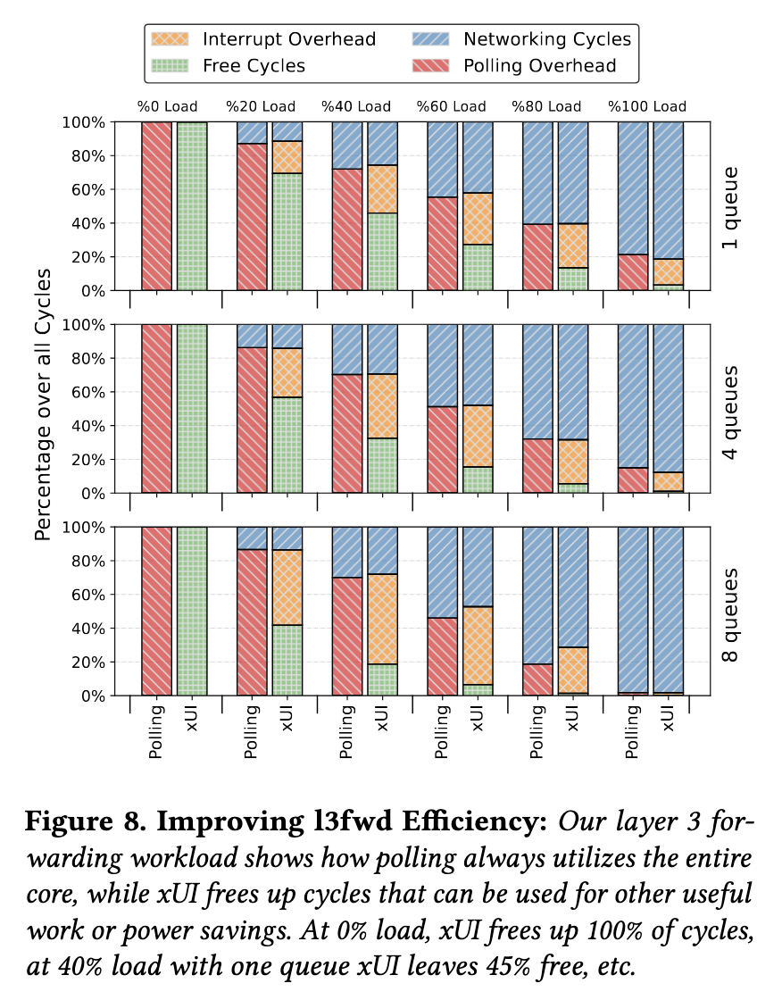
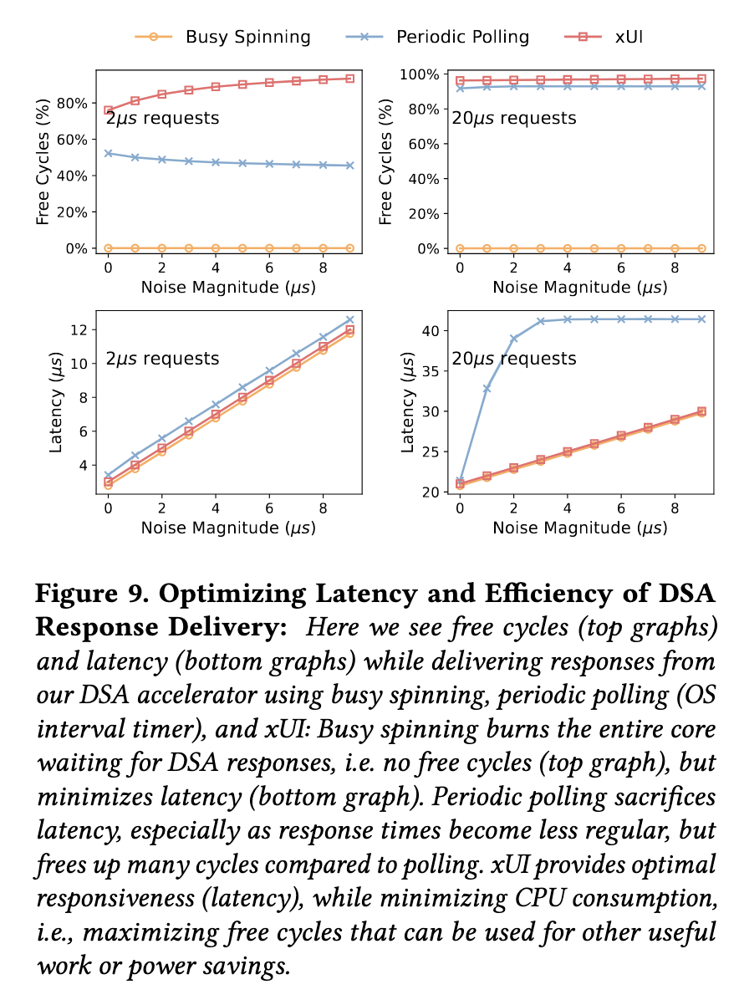

# Extended User Interrupts (xUI): Fast and Flexible Notification without Polling

## Abstract

文章分析和测量解构了 Intel 的 UIPI 设计，并利用它来开发时序的准确模型。

引入了关于用户态中断的四种新增强：

*   跟踪中断
*   硬件安全点
*   内核旁路定时器
*   中断转发

三种用例：

*   用户态运行时高性能抢占
*   DPDK 中的第三层路由中的 IO 通知
*   基于 Intel 的数据流加速器建模的流式处理加速器的综合工作负载中的 IO 通知

**xUI 提供了共享内存轮询的性能和异步通知的效率（这一点证明了 TAIC 的研究方向很有意义）。**

## Introduction

两个重大的趋势：

*   语言级并发将 CPU 调度的责任迁移至用户态运行时；
*   内核旁路接口将 IO 调度迁移至用户态运行时；

但缺少关键组成部分：中断系统（转发来自设备的低延时异步通知、CPU IPI、定时器）。中断的好处：

*   立即更改接收核心上的控制流
*   最大限度提高效率，不需要浪费周期来轮询通知

**缺少中断导致了需要使用昂贵的内核接口或者退回到使用共享内存轮询来获取低延时和高吞吐（这个在用户态的环境下很有说服力，但是在 unikernel 的环境下，说服力会比较小）。**

内核旁路接口的缺点：

*   必须使用轮询
*   可扩展性差，处理器不能在多个队列上空闲，每个被轮询的队列都会占用缓存行

**文章的主要贡献是对 Intel 用户态中断的详细分析，以及应用场景的描述。**

理论上的性能优势：

*   缩短了中断通知和基于内存通知的开销
*   硬件安全点：（目前还不理解硬件安全点的含义）调和中断和垃圾回收的紧张关系
*   用户态的低开销定时器
*   扩展中断路由，允许设备发送中断给用户态线程

xUI 性能优化：

*   比 UIPI 优化了 RocksDB 10% 的吞吐量（抢占）
*   相比于自旋，提高了效率，在 40% 的负载场景下，降低了 45% 的 CPU 消耗

## Limitations of User-Level Notification

*   信号机制：高开销，不准确，上下文切换，以及内核的信号处理代码的开销；不精确导致了在任意点改变控制流对 GC 产生影响，GC 依赖于在堆栈中维护数据的指针映射

*   轮询机制：不可预测、低效、不可扩展

    *   每次 negtive check 和 notification 的开销比较小，因此轮询可以支持低开销和高吞吐
    *   轮询比信号机制精确，程序员可以完全控制轮询发生的位置
    *   轮询同样可以实现在编程语言的级别实现抢占（编译器增加插桩点，在每个函数的入口和 loop 循环的边缘增加对共享变量的轮询来保证线程让权），但轮询的开销很高且依赖于工作负载（即使见到的检查也可能造成非常高的开销），因此很多运行时不支持使用轮询来实现抢占
    *   每增加一个队列，则会消耗掉一个缓存行，并且开销线性增加，轮询导致能源效率低下，而 mwait 只适用于单个队列，轮询频率低会降低开销，但是会导致响应延时增加

*   定时器昂贵且复杂

    *   定时器能够支持抢占、定期轮询设备和超时同步
    *   现在依靠 settimer、timer\_create、nanosleep、select 等系统调用来实现通知
    *   用户态运行时使用 CPU（内核线程）来充当定时器，在需要抢占是来通知其他内核线程（无论是信号、共享内存还是 UIPI）

*   UIPI 比轮询开销更大、不精确、使用范围窄

    *   UIPI 的通知比基于内存轮询的开销慢 6～9 倍（来自于流水线被中断的开销）
    *   UIPI 仅支持 APIC 的小部分功能

## Characterizing Intel UIPI

### Overview

允许 IPI 直接从内核线程发送给用户线程

*   访问控制：

    *   UITT(User Interrupt Target Table)：指定进程（及其所有线程）可以发送 UIPI 给哪些其他线程
    *   UPID (User Posted Interrupt Descriptor)：UITT 中的表项
    *   用户进程通过系统调用来设置 UITT

*   用户级别的中断路由的挑战：

    *   没有线程寻址的概念
    *   8位中断向量空间有限
    *   线程不一定在运行

*   解决用户级别的中断路由的挑战：设计了正交的虚拟命名空间（线程 ID ）和向量空间（用户向量）

### Sending and Receiving UIPIs

当发送 UIPI 时，发送 CPU 在 UITT 中查找目标线程的 UPID，修改目标线程的 UPID；之后，发送 CPU 发送传统的 IPI 给接收 CPU，通知它有需要处理的 UIPI；接收 CPU 使用 UPID 中的状态来转发请求；

UPID 在内存中，所有的 CPU 都可以访问；

接收方通过 register\_handler 系统调用分配 UPID，并存储用户态的中断处理程序的入口；

发送方通过 register\_sender 系统调用在 UITT 中分配一个新条目，并在其中存储指向相应 UPID 的指针和用户提供的向量。

发送中断通过 senduipi 指令，该指令采用一个操作数—— UITT 的索引。发送 CPU 在 UITT 中查找 UPID 和向量，在 UPID 的 PIR 字段设置位来表示发布的中断向量，并且 ON 位来表示中断处于挂起状态，后续将常规的 IPI 发送给运行目标线程的 CPU（NDST 指向的地址），并且使用向量 NV 来指示待处理的 UIPI。

当 IPI 到达时，接收 CPU 会将收到的向量与存储 UIPI 通知向量的 MSR（UINV）字段进行比较。若匹配，则接收 CPU 检查线程的 UPID 的 PIR 字段来确定 UIPI 是否应该传送到当前线程，或者是否需要由系统处理。

如果 UIPI 的目标是当前正在运行的线程（快速路径），则直接调用接收方注册的用户态处理程序，处理程序结束后使用 uiret 指令返回。如果不是当前正在运行的线程，则经过内核的较慢路径，内核恢复目标线程后再通过本地 APIC 将捕获的 UIPI 重新发布为自身的 UIPI（这里是对于目标线程不在线的情况）。

如果频繁需要执行较慢路径，则会减慢接收 CPU 上运行的其他程序的速度。解决方案是使用 UPID 的 SN 位来表示接收方是否就绪，从而防止发送方继续向该接收方线程发送中断（在目标线程被切换出去时，内核设置 SN 位）。

clui 和 stui 可用来手动控制开关用户态中断，testui 可查询中断是否阻塞。

线程可以在 CPU 之间迁移，UIPI 必须要发送至正确的 CPU（通过 NDST 来保证，在迁移时，内核来更新这个字段）。

### Architecture View

描述了 UIPI 的流程，一些微处理器的细节实现

这里没有记录具体的描述细节（包括一些微处理器细节、控制寄存器等）

### UIPI Performance

### Deconstructing the UIPI Microarchitecture

#### Interrupt handling strategy

跳转至中断处理例程对于 reorder 缓冲区（可以容纳 500 甚至更多的 in-flight 的指令）有较大影响，直接刷新可以降低中断处理的延迟，但直接执行完所有 in-flight 指令也可以（flush 策略）。

一旦 pipeline 中没有 pre-interrupt 指令，程序计数器就会指向 interrupt 之前程序中的最后一条指令。可以保存下一条指令的 PC，指定处理器在中断处理程序后应恢复执行的位置（这种耗尽策略造成更大的延迟，但是最大限度的减少了浪费的工作）。理论上，随着 reorder 中的 in-flight 指令数量增加，采用耗尽策略会导致端到端 UIPI 的延迟也随之增加，但实际的结果没有这种变化，因此 CPU 采用了 flush 策略；

使用硬件技术器来测量当收到中断时被调度但未提交的指令数（刷新的指令数），刷新的指令数量与收到的中断数量完全显性增加，再一次验证了 CPU 使用了 flush 策略。

#### Where are the receiver overheads coming from?

测试方法：由于这些与 UIPI 对应的操作会对应到共享内存中的 UPID 中的字段的修改，可以采用并行的线程来检测这些事件。

测试代码实现为内核模块，并且为了减少刷新缓存对测量的影响，测试模块直接与接收方线程处于相同的 SMT 上下文中。

接收方线程在循环中执行 rdtsc 指令来记录当前时间，在中断处理程序中，记录的值则为执行中断前的最后一刻。

## xUI: Extended User Interrupts

目标：

*   快速：提供与共享内存通知相当的性能，以消除轮询的需要
*   非侵入式：在高性能处理器中使用较少的更改即可使用，不会对处理器的其他功能产生影响
*   简单且兼容：与现有软件一起使用，并启用比当前用户态通知更简单的解决方案
*   通用：支持在内核的中断系统的所有形式的通知

### Overview

#### Tracked interrupts: closing the memory gap

中断分发的替代方法，避免刷新 pipeline 的开销。使得通知的开销与轮询相当，但具备异步通知的效率和响应能力。将 UIPI 的开销降低了 3～9 倍，根据通知的类型，通知需要 231 或 105 个周期。

#### HW safepoints: precise interrupts for precise GC

提供 safepoint 指令，让编译器可以在安全传递中断的位置进行精确通信。

对比之下，UIPI 需要使用 clui 和 stui 指令来实现这个功能，需要 34 个周期，在循环中会造成大开销。

#### KB\_Timer: fast efficient user-level timer interrupts

降低了基于内核的或基于专用定时器线程实现的定时器的复杂性以及开销。

每个时钟中断的开销为 105 周期，允许在用户态直接进行控制（修改定时器频率，使能或禁用，使用不同的工作模式）。

#### Interrupt forwarding: device interrupts for threads

将发往特定 APICID/向量的中断路由到用户态线程/向量**（UIPI 没有提供这个解决方案？这里应该查看 Intel 的手册）**

### Tracked Interrupts

解决中断与 reorder 缓冲区之间的矛盾。

思路：中断处理代码在指令流中的位置具有一定的灵活性（源于中断的异步特性），处理器可以自己选择在何处执行中断处理程序来实现最好的延迟且不牺牲吞吐量。

#### Microarchitecture design

tracking 策略在处理器前端（取指令单元）实现，而不是后端（提交单元）。

tracking 转发中断分两步：

*   一旦本地 APIC 接收了中断，tracking 将会强制指令预取单元将控制流重定向至 MSROM（存储了中断通知处理的微操作），从而将这些指令注入到微操作流中。tracking 将跟踪，如果处理器错误预测而取到了更年轻的指令，则重新提交这些 MSROM 中的指令。
*   处理器可以准确识别并保存最后一条程序指令（在中断处理程序运行后恢复执行，即 iret 指令之后）

当中断从本地 APIC 到达时，前端的 next PC 逻辑将判断当前的微操作是否位于指令的边缘。一旦满足此条件，则将微操作的 PC 设置为 MSROM 中的中断处理微程序的开头并继续执行。

由于既不刷新也不耗尽，需要克服的以下挑战：

*   误猜：例如分支预测错误，处理器通常使用刷新所有比分支跟年轻的指令，再恢复执行，但这会导致刷新掉中断处理代码，导致中断丢失。在前端实现了状态机，来判断是否在中断处理中。如果在中断处理中，由于误猜而导致刷新，可以马上将指令预取单元指向中断处理的微操作码，在恢复执行前重新注入。在提交中断处理微操作之前，都会保持中断处理微操作码为误猜的默认恢复路径（即使重复多次误判，但后续的中断处理微操作码已经在缓存中）。
*   识别中断前最后提交的指令的 next PC值，来保证 iret 后能够返回到正确的地址：因为正确的返回地址在处理误猜时会发生变化。解决方法是在执行重定向时，从前端读取 next PC，如果没有处理误猜，则正确；如果产生了误猜并进行处理，则前端会计算新的 next PC 值，中断处理微操作将使用这个重新计算的结果。

#### Cheaper than shared memory notification?

tracked interrupt 可能比共享内存通知更便宜，原因在于共享内存通知本质上是同步的，可能会引入意外的控制流（事件达到时，会导致共享内存变量对应的缓存行失效，从而进行较长的缓慢读取操作）。**这里还需要进一步研究基于共享内存的轮询的实现方式。**

去除刷新 pipeline 的开销，UIPI 需要读取共享内存中的 UPID，与基于共享内存的轮询方式的开销相当。xUI 针对时钟和外设中断，不会修改 UPID，从而避免与缓存相关的开销，只需要 105 个时钟周期。

#### Hardware cost and complexity

目前的实现方式：在执行中断之前的指令出现了误猜，则会将整个 pipeline 刷新（包括中断指令，后续再重新发送这些中断指令）

xUI 的方式：在每个 ROB 条目中增加一位来指示微操作的源来自于正常程序还是来自中断处理程序；前端到后端的每个微操作增加一位来表示 ROB 的源；将取指令单元指向中断通知的微操作码的逻辑电路；以及传递给前端的检测是否已经提交中断处理微操作的逻辑电路；

### The Kernel Bypass (KB) Timer

每个线程一个用户级的定时器，类似于本地 APIC 定时器。

APIC 定时器不能让应用程序开发者直接使用。但它提供了一个低级原语，用户级运行时可以使用它来实现软件计时器，以执行抢占、定期轮询、超时等任务。

#### Microarchitecture design

每个物理 CPU 上一个 KB\_Tiner，被操作系统的多个线程复用。内核使用本地 APIC 的定时器，而 KB\_Timer 使用自己的物理定时器。

KB\_Timer 中断通过用户态中断处理程序来传递内核分配的中断向量（中断分发开销为 105 个时钟周期，跳过了修改 UPID 的操作以及路由的操作，直接调用中断分发的逻辑）。

KB\_Timer 不支持慢速路径，不支持不在线的处理，即**不在线时不会发送中断**。线程在内核模式下触发时，直接 trap；如果在用户模式下触发，直接分发中断。内核来管理定时器状态。

#### Multiplexing the KB\_Timer

内核使能和禁用 KB\_Timer，并通过写入 kb\_config\_MSR 来设置定时器中断向量。与 UIPI 类似，这允许内核通过系统调用 （enable\_kb\_timer, disable\_kb\_timer） 来控制对此机制的访问。在进行上下文切换时，需要保存/恢复与定时器相关的寄存器到上下文中。

### Hardware Safepoints

safepoint 是代码中的精确位置，在编译期间通过静态分析确定，来精确 GC 所需要的预计算堆栈映射有效。

Hardware safepoints 通过为编译器提供精确且近乎零成本的机制来指示处理器可以安全地提供中断的位置来解决此问题。

通过增加一个 1 bit 的标志寄存器，一旦启用之后，只有在 safepoint 指令处才可以提供中断。

tracked interrupt 保证了只会在指令的边缘发起执行中断微操作，因此 safepoint 只需要在现有的指令边界检查逻辑上进行少量的修改即可（增加判断当前指令是否为 safepoint 指令的逻辑）。

这会导致误猜的处理逻辑复杂，如果 safepoint 在误猜的逻辑上，则会先恢复正常的逻辑，直到遇见下一个 safepoint，而不是无条件恢复到中断处理的微操作。**（还会导致另一个增加复杂性，但是没看懂。）**

### Interrupt Forwarding: Routing Device Interrupts

扩展本地 APIC，来实现将发给核心的中断转发给目标线程。若目标线程不在线，则与 UIPI 的方式类似。不需要经过 UPID，因此开销也为 105 个周期，慢速路径的开销没有提。

扩展了本地 APIC，增加了两个 256 bit 的寄存器（forwarding\_enabled、forwarded\_active），每个 bit 与一个中断向量相关。forwarding\_enabled 的位表示哪些中断是给内核的，forwarded\_active 的位表示哪些中断是转发给当前运行的线程的。

也存在快速路径和较慢路径，都需要设置 本地 APIC 的 forwarding\_enabled 的位，如果还设置了 forwarded\_active 中对应的位，则直接将中断转发给线程，否则则是发起常规中断，并从 UIRR 寄存器读取向量号并保存在 DUPID（Device User Interrupt Posted Descriptor） 中来进行后续的转发。**（这个设计在我们之前的讨论就已经有痕迹，只是还没有到这里这么细节，但是在后续的讨论中，似乎已经不需要考虑这种慢路径和快速路径了，统一到优先级上了）**

#### Multiplexing interrupt forwarding

每个线程有一个 256 bit 的向量，在线程恢复执行时，被写到 forwarded\_active 寄存器中。**（这与 RISC-V 的 N 扩展中用户态相关的寄存器需要保存到任务的上下文中类似，之前和 TKF 已经讨论过这个问题）**

## Experimental Methodology

### Hardware Platform

在 Intel 的机器上进行实验，测试 flush 的微操作使用提交的操作与解码的指令之间的差值。

### gem5 Simulation

在 gem5 上实现了 Intel 的 UIPI 以及 xUI。gem5 仿真实现的 UIPI 的开销与真实机器相当。并且在 gem5 上模拟实现了 dpdk 设备。

对 gem5 本身的一些优化，它采用了耗尽的策略而不是 flush 的策略，并且每次人为的插入固定13个周期。

### Preemptive Scheduling with UIPI and xUI

使用了 Aspen 用户态运行时，基于 Caladan，支持轻量级用户态线程、内核旁路 I/O，基于用户态中断实现抢占式调度，使用工作窃取实现负载均衡。

*   负载生成器和 RocksDB server各自运行在单个 CPU 上。
*   使用一个额外的 CPU 在负载生成器和 RocksDB server 之间转发数据包来模拟网络流量。
*   关闭 CPU 重新分配并删除实现它的模块（ksched）
*   每个内核线程固定在特定的 CPU 上
*   Aspen 使用 KB\_Timer

### IO Notification: L3Fwd & Simulated Accelerators DPDK-based L3 forwarding

与基于轮询的 DPDK 的通知机制的开销。

详细的测试方法直接看正文，这里不描述。

## Evaluation

### xUI Features

#### Receiver-side overheads: UIPI and xUI

*   tracked interrupts vs UIPI：231-645
*   KB\_Timer：105

在 5 $\mu$s 的事件间隔时，中断转发的成本从 6.86% 降低至 1.06%。

#### Hardware safepoints vs. polling-based preemption

基于 Concord（基准），对编译器修改，增加了插入 safepoint 的指令，而不采用轮询检查。

在处理抢占后返回的上下文开销比切换到不同的线程或 I/O handler 的开销小。

#### Benefits of eliminating timing cores with KB\_Timers

KB\_Timer消除了使用昂贵的作系统接口（每个计时器事件具有多个上下文切换）的需要，并且每个内核都可以有自己的计时器，无需 IPI。

#### Maximum interrupt latency

跟踪的好处是可以最大限度地提高吞吐量，因为它永远不会丢弃工作，但是，延迟取决于中断到达时正在进行的指令的性质。

在最坏情况下需要 7000 个周期，并且具有 50 个或更多长延迟负载链（长延迟负载链没看懂）。而 Intel 的 flush 策略下的延迟会降低一个数量级。这种极端的场景在多数的负载场景下验证了是异常情况。

### End-to-End Evaluation

#### Preemption for RocksDB in Aspen

由于接收 UI 的开销较低，添加 KB 计时器和跟踪可进一步将 GET 的吞吐量提高 10%。**（这个结果与 TAIC 小论文的结果差不多，也许可以进一步讨论。）**

在这两种情况下，抢占的代价是高负载下 SCAN 请求的尾部延迟略有增加。（SCAN 请求需要数百微秒才能完成，因此被抢占很多次。）

#### IO notification in l3fwd

两种方法的吞吐量几乎相同，xUI 吞吐量比轮询低 0.08%。（因为在中断处理程序返回之前，会再次轮询网络队列。）

xUI 相较于轮询模式，在 1、4 和 8 个 NIC 下，95% 的尾部延迟分别 +2%、-8% 和 +65%。（论文里面没有给出图片，这个结果实际上并不好），只有图 8 的结果能够体现出 xUI 的好处。

#### IO notification in DSA

**（这个图的结果和画法可以使用到 TAIC 的小论文中）**

相比之下，使用 xUI 时，延迟保持不变，并且与轮询这两种类型的请求所实现的延迟相差 0.2 μs 以内。

xUI 能够实现最佳 CPU 效率，而延迟损失很小。

## Related Work

**Tracked interrupts：**介绍了中断处理时的流水线刷新相关的工作

**Hardware support for user interrupts：**介绍了 1994 年和 2002 年的文章；RISC-V 的 N 扩展和 CLIC；

**Accelerators and killer microseconds：**介绍了与高速 I/O 设备相关的加速器，以及一些加密、压缩、序列化的加速器。

**Hardware virtualization at user level：**介绍了 VT 和 EPT 等虚拟化技术。

**High-performance IO and polling：**介绍了用户态的 I/O 栈以及 Hyperplane 加速器。

**User-level preemption：**介绍了Concord、shinjuku 以及基于 UIPI 的一些公族。

**Hacking around UIPI limitations：**介绍了 skyloft 绕过了 UIPI 对于时钟中断的限制，以及 skyloft 的使用方法的缺点（内核不再使用本地 APIC 计时器进行调度、计时等；会禁用用户态中断的其他用途；定时器中断重载 UINV 意味着处理器无法将其他 UIPI 与计时器中断区分开来。），这个技巧不能替代 xUI 的 KB\_Timer 支持。

## Conclusion

xUI 为用户级别的异步通知提供一流的支持。

## 个人思考

可以复现这个结果，建立好环境，后续的工作应该可以在这个环境上进行，获取的结果应该会更有说服力。

其余的思考在不同的模块给出。
