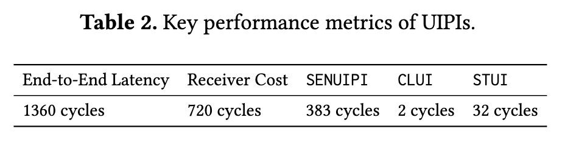

# Extended User Interrupts (xUI): Fast and Flexible Notification without Polling

## Abstract

文章分析和测量解构了 Intel 的 UIPI 设计，并利用它来开发时序的准确模型。

引入了关于用户态中断的四种新增强：

*   跟踪中断
*   硬件安全点
*   内核旁路定时器
*   中断转发

三种用例：

*   用户态运行时高性能抢占
*   DPDK 中的第三层路由中的 IO 通知
*   基于 Intel 的数据流加速器建模的流式处理加速器的综合工作负载中的 IO 通知

**xUI 提供了共享内存轮询的性能和异步通知的效率（这一点证明了 TAIC 的研究方向很有意义）。**

## Introduction

两个重大的趋势：

*   语言级并发将 CPU 调度的责任迁移至用户态运行时；
*   内核旁路接口将 IO 调度迁移至用户态运行时；

但缺少关键组成部分：中断系统（转发来自设备的低延时异步通知、CPU IPI、定时器）。中断的好处：

*   立即更改接收核心上的控制流
*   最大限度提高效率，不需要浪费周期来轮询通知

**缺少中断导致了需要使用昂贵的内核接口或者退回到使用共享内存轮询来获取低延时和高吞吐（这个在用户态的环境下很有说服力，但是在 unikernel 的环境下，说服力会比较小）。**

内核旁路接口的缺点：

*   必须使用轮询
*   可扩展性差，处理器不能在多个队列上空闲，每个被轮询的队列都会占用缓存行

**文章的主要贡献是对 Intel 用户态中断的详细分析，以及应用场景的描述。**

理论上的性能优势：

*   缩短了中断通知和基于内存通知的开销
*   硬件安全点：（目前还不理解硬件安全点的含义）调和中断和垃圾回收的紧张关系
*   用户态的低开销定时器
*   扩展中断路由，允许设备发送中断给用户态线程

xUI 性能优化：

*   比 UIPI 优化了 RocksDB 10% 的吞吐量（抢占）
*   相比于自旋，提高了效率，在 40% 的负载场景下，降低了 45% 的 CPU 消耗

## Limitations of User-Level Notification

*   信号机制：高开销，不准确，上下文切换，以及内核的信号处理代码的开销；不精确导致了在任意点改变控制流对 GC 产生影响，GC 依赖于在堆栈中维护数据的指针映射

*   轮询机制：不可预测、低效、不可扩展

    *   每次 negtive check 和 notification 的开销比较小，因此轮询可以支持低开销和高吞吐
    *   轮询比信号机制精确，程序员可以完全控制轮询发生的位置
    *   轮询同样可以实现在编程语言的级别实现抢占（编译器增加插桩点，在每个函数的入口和 loop 循环的边缘增加对共享变量的轮询来保证线程让权），但轮询的开销很高且依赖于工作负载（即使见到的检查也可能造成非常高的开销），因此很多运行时不支持使用轮询来实现抢占
    *   每增加一个队列，则会消耗掉一个缓存行，并且开销线性增加，轮询导致能源效率低下，而 mwait 只适用于单个队列，轮询频率低会降低开销，但是会导致响应延时增加

*   定时器昂贵且复杂

    *   定时器能够支持抢占、定期轮询设备和超时同步
    *   现在依靠 settimer、timer\_create、nanosleep、select 等系统调用来实现通知
    *   用户态运行时使用 CPU（内核线程）来充当定时器，在需要抢占是来通知其他内核线程（无论是信号、共享内存还是 UIPI）

*   UIPI 比轮询开销更大、不精确、使用范围窄

    *   UIPI 的通知比基于内存轮询的开销慢 6～9 倍（来自于流水线被中断的开销）
    *   UIPI 仅支持 APIC 的小部分功能

## Characterizing Intel UIPI

### Overview

允许 IPI 直接从内核线程发送给用户线程

*   访问控制：

    *   UITT(User Interrupt Target Table)：指定进程（及其所有线程）可以发送 UIPI 给哪些其他线程
    *   UPID (User Posted Interrupt Descriptor)：UITT 中的表项
    *   用户进程通过系统调用来设置 UITT

*   用户级别的中断路由的挑战：

    *   没有线程寻址的概念
    *   8位中断向量空间有限
    *   线程不一定在运行

*   解决用户级别的中断路由的挑战：设计了正交的虚拟命名空间（线程 ID ）和向量空间（用户向量）

### Sending and Receiving UIPIs

当发送 UIPI 时，发送 CPU 在 UITT 中查找目标线程的 UPID，修改目标线程的 UPID；之后，发送 CPU 发送传统的 IPI 给接收 CPU，通知它有需要处理的 UIPI；接收 CPU 使用 UPID 中的状态来转发请求；

UPID 在内存中，所有的 CPU 都可以访问；

接收方通过 register\_handler 系统调用分配 UPID，并存储用户态的中断处理程序的入口；

发送方通过 register\_sender 系统调用在 UITT 中分配一个新条目，并在其中存储指向相应 UPID 的指针和用户提供的向量。

发送中断通过 senduipi 指令，该指令采用一个操作数—— UITT 的索引。发送 CPU 在 UITT 中查找 UPID 和向量，在 UPID 的 PIR 字段设置位来表示发布的中断向量，并且 ON 位来表示中断处于挂起状态，后续将常规的 IPI 发送给运行目标线程的 CPU（NDST 指向的地址），并且使用向量 NV 来指示待处理的 UIPI。

当 IPI 到达时，接收 CPU 会将收到的向量与存储 UIPI 通知向量的 MSR（UINV）字段进行比较。若匹配，则接收 CPU 检查线程的 UPID 的 PIR 字段来确定 UIPI 是否应该传送到当前线程，或者是否需要由系统处理。

如果 UIPI 的目标是当前正在运行的线程（快速路径），则直接调用接收方注册的用户态处理程序，处理程序结束后使用 uiret 指令返回。如果不是当前正在运行的线程，则经过内核的较慢路径，内核恢复目标线程后再通过本地 APIC 将捕获的 UIPI 重新发布为自身的 UIPI（这里是对于目标线程不在线的情况）。

如果频繁需要执行较慢路径，则会减慢接收 CPU 上运行的其他程序的速度。解决方案是使用 UPID 的 SN 位来表示接收方是否就绪，从而防止发送方继续向该接收方线程发送中断（在目标线程被切换出去时，内核设置 SN 位）。

clui 和 stui 可用来手动控制开关用户态中断，testui 可查询中断是否阻塞。

线程可以在 CPU 之间迁移，UIPI 必须要发送至正确的 CPU（通过 NDST 来保证，在迁移时，内核来更新这个字段）。

### Architecture View

描述了 UIPI 的流程，一些微处理器的细节实现

这里没有记录具体的描述细节（包括一些微处理器细节、控制寄存器等）

### UIPI Performance

### Deconstructing the UIPI Microarchitecture

#### Interrupt handling strategy

跳转至中断处理例程对于 reorder 缓冲区（可以容纳 500 甚至更多的 in-flight 的指令）有较大影响，直接刷新可以降低中断处理的延迟，但直接执行完所有 in-flight 指令也可以（flush 策略）。

一旦 pipeline 中没有 pre-interrupt 指令，程序计数器就会指向 interrupt 之前程序中的最后一条指令。可以保存下一条指令的 PC，指定处理器在中断处理程序后应恢复执行的位置（这种耗尽策略造成更大的延迟，但是最大限度的减少了浪费的工作）。理论上，随着 reorder 中的 in-flight 指令数量增加，采用耗尽策略会导致端到端 UIPI 的延迟也随之增加，但实际的结果没有这种变化，因此 CPU 采用了 flush 策略；

使用硬件技术器来测量当收到中断时被调度但未提交的指令数（刷新的指令数），刷新的指令数量与收到的中断数量完全显性增加，再一次验证了 CPU 使用了 flush 策略。

#### Where are the receiver overheads coming from?

测试方法：由于这些与 UIPI 对应的操作会对应到共享内存中的 UPID 中的字段的修改，可以采用并行的线程来检测这些事件。

测试代码实现为内核模块，并且为了减少刷新缓存对测量的影响，测试模块直接与接收方线程处于相同的 SMT 上下文中。

接收方线程在循环中执行 rdtsc 指令来记录当前时间，在中断处理程序中，记录的值则为执行中断前的最后一刻。

