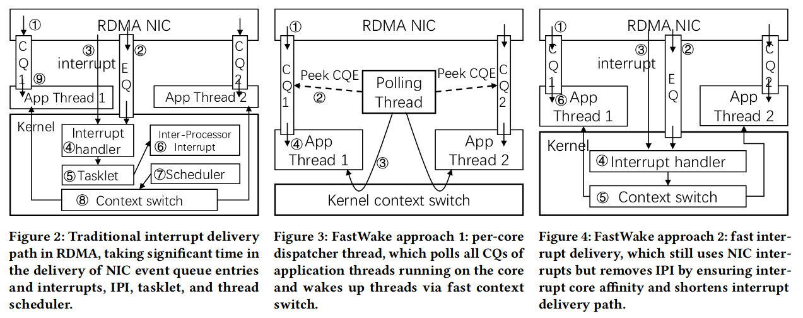
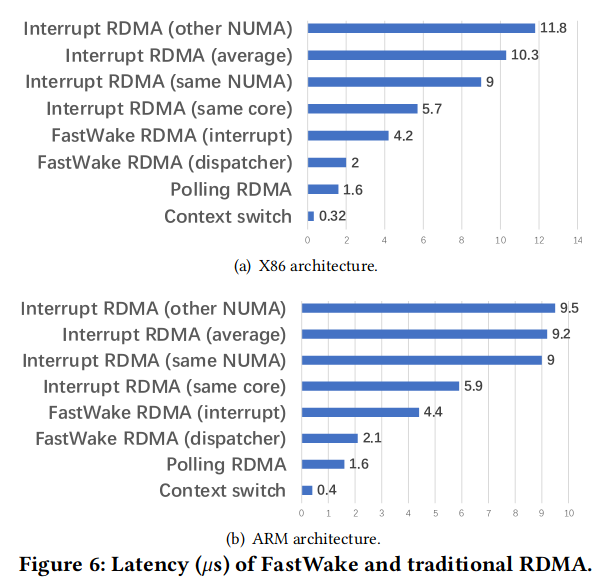
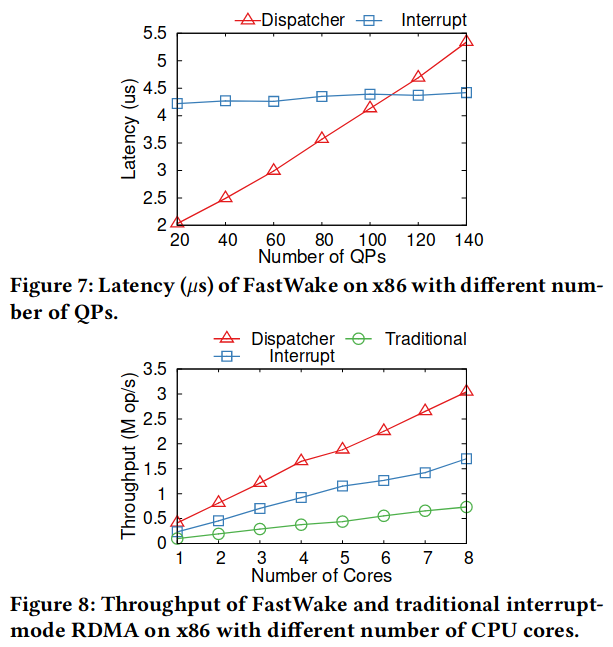
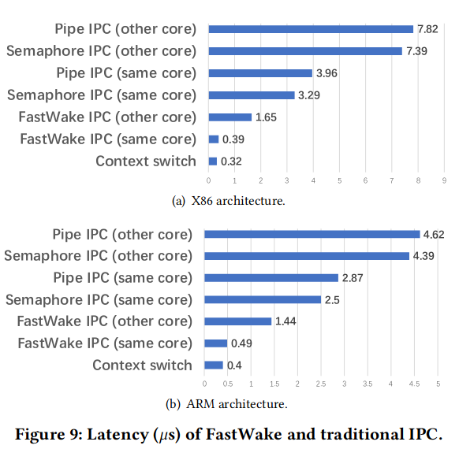

# FastWake: Revisiting Host Network Stack for Interrupt-mode RDMA

#### 赵方亮笔记

使用 poll 降低延迟和改善吞吐量，但只能在一个核上运行一个线程。

使用中断来支持单个 CPU 上的多个线程时分共享，则需要引入 6 \~ 10 微秒的中断延迟。而 RDMA 访问远程内存的时间开销为 1.6 微秒。

传统的 TCP/IP 协议栈和固态硬盘具有 > 20 微秒的延迟，因此线程唤醒的开销可以被忽略。

中断核心亲和力对中断分发延迟非常重要。中断处理例程唤醒线程，若线程在同一个核上只需要 4 微秒，若在其他核上需要 7 \~ 10 微秒。

已有技术的缺点：

1.  RDMA 默认将中断交付给一个随机的核，因此被唤醒的线程在同一个核上运行的概率很低。
2.  大多数中断涉及到中断处理程序唤醒另一个核心上的线程的长延迟
3.  在同一内核上执行中断处理程序也会限制多核吞吐量。
4.  即使一个中断唤醒了同一个内核上的线程，开销仍然很大，因为NIC需要生成事件并触发中断，然后内核在唤醒线程时花费时间在任务片、进程调度和上下文切换上。

文章提到的两种技术：

1.  内核分发线程（守护线程）：轮询线程 CQ 队列，线程切换，内核快速路径，上下文切换只需要 0.3 \~ 0.4 微秒，比中断（3 \~ 4 微秒）快得多；但 CPU 使用了达到 100%
2.  将网卡的中断分散到不同的核上，通过中断向量保证中断的亲和性。

## Background

### The Latency Hiding Problem

隐藏这种微秒级的延迟一直是编程语言、操作系统和计算机体系结构社区的研究重点。

使用协程需要大幅度修改应用程序。

IPC 优化无法解决中断传递延迟。

## Design

### Per-core Dispatcher Thread

为了安全性，使用内核线程来轮询 RDMA CQ 队列

增加 switch\_to 系统调用，导致安全问题，但通过在 PCB 中增加 flag 以及 ioctl 系统调用保证了一定的安全性。

### Fast Interrupt Delivery

在同一核心上唤醒线程作为中断传递比其他核心要快得多。

缩短中断传递路径

FastWake 直接将线程从 waitqueue 移动到 runqueue 的头部，然后上下文切换到该线程。

## Evaluation

