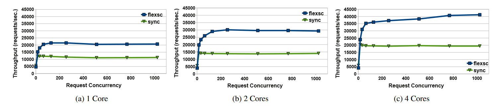

### FlexSC: Flexible System Call Scheduling with Exception-Less System Calls

系统调用导致直接的上下文切换影响和间接的缓存污染影响。user-mode IPC下降，需要 14000 个周期才恢复到原来的水平。

#### exception-less system call

将系统调用请求写入到预先分配的系统调用请求页内。实际系统调用请求由内核中的系统调用线程异步执行。在完成后将结果写回到系统调用请求页内。

将系统调用的调用过程与执行过程解耦。
1. 允许批处理系统调用
2. 但另外的核上处理系统调用，并行 + 局部性

#### Exception-Less Syscall Interface

- flexsc_register()

1. 映射系统调用请求页
2. 创建系统调用执行线程

使用了 eception-less 系统调用后，内核无法判断何时让进程进入睡眠状态

- flexsc_wait()

针对上述问题，使用这个接口显示的与内核进行通信，让进程能够进入睡眠状态

- 系统调用线程

1. 虚拟地址问题：在注册过程中 spawn，从而可以与进程内的其他线程处于同一个虚拟地址空间中
2. 系统调用线程需要阻塞等待资源：必须增加资源可用时的通知机制；但文章直接暴力的注册多个系统调用处理线程（由于 linux 内核线程实现很轻量级，开销没有实际那么大）（与共享调度器实现的异步系统调用类似），内存占用 10KB，浪费内存。在系统调用线程需要阻塞时，通知等待队列，唤醒下一个系统调用线程。

- 系统调用线程调度器

1. 在单核环境下，只有当用户态线程无法继续执行时，调用 flexsc_wait 接口执行系统调用线程；系统调用请求都发出，至少有一个处理完毕才会回到用户态线程
2. 多核环境下，将系统调用线程分配在静态预定义的处理器列表上。通过 ipi 来通知处理器唤醒并执行系统调用线程。并且为了避免数据竞争，系统调用线程在处理之前对系统调用请求页上锁。但多个系统调用线程可以并行的处理不同的系统调用页上的请求。

#### 使用方式

1. 对于事件驱动系统，同步和 exception-less 系统调用可以共存
2. 在多线程系统中，使用 FlexSC-Threads，将同步系统调用透明的转化为 exception-less 系统调用。

FlexSC-Threads 使用 M-on-N 线程模型。（N，其中每个核上只有一个内核可见线程来支持多个用户态线程，其余为系统调用线程）

将调用 libc 库重定向为调用文章实现的库。发出系统调用，在系统调用请求页中填写好系统调用参数，切换到另一个用户态线程。FlexSC 检查系统调用请求页中的系统调用项是否完成，并唤醒对应的用户线程。

#### 评估

##### 开销

1. 切换到系统调用线程
2. 从系统调用请求页中解码系统调用参数
3. 切换回用户态线程
4. 从系统调用页面获取返回结果

使用连续的 getpid 系统调用测试直接开销。使用 exception-less 系统调用，批处理开销分摊过后比同步系统调用开销小。单个 exception-less 比同步系统调用慢 43%，而随着批处理数量增加，比同步系统调用快 130%。

在系统调用负载较小时，MySQL（25%），FlexSC 的加速比减小。

