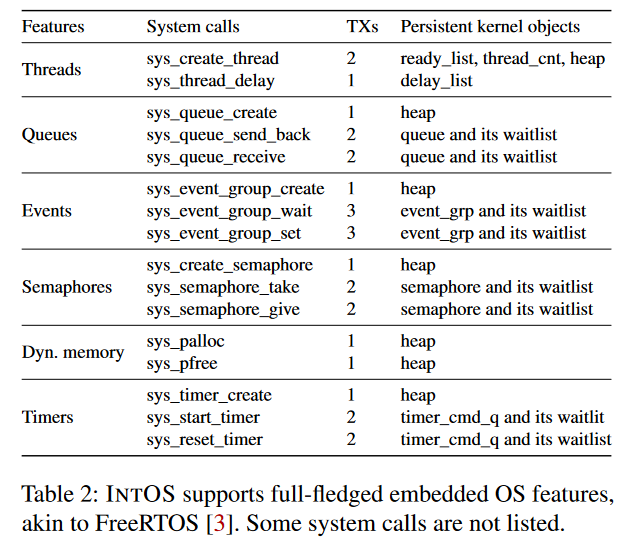
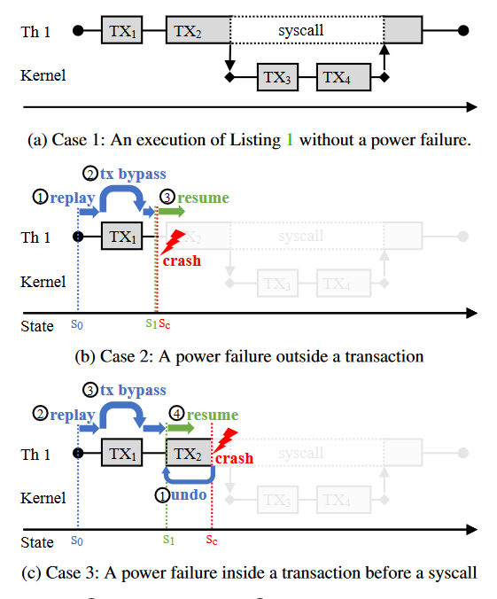
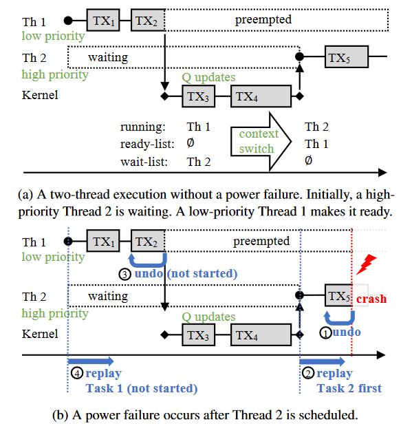

# INTOS: Persistent Embedded Operating System and Language Support for Multi-threaded Intermittent Computing

## Abstract

支持基于优先级的抢占式多线程

## Introduction

在 OS/运行时 层缺乏对间歇计算环境的支持。

INTOS 将包含局部变量和函数帧的程序栈放置在易失性内存中，以提高性能和能量效率。

INTOS 提供了一种新的重放-旁路方法解决崩溃一致性的问题。

使用了 Rust 语言的类型系统来执行各种编程规则。

贡献：

1.  第一个持久化的嵌入式操作系统，支持基于优先级的抢占式多线程
2.  使用重放-旁路方法支持崩溃一致性（内核、用户级的易失非易失性内存状态）

## Background

### Intermittent Computing

在能量收集平台上的执行是间歇性的，即在电容器耗尽后突然停止，并在充电后恢复，通常为满电容量。

程序经常会由于电源而中断，因此需要保证崩溃一致性，以及故障恢复。

### Embedded Operating Systems

嵌入式操作系统与应用程序代码紧密相连，通常作为固件镜像的一部分。

目前的嵌入式 OS 不支持崩溃一致性和间歇计算。

### Transactions for Non-volatile Memory

intel PMDK，用户可以使用非易失性内存分配器分配一个持久对象。

## Related Work

## Overview of INTOS

### Multithreading and Transactions

支持传统的有栈多线程作为编程单元和调度实体。

需要保证崩溃一致性，因此，这些系统调用的接口涉及到对 kernel 中的数据结构变化的都需要使用事务，对接口会增加一些额外的操作。

单线程崩溃一致性：

多线程崩溃一致性：

INTOS 采用基于优先级的恢复和重新执行。优先级最高的线程被最先恢复。

## INTOS Programming Model

5个设计原则来保证崩溃一致性：

1.  持久化对象在事务外部不应该被访问(既写又读)，在事务内部必须记录它们的更新。
2.  持久化对象的指针/引用不能作为返回值传递出事务
3.  持久化对象不能包含对易失性对象的引用
4.  系统调用（锁除外）只能在包含在事务内部
5.  不能在事务内部使用锁
