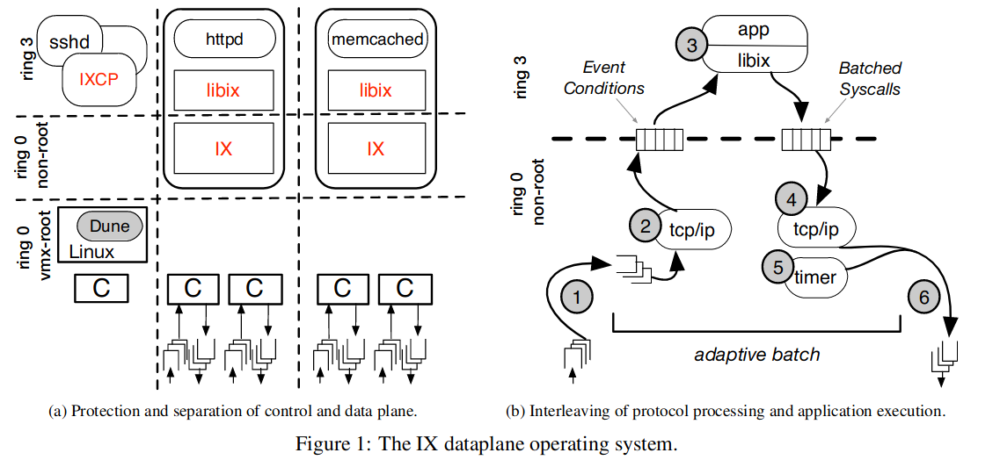
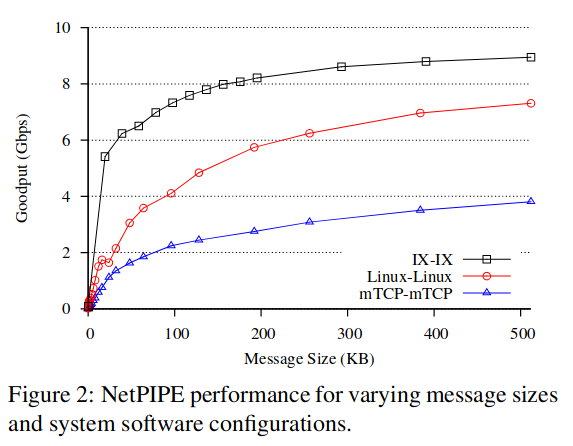
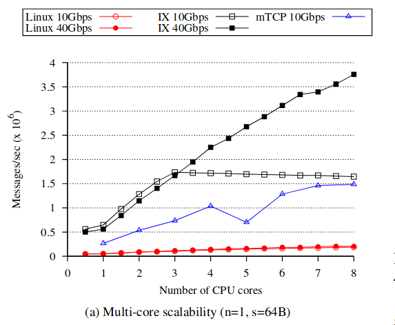
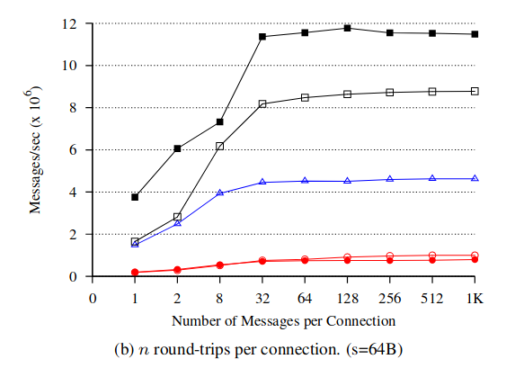
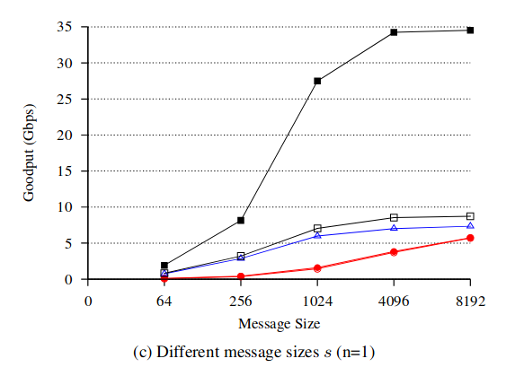
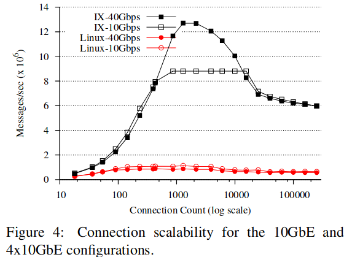
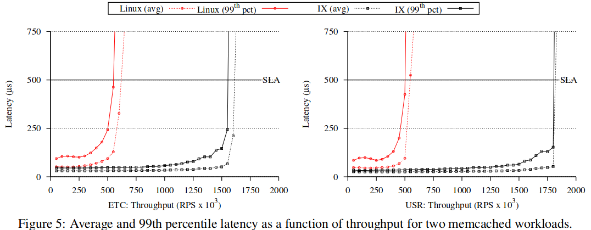

### IX: A Protected Dataplane Operating System for High Throughput and Low Latency

#### 目的：构建高吞吐量、低时延服务

#### 针对问题：高吞吐量、低延迟、保护、资源效率四个方面进行取舍

kernel bypass 或 unikernel，但保护和资源使用方面存在缺陷，并且 kernel bypass 硬件还存在需要双方部署等问题

批处理影响延迟，但有助于提高吞吐量（批处理自适应时，对于延迟也存在益处，减少队头阻塞）

#### 思路：

1.  控制平面与数据平面分离（一个核运行传统的 linux，而另外的核运行 IX）

2.  run to complete（局部性） + 批处理（不局限于系统调用）

    1.  保留中断用于抢占长时间的任务
    2.  批处理队列：有界 + 自适应 + run to complete

3.  zero copy

    1.  数据平面和应用程序协同管理消息缓冲池
    2.  传入数据包以只读方式映射到应用程序中，该应用程序可以保留消息缓冲区并稍后将它们返回到数据平面

4.  Flow consistent, synchronization-free processing

    1.  多队列网卡，每个 core 对应一个队列

#### 架构

左侧为控制平面，IXCP 监控资源使用。

通过硬件虚拟化技术（Dune）将 IX 运行在 VMX non-root ring0，而应用程序运行在 ring 3，提供三向保护（控制平面、数据平面、未信任用户代码）

由实时优先级与 cpusets 控制 core 分配，每个核单独一个网卡队列

#### 评估

与 mTCP 的比较性能差距较大的原因可能是因为 mTCP 的实现存在问题，若换成实现较好的用户态协议栈，可能性能不差，这里的优势在于隔离性。
