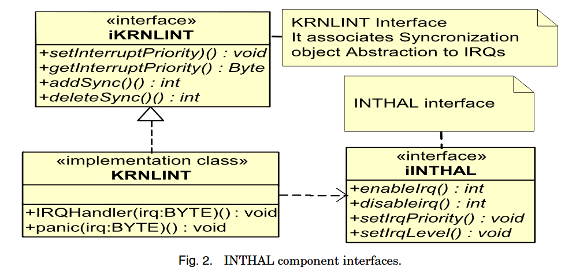
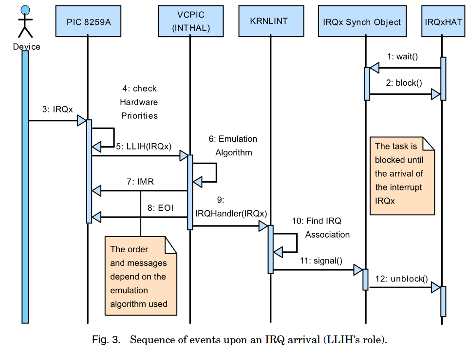

# Integrated Task and Interrupt Management for Real-Time Systems

## Abstract

通过在单个调度模型中集成中断和任务来解决中断带来的不一致性。

## Introduction

实时系统中存在的两种异步活动：

1.  任务
2.  中断服务例程（ISR）

每种活动有各自独立的调度和同步策略与机制。但 ISR 与任务之间的调度和同步方面的差异会产生相互干扰的问题，从而危及系统的可预测性。

### 任务

内核提供的并发模型，任务管理完全依赖内核，需要提供创建、删除、通信和同步等服务。

根据软件优先级调度任务。

内核提供同步机制（信号量、互斥锁、消息、mailboxes等）。

### 中断

计算机硬件提供的机制，中断管理依赖专用的硬件电路逻辑。硬件将 IRQ 分配给 ISR，在任务与 ISR 之间进行上下文切换，使能和禁用 IRQ。

根据 ISR 的硬件优先级调度 ISR。

传统的中断优先级高于软件优先级，使得中断的延迟低，避免了数据丢失。但在实时系统中，所有的活动都有严格的时间要求，因此会危机到任务的实时性。

借助自身硬件优先级实现互斥。

保证任务与 ISR 之间的互斥只能通过关闭中断来实现。

### 问题

在实时系统中，任务的优先级比某些 ISR 高。

### 解决方案

*   集成了中断和任务管理的策略
*   针对策略，分析了利用率和响应时间
*   设计了可移植的实时系统中断管理层子系统
*   在传统 PC 上使用了虚拟中断屏蔽技术实现了模型

## 实时系统中传统模型的相互干扰

### 优先级干扰

实时系统中的实时任务的响应时间要求比一些 ISR 的要求更短。因此需要给这些任务设置更高的优先级。

1.  高优先级任务会受到与低优先级任务相关的硬件中断的干扰
2.  与低优先级任务相关的中断可能会由于暂时的过载导致无法运行（频繁中断）。

## 中断延迟干扰

应用程序也会禁用中断，因为这是任务与 ISR 之间唯一的同步手段。

在最坏情况下，中断的延迟是 CPU 延迟与应用程序禁用中断的时间总和。

### 互斥干扰

### Sequencing Interference

将中断的响应拆分为 ISR 和 OS 中的任务：

ISR 将会执行一次，告诉内核某个事件发生了。并且会允许比当前运行的任务优先级高的任务执行。若 ISR 没有完成之前进行了上下文切换，剩下的 ISR 处理必须等到中断任务被执行后才会继续，这种方式使得系统处于不稳定的状态。

## 集成任务和中断处理的机制

1.  将任务和 ISR 集成到单个优先级空间中
2.  开发调度和同步的统一机制

将活动分为：

1.  SAT：软件激活任务（传统的软件任务）
2.  HAT：硬件激活任务（传统的 ISR）

活动的优先级只与实时性相关，共享同一个优先级空间，避免了优先级的干扰，禁用 ISR 导致的互斥干扰和中断锁的干扰也被消除了，可以使用一些技术来避免中断过载。

在最底层使用通用的低级中断处理程序（LLIH）处理所有 IRQ。LLIH 将禁用的中断与当前正在运行的任务的优先级同步，并使用任务之间的通信与同步的抽象将中断转化为同步事件。

HAT 阻塞直到 IRQ 发生（例如使用 wait 等待与 IRQ 相关的信号量或条件变量上，或者使用 receive 来接收消息，消息传递机制）。当 IRQ 发生时，LLIH 只将任务唤醒。当与 IRQ 对应的 HAT 的优先级足够高时，LLIH 被激活，抢占当前的任务。

**核心观点：**将中断处理的低级细节分配给内核（而不是硬件），并消除了 HAT 与任务之间的差异。中断的真正服务是在 HAT 中，内核不必处理任何与任务不同的中断。

LLIH 为唯一的异步活动。

优点：

1.  IRQ 的调度不由 PIC 决定，而是由内核的任务调度器决定
2.  应用程序不能禁用中断
3.  HAT 可以不受限制的调用内核的服务
4.  简化了系统开发和维护，任务之间只有一种同步和通信机制

## 调度能力分析

传统模式：

1.  降低了资源利用率的界限
2.  增加了响应时间

集成模式的开销：

增加了 HAT 上下文切换的开销，降低了资源利用率界限。但传统模型导致的优先级反转，资源利用率界限反而更低。因此，在某些情况下，可以使用混合模式，部分中断处理仍然通过 ISR，部分中断通过 HAT 处理。

## DESIGN OF THE LOW-LEVEL INTERRUPT MANAGEMENT SYSTEM

中断管理系统分为

1.  KRNLINT（kernel interrupt management）：硬件无关的管理代码
2.  INTHAL（interrupt hardware abstraction layer） 层：硬件相关的管理代码

KRNLINT 与 INTHAL 之间的交互通过 iINTHAL 接口。

### 内核中断管理部件

1.  使用 addSync、deleteSync 来使用内核提供的同步对象（基于syncId）
2.  当 IRQ 到来时，为同步对象产生一个信号
3.  为中断管理提供机制

### 中断硬件抽象层

提供基本的使能、禁用中断、设置优先级等接口

## IMPLEMENTATION OVER CONVENTIONAL PC INTERRUPT HARDWARE

INTHAL 取消了硬件自动优先级管理，使能所有的中断。当 IRQ 发生时，INTHAL 设置中断屏蔽位，禁用所有的相同或者低优先级的 IRQ，使能高优先级 IRQ。

基于 INTHAL 实现了 VCPIC（virtual custom programmable interrupt controller），

## USING THE VIRTUAL INTERRUPT MASKING

将乐观中断保护机制（在中断产生时，才修改硬件的中断屏蔽位，将中断处理延迟到临界区尾部。）适配到实时系统中。

## USING THE VIRTUAL INTERRUPT MASKING

### LLIH

1.  取消传统的 PIC 的优先级模式
2.  强制统一优先级空间
3.  将控制权转移至内核中断处理程序

## 总结

在产生中断后，在 LLIH 中唤醒对应的阻塞的 HAT，这个操作与 embassy 中的做法是相同的，我们的设计将唤醒的操作也集成到硬件中，这是我们的优势，它的优势是可移植。
