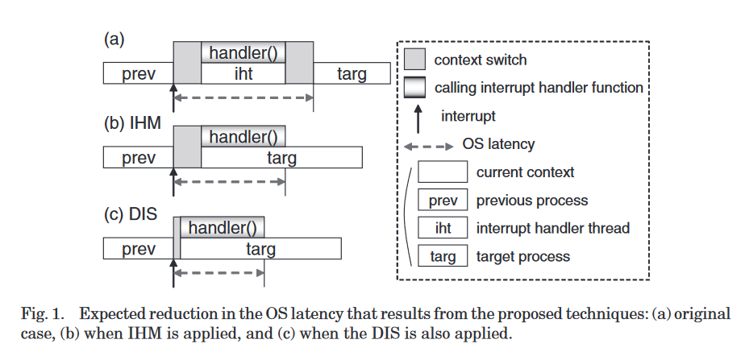
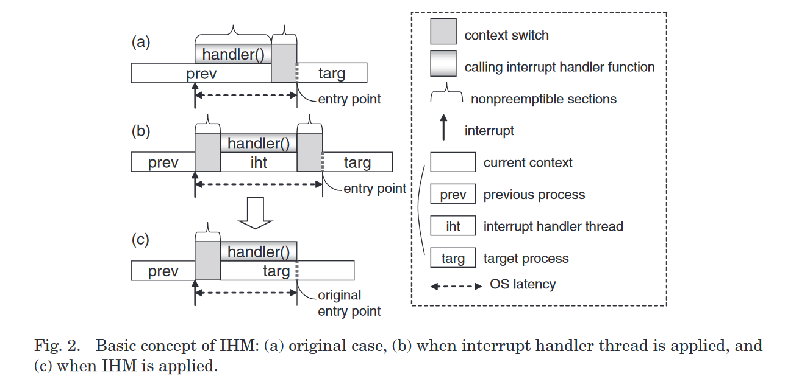

# Interrupt handler migration and direct interrupt scheduling for rapid scheduling of interrupt-driven tasks

## Abstract

两种旨在最小化高优先级中断驱动任务的调度延迟的技术

1.  中断处理程序迁移（IHM）：将中断处理程序迁移到相应的目标进程，避免额外的上下文切换，提高中断处理程序生成的数据的缓存命中率
2.  直接中断调度（DIS）：在中断到达和目标进程之间建立紧急中断处理路径（将中断处理划分为不可抢占和可抢占部分）

调度延迟减小 82%，在主频为 200MHz 的 arm cpu 上，调度延时低至 30 微秒，中断处理和调度的开销减少。

## Introduction

OS延迟：为从中断到达到重新激活等待中断的进程之间经过的时间

在 CPU 不够快和不够强大时，减少 OS 延迟对于减少开销很重要。

中断处理程序不仅可以在中断上下文中执行，也可以在线程上下文中执行，中断处理程序不再被视为不可抢占的部分。（中断时只做最少的处理）

使用的两种技术对中断延迟的示意图：

**如果提前对每个中断和要被它重新激活的目标进程之间的相互关系进行预处理和维护，一旦中断到来，就可以立即识别它的紧急性，如果是紧急的，也可以立即识别下一个要运行的进程。**

## Related Work

1.  让 linux 完全可抢占
2.  减少不可抢占段的数量和大小

**spinlock-based 方法**：在持有 spinlock 时，不允许抢占，其他部分可以抢占，但会导致持有 spinlock 时，高优先级的任务不能抢占。

**spinlock-to-mutex 方法**：同样的问题，高优先级任务尝试获取 Mutex 时，会导致至少两个上下文切换开销

**delay locking 方法**：预测中断和持有锁的时间，对可抢占和不可抢占的部分进行重排序

**Lock-Breaking Linux**：将较长的非抢占部分拆分为较小的部分

### Interrupt Handler Thread

中断处理程序和 softIRQ 处理程序的中断上下文执行的优先级高于任何其他进程，因此中断上下文可以抢占任何线程上下文。在中断上下文期间，内核不允许抢占。（中断处理程序和 softIRQ 处理程序被视为不可抢占部分，最高优先级进程）

改进：

以前在 Interrupt 上下文中执行的大多数操作都可以移动到 Thread 上下文中。（但会导致额外的上下文切换）

IHM 将中断处理线程的上下文迁移到目标进程的上下文中

LRP（Lazy receiver processing）：原本在中断上下文中处理的协议处理都是在目标进程的上下文中懒散地执行。只针对网络中断。

### Privious Works on Interrupt handling

1.  interrupt-triggered software prefetching

## Interrupt Handling Migration（IHM）

### Basic Concept of IHM

a 中的 prev 是已经处于中断处理程序中，内核不可被抢占，只能等这一次中断处理结束之后，再响应这一次产生的中断（从箭头开始的部分已经是在处理中断了，图中没有画出第一次被打断的示意，直接把中断处理算在了 prev 中）（图中的上下文切换是从调度器的视角来看，因为没有切换线程，所以没有上下文切换，但是打断原本的执行流跳转至中断处理，以及恢复的开销是不能避免的。）

这个图只画了从调度器的角度看到的调度开销，只强调了线程上下文切换的开销，没有体现中断上下文的开销，并且把必要的中断处理划分到了目标上下文中，但是这种方式把文章要达到的效果表现得更加明显。

做法：

1.  处于睡眠状态的目标进程下一次执行的入口点是 schedule 函数，因此可以将中断处理函数迁移至这个固定的入口点。
2.  将中断处理的操作从唤醒中断处理线程改为唤醒目标进程

好处：

1.  改善了缓存命中率，因为中断处理以函数调用的形式直接在目标上下文中进行，没有地址空间的切换，生成的数据的缓存友好
2.  解决优先级反转：
3.  改善中断相关的统计：中断处理占用的时间被划分到了目标进程，更加合理

带来的问题：

1.  如果中断没有唤醒目标进程将会发生什么？
2.  如果多个目标进程等待同一个中断源？
3.

## 评价

这里减少了内核不可抢占的部分，但是上下文切换和前半段（唤醒中断处理线程或目标进程）还是不可抢占的，而我的做法则只有上下文切换的代码是不可抢占的。
