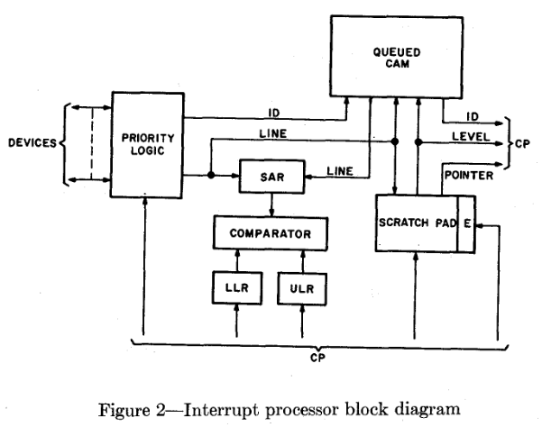
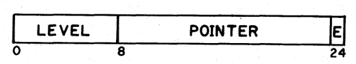
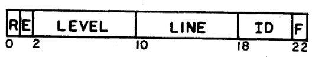

# Interrupt processing with queued content-addressable memories

#### 赵方亮笔记

## Introduction

设计高性能计算系统时最重要的问题之一是相关监控软件的复杂性。

对此问题经常提出的解决方案是从软件中删除一些耗时的执行功能，并在硬件中执行它们。

无论计算机用于控制还是数据处理，其有效性通常通过其对用户环境条件做出反应的速度来衡量。

需要制定一种新方法来提高硬件和软件的性能。

对于同一优先级下的不同中断源，机器不能高效的处理，只能降低性能或者在硬件中增加额外的优先级。

传统优先级中断模式的缺陷：

某个优先级的中断正在等待、被服务或由于更高优先级的请求被挂起，同级别内的后续中断将被忽略（需要保证中断响应的时间小于中断之间发生的间隔）

IP （Interrupt Processor）充当中型到大型在线多处理系统的自主元件，并促进计算机与用户、外围设备和控制接口的交互。所有与检测、确认和调度中断相关的功能都已合并到 IP 硬件中，为所有其他处理器提供集中的中断路由。

## The Queue Content-Addressable Memory

Content-Addressable Memory（CAM）：类似于 hash 表的结构

## Interrupt Processor Organization

作为 CPU 的一部分，与 Central Processor 和 main memory 都有接口。

### Priority Logic

决定被处理的顺序

### Scratchpad

高速随机访问存储。每 64-256 个中断线占用一个条目。

8比特表示中断服务例程的优先级；16bit 表示中断服务例程的指针；E 表示使能。

#### Queued CAM

8位的 level 和 line 根据 Priority Logic 获取，F 表示合法。

R 表示中断服务例程处于运行状态。

可以通过行号询问 CAM，以便清除特定行生成的等待中断请求。

## Interrupt Processor Operation

IP 的操作分为以下三类：

1.  附加功能：修改 scratchpad 中的内容或者使能中断等
2.  将中断发送给 CAM
3.  将服务请求发送给 CP

### Arming and enabling Interrupts

一些细节，没必要深究

### Detecting and acknowledging interrupts

1.  当检测到中断信号时，它被加载到保持寄存器的适当位中。
2.  当线路被选通时，通过优先级树比较获取scratchpad 地址
3.  源 ID 存储在排队的 CAM 输入数据寄存器中，向设备返回确认信号，并且线路从优先级树断开，直到中断复位。

### Storing and scheduling interrupts

如果在 queued CAM 中找到与新中断请求相匹配的条目，则该级别已分配给 CAM 中的某个字，并且新请求将加载到相应队列的末尾。

### Initiating CP service

三种让 IP 通知 CP 初始化中断服务例程的情况：

1.  到达 CAM 的新请求被使能，且优先级高于目前正在活动的请求

2.  CP 正在启用比当前活动级别更高的优先级，且 CAM 中有待处理的请求

3.  较低优先级请求启用并等待，较高优先级中断服务例程完成

    ###

## Interrupt Processor Performance

四个评价指标：reaction time、overhead、optimum Priority response、saturation

reaction time： 5微秒

overhead：IP 中接收请求的间隔为 1.4微秒，因此中断处理的开销不能超过 2.8微秒

## 评论：

文章的假设应该是所有的任务都是通过中断来驱动的，即整个系统是一个对外部中断的响应部件。

文中提到的设计应该是一种类似于任务调度的部件，设计的目的是保证了不会导致高优先级的中断服务例程长期占用 CPU。

主要的工作是对多种中断的管理。
