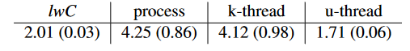

# Light-Weight Contexts: An OS Abstraction for Safety and Performance

## Abstract

OS抽象——light weight contexts（lwCs），在进程中提供独立的保护、权限和执行状态单元。

lwCs 的开销与 lwCs 的内存量成正比。

切换 lwCs 比在同一个进程内进行切换内核线程更快。

## Introduction

进程抽象出通用操作系统中的隔离、特权和执行状态单元。需要在操作系统级别提供内存隔离、权限分离或延续的计算必须在单独的进程中运行（或者在语言、运行时方面付出更多的成本）。

进程间通信、切换需要内核调度器、资源核算、上下文切换、IPC 等开销。

线程将执行单元从进程中分离，作者断言将内存隔离、执行状态与权限分离等功能与进程概念相分离是有好处的。

**具体的做法**：每个 lwCs 可以拥有各自独立的虚拟内存映射、文件描述符、可信凭证。也可以共享。

但 lwCs 是不可调度的实体，与进程内可执行的线程是完全正交的。一个线程可以从 lwC a 通过系统调用切换到 lwC b。这种切换将以原子的方式改变线程的 VM 映射、文件描述符、权限和栈指针。多个线程可能会在同一个 lwC 中执行。lwC 中会维护每个线程的状态。

**贡献点**：1. 提供了 lwCs 操作系统抽象，并扩展了 POSIX api，展示了常见的编码方式以及不同的用途。2. 在 FreeBSD 中实现了 lwCs 并且实际的 web 服务中实现高效的会话隔离。3. 使用一系列的 micro-benchmarks 和应用场景。相比其他的方法，使用 lwCs 能够提供开销更小的会话隔离机制。

## Related work

1.  Wedge - sthread：在 sthread 之间提供权限分离和隔离，否则 sthread 共享地址空间，基于 Linux 进程。lwCs 与线程正交，避免了在切换上下文时进行调度的成本。lwCs 可以对执行的任何状态进行快照，而 sthread 只能恢复到初始状态。
2.  Shreds：基于 ARM 架构对内存域支持，以及编译工具链、内核的支持，在进程中提供隔离的代码和数据区段。lwCs 不依赖编译器支持，只依赖基于页的硬件保护机制，并且可以通过快照功能。
3.  SpaceJMP：将地址空间从进程中独立出来。它与 lwCs 均可在进程内切换地址空间，但 SpaceJMP 的上下文切换与强制控制转移无关，因此它不支持在进程中需要分离或权限分离的应用程序。
4.  Dune 基于 Intel VT-x 技术，将虚拟化支持安全的导出到 linux 进程中，可以在进程中实现权限分离、引用监视器和隔离区间等，依赖特定的虚拟化硬件设备。lwCs 会由于系统调用重定向带来高开销，但避免了 Dune 在 TLB 未命中和内核调用上的开销。
5.  Trellis：基于代码注释，编译器、运行时和内核模块。在应用内部提供权限分离。内核和运行时确保了只有相同或更高权限的代码才能调用函数和访问数据，lwCs 不需要语言、编译器的支持，并且切换开销更小，支持快照。
6.  Mondrian Memory Protection（MMP）、Mondrix、CHERI 基于硬件扩展。
7.  Resource containers 将资源审计从进程中独立出来，lwCs 与其是正交的。
8.  Corey OS 对 CPU 内核之间的内存区域和内核资源共享提供了细粒度控制。
9.  编程语言提供轻量级隔离、权限分类和快照。C++、Java 等提供了静态隔离，动态隔离则需要不可忽略的运行时开销。lwCs 不依赖于编程语言。像 C 语言这种低级语言可以通过二进制重写和编译器插桩检查来实现隔离和特权保护，但需要 OS 支持，且会带来运行时开销。
10. 软件故障隔离依赖二进制文件的静态检查和检测。
11. 进程检查点设施将进程状态持久化到内存中，lwCs 可以非常迅速的完成快照。
12. Determinator OS 依赖私有工作空间模型 - space，来实现在多核平台上的确定执行。space 绑定到线程。
13. Intel SGX 技术提供了 ISA 支持，可以增强 lwCs，但一些 lwC 应用需要大量重构才可以在 SGX 上运行。
14. NOVA 在 VMM 上提供保护域和执行上下文机制，与 lwC 的目标不同。

## lwC design

lwC 与线程独立。在进程内，任意时刻，线程在一个 lwC 上执行，且可以在 lwC 之间切换。每个 lwC 使用文件描述符命名。每个进程存在一个 root lwC。

### Creating lwCs

lwcreate：类似 fork，子 lwC 的初始状态为父 lwC 的状态（除了描述符），且没有线程在子 lwC 中执行。

可以通过 lwCreate 接口来快速创建快照。

### Switching between lwCs

lwSwitch：将调用的线程切换到目标 lwC 上，并将参数传递过去。在当前 lwC 上保存当前的线程状态。同一个线程下一次切换回旧的 lwC 时，视为 lwSwitch 函数返回。类似于协程 yield。

### Static resource sharing

由于子 lwC 与父 lwC 之间的资源不同，因此在传递父 lwC 中线程的堆栈、代码、同步变量和其他依赖项时，需要仔细检查，来确保行为可预测。

### Dynamic resource sharing

lwOverlay 接口

## Evaluation

### lwC switch

略……

## Conclusion

提供了快速的操作系统级快照和上下文之间的协程样式控制传输。
