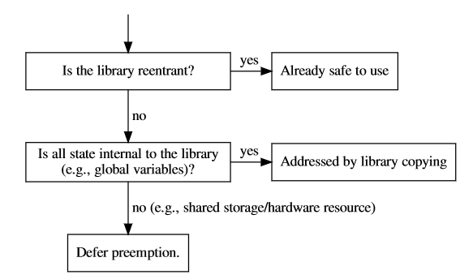
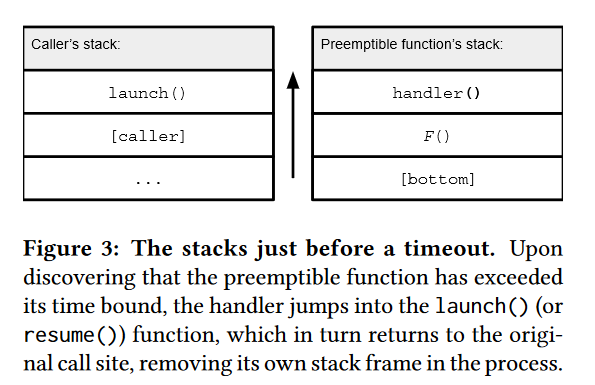
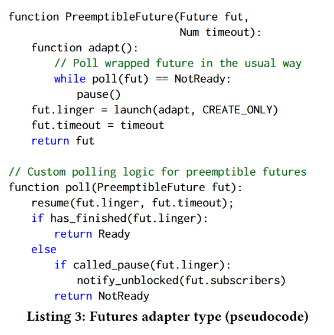
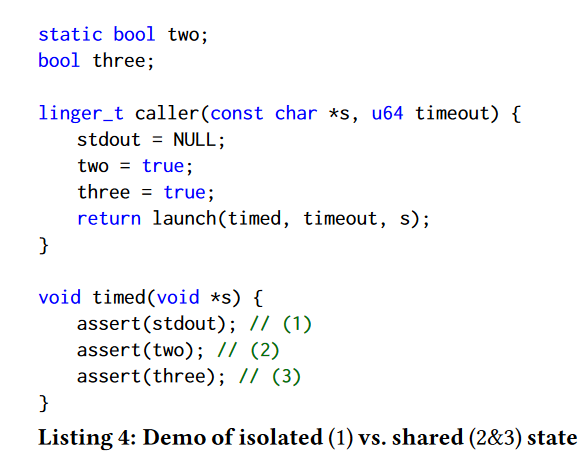
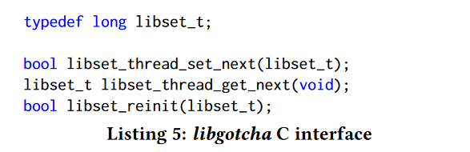

### Lightweight Preemptible Functions

**背景**：没有内核支持的逻辑线程模式（green thread），os 无法感知单个任务，因此上下文的切换是纯协作式的。

**核心贡献**：带有计时器的函数抽象，能够进行抢占。一旦某个函数超时，该函数的执行状态被返回，用于后续的调用。

**解决问题**：用户代码打断其他用户代码只有在严格限制自己调用异步信号安全的函数时才是安全的。基于时间的函数抢占构成了对程序后续部分的中断，这意味着程序的后续部分只能调用可重入函数。

文章的重大贡献是解决了上述的调用可重入函数的限制。某些库是可重入的，而其他的库则通过复制库的内部状态，使抢占一个调用不会打断库的并发调用。

##### 实现函数抢占的方式

###### naive 方式：关键路径上存在创建线程，因此性能损失

1. 实现可抢占函数最简单的方式是将其映射到系统线程上，但是取消线程很困难（内存分配、锁等资源释放）。
2. 通过 fork() 系统调用：性能损失、对象可见性和所有权挑战

##### 贡献

1. 提出在抢占时返回延续的函数调用
2. 引入选择性重链接，可以自动解除与不可重入相关的安全限制
3. 演示了如何支持异步的函数取消

##### 相关工作

1. 协作式方法：运行时检查定时器，自愿将 CPU 让出给另一个任务
    - 无法中断两类定时代码：blocking-call（长时间陷入内核中）、excessively-tight loops（循环主体没有可让出点）
2. 抢占式方法：外部直接抢占，CPU 直接交给调度程序，例如中断或异常

- Scheme engines：调用函数时需要指定 tick 参数，时间耗尽后，返回记录中断点的 engine（关键字），依赖 scheme 运行时
- Lilt：语言提供静态强制定时策略，编译器跟踪每条路径可能持续的时间，在可能超时的点插入 yield，可以解决 excessively-tight loops，但是无法解决 blocking-call
- goroutine：运行时在函数调用点有条件的 yield，但对于 excessively-tight loops 只能手动插入 Gosched()
- the C∀ language、RT（C 语言，用于实时系统的线程库）：使用时钟中断进行抢占
- Shinjuku：在 worker thread pool 上运行任务，由一个中心化的调度线程进行控制，后者控制每个任务运行的时间，并向任何任务超时的工作者发送处理器间中断(IPI)。

##### Timed functions：libinger

###### APIs：

- launch() 指定 function 运行的时间，并运行；函数完成后直接返回，或者时间耗尽后返回 continuation 对象
- resume() 超时函数继续运行

链接：[Efficient Computing at Carnegie Mellon](https://efficient.github.io/#lpf)

###### Automatic handling of shared state

函数 F 调用了第三方库 L，其中存在共享的状态，此时 F 被抢占，另一个函数 F0 也调用了 L，这时就存在 bug。一种解决方案是遵循 POSIX 信号处理采用的方法，并且限制抢占的函数不调用第三方库 L。libinger 则是自动创建第三方库 L 的内部状态。

###### Safe concurrency

使用 Rust 的 Send trait 保证 thread-safe，针对死锁问题：当执行了 try-lock 操作后，抢占函数会执行 pause() 操作返回到被调用函数。

###### Execution stacks

对于每个新的函数，launch() 函数会切换到一个新的栈上运行。libinger 分配了 2-MB 的栈，在第一次使用时预分配一个可重用堆栈池。

###### Timer interrupts

中断处理函数中保存寄存器状态，再通过非结构化跳转回到 launch() 或者 resume()，同时切换栈。对于 blocking-call 问题，通过在注册信号处理函数时使用 SA_RESTART 标记告知 libc 重启被信号中断的系统调用。将信号发送到正在运行可抢占函数的进程的特定线程上。

###### Cancellation

Rust 通过 destructor 完成，而 C 则需要显示调用 cancel() 函数。释放掉 launch() 函数中申请的资源。

##### Thread library: libturquoise

###### Futures and asynchronous I/O

##### Shared state: libgotcha

专门用于隐藏 app 共享状态的运行时；假设程序员将动态链接所有第三方库，只能通过这种方式将其与第三方库分离开。

###### Library copying: namespaces

将可抢占函数的边界扩充至第三方库需要这些第三方库的副本。通过 ld-linux.so 维护 namespace，每次执行可抢占函数 F 时，使用 namespace 副本，但会改变 static 变量的作用域。

###### Library copying: libsets

使用 libsets 来替换 namespace，避免过多的隔离（针对不存在共享状态的库）。每当 launch(F) 发生时，将会为可抢占函数分配一个可用的 libset。

###### Managing libsets

在程序开始时，libgotcha 初始化 libset 池。libinger 跟踪给每个可抢占函数分配的 libset。当可抢占函数正常返回时，直接将 libset 放入池中，但如果是被取消，则需要通过 libset_reinit() 重置。

###### Selective relinking

作为 libset 切换的基础机制。在 ld-linux.so 填充完 GOT 后，libgotcha 使用影子 GOT 进行替换。通过触发地址访问错误，libgotcha 在处理错误时进行地址替换操作

###### Uninterruptible code: uncopyable

