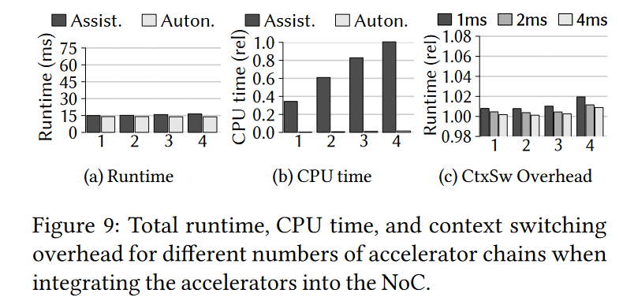

### M3X: Autonomous Accelerators via Context-Enabled Fast-Path Communication

#### 加速器面临的困难（摘要）

1. 需要处理器核的辅助，不能自主访问操作系统的服务
2. 快速通路通信与抢占式上下文切换不同
3. 这些概念（？？？）需要正交，加速器与处理器核之间才可以直接无辅助的通信
4. 支持多个应用程序上下文切换（最困难）

#### 提高性能的方法（背景）

##### 面临的问题

1. 主频不能进一步提高
2. 并行性得到限制

##### 解决方案

1. 定制加速器
2. 绕过内核通信

##### 问题陈述

1. 加速器自主性：直接访问数据，不需要通过内核，这需要建立加速器与 OS 服务之间的连接，例如 GPUfs、GPUnet、FPGAFS 等，但不能多个加速器之间不通过 OS 通信
2. 快速通路通信的上下文切换：通信双方不固定，且不一定在线，

##### M^3^x 方案

1. 不仅建立在共享内存之上，提供全局缓存一致性困难，未来的系统如何支持缓存一致性尚不明确

2. M^3^使用的方案：使用专门的处理器核处理通信，因此避免了上下文切换（与 hotos 上的文章思路相同），但需求增加，使用专门的资源处理特定的任务仍然不太现实，因此不使用专门的处理器核就必须考虑上下文切换的问题
3. 快速通路通信接收方不在线，将如何传递消息？如果使用 DRAM 缓存消息，会增加 DRAM 的负担，最简单的方法是当接收方不在线时，直接唤醒并再次发送消息，但不能满足需求，因为这两个操作不是原子的，在唤醒之后再次发送之前，接收方可能继续被阻塞。并且不经过内核，内核无法做出调度或者放置决策。
4. 加速器直接访问 OS 服务

#### M^3^X 设计（design）

##### 系统架构

平坦模型、共享 DRAM

##### 集成加速器

1. 硬件完成数据源的搬运工作，将其从软件卸载到硬件上。（DMA 的作用）

2. 单个加速器上运行多个任务，则需要低延迟的上下文切换。但加速器通常由软件调用，一直到完成都不会被中断，如果数据量大，则延迟会增加，如果每次的数据量较小，则延迟会减小，但是需要在软件上不断地调用加速器，造成 CPU 占用增加。解决方案：在加速器逻辑中增加可抢占点的状态机。（猜测与中断的机制相似）
3. 加速器中添加简单的状态机，保存和恢复上下文，在软件中进行复杂的调度决策

##### Activity-aware 通信

1. 不依赖共享内存（接收方不在线则不能发送消息）：解决方案，挂起某个任务时，将所有的通信通道失效（增加上下文切换的开销）；保持通信通道有效，但惰性地检测与挂起任务的通信尝试（需要硬件支持）。使用 lazy 方法，并且当接收方挂起时，不会使用很多通信通道，在与挂起的接收方通信时，会产生硬件错误

##### 消息转发

当接收方不在线，硬件产生错误后，重新调度接收方存在以下竞争条件：内核不参与快速通路通信，因此无法获取通信结束的时间，因此可能在发送过程中将接收方挂起（上下文切换与快速通路通信解耦），例如多个发送方与在同一个 CU（component unit） 上的多个接收方通信，直接调度挂起接收方会导致正在通信的接收方挂起。这种因为调度导致的失败，退化为由内核转发的通信方式。任务 A 向任务 B 发送消息，收到硬件产生的错误信号后，告知内核，由内核转发调度 B，并且在完成通信之前，不会挂起 B。

##### 任务状态

使用快速通路通信，内核无法感知任务处于计算状态或者空闲状态。可以发送空间通知或者内核定期轮询所有任务解决这个困境。延迟发送空闲通知（由 idle delay 控制，存储在任务地址空间中，由内核进行更新），避免过急的切换上下文。或者当前的 CU 上没有就绪任务时，不需要发送空闲通知。不强制发送空闲通知，但可以使用一些传统的方式强制进行切换。

##### 调度组

当通信频繁的任务与其他的任务竞争同一个 CU 时，需要一个有条理的调度方案来维持高性能。将调度组中的任务固定在不同的 CU 上，同时进行调度，来运行同一条链上的任务。

##### 加速器类型

1. 流处理加速器：将数据以块的形式打包，加速器处理块，基于 DMA
2. 请求处理加速器：通过请求，加速器直接处理所有的数据，基于内存缓存来支持大规模数据访问

两类加速器都增加了 ASM（accelerator support module），内部实现了有限状态机，用于与其他 CU 的交互。

##### 访问 OS 服务

设计了一个让加速器访问所有 file-like 对象的协议，在 client 和 server 之间建立快速通路消息通道，加速器可以自主访问数据，不需要进行过多的交互。

协议包括两部分：next_in 和 next_out。前者请求下一块需要读取的数据，后者请求下一块可以写的数据。由于客户端自主访问数据，因此服务端并不知道客户端实际访问的数据量。因此，对于输入和输出请求都需要进行提交。每次 next_in 或 next_out 暗含了上一次访问的数据量。commit 可以显示的表示上一次请求的数据量（例如客户端停止写入时，可能实际写的数据量小）。

##### 可中断加速器

通过使用 ASM 中的状态机，软件上执行粗粒度的调用，而硬件则执行细粒度的调用，而这些调用之间可以被中断。流处理加速器不需要这种可中断的需求，而请求处理加速器需要。

#### 实现（implementation）

##### 基于 M^3^

M^3^ 在每个 CU 旁增加了新的硬件组件（DTU，数据传输单元），作为 CU 的异构硬件抽象，来支持 CU 之间的快速通路通信。DTU 通过 MMIO 访问，与 CU 组成片上网络，DTU 提供通信原语，可配置成接收方、发送方端点或内存端点。发送方和接收方用于构建快速通路通信，而内存端点用于构建快速通路数据通道，提供类似与 DMA 的访问。M^3^ 运行在专门的 tile 上，有些 tile 不能运行 OS 内核。M^3^ 与传统内核不同，它不在内核 tile 上运行用户程序，在其他 tile（user tile） 上运行用户程序。内核 tile 需要建立 user tile 之间的快速通路，管理 user tile 的 DTU 状态，使用 capabilities 管理系统权限。M^3^ 没有上下文切换，因此创建空闲任务，将其分配到空闲 tile 上，直至任务结束。M^3^ 使用内存文件系统 m3fs，允许应用程序直接通过 DTU 访问数据。

##### 虚拟内存支持

在内核中运行接收页错误的帮助器，在 DTU 中增加 MMU，与页表 walker 和 TLB 保持一致性。页错误由分页器与 M^3^X 内核协作处理，后者更新页表项，与其他微内核系统类似，而分页器则作为 M^3^X 中的服务器，支持 COW 需求。通用处理器核上，页面帮助器发送消息给分页器来解决页错误，在加速器上，DTU 发送消息给分页器。

##### 上下文切换

上下文切换只发生在 user tile 上，由 M^3^X 内核远程执行。

CtxSW：context switcher

RCTMux：remotely controlled time multiplexer，保存和恢复 CU 状态

DTU 状态由内核保存和恢复，M^3^ 内核为每个 user tile 维护一个 CtxSW，用于执行调度和放置决策。

CtxSW 与 RCTMux 之间的接口由内核用于请求 RCTMux 保存和恢复 CU 状态，并被 RCTMux 用来确认它们的完成。

DTU 之间的接口用于内核向 CU 发送即将发生上下文切换信号。

##### 内核扩展

在 M^3^ 内核中加入 CtxSW，CtxSW 要求 RCTMux 保存 CU 状态，CtxSW 自己保存 DTU 状态，再恢复新任务的 DTU 状态，RCTMux 恢复新任务的 CU 状态。

增加系统调用，在接收方挂起时，用于转发消息。为发送空闲通知增加系统调用。

增加任务迁移逻辑，当两个任务进行通信但被分到同一个 CU 上时，被挂起的任务将会迁移到另一个 CU 上；如果某个任务处于空闲时，则会尝试从其他兼容的 CU 中窃取任务。

##### DTU 扩展

在 DTU 中增加当前任务 ID，消息头中附加目标任务 ID，保证能够检测是否与挂起的任务进行通信。如果 ID 不匹配，DTU 会发送错误信号给发送方，发送方则会请求内核转发。如果内核在加速器正在执行任务时决定调度，进行上下文切换，则 DTU 有停止指令，后续的通信将被拒绝并产生错误，直到内核重新启用；对于已经发送的消息，DTU 等待所有基于消息的通信完成，而对于数据访问则因为错误而中止。

##### RCTMux

如果需要发生上下文切换，RCTMux 将会接收到信号，ASM 只在特定的时间点检测信号。接收到切换信号，RCTMux 将 ASM 的状态和加速器本地内存通过 DTU 保存到 DRAM 中预先分配的位置。再使用 DTU 的停止指令，通知内核状态已经被保存。内核发送恢复请求时也类似。

##### 文件协议服务端

M^3^ 的 m3fs 只适用于通用处理器核，不适用于加速器。

M^3^X 文件协议基于 client-server 之间的消息通道以及用于访问文件数据的数据通道。next_in 请求通过内核建立相关数据通道，给 client 提供访问下一个范围的权限。而 seek 请求可以修改文件指针，next_out 请求提供 client 访问空间的权限，commit 则允许裁剪多余的空间。

##### 文件协议客户端

软件或者硬件都可以作为 client，ASM 通过 DTU 将数据加载到加速器的 scratchpad memory 中，激活加速逻辑，并将结果写到输出流中。

#### Discussion

1. 通过 RCTMux 进行上下文切换对于大状态的加速器不友好，但是大状态的加速器需要定制上下文切换机制。
2. 在同一个 CU 上的任务进行通信，盲目的将其中挂起的接收方分配到另一个 CU 不适用所有场景，例如只通信一次。
3. 当接收方挂起时，没有将消息用队列保存起来，而是通过内核转发，可以在加速器中增加消息队列

#### 评估

##### Fast-Path VS. Forwarding

##### Application-level Benchmarks

##### Tile Sharing

可以在内核中直接运行上下文切换，避免不必要的浪费。

##### Autonomous Request Processing

##### Autonomous Stream Processing

#### 总结

- 加速器自主访问 OS 服务：修改文件系统，增加 next_in、next_out、commit 等接口给加速器使用，需要预先建立收发双方通道以及数据访问通道
- 上下文切换（加速器虚拟化），避免大规模的计算长时间占用加速器
    - 在加速器中增加状态机，在特定的状态可以进行切换，与其他的 CU 进行交互
    - 上下文切换：RCTMux 收到切换信号，通过 DTU 将加速器的状态保存到 DRAM 中预先分配的位置，通用处理器模块中则保存 DTU 的状态
- 虚拟内存支持：DTU 中增加 MMU
- 通过 capability 管理访问权限等
- 针对通信双方在同一个 CU 上运行的情况进行优化：将挂起的接收方迁移到另一个 CU 上
- 不依赖共享内存进行通信：接收方不在线，硬件产生错误信号，让内核转发，唤醒接收方

#### 不完善的地方

1. 针对 GPU 这些加速器，状态机不适用
2. 迁移挂起接收方的操作不使用，如果仅仅通信一次

#### 存在困惑的地方

1. 接收方不在线的情况，通过内核转发了，使用队列缓存，内核来控制下一次接收方的操作，文章中提到在加速器中增加缓冲队列，但加速器中增加缓冲队列，加速器对于收发的处理应该会更加复杂
1. 针对软硬件结合，硬件访问 OS 的服务，使用文件系统提供的服务，软件调用加速器的接口不太清楚