# Optimizing Storage Performance with Calibrated Interrupts

## Abstract

IO 设备完成请求后：

1.  立即发起中断减小时延
2.  延迟发起中断，增加吞吐量

采用启发式中断合并的方式来平衡这两个目标。

问题：设备缺乏关于 IO 请求延迟敏感度的信息

解决方案：软件明确指定哪些需求为 IO 敏感型

## Introduction

NVMe 不仅每秒可以发起数百万个请求，且可以同时发起 65535 个并发请求，针对每个完成请求发起中断会导致中断风暴

中断合并通过将请求批量化为单个中断来解决中断风暴

批处理带来了请求延迟和中断率之间的权衡。即使合并少数的中断，其请求时延也提高了 10x

将发给设备的请求增加了 2 位，使得软件能够将时延敏感度信息提交给设备

**缺点**：需要修改设备

同样的中断 calibrate 方式也可用于网卡，但更具有挑战性

## Background and Related Work

以有的研究工作专注于提高 IO 提交率，而没有直接解决更高完成率的问题。

**Lessons from Networking**：从 100Gbps 网络获得灵感，中断合并、轮询

**NVMe中断合并的问题**：

1.  仅允许以 100 微秒为增量设置聚合时间，导致中断合并时延严重增加的原因
2.  NVMe 的聚合设置均为静态的

**Polling is expensive**:

1.  用户态通过 SPDK 轮询需要对应用进行修改，且无论在内核或用户态 polling 均浪费 CPU cycle。只轮询低时延的请求仍然会存在浪费
2.  混合轮询模式：休眠一段时间再轮询在请求大小变化以及线程增多时很低效

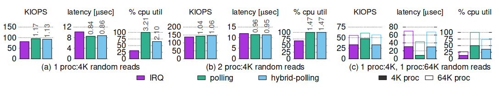

**Heuristics-based Completion**：vIC 尝试通过启发式估计 I/O 完成时间来调节虚拟中断。

网卡一方面通过合并减少中断开销，以帮助以吞吐量为导向的工作负载，另一方面通过尽快触发传入数据包的中断，为延迟敏感的工作负载提供低延迟。（在设备内部实现，并由驱动辅助）但必须满足通用负载导致无法达到最优。

## Cinterrupts

在设备端的启发式中断合并方式由于请求和设备之间的信息差，总会存在一些边界情况无法达到最优。

Cinterrupts 利用了延迟敏感度信息可以轻易的存储在设备中，且能够在提交时访问的特点。（与网卡不同）

### Adaptive Coalescing

NVMe 中的超时粒度即使再小，也是固定的，总会存在浪费。

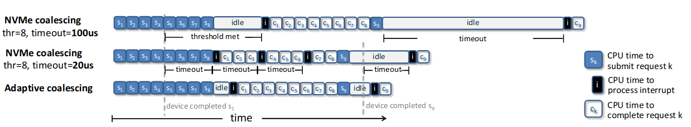

 自适应算法：

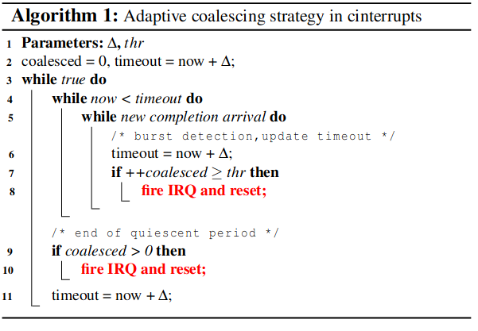

自适应算法与默认、NVMe 静态中断合并算法对比

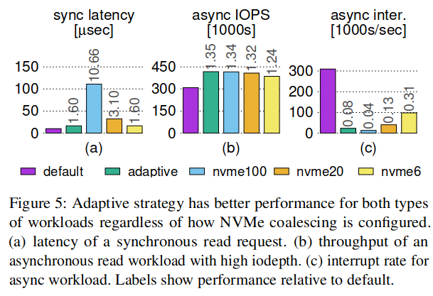

在请求足够多时，NVMe 超时时间设置越小，反而会产生一些不必要的影响。

cinterrupt 算法增加了 Urgent 和 Barrier 注释

### Urgent

带有 Urgent 标记的请求会马上产生中断，因此是用于标记那些延迟敏感的请求。

使用 Urgent 的对比结果：（紫色结果最优）

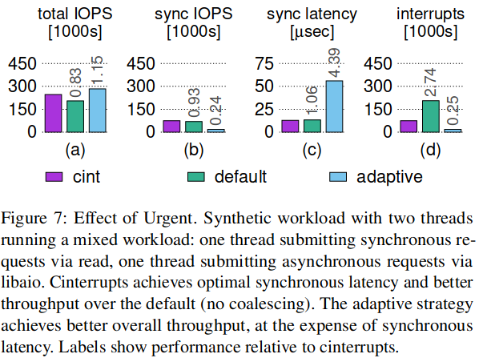

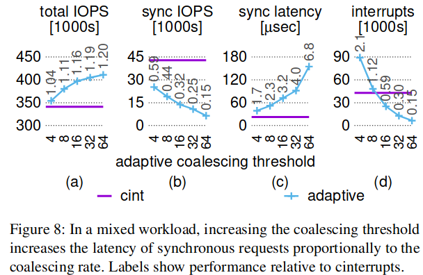

### Barrier

设置了 barrier 后，在前面所有的请求完成后，将会产生中断。因此有利于降低中断率。

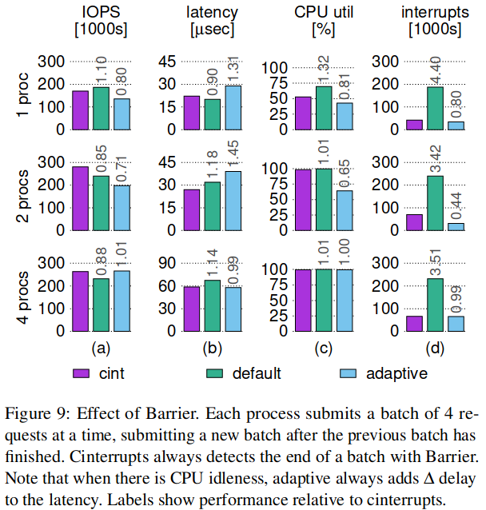

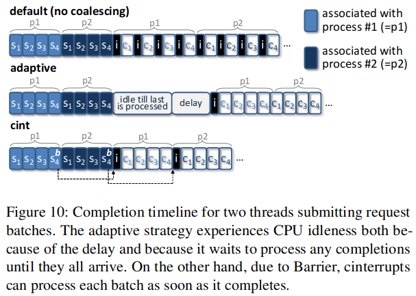

### Out-of-Order Urgent

通过 cinterrupt 的乱序处理，使得在中断处理时，只会处理带有 Urgent 标记的请求，从而快速回到用户态，但带来了中断次数增加。

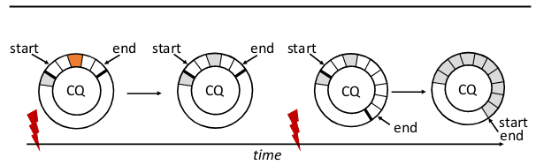

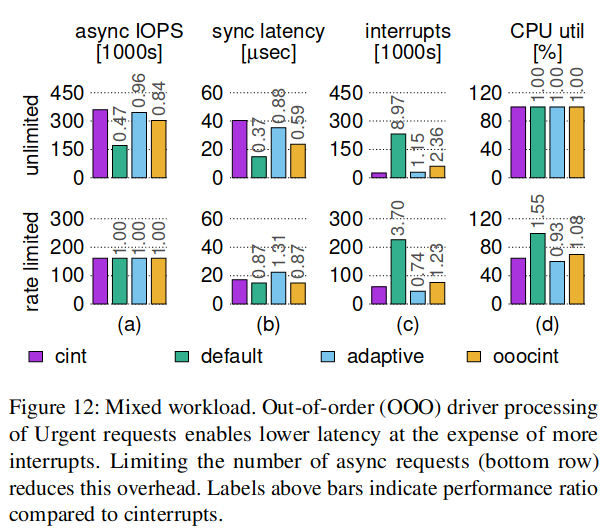

完整的 cinterrupt 算法：

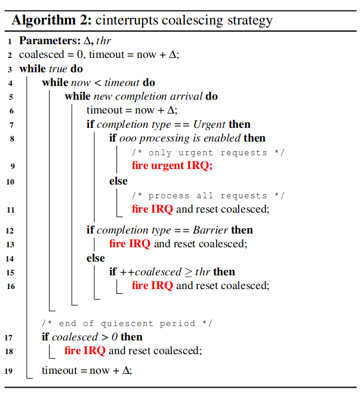

## Implementation

### Software Modifications

修改内核，设置默认注释。

针对让用户进程阻塞的系统调用标记为 Urgent，而支持异步的系统调用则标记为 Barrier。

### Hardware Modifications

由于硬件设备的队列存在限制，因此不能使用专门的 Urgent 队列来处理带有 Urgent 标记的请求。

最终使用的模拟方案：

专用核心运行在 NVMe 设备驱动程序中创建的固定内核线程，该线程轮询目标核心的完成队列并根据算法 2 生成 IPI。

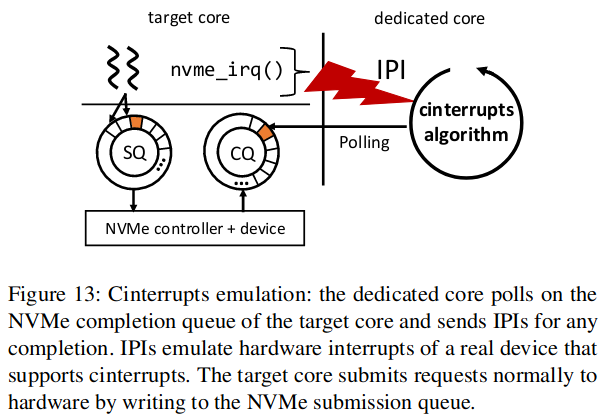

cinterrupt 注释嵌入到请求 ID 中，关闭了目标核分配的 NVMe 队列中断。

## Evaluation

每个核心都分配有自己的 NVMe 提交和完成队列。

模拟中断带来的开销为 3-6%

### Microbenchmarks

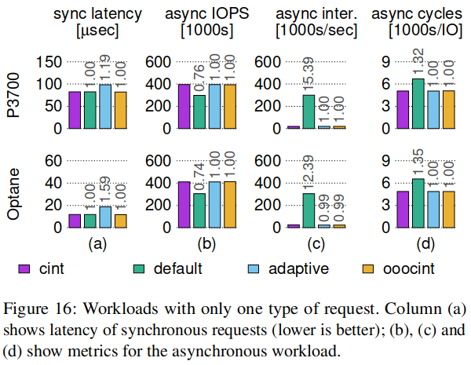

同步工作负载通过 read 提交阻塞 4 KB 读取。异步工作负载通过 libaio 提交 4 KB 读取，io深度为 256，批次大小为 16。

1.  Cinterrupts 与默认的同步延迟相匹配，同时实现了高达 35% 的异步吞吐量提高；与自适应的异步吞吐量相匹配，同时实现了高达 37% 的低延迟。
2.  当未触发时，OOO 不会增加 cinterrupts 性能的开销。

### Macrobenchmarks

### RocksDB

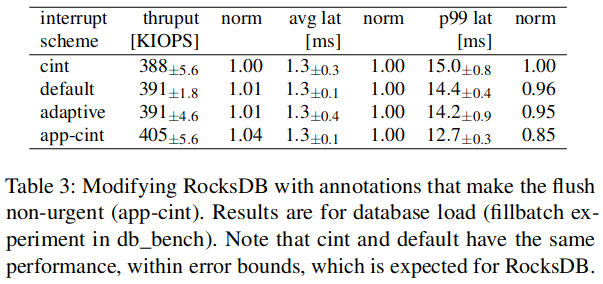

### KVell

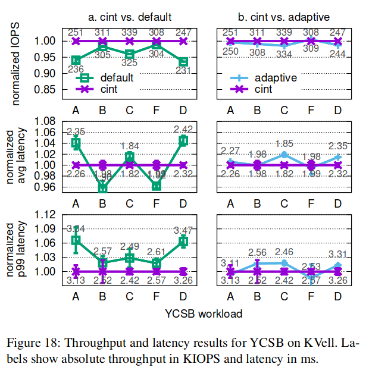

## Cinterrupts for Networking

困难：

1.  修改单台机器不足够，收发都需要进行修改，且任何中断驱动的软件路由器也需要支持 cinterrupt
2.  网络分层协议，直接套用 NVMe 的 cinterrupt 不可行，NIC 可能会看不到 cinterrupt 的信息，否则就需要逐层传递 cinterrupt 信息
3.  Ethernet 协议头部没有可用于传递 cinterrupt 信息的保留字段
