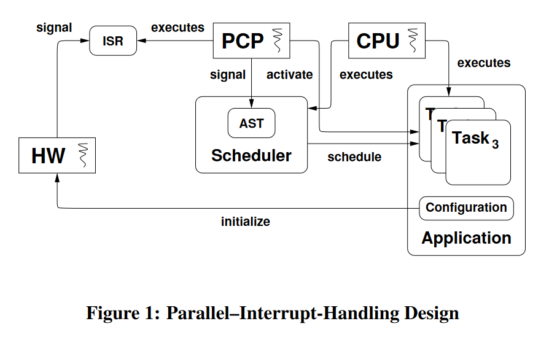
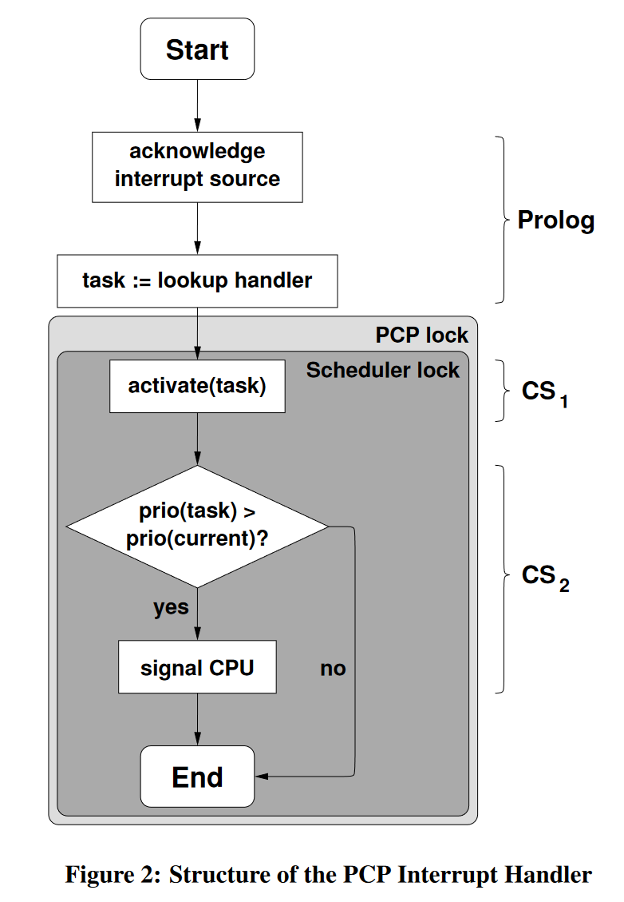

# Parallel, hardware-supported interrupt handling in an event-triggered real-time operating system

#### 赵方亮笔记

## Introduction

### Rate-Monotonic Priority Inversion

用中断实现的低优先级任务抢占了高优先级的线程，导致了优先级反置。

### Parallel, Hardware-Supported Interrupt Handling

将中断重定向到协处理器中，并行处理。

## Design

PCP 修改调度器中任务的状态，但只有优先级高的中断任务转化为就绪时，才通知 CPU 进行重调度。

## Discussion

1.  使用 PCP 执行线程或 ISR，这不能解决优先级反置，并且在 PCP 上也会出现优先级反置
2.  PCP 的计算能力较弱

## 评论

关键的问题：协处理器和 CPU 运行的调度器需要保证互斥访问任务队列。可能一次中断处理被屏蔽两次。

PCP 与 CPU 之间可能因为同步互斥而相互阻塞，导致处理时间反而增加。
