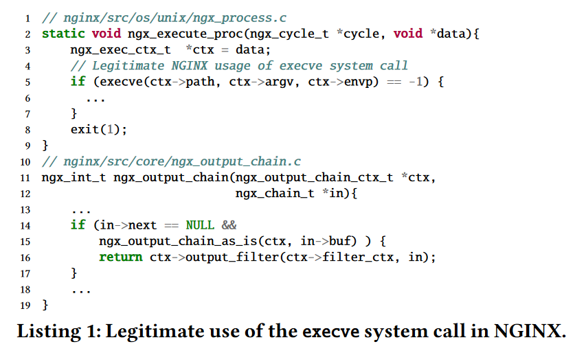
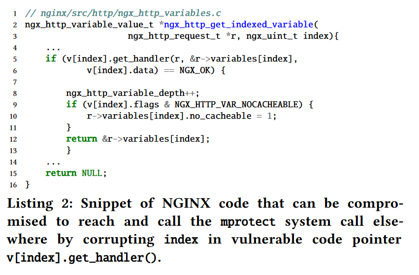
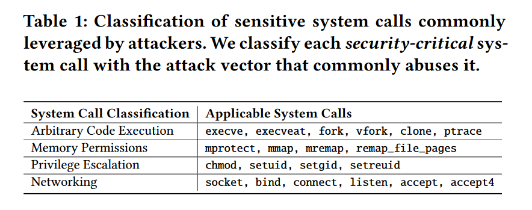
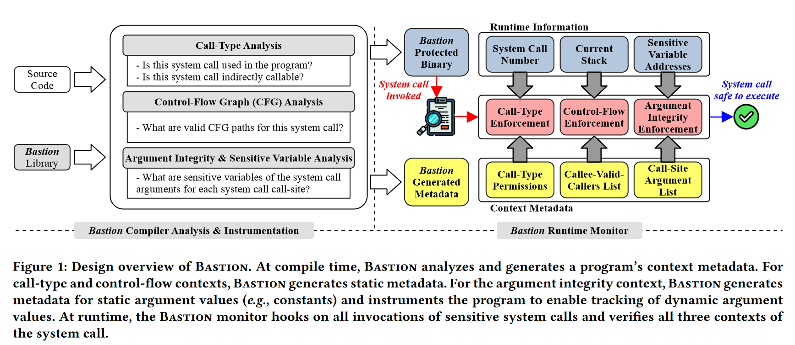

# Protect the System Call, Protect (Most of) the World with BASTION

## Abstract

在许多严重的安全攻击中，系统调用是一个关键的构建块。

本文提出了一种新的系统调用完整性( System Call Integrity )，它保证了系统调用在整个运行期间的正确使用。

界定了以下三个上下文：

1.  调用什么系统调用以及如何调用(调用类型)
2.  系统调用如何到达(控制流)
3.  参数不被破坏(论据完整性)

通过破坏攻击链中的关键构建块来挫败攻击。

BASTION 作为一个编译器和运行时监控系统。

## Introduction

核心思想是，正确使用系统调用应遵循两个性质：

1.  调用时流向系统调用的控制流应该是合法的
2.  系统调用的参数不应该被破坏

在程序运行过程中强制执行系统调用的正确使用，以打破攻击链中的关键部分。

基于更精细的系统调用过滤来确保系统调用的上下文正确。

BASTION 由两部分组成：

1.  定制化编译器
2.  运行时监控器

## Background

### System Call Usage in Attacks

目前的防御手段没有针对系统调用进行防御

### Current System Call Protection Mechanisms

1.  减少攻击面：去除二进制文件中未使用的代码
2.  系统调用过滤：只能针对部分系统调用进行使能/禁用的权限设置，对于mmap、mprotect 等系统调用无法做到，或者将系统调用的参数设置为常量，但这种限制策略也很宽松
3.  控制流完整性（CFI）：攻击者仍然可以通过破坏系统调用的参数来实施攻击
4.  数据流完整性（DFI）：有效性依赖于数据流图中的分析点的有效性

## CONTEXTS FOR SYSTEM CALL INTEGRITY

### Call-Type Context

只有允许的系统调用才能被调用

1.  not-callable
2.  directly-callable
3.  indirectly-callable

### Control-Flow Context

### Argument Integrity Context

### Real-World Code Examples

#### execve

需要针对每个应用的使用场景，来进行判断控制流的变化，例如上图中，需要明确知道到达 ngx\_execute\_proc 函数的路径

#### mprotect

## Threat Model and Assumptions

主要针对了这些敏感的系统调用进行防御。可以扩展至其他系统调用。

## Bastion Design Overview

编译器 + 运行时监控

## Bastion Compiler

分析 LLVM IR指令，并检查所有的函数调用指令。
