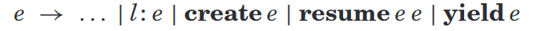
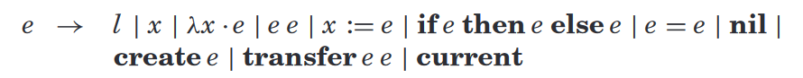

# Revisiting Coroutines

## Abstract

协程——通用控制抽象

引入完全非对称协程，并通过运算语义提供精确的定义。

证明了协程与 one-shot continuations 和 one-shot delimited continuations 具有同等的表达能力。

## Introduction

主流语言中协程设施的缺失可以部分归因于对这一概念缺乏统一的看法，而这一概念从未被精确定义过。

Marlin 的博士论文中对协程的特征进行了如下总结：

1.  协程的局部数据在连续调用之间持久化存在
2.  当控制离开时，协程被挂起，当控制重新进入协程后，从中断的地方继续

但这种描述过于一般，对于协程的结构没有给出明确的定义。

除了保存状态的能力，还可以确定区分不同种类的协程设施的三个主要问题：

1.  控制转移机制：对称/非对称协程
2.  协程是否作为语言中第一类对象提供，程序员可以自由构造还是需要作为受约束的前提构造
3.  协程是否作为堆栈结构实现，即是否能够在嵌套调用中暂停其执行

除了定义不明确，引入 first-class continuations 也导致了以协程作为一般控制抽象的研究兴趣终结。此外，现代语言中采用了多线程作为并发编程的实施标准。

一些研究开始尝试使用其他的可替代的并发编程：事件驱动编程、协作式多任务。

当作为 first-class object 提供，且以堆栈结构实现时，coroutine 与 one-shot continuations 和 one-shot delimited continuations 具有同等能力。对称/非对称具有等效的表达能力。非对称协程更加容易管理和理解，因此作者认为完全非对称协程时语言可扩展性的方便构造。

## A CLASSIFICATION OF COROUTINES

协程的通用描述：在连续调用之间能够保存状态。

### Control Transfer Mechanism

根据控制转移操作将协程分为对称和非对称协程的概念。

**对称协程**：通过单一的控制转移操作，允许协程之间显示传递控制权

**非对称协程**：提供两个控制转移操作，一个用于调用协程；另一个用于挂起协程，将控制权返回给协程调用者

两者的表达能力是相等的，在一个语言中同时增加两种协程机制并不会增强表达能力，只会增加语言的复杂程度。但两者在易用性方面不等同。

### First-Class versus Constrained Coroutines

“是否作为 first-class object 提供” 对协程表达能力会产生重大影响。

### Stackfulness

stackful 协程机制允许在嵌套函数内暂停其执行。

非堆栈协程也不够强大，无法支持通用的多任务环境。

### Full Coroutines

影响协程表达能力的两个因素：1. 是否作为 first-class object 提供；2. 是否是堆栈结构；

## FULL ASYMMETRIC COROUTINES

### Coroutine Operators

完全非对称协程包含三种操作符：create、resume、yield。

create：参数为 procedural，与协程主体相关，并返回创建的协程的引用；但并不会开始执行，开始处于挂起状态，其 continuation point 被设置为主体的起点。

resume：参数为 create 接口返回的协程引用，当协程第一次 resume 时，第二个参数为传递给协程主体的参数，后续每次 resume 时的第二个参数为 yield 返回的值。

yield：将协程挂起，并将 continuation point 设置为挂起的位置，保证下次执行从挂起处继续。

### Operational Semantics

对完全非对称协程的扩展：

使用 labels 作为协程的引用，并使用 labeled 表达式来表示当前活动的协程。

规则 8 表示创建协程，使用 label 来表示协程，并将 label 到协程主体的映射存储起来。

规则 9 表示 resume 生成一个带标签的表达式，它从存储中获取协程的 continuation。

规则 10 表示协程挂起操作，yield 必须由 labeled subcontext 执行，它将会创建一个 continuation 并替代存储中的 label-coroutine 映射。

规则 11 表示协程结束，返回值将成为最后一次 resume 的结果，并且将创建时建立的 label-coroutine 映射移除。

## PROGRAMMING WITH FULL ASYMMETRIC COROUTINES

### An Example of a Full Asymmetric Coroutine Facility

### Implementing Generators

### Cooperative Multitasking

具有协程的编程语言不需要额外的并发结构。engines 和大多数线程实现都提供基于抢占的多任务处理。

在协作式多任务环境下，并发任务的交错是确定性的，不会发生竞争，对共享资源的访问很简单，并且最大限度地减少了对同步机制的需求。

协作式多任务可能会导致公平性问题，

用户态多任务将协作的环境限制在同一个程序中，因此公平性问题可以很好的解决。

## EXPRESSING ALTERNATIVE CONTROL STRUCTURES

### Symmetric Coroutines

两种基本操作符：create、transfer + current

create：与创建非对称协程相同

transfer：将 continuation point 保存，并激活作为第一个参数传递的下一个协程；主协程结束标志着程序结束，其他的协程结束，则控制权则会回到主协程。

current 获取当前运行的协程的引用

### One-Shot Continuations

### One-Shot Subcontinuations

## FINAL REMARKS

没有解决跨语言调用的问题，但解决方案是在执行外部函数期间，不允许控制权转移。

性能问题无法保证。

没有证明使用非 first-class object 的协程或者非堆栈协程能否表达完全协程。

没有证明使用协程可以表达 multishot continuations。
