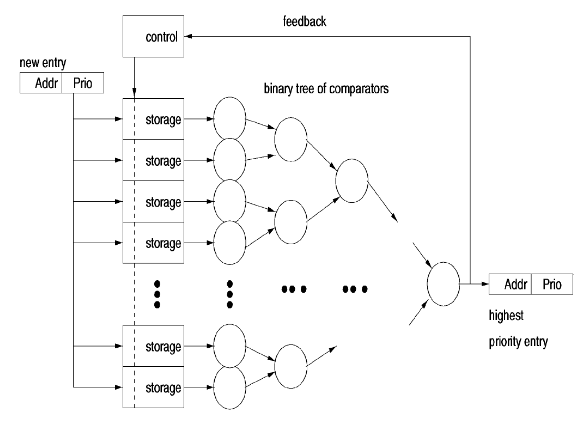
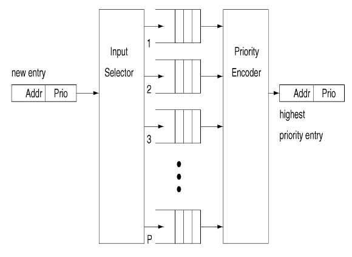
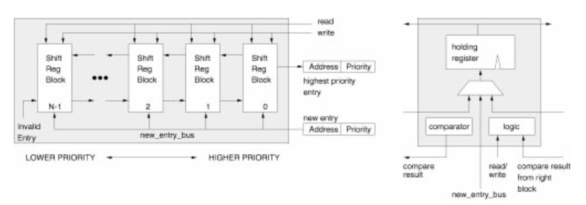
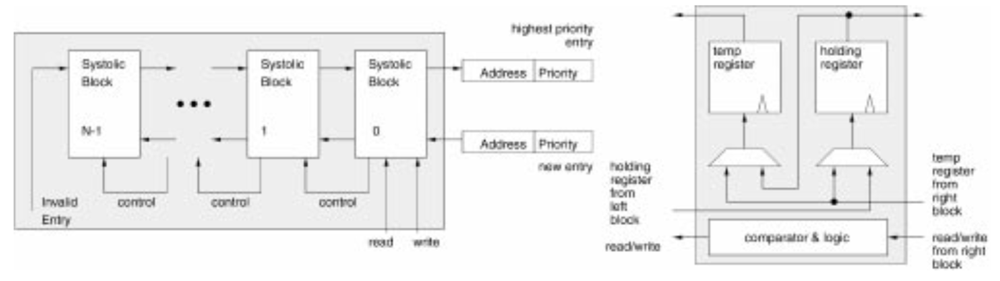
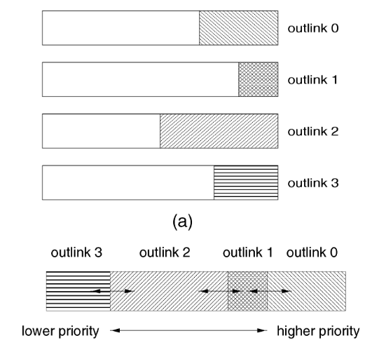
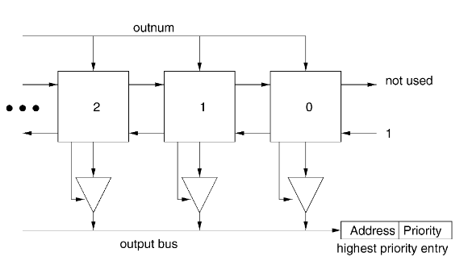
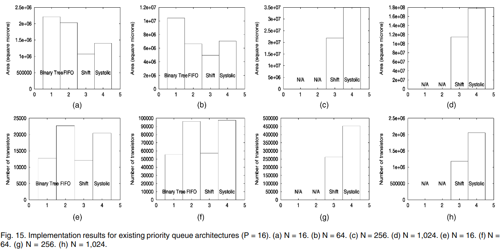
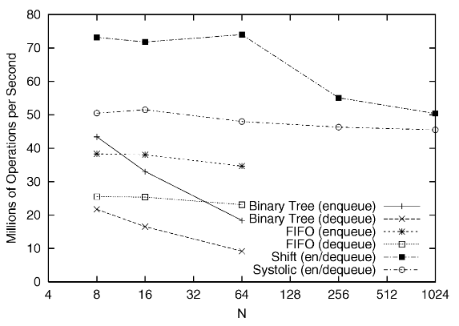
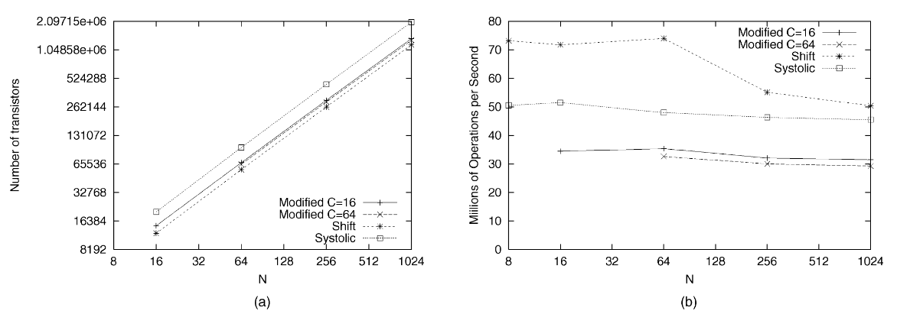
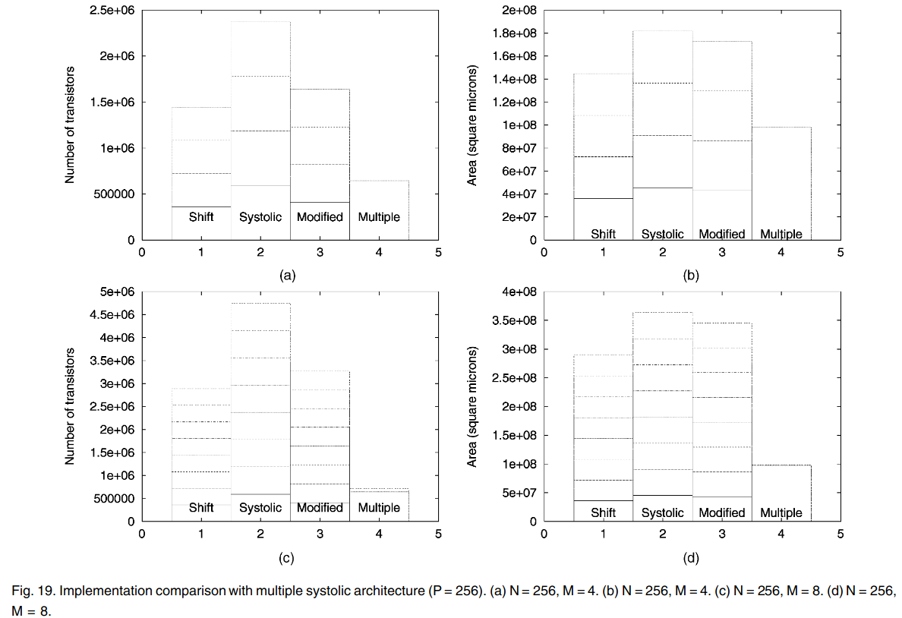

# Scalable hardware priority queue architectures for high-speed packet switches

#### 赵方亮笔记

## Introduction

链路调度程序协调给定链路上多个连接之间的数据包传输。由于一条链路一次只能发送一个数据包，因此尝试使用该链路的其他数据包必须排队。

链路调度程序通常为队列中的每个数据包（或数据包组）分配一些优先级编号，以确定一旦链路可用，哪个数据包可以访问该链路。

优先级队列对于实现链路调度算法至关重要。

## Priority Queue Architectures

移位寄存器和脉动阵列架构采用不同的方法，并且比 FIFO 和二叉树具有更好的扩展性。

### Binary Tree of Comparators

N 项存储块和深度为 log2 N 的比较器树，其输出是存储中优先级最高的项。

反馈机制用于从存储中删除树的输出。

优点：

1.  比较器可在多个存储块间共享

缺点：

1.  具有相同优先级的条目无法保证 FIFO 顺序

### FIFO Priority

根据条目的优先级将条目插入到 P 个 FIFO 之一中。

每个 FIFO 对应于特定的优先级，因此队列不需要为每个条目存储优先级字段。

优先级编码器按优先级降序扫描 FIFO 的头部，并从第一个非空 FIFO 中删除条目。

缺点：

随着 P 增加，需要更多的硬件资源，且解码逻辑复杂。

### Shift Register

每个块存储一个条目并与其右侧和左侧的块进行通信。

较高优先级条目存储在较低优先级条目的右侧，第 0 个块包含当前最高优先级条目。

入队：

1.  新条目通过 new\_entry\_bus 广播到所有块。
2.  每个块做出单独决策，保存当前条目或锁定右邻居的条目。
3.  让新条目强制所有具有较低优先级的条目向左移动一个块，而新条目将其自身放置在具有较高且相同优先级的条目的左侧。
4.  队列满时，丢弃优先级最低的条目

出队：只读取最右侧的条目，而其他条目右移一个块。

扩展性：由于每个块只进行本地决策，因此不需要增加额外的逻辑即可扩展 N，而 P 的扩展则需要在条目中增加位数，增加每个块的比较逻辑。

缺点：实现起来导致扩展性较差，每个块在做出决定之前，新的输入广播到所有块。（对于总线负载较大，而不是因为设计的问题）且 P 增加，导致比较逻辑增加。

### Systolic Array

入队：只有第 0 块与新条目比较，将优先级较低的条目传递到左侧的块再重复进行比较

出队：与 shift register 相同

缺点：

1.  增加 P 需要额外的存储和更宽的比较器。
2.  需要的存储量是 shift register 的两倍（每个块比较多了一个临时寄存器）

## Modified Systolic Array Priority Queue

结合了 shift register 和 systolic array 的优点，并且保证了相同优先级的条目能够维持 FIFO 的顺序。

将原本的每个块由一个寄存器和临时寄存器改为 1 个临时寄存器，C 个移位寄存器，将资源浪费从原来的 1/2 降低至 1/c。

## Multiple Output Link Priority Queue

通过额外的输入信号（outnum）判断请求队列（每个条目都附带自己所属的 outnum）。

插入：5个时钟周期

删除：7个时钟周期（4个周期不能保证操作不重叠）

## Performance and Implementation

根据设计使用的硅面积和晶体管数量衡量成本，性能根据最大时钟速度和吞吐量（每秒完成的出队入队次数）

Binary 和 FIFO 在 N 较大时，占用的资源过多。

随着 N 增加，性能下降，Binary 和 shift 性能急剧下降。（shift register 和 二叉树总线加载问题以及二叉树比较器树深度增加）

FIFO 和 Systolic 下降是因为寄存器和多路复用中的额外位数增加，需要增加控制信号延迟。

尽管看上去 shift register 优于 Systolic，但 N > 1024 时，可以预测 Systolic 将优于 shift register。

### Multiple Systolic Array Architecture

在 Multiple Systolic 中添加对更多输出链路的支持仅略微增加了成本。这是因为大多数多链路支持已经存在，所需要的只是额外的计数器和控制器中的少量添加。

