# Slothful Linux: An Efficient Hybrid Real-Time System by Hardware-Based Task Dispatching

## Abstract

通用 OS 需要获取实时 OS 采集的数据，因此需要将这两个系统组合成一个混合系统。

利用了 sloth（使用中断控制器用于线程调度，将所有线程视为中断处理程序） 中断驱动调度方法，在同一硬件上同时运行实时内核和 Linux 内核的组合系统。

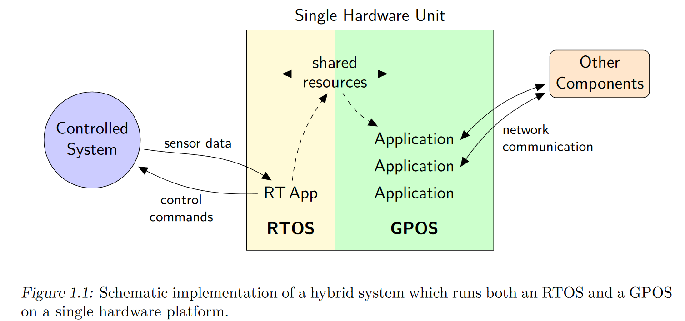

## Introduction

实时系统不要求反应非常快速，但要求时间处理的事件是有限制、可预测的。

实时系统可分为软实时和硬实时。

### Consolidation of Real-Time and General-Purpose Operating Systems

一些与实时 APP 相关的任务不需要在 RTOS 中进行处理。与人机交互相关的任务可以在 GPOS 中处理。因此可以将一个任务分解为在 RTOS 上运行的用于控制的部分，与在 GPOS 上运行的人机交互部分。但需要在 RTOS 与 GPOS 之间共享数据。

### Goals of this Thesis

将实现了 Sloth 实时调度的 RTOS 与作为 GPOS 的 Linux 集成，在同一 PC 硬件上同时运行。在不影响 Sloth 系统实时性的情况下，让同时运行的 Linux 提供用户交互。———Slothful Linux。

### The Sloth Real-Time Kernel

Sloth：利用中断控制器硬件实现操作系统中不同控制流的调度和分派。

将所有控制流都作为中断处理程序来实现，从而消除线程和中断之间的区别，消除了软件调度器。同步事件和异步事件的调度决策都只在中断控制器的范围内进行，能够提升系统服务的性能。

#### The Sloth Concept

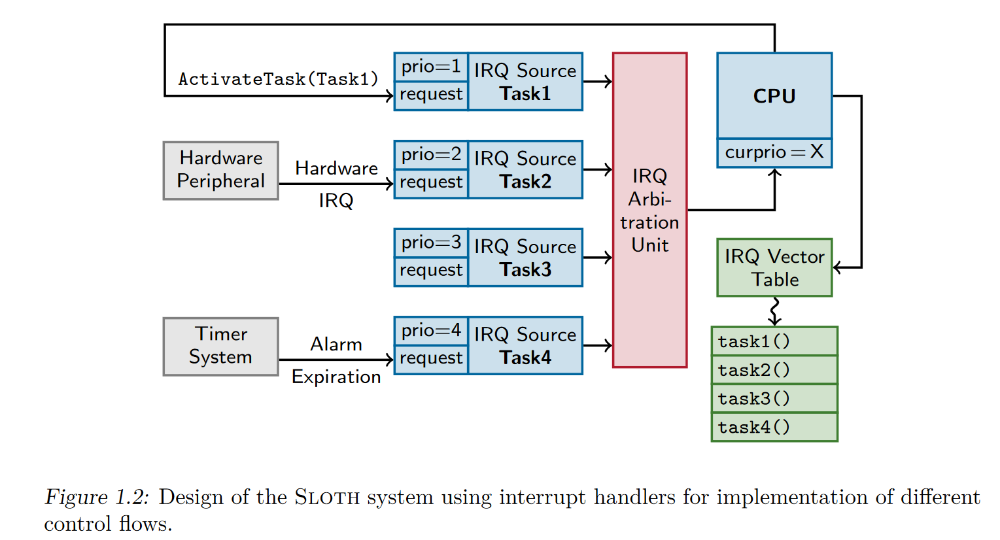

以任务作为控制流的抽象，每个任务被分配到一个具有固定优先级的中断源。在中断控制器中设置相应的 pending 位则表示任务激活（软件或外部中断）。由中断控制器内部的中断仲裁机构进行调度。

1.  若当前 CPU 的优先级低于仲裁机构确定的最高优先级，则中断控制器向 CPU 发中断请求。
2.  CPU 的当前优先级可以不与当前正在运行的执行流的优先级匹配，通过这种方式来实现同步互斥。

OSEK 描述了两类任务：basic 和 extended。basic 是严格 run-to-completion 的，而 extended 则可以阻塞等待某个事件。

基于软件实现的调度器会区分异步触发的中断服务例程（ISRs）和同步激活的任务，Sloth 将所有任务都视为中断处理程序，都被异步触发。

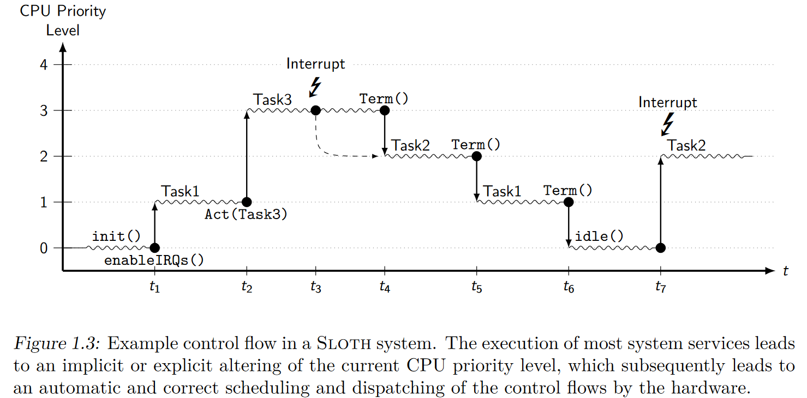

#### Requirements on the Interrupt Controller

1.  必须为系统中的每个任务提供不同的优先级
2.  必须支持软件触发中断，允许同步触发中断

## Problem Analysis

### Requirements on an RTOS

1.  在任意时刻能够被抢占，保证中断延迟低。
2.  中断处理程序不仅可以抢占正在运行的任务，还可以抢占其他的中断处理程序。
3.  同步机制需要具有可预测性

### Existing Projects based on Linux

1.  在 linux 内核中增加补丁来支持实时行为
2.  将实时活动移植到更小的实时内核中，处理所有中断，并且使用中断虚拟化来将 linux 运行在低优先级的任务上。
3.

#### The RT-Preempt Patch

不能满足硬实时的要求

#### The I-Pipe Patch for Generic Interrupt Virtualization

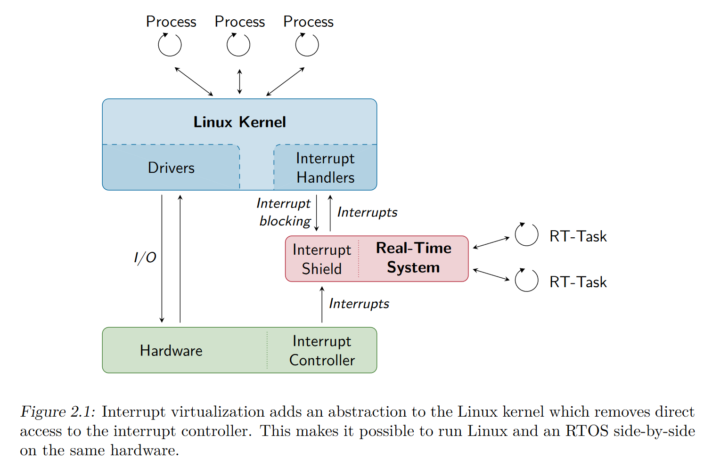  

在 Linux 内核和中断控制器硬件之间增加一个抽象层。

所有与中断相关的功能必须从 Linux 内核中移除。使用硬件来关闭中断的同步方式用乐观中断保护来替换。利用乐观中断保护来实现同步，实时系统可以处理中断，从而保证实时性。Linux 内核只有在实时 APP 空闲时才会运行。

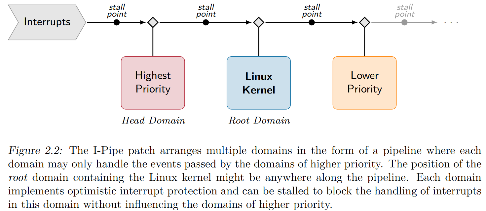

### Integration of Sloth into Linux

中断虚拟化

## Design and Implementation of Sloth on the Intel x86

### Sloth Design Overview

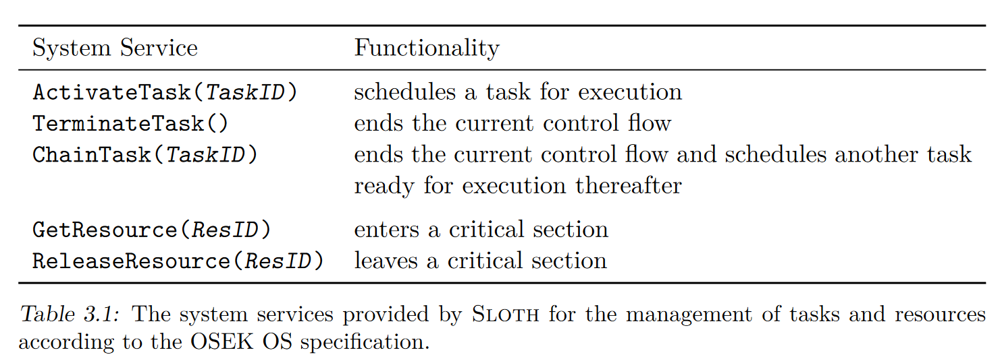

### The Intel x86 Interrupt Subsystem

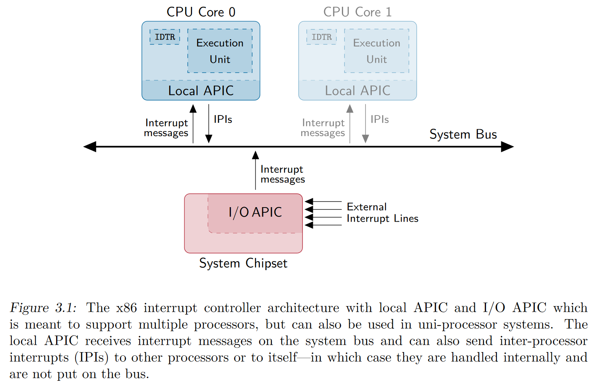

#### Resource Management

使用优先级天花板协议

## Design and Implementation of Slothful Linux

### Design of Slothful Linux

针对实时系统的中断可以直接在Sloth内核中分配任务，而来自外围设备的中断则会传递给Linux内核。

将 Sloth 实时核心插入到 I-Pipe 的头部。

#### Pipes

实时内核与 Linux 用户进程之间的单向通道，作为字符设备，Linux 用户进程可以直接读取，实时任务可以直接写。

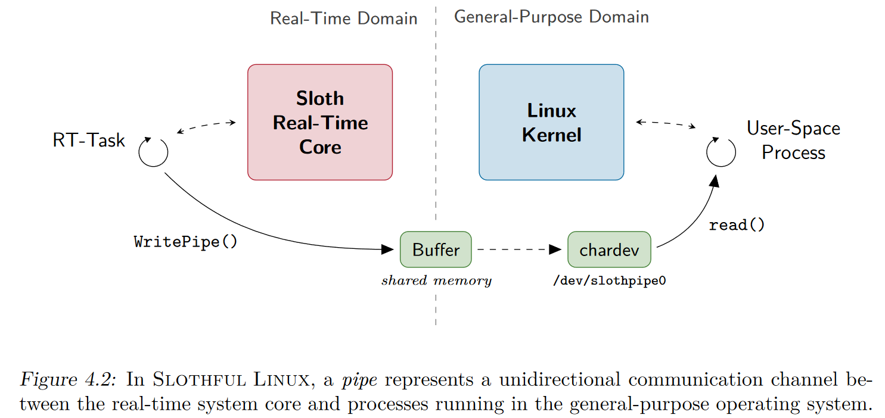

#### Real-Time Applications as Linux Kernel Modules

### Implementation of Slothful Linux

#### Modifications to the Standard Linux Kernel

使用 I-Pipe 中断虚拟化技术消除了内核直接访问中断控制器的部分，

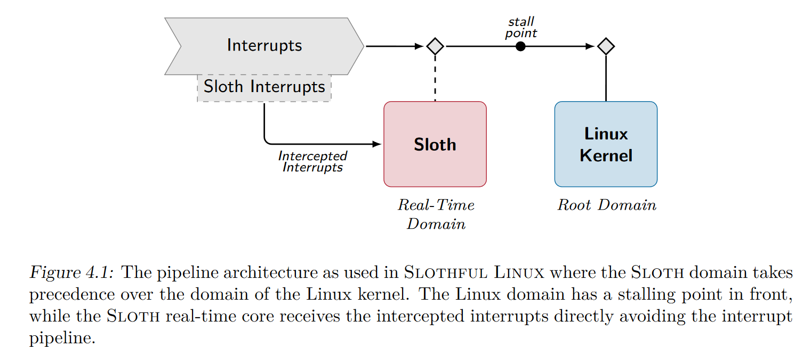

Sloth 域直接拦截中断

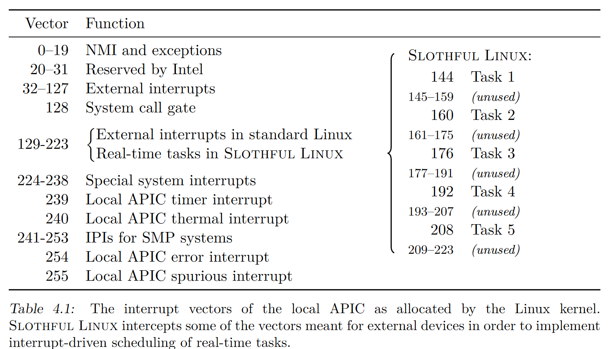

## Evaluation

### Evaluation Metrics

中断延迟：从中断请求产生到中断处理开始之间的间隔

只在单核上进行了性能测试。

#### Performance Benchmarking with the Time-Stamp Counter

测量两次 rdtsc 指令之间花费的时钟周期，需要保证不会乱序执行。

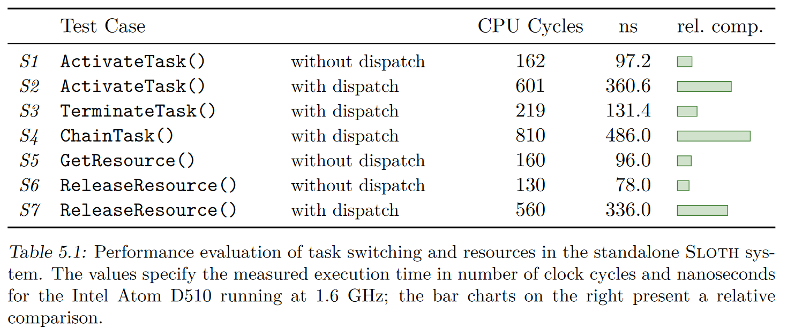

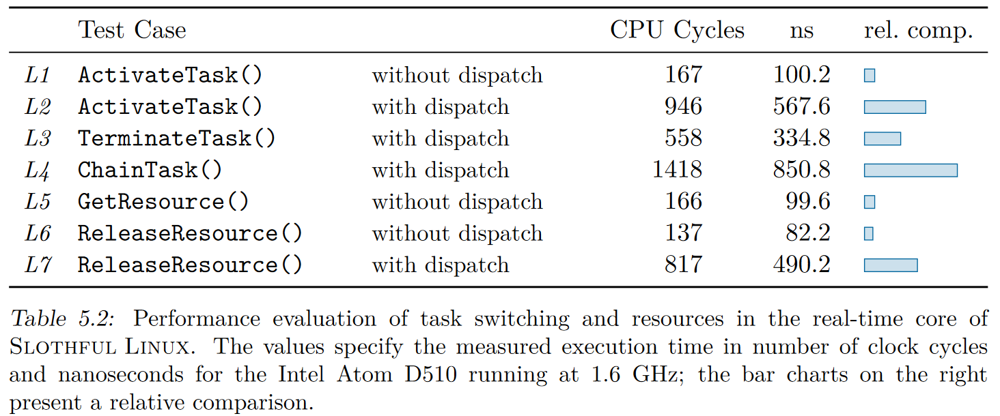

与标准的 Sloth 相比，涉及到调度（域切换）会增加 300 个周期。

#### Evaluation of Interrupt Latency

只测量了由软件引起的中断延迟。

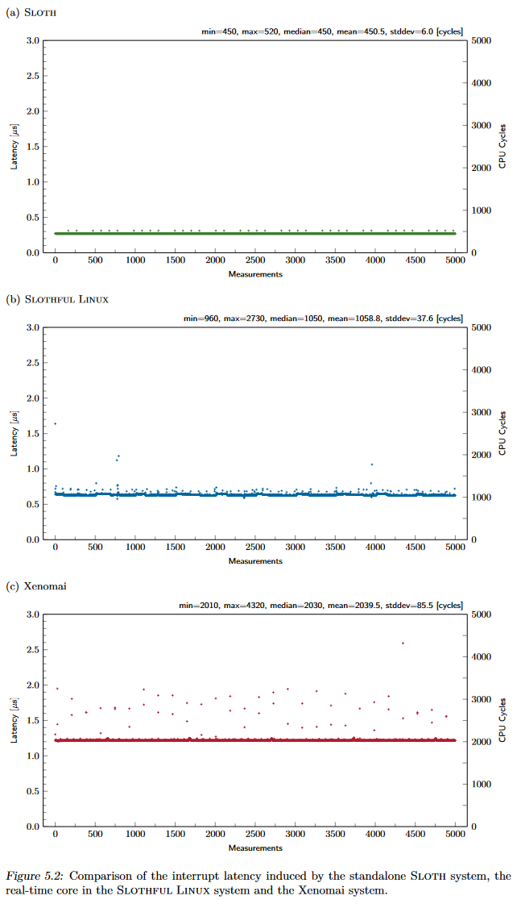

比 Xenomai 相比，中断延迟减小的原因是绕过了 interrupt pipeline。

### Limitations

1.  在运行实时任务时，MMU 不会重新配置，必须以超级用户运行实时任务，从而可能导致不安全。

## 总结

Sloth 将任务视为中断处理程序，任务调度由中断控制器来完成。并且借助中断虚拟化技术，将 RTOS 与 GPOS 混合。
