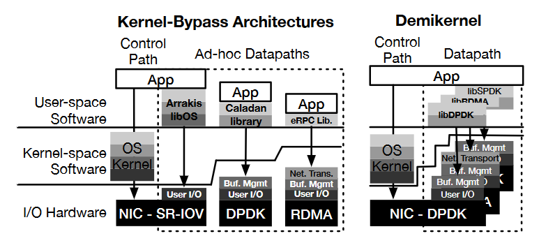
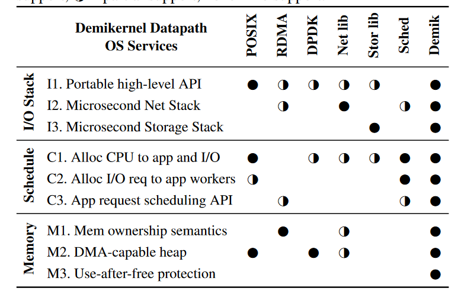
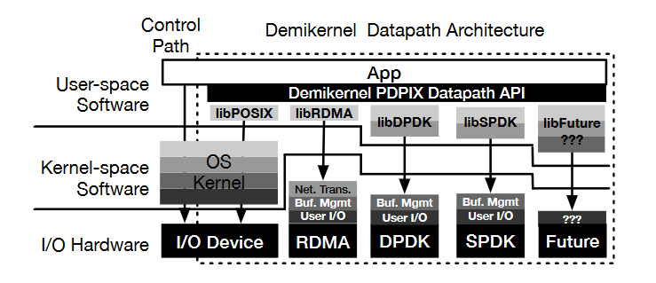
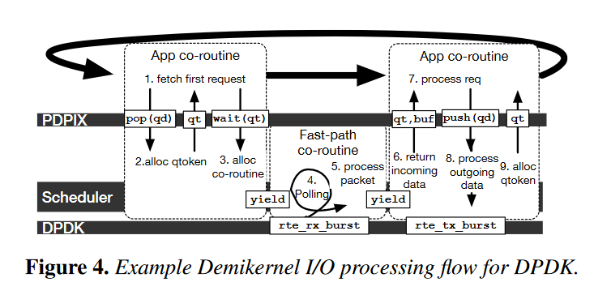

#### The Demikernel Datapath OS Architecture for Microsecond-scale Datacenter Systems

背景

当前的内核 bypass 方法没有提供微秒级的数据通路，且没有统一的数据通路架构

方法
1. 微秒级的设备
2. 微秒级的数据通路（数据零拷贝，app 与 os 之间内存管理 + 细粒度 CPU 多路复用）

贡献
1. 定义了一种新的操作系统管理的数据通路特性
2. 提供便携的数据通路 API
3. 为不同的设备提供灵活的数据通路架构

建立在传统的控制平面内核上，由内核管理新的特性和架构。

Demikernel 从面向内核的 os 转向面向库的数据通路 os（因为设备越来越快速，导致 CPU 成为性能瓶颈）。

##### Demikernel 数据通路 os 的需求

1. 支持异构操作系统卸载，不同的内核旁路设备实现了不同的 os 功能，但存在重叠，但各自针对的需求不同，不得不实现多种数据通路
2. 协作式零拷贝内存访问，IO 设备的 IOMMU 与 CPU 的 IOMMU 和 TLB 之间的协调（不同的设备以及内核会使用不同的内存区域，这需要协调） + app 内的 IO 缓冲区协调（app 与 协议栈需要协调）
3. CPU 微秒级多路复用与调度

##### Denikernel 设计

###### 设计目标

1. 简化微秒级内核旁路系统开发
2. 提供不同内核旁路设备之间的可移植性
3. 实现纳秒级的延迟

###### 系统模型和假设

1. Demikernel 数据通路 os 运行在 app 的同一个进程/线程内，由内核或内核旁路设备提供隔离和保护。
2. Demikernel 使用用户态协作式调度

###### 方法

1. 通过可移植的数据通路 API 与灵活的 os 架构解决了异构内核旁路卸载问题
2. DMA 可访问堆，use-after-free 保护：简化零拷贝。
   1. app 将所有权传递给 Demikernel 数据通路，直到 IO 完成才接受所有权
   2. DMA 可访问堆简化了程序员指定可访问 IO 内存的问题
   3. use-after-free 确保不提前释放缓冲区，但不提供写保护
3. 协程与微秒级 CPU 调度：使用协程封装 os 和 app 计算。针对内核旁路设备设计了集中式协作式调度器，协程可以阻塞的，等事件产生后回到就绪队列中

##### Demikernel 数据通路 os 特点与 API

###### Feature

1. 提供不同程度的 IO stack：高级 API（socket）、网络协议栈（流控）、数据存储栈
2. 提供不同的调度：Demikernel 数据通路 IO 请求与 app workers 之间的 CPU 调度、为 IO 请求分配 app workers、IO 请求调度
3. 协作式零拷贝：缓冲区所有权、DMA 可访问堆、use-after-free 保护
   
###### PDPIX API

1. IO queues：最大程度不改变 POSIX API，但返回的不再是文件描述符，而是队列描述符。队列类似于 go 语言中的 channel。
2. 网络与存储 IO：push/pop 操作用于提交和接收 IO 请求。在 push/pop 之后，Demikernel 会尽快提交或接收。并且是非阻塞的，返回一个异步结果标识符。app 通过使用这个异步结果标识符的 wait 操作来完成操作（wait 是阻塞的）。
3. Memory：app 不会分配数据，pop 或 wait 时，直接返回 DMA 使用的缓冲区指针，所有权从 DMA 转移到 app 中。push 操作将所有权转移给 Demikernel 数据通路 os。写保护必须由用户自己保证（提供写保护的开销很大）。
4. 调度：用 wait 替换了 epoll 操作，wait_any 替换 select 或 epoll，而 wait_all 阻塞等待所有请求完成。

##### Demikernel 数据通路 libos 设计

###### Overview

每个不同的设备类型对应一个 lib，将几种设备进行组合。

1. lib 由 rust 实现，需要向上/下提供 c/c++ 的接口。
2. app 使用 DMA 可访问堆
3. 使用 rust 协程
4. 每个 IO 栈使用一个快速通路 IO 协程轮询硬件接口

IO 处理
1. 没有通过中断，而是通过协程，在没有其他的协程时，调用 poll 协程，一旦发现数据，则快速处理，并唤醒协程。
2. 如果存在多个连接，则一次性 pop 所有的连接，在使用 wait_any 接口(共享调度器现在还没有支持 join、select 操作)
3. 快读路径的 poll 协程在轮询 n 次后让权。对于特殊情况，快速路径协程将唤醒其他协程并让权。

协程调度器

1. 快速通路协程： poll 和处理数据
2. 后台协程：保证 IO 栈工作（例如维护 TCP 发送窗口）
3. app 协程，保证异步

对于 app 协程，采取优先级调度；对于后台协程与快速通路协程采取 FIFO 调度。但只能在单线程上工作，不支持多核。

实现纳秒级的调度器的挑战：只有几百个周期来找到下一个就绪协程。通过 bitmap 来维护就绪协程的状态，协程本身不会出队。在 x86 架构上通过 tzcnt 指令快速找到就绪协程。从一个协程 yield 到找到下一个就绪协程，通过 microbenchmark 测出来只需要 12 个 cycles。

#### 评价

1. 调度器提供给 app 的接口值得借鉴（join、select）
2. 不通过中断，采用轮询的方式，在 n 轮之后让权
3. app 中的协程采取优先级调度，而后台协程和快速路径协程采取 FIFO 调度，尽管其他的协程采用了 FIFO，但 app 中协程采取优先级调度，变相保证了其他协程也是优先级调度。
4. 调度器通过 bitmap 来维护所有协程的状态，通过指令快速查找就绪协程，比 sharedscheduler 中的管理方式，减少了开销。

