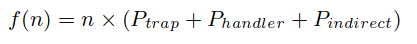

# The Context-Switch Overhead Inflicted by Hardware Interrupts (and the Enigma of Do-Nothing Loops)

## Abstract

采用两种互补的方法来衡量由于周期性的时钟中断产生的开销。

## Introduction

介绍上下文切换以及多任务的定义，并且分析两者之间的关联。

介绍内核进行中断处理。

由于硬件中断通常导致“传统”的应用程序上下文切换的开销，中断的开销通常没有单独考虑。

在不同的 tick 频率和工作负载下的直接影响和间接影响。

## Impact on a serial program

在不同的 tick 频率上的机器运行排序程序，测量直接开销和间接开销

### Direct Overhead

**Trapping**：通过 getpid 系统调用进行评估，测量 CPU cycle

**Handler**：默认的处理时钟中断的开销慢

### Indirect Overhead

只能通过测量总体的开销，再减去直接开销

随着 tick 频率增加、多任务程度增加，排序所需的时间逐渐增加

多任务增加，开销逐渐增大是由于 Linux 的调度算法，在遍历完所有可运行的任务列表后，发现没有符合条件的进程后才会更新 epoch

**Deducing the Indirect Component**：

间接开销占了很大一部分81%，直接开销19%

**时钟中断造成的开销**：线性模型，n 表示时钟中断的次数

## IMPACT ON A PARALLEL JOB

批量同步作业具有显著放大由零星操作系统活动引起的本来可以忽略不计的减速的特性。

通过测量短固定无作用循环的完成时间的扰动（模拟计算阶段）。

###
