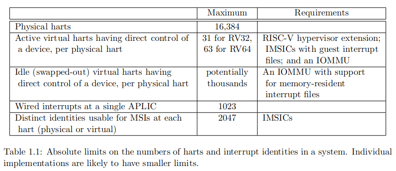
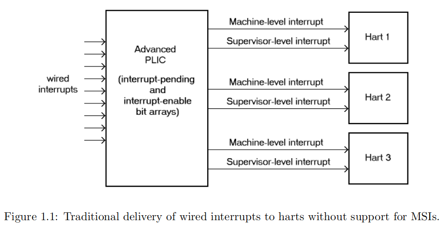
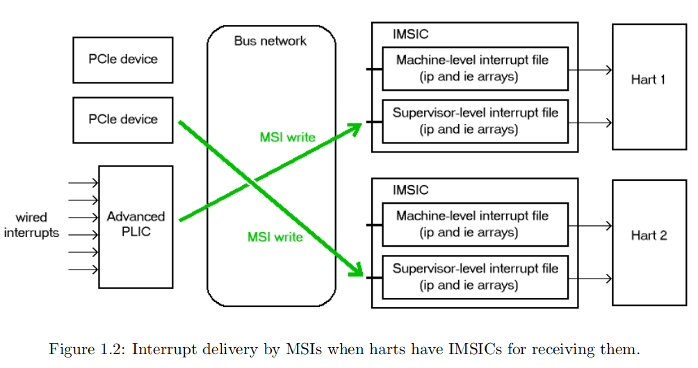
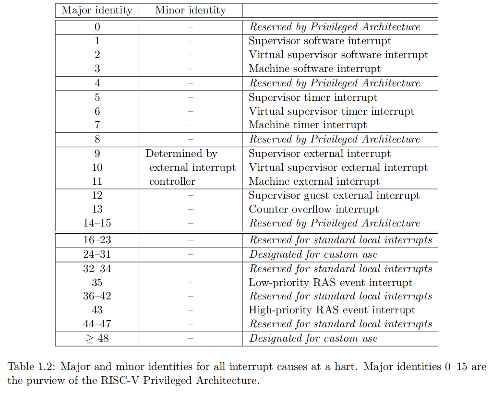
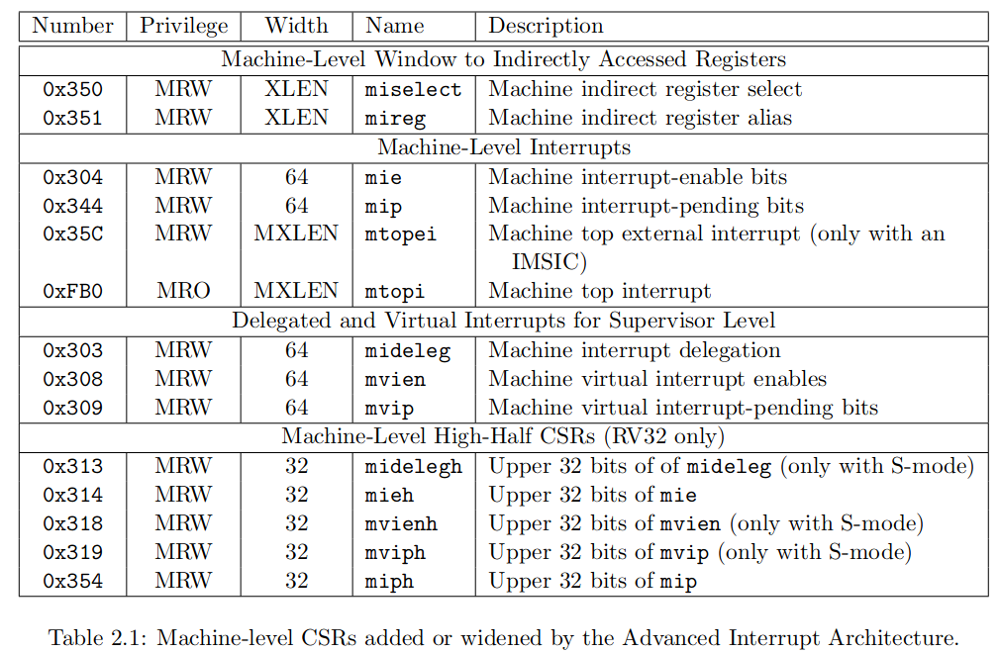
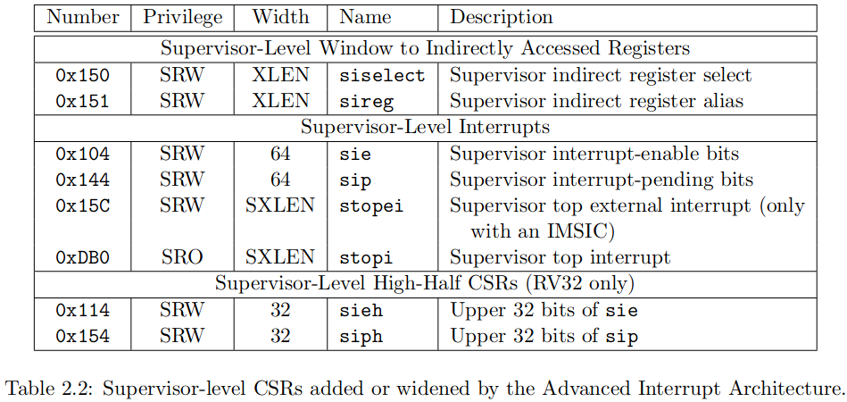
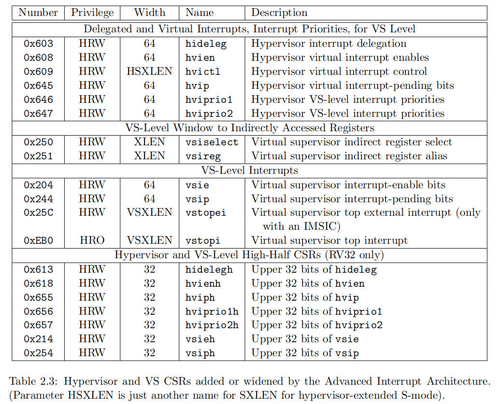

# The RISC-V Advanced Interrupt Architecture

## Introduction

### Goals

*   在现有的 RISC-V 特权级架构的中断处理功能上构建，尽量减少对现有功能的替换；
*   除了基本的线中断外，还为 RISC-V 系统提供了 PCIE 和其他设备标准中使用的 MSI 中断直接工作的便利
*   对于线中断，定义了新的平台级中断控制器（APLIC），它针对每个特权级拥有独立的控制接口，可以将线中断转换成 MSI，支持 MSI 的系统
*   扩展了 RISC-V hart 本地中断的架构
*   允许软件将所有中断源的相对优先级配置到 RISC-V hart 中，而不仅仅局限于单独对外部中断进行优先级排序的能力
*   在 hart 实现了特权级架构中的 h 扩展时，给虚拟机虚拟化相同的中断提供足够的便利
*   借助 IOMMU 重定向 MSIs，最大化的利用虚拟机中运行的 guest os 直接控制设备的机会和能力，尽可能减少 hypervisor 的参与
*   避免中断硬件成为虚拟机数量的限制
*   在速度、效率和灵活性之间实现最佳折衷

目前不支持以下中断特性：

*   为每个中断源定义单独的入口地址
*   自动化保存栈寄存器和恢复栈寄存器
*   基于优先级进行抢占

### Limits

可以支持的 hart 的数量存在上限

### Overview of main components

RISC-V 系统对信号中断的处理取决于主要是针对 MSI 还是传统的线中断。

在完全支持 MSI 的系统中，每个 hart 有一个自由的 IMSIC，传统的基于线中断的系统没有 IMSIC。

#### External interrupts without IMSICs

当没有 IMSIC 时，外部中断通过专用的中断线给 hart 发信号，由 APLIC 进行路由，并确定优先级。

当没有 IMSIC 时，即使 hart 实现了 h 扩展，也不能向 VM 直接发送外部中断，中断必须发送给相关的 hypervisor，hypervisor 再将虚拟中断注入到 VM 中。

#### External interrupts with IMSICs

每个 MSI 中断实际上是写入特定内存地址，硬件视它为中断。因此 IMSIC 需要在机器的地址空间中分配一个或多个不同的地址，当预期的地址被写入时，IMSIC 将写入解释为相应的硬件产生了中断。并且可以从任何具有写入权限的代理（hart 或设备）接收中断。

IMSIC 针对不同特权级进行了地址划分（访问权限以及虚拟化的需求）

IMSIC 用特定的 interrupt file 来记录 中断pending 和 中断 enable。

在拥有 IMSIC 的 RISC-V 系统中，APLIC仍然存在，但角色不同，APLIC 将线中断转变成 MSI 写。软件配置 APLIC 设置每个 MSI 发送到单个目标 hart。

在实现了 h 扩展时，IMSIC 还拥有额外的 guest interrupt files 来转发中断给 VM。

#### Other interrupts

*   除了来自 I/O 设备的外部中断，还有时钟中断和软件中断。
*   每个 hart 有 local interrupts 来中断自己，用于响应异步事件（通常是错误），不需要经过 APLIC 或者 IMSIC。

### Interrupt identities at a hart

外部中断的编号需要有外部中断控制器提供支持。

### Selection of harts to receive an interrupt

每个中断信号只会被传递到单个 hart 上的单个特权级，RISC-V 不提供中断广播/多播机制。

任何本地中断对于其他的 hart 都是不可见的。外部中断发送给单个 hart 需要软件配置，发送 IPI 给多个 hart 需要循环来依次发送。

若某个 I/O 设备的单个中断需要与多个 hart 进行通信，则需要先发给单个 hart，再由这个 hart发送 IPI 通知其他 hart。

### ISA extensions Smaia and Ssaia

Machine：Smaia

Supervisor：Ssaia

## Control and Status Registers (CSRs) Added to Harts

AIA 为中断控制与处理增加了 CSRs。

### Machine-level CSRs

miselect 和 mireg （8bits）用于访问除了表中的 CSRs 之外的寄存器

miselect

|           |                  |
| --------- | ---------------- |
| 0x00-0x2F | 保留               |
| 0x30-0x3F | 主要中断优先级          |
| 0x40-0x6F | 保留               |
| 0x70-0xFF | 外部中断（仅适用于 IMSIC） |

也可访问超过 0xFF 范围的寄存器，但没有标准规范。

当 miselect 的值处于保留范围或者未自定义时，访问 mireg 将会产生非法指令异常。

### Supervisor-level CSRs

与 machine 模式下相似，但 siselect 和 sireg 为 9 位，用于区分虚拟中断。

### Hypervisor and VS CSRs

vsiselect

|             |                 |
| ----------- | --------------- |
| 0x000-0x02F | 保留              |
| 0x030-0x03F | 主要中断优先级         |
| 0x040-0x06F | 保留              |
| 0x070-0x0FF | 外部中断（仅适用 IMSIC） |
| 0x100-0x1FF | 保留              |

## Incoming MSI Controller (IMSIC)

与 hart 紧偶和，每个 hart 一个 IMSIC。IMSIC 接收并记录每个核的 MSIs，当存在 pending 和 enableed 中断需要服务时，向 hart 发送信号。

一个 IMSIC 在机器的地址空间中存在一个或多个 memory-mapped 寄存器，此外软件还通过附加的 CSRs 与 IMSIC 进行交互。

### Interrupt files and interrupt identities

MSIs 不仅仅指向特定核还指向特定的特权级。

针对每个特权级，IMSIC 包含单独的 interrupt file。

interrupt file 文件组成：两个数组

pending array：指示产生了但尚未服务的中断

enabled array：指示 hart 可以接收哪些中断

每个 bit 的下标即为中断号。

支持的中断号的数量为 64 的倍数-1，63-2047

0仍然是无效的中断号。

不同的 hart 的 interrupt file 中的编号不具有关联性，可以来自不同的 MSI 源。因此，可以支持的 MSI 源数量是所有 interrupt file 内的数组长度之和（不同的 hart、不同的特权级的 interrupt file 文件中的数组长度可以不同）。

平台可以为软件提供配置 IMSIC interrupt file 数量和大小的方法。（建议只允许 Machine 特权级拥有这个能力）

### MSI encoding

根据设备或控制器遵循的标准，地址限制在低 4GB 范围，写入的值可能是 16bit，高 16bit 为0。

MSI 根据接收 hart 存在的相关的 interrupt file被定向到特定的特权级或者特定的虚拟 hart。MSI 写入地址是物理地址，连接到目标的 interrupt file。一个物理地址对应一个 interrupt file，写的内容是中断编号。

软件能够完全配置：

*   哪个 hart 接收特定的设备中断
*   目标特权级或虚拟 hart
*   在目标 interrupt file 中对应的 MSI 编号

### Interrupt priorities

在单个 interrupt file 中，中断优先级直接由中断编号决定，低优先级有高优先级。（由于每个 interrupt file 支持的中断编号数量不同，如果优先级顺序相反，则每个 interrupt file 最高优先级编号不同。

### Reset and revealed state

当 IMSIC 复位时，其interrupt file的所有状态都是有效且一致的。但除了 eidelivery 寄存器外。

### Memory region for an interrupt file

IMSIC 的每个 interrupt file 有一个或者两个 memory-mapped 32bit 的寄存器，用于接收 MSI 写。

每个interrupt file是 4KiB 对其的，但只有最开始的两个 32bit 能写，其他的位置均保留（只读）。

|                |               |
| -------------- | ------------- |
| 0x000（4 bytes） | seteipnum\_le |
| 0x004（4bytes）  | seteipnum\_be |

在 seteipnum\_le 中以小端序写 i ，则会将 interrupt file 中编号为 i 的 pending 位置位。（seteipnum\_be 则是大端序。）读这两个寄存器将直接返回 0。

### Arrangement of the memory regions of multiple interrupt files

每个 interrupt file 占据一个 4KiB 页，每个特权级下的页面一起位于地址空间的一部分（PMP 机制）。

每个 hart 存在一个 hart\_id（h），则对应的 Machine 特权级interrupt file地址为 A + h \* 2C，A 表示基址，C 表示interrupt file的页面对齐，最小为 12。supervisor 特权级对应的interrupt file地址为 B + h \* 2D。若实现了 guest interrupt file，则对应的interrupt file为 S,G1,G2,G3,……，Gi 表示 guest interrupt number i，常数 D 至少为 12 + log2(max GEILEN + 1)。

### CSRs for external interrupts via an IMSIC

### Indirectly accessed interrupt-file registers

#### External interrupt delivery enable register (eidelivery)

控制来自该interrupt file的中断是否从 IMSIC 传送到连接的 hart。可能的值为：

*   0：disable
*   1：来自 interrupt file 的中断使能
*   0x40000000：来自 PLIC 或 APLIC 的中断使能

当 eidelivery 为 0x40000000 时，interrupt file 的功能与 eidelivery 为 0 时相同，PLIC 或 APLIC 充当提供外部中断的控制器。

Guest interrupt file 不支持 0x40000000 模式。

#### External interrupt enable threshold register (eithreshold)

中断门槛（最小的中断优先级，最大的中断编号），当 eithreshold 为 0 时，所有的中断都被使能。

#### External interrupt-pending registers (eip0–eip63)

如果 XLEN=32，则支持的数量为 64 \* 32；如果 XLEN=64，则支持的数量为 32 \* 64，只支持偶数的 eip0, eip2, eip4 等。eie 相同。

### Top external interrupt CSRs (mtopei, stopei, vstopei)

表示当前包含的优先级最高的 pending-and-enabled 的中断，优先级超过 eithreshold。当不满足条件时，读出来的数为 0，否则独处来的格式为：

|       |                                       |
| ----- | ------------------------------------- |
| 26:16 | Interrupt identity                    |
| 10:0  | Interrupt priority (same as identity) |

写 \*topei CSR 将清除对应的中断文件的 pending 位。（写入的值会被忽略，CSRRW 指令会直接清除 pending,并返回对应的中断编号，如果分别使用 CSR 指令进行处理，很大概率会出错，因为两条指令中间，可能会出现更高优先级的中断，如果不使用 CSRRW 指令，则应该通过 sielect 和 sireg 寄存器来进行）

### Interrupt delivery and handling

1.  保存处理器寄存器
2.  读 \*topei 寄存器中断编号 i，同时清除
3.  i = i >> 16
4.  调用中断号为 i 的中断处理程序
5.  回复处理器寄存器
6.  返回

## Advanced Platform-Level Interrupt Controller (APLIC)

### Memory-mapped control region for an interrupt domain

##
