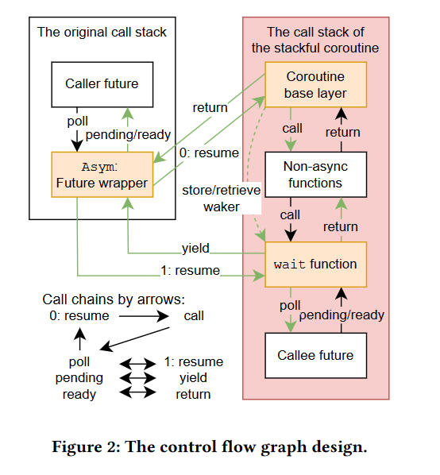
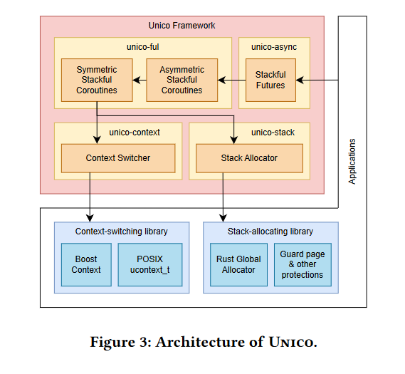

# UNICO: Unifying Coroutines in Rust

## Abstract

Rust futures 和非异步（常规）函数之间的互操作仍然是一个未解决的问题。

1.  使用有栈协程，通过原生的上下文切换，来存储和传递 future 的副作用，从而允许 non-async 函数直接执行 future。
2.  将 Stackful 协程包装到 futures 中，使它们能够由任何异步运行时运行

## Introduction

异步过程的上下文通常由有限状态机( FSM )来实现，而产生和唤醒进程则相应地转换它们的内部状态。一个 non-async 函数执行一个 future，它不能直接使用 await，因为不会进行状态转换

有栈协程：让权和唤醒通过保存和恢复硬件寄存器上下文 ，能够通过中断和信号机制进行协程抢占。

async 与 non-async 函数之间的函数着色问题，目前的解决方案分为以下三类：

1.  在函数调用链中嵌入 async 运行时，运行时不能在最佳条件下使用，并发性下降
2.  自动生成两种类型的 API（由于包管理系统，其他的有依赖关系的包反而会导致灵活性下降）
3.  使用通道而不是直接通过函数调用，需要改变编程范式

以上三种方式都会导致性能开销或者额外的维护开销，这些方法绕过了核心问题-普通函数如何让协程状态变化。

## Unico: The Design

个人理解（也许不准确，因为没有源码的信息）这个 wait function 相当于一个最简单的异步运行时，整体结构是两层运行时嵌套，UNICO 的运行时需要在其他的运行时的基础上运行。类似于在 AsyncOS 中用户态陷入内核处理系统调用、中断的手动组合的逻辑，但是这里是提供了更加通用的实现。
