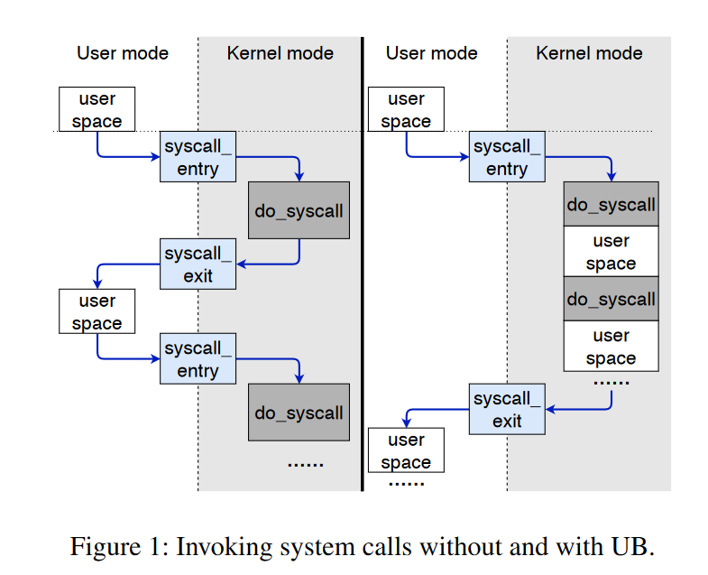
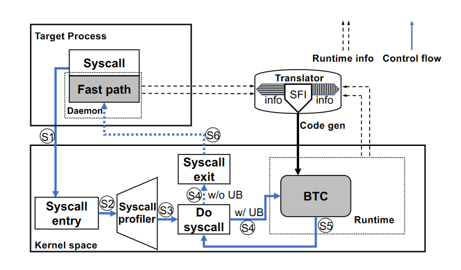

### Userspace Bypass: Accelerating Syscall-intensive Applications

#### 问题

1. 怎么识别连续系统调用之间的用户代码？
2. 将指令插入到内核执行也存在开销
3. 恶意程序利用 UB 窃取内核数据甚至执行特权指令
4. 存在 bug 的程序可能导致内核的内存污染
   
通过动态二进制翻译 + 软件故障隔离机制解决上述问题。

hooking 系统调用条目识别出热点系统调用。通过 JIT 启发，可以获得在热点系统调用之后的用户态代码。
这些指令如果在同一个函数中将会被翻译到二进制翻译缓存（BTC）中。限制 BTC 中的代码行为，并实现内核控制流完整性（CFI）和数据完整性。

#### 优化系统调用的方法

1. 异步系统调用：但目前大部分系统调用仍然是同步的
2. 批处理系统调用
3. Unikernel：LKM、libos
4. In-kernel sandbox
5. kernel bypass

#### UB 设计

目标
1. 减轻开发者负担
2. 对系统架构的影响小
3. 与其他系统调用优化的方法性能相当

