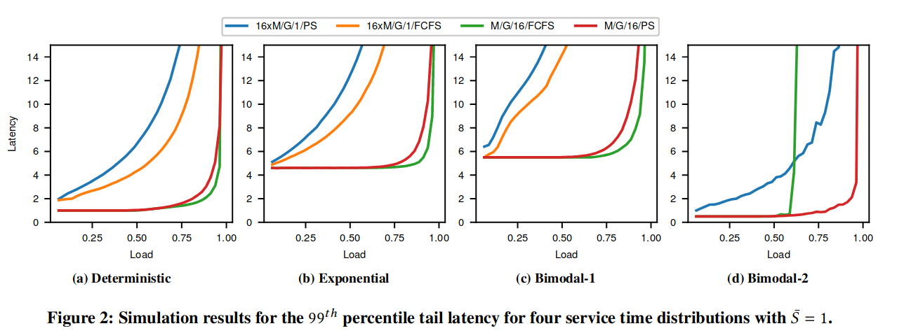
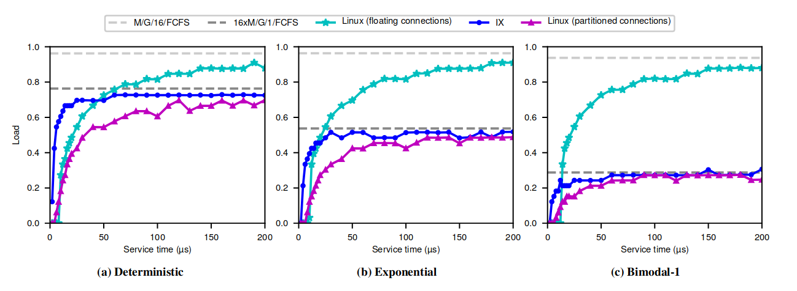
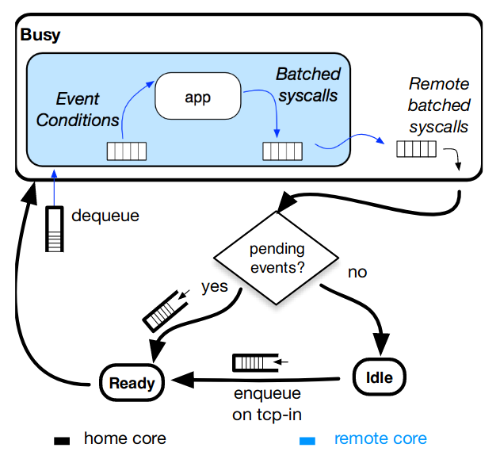
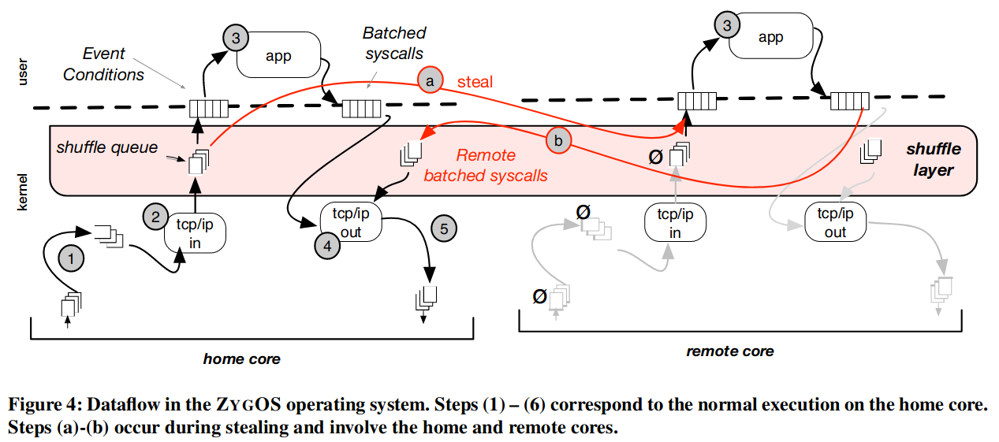

# ZygOS: Achieving Low Tail Latency for Microsecond-scale Networked Tasks

#### 赵方亮笔记

## Introduction

单个应用程序可以包含数百个软件组件，部署在多层组织的数千台服务器上，并通过商用以太网交换机互连。

内核旁路技术的缺点：

1.  可能发生存在请求时，但却存在核心空闲。
2.  队头任务必须等待前一个任务执行结束才能被处理。

ZygOS 利用多种手段：对称多处理网络协议栈、混合轮询与中断模式、IPI、任务窃取。

存在空闲循环逻辑，识别操作系统和 NIC 硬件队列的任务窃取机会。

ZygOS 相较于 IX，引入了一些必要的缓存、通信和同步开销，但消除了队头阻塞。（IX 因为自适应有界批处理，所以在任务大小非常小的工作负载下性能较优）

ZygOS 由于数据平面的优化，因此性能比 Linux 好，而由于 work-conserving 调度器提供始终如一的尾部延迟，因此优于 IX。

## Background

现实需求：操作系统每秒可以处理数百万个请求，并在商品服务器上处理超过一百万个并发连接

对称处理：将连接拆分到线程上，每个线程通过非阻塞系统调用与操作系统进行交互（epoll）。

缺点：惊群问题

非对称处理：少数线程处理网络 IO，识别 RPC 请求边界并将请求添加至中心队列，其他线程从中心队列中取出请求。

缺点：增加单个请求的延迟，当任务较小时，影响吞吐量

### kernel bypass and sweeping simplifications

缺点：资源效率低，强制每个线程处理定向的 NIC 队列请求，负载不均衡时，延迟较高

排队论模型：

1.  单队列模型优于多队列模型
2.  FCFS 延迟小于 PS（只有在服务时间方差增大的情况下，PS 才会优于 FCFS）

## Experimental Methodology

1.  IX 和 Linux 分区都渐进地收敛到预期的 16×M/G/1 性能水平。
2.  Linux 浮动实际上为较大的任务提供了最佳性能，并慢慢收敛到集中式 FCFS 模型预测的上限。

## Design

High-level Design

特点：

1.  单地址空间 + 单应用程序
2.  针对任务窃取进行优化（通过中间缓存）
3.  通过中间缓存和 IPI 消除队头阻塞

实现：

1.  lower networking layer：以无一致性的方式在每个核心上独立执行。
2.  intermediate shuffle layer：spmc 队列
3.  application execution layer：无一致性方式

消除队头阻塞：（不理解为什么这个状态机可以消除队头阻塞）

（socket 状态更新）

IPI 保证remote system call 能及时执行：内核禁用中断，中断处理例程负责两件事情：

1.  若 shuffle 队列为空，则从网卡传入数据包
2.  执行 remote system call，传出线路上的数据包

## Implementation

Idle loop polling logic：只有所有队列都空时，核心才处于空闲状态，按照顺序轮询队列。（当其他的空闲核在检测到网卡硬件队列中存在待处理数据包，且主核正在用户态执行，则积极发送 IPI ？？？）

## 中间测试没有看

## Related work

1.  传统事件驱动模型：epoll-exclusive 消除了惊群效应，但需要传统、复杂的同步互斥才能使用这个特性
2.  传统多线程模型：CFS、BVT等抢占式调度对延迟敏感型应用友好
3.  Shared-nothing dataplanes architectures：增加了吞吐量，但导致了负载不均衡
4.  Work-stealing within application：通常在编程语言的运行时中实现（将连接映射到内核可能导致基于时间的程序处于负载不平衡的状态）
5.  Cluster-level work-stealing：
