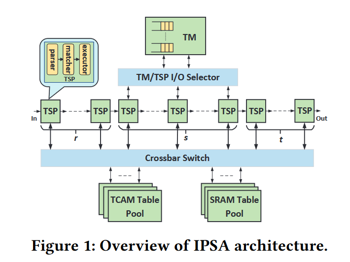
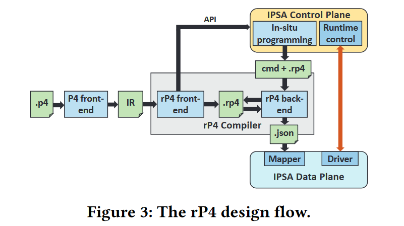
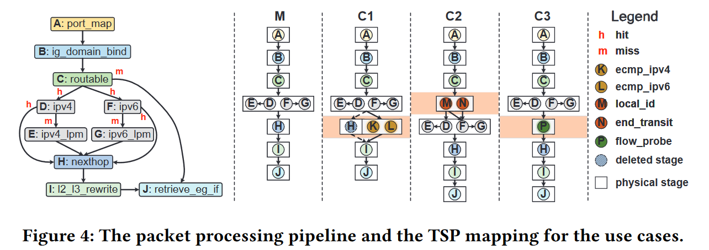
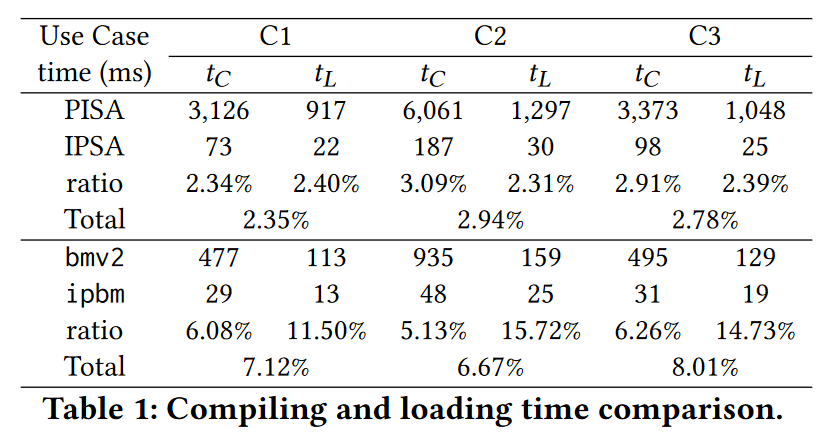
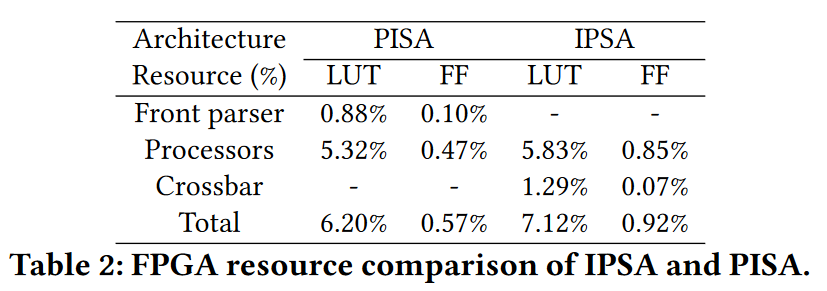
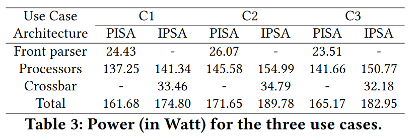
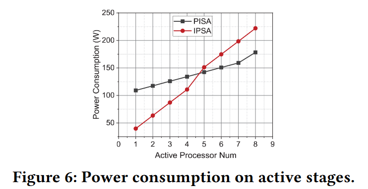

# In-situ Programmable Switching using rP4: Towards Runtime Data Plane Programmability

## Abstract

目前存在芯片架构和编程语言无法在运行时动态更新需要的协议和功能。

提出了 IPSA（In-situ Programmable Switch Architecture）。相比于 PISA，牺牲了部分性能，获得了更大的灵活性。

## Introduction

高性能网络设备通常建立在以转发芯片组为中心的硬件上。

随着需求多样化以及对吞吐量的无止境的追求，将所有的功能在设计阶段集成到一个芯片上越来越不现实。

先介绍了 FPGA、NPU 对于现场可编程性的一些作用。再介绍 PISA 对数据平面可编程性的促进，以及对网内计算和可编程网络可见性方面的推动。

**问题**：包处理流水线一旦被安装后，在运行时无法改变。

运行时更新需要的能力：

1.  只将增量更新到现有系统中，不对整个系统进行重新编译和重新加载。
2.  对网络服务的影响较小，允许产生轻微延迟，允许实时交互控制循环

介绍了存在这种运行时更新需求的应用：

1.  动态网络可见性
2.  新协议/算法的测试
3.  Transitory in-network computing
4.  表重构和重新调整：由于内存资源有限，需要适应不断变化的流量模式和网络规模

## IPSA overview

### Distributed On-demand Parsing

PISA 架构中将包解析和包处理纠缠在一起，因此导致进行修改非常困难。需要进行模块化设计。

IPSA 将前端的包解析器拆分到每个流水线阶段。并且每阶段的 parse header 可以传递给后面的阶段，并且在 egress 阶段的 deparser 不是必须的。

### Templated Stage Processor

每个阶段可以单独进行编程，由 parser、matcher、executor 组成。

### Elastic Pipeline

将一个 TSP 中的逻辑迁移到另一个 TSP 只需要将 template 写入即可，在少量的时钟周期内即可完成。

增加了 selector，可以选择左侧的某个 TSP 当作 TM 输入，右侧的某个 TSP 作为 TM 输出。

插入或删除任何一个阶段，流水线先通过背压排水，受到影响的 TSPs 的 template 被重写，selector 被重新配置。

### Disaggregated Memory Pool

PISA 在所有的阶段都按照比例来分配 TCAM 和 SRAM，而表扩展则通过将连续的阶段占用的内存组合起来实现，减少了有效的流水线阶段的数量。集成内存使得增量非常困难。

使用静态配置的 crossbar switch 实现 TSP 和 memory 之间的交互，涉及到 TSP 或 memory 的修改都需要重新配置 crossbar switch。

## PROGRAMMING WITH rP4

###

## IMPLEMENTATION AND EVALUATION

三种应用场景：

1.  ECMP 负载均衡（存在多条最优路径通往同一目标）
2.  SRv6（IPv6 Segment Routing）
3.  Event-triggered Flow Probe

### Performance Evaluation

## HARDWARE ANALYSIS

IPSA 在三种测试场景下吞吐量是 PISA 架构的 1/3.

## RELATED WORK

1.  dRMT 将 processors 和 memory 解耦，但 processor 是 run-to-complerion 模式，不能增量更新
2.  POS 允许运行时插入表和函数，但只使用在 NPU 上，不能适用于 ASIC
3.  software switches 支持运行时更新，但技术不能在硬件上实现
4.  daPIPE 允许用户集成自定义函数，但需要重新编译
5.  Mantis 预定义的可延迟值、字段和表的语义在运行时可以更改进行反应式编程，但灵活性有限，行为需要预定义
6.  Hyper4 通过对数据面进行虚拟化，以适应各种应用转发
7.  Newton 支持动态遥测的查询 template，但难以扩展
8.  PR（Partial Reconfiguration）允许在运行时部分重新配置，但 FPGA 的性能和可扩展性不适合用于核心交换芯片
