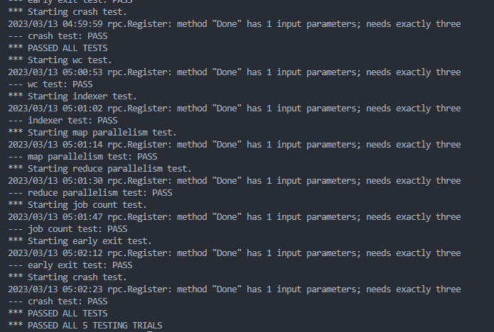

Map 函数和 Reduce 函数是由外部定义好的，最后由 mrworker 来调用插件即可使用

### Coordinator
功能：
- 根据输入的文件名，按照下标生成任务，每个文件表示一个任务
- 回应来自 Worker 的 RPC 请求，将任务分配给 Worker，并用下标记录对应的文件信息

### Worker

发送 RPC 请求，根据 Coordinator 返回的任务执行，执行结果通过 RPC 返回给 Coordinator

