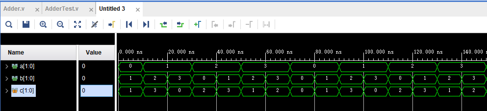

## lab1


### 1.  编写汇编程序，求前 10 个 Fibonacci 数（前两项为 1），将结果保存到起始地址为 0x80400000 的 10 个字中，并用 D 命令检查结果正确性。
代码，这里忘记将前两项保存了，不过问题不大
```asm
li a0, 1
li a1, 1
li s1, 0
li t0, 0
li t1, 10
li s0, 0x80400000
loop:
	add s1, a0, a1
	add a0, a1, x0
	add a1, s1, x0
	sw s1, 0(s0)
	addi t0, t0, 1
	addi s0, s0, 4
	bne t0, t1, loop
ret
```
输出
```
>> g
addr: 0x80100000

elapsed time: 0.000s
>> d
addr: 0x80400000
num: 64
0x80400000: 0x00000002
0x80400004: 0x00000003
0x80400008: 0x00000005
0x8040000c: 0x00000008
0x80400010: 0x0000000d
0x80400014: 0x00000015
0x80400018: 0x00000022
0x8040001c: 0x00000037
0x80400020: 0x00000059
0x80400024: 0x00000090
0x80400028: 0x00000000
```

### 2.  编写汇编程序，将 ASCII 可见字符（0x21~0x7E）从终端输出。
代码
```asm
li a0, 0x21
li a1, 0x7F
func:
    li t0, 0x10000000
	.TESTW:
	    lb t1, 5(t0)
	    andi t1, t1, 0x20
	    beq t1, zero, .TESTW
    sb a0, 0(t0)
    addi a0, a0, 1
    bne a0, a1, func
jr ra
```
输出
```
>> g
addr: 0x80100000
!"#$%&'()*+,-./0123456789:;<=>?@ABCDEFGHIJKLMNOPQRSTUVWXYZ[\]^_`abcdefghijklmnopqrstuvwxyz{|}~
elapsed time: 0.002s
>>
```


## lab2
### demo 例子
#### 加法器
chisel 生成代码
```scala
import chisel3._
class Adder extends Module {
  val io = IO(new Bundle {
    val a = Input(UInt(2.W))
    val b = Input(UInt(2.W))
    val out = Output(UInt(2.W))
  })
  io.out := io.a + io.b
}
object AdderGen extends App {
  chisel3.Driver.execute(Array("-td", "generated/Adder"), () => new Adder)
}
```
verilog 测试代码
```verilog
module AdderTest(a, b, c);
output reg [1:0] a, b;
input wire [1:0] c;
initial begin
    a = 0;
    b = 1;
end
always #10 begin
    a = a + 1;
    b = ~b;
    #10
    b = b + 1;
end
Adder adder(.io_a(a), .io_b(b), .io_out(c));
endmodule
```
行为仿真波形


#### 7段数码管计数器
使用寄存器进行时钟同步，再用一个寄存器对已经同步的按键进行延时，再进行判断，counter 内部使用的寄存器同样也是延时复制，因此 res 会在按下时 + 1
按键检测代码
```Scala
import chisel3._
class Btncheck extends Module {
    val io = IO(new Bundle {
        val pushbtn = Input(UInt(1.W))
        val trigger = Output(UInt(1.W))
    })
    val inner_trigger = Reg(UInt(1.W))
    val inner_trigger2 = Reg(UInt(1.W))
    inner_trigger := io.pushbtn
    inner_trigger2 := inner_trigger
    when(inner_trigger2 === 0.U && inner_trigger === 1.U) {
        io.trigger := 1.U
    }.otherwise {
        io.trigger := 0.U
    }
}
object BtncheckGen extends App {
  chisel3.Driver.execute(Array("-td", "generated/Btncheck"), () => new Btncheck)
}
```
计数器代码
```Scala
import chisel3._
class Counter extends Module {
  val io = IO(new Bundle{
    val trigger = Input(UInt(1.W))
    val res = Output(UInt(4.W))
  })
  val inner_res = RegInit(0.U(4.W))
  io.res := inner_res
  when(!reset.asBool()) {
    when(io.trigger.asBool() && inner_res =/= 0xf.U){
        inner_res := inner_res + 1.U
    }.otherwise {
        inner_res := inner_res
    }
  }.otherwise {
    inner_res := 0.U
  }
}
object CounterGen extends App {
  chisel3.Driver.execute(Array("-td", "generated/Counter"), () => new Counter)
}
```
仿真波形


