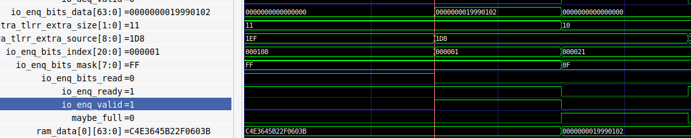

### 2024 寒假日常

##### 20240224

- 调试
  - rocketchip 中的指令参数有限制，不能放在 payload 之后，修改参数顺序后成功生成 vcd 文件
  - 使用 `sudo apt install gtkwave` 安装 GTKWave 查看波形
    - 在 ldut 下能够找到 atsintc 对应的波形，
    - 运行时间较短，不能从波形中看到对应的数据
    - 能够在波形中看到 mmio 寄存器读写数据，剩下的是仔细对比波形了
  - 学习 DecoupledIO，ready-valid 协议
    - 之前存在的 bug 可能是因为n接受端和发送端都是 C 代码，在写的时候，硬件设备并不是接受端。
    - 
    - 在准备好 bits 的同一个周期内，拉高 valid，此时 ready 已经为 true，因此将数据写到了 ram 中，但是只有最后一次写进去了，之前的写没有看到数据
    - 多次读寄存器，deq bits 只看到第一次的，但是 print 打印出了之后的数据
    - 写完之后，可能接受方一直没有 ready，导致第一次读的时候读出来为 0，第二次才读出第一次写的内容
    - chipyard 官方提供的计数器例子也存在问题，写完之后，需要读写 3 次，才会出现符合逻辑的结果
- 完善设计文档

##### 20240223

- 翻译文档

##### 20240222

- 翻译文档

##### 20240221

- 翻译文档

##### 20240220

- 坐高铁，翻译文档

##### 20240218

- 准备收心学习
- 收到了被拒的邮件，从审稿人的回复来看，文章需要注意的事项还很多

##### 20240205

- 阅读论文 Diplomatic Design Patterns: A TileLink Case Study
- 阅读 rocket-chip 文档

##### 20240202

- 意识到了另一种对我来说的快乐
  - 行动大于言语，不能想的太多却不落实行动

##### 20240201

- 整理 vDSO 仓库
- 整理设计文档
- 阅读 rocket-chip 文档
  - 阅读 Diplomatic Design Patterns: A TileLink Case Study
  - 可以直接通过 TileLink 进行内存访问

##### 20240131

- 逛了颐和园、圆明园
- 闲聊

##### 20240130

- 整理了一下宿舍环境
- 写了 ats-intc-rocket-chip 项目的环境安装文档
- 讨论 FPGA-CPU 接口