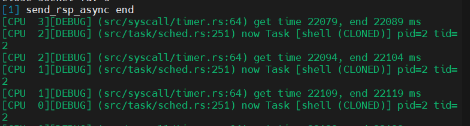

### 用于记录每天的日常

高优先级：

- [ ] 学习 rocket

##### 20231120

- debug
  - shell 从 str 获取参数时，出现奇怪的错误，因为编译器会添加 memset 这些函数，但是单独定义了 memset 这些操作，所以导致与 string 相关的操作出现错误
- 整理仓库文档
- 写设计文档
- 测试直接切换协程
  

##### 20231119

- 写代码
  - 内核和用户程序只能使用 unknown-elf，不能使用 linux-gnu，共享文件可以使用 linux-gnu
  - 将用户程序与共享库链接起来
  - 跑通简单的用户程序
    - 用户程序执行 fork 之后卡住
    - 同步和异步的函数都不会执行 __switch 函数，应该是中间卡住了，在多核下，两个进程都可以运行，但是因为内存映射的问题，所以子进程在内核的过程可以执行到 trap_return 中，但进不了用户态，而单核卡住则是因为 run_next 中存在死锁
  - 写设计方案

##### 20231118

- 写代码
  - `got` 表属于可以 `load` 的段，因此在解析段的时候，不需要单独进行映射，只需要在重定位时，将对应的符号填写好即可
  - 内核与用户程序中向共享库中提供的符号如何确定
  - 堆与 EXECUTOR 能够正常工作，但 println 不能工作，可能的原因是 gcc 将 memcpy、memset 编译到 plt 内调用外部的函数，暂时先不使用这个输出
  - 能够正常执行内核中的协程
  - 写内核的调度

##### 20231117

- 写代码
  - 把 fs 放到内核中，当作 ramfs
  - 写 mmap 函数以及动态链接器 loader
    - 重写 mm 数据结构以及相关的方法
    - 能够从 so 中找到依赖的外部库

##### 20231116

- 写代码
  - 去掉关于用户态中断的代码
  - 重构项目框架
  - 使用 easy-fs，在内存中模拟文件系统
  - 写用户态 app，可以使用 riscv64-unknown-linux-gnu 工具链编译
  - 内核编译时，sym path 被编译成在 GOT 中读出数据了，还是换回原来的工具链，但在开启分页后，出现了错误

##### 20231115

- 修改代码
  - `Pin` 已经 `FFI` 安全。可以按照标准的动态链接库来写共享调度器
  - 尝试用动态链接实现堆分配器方法，从而避免硬编码
    - `Layout` 仍然 `FFI` 不安全，需要转化成 `size + align` 调用外部函数，避免依赖固定的分配器类型
  - `Executor` 中队列与协程状态之间关联，在唤醒时，最直接的办法是修改协程的状态即可，不需要出队入队，但这需要扫描整个队列找到就绪协程，利用 `bitmap` + 指令可以实现快速查找；但目前还没有增加 b 扩展。且修改协程状态后，还需要修改 `bitmap`。最直接的办法是修改位图。内核中的协程通过 waker 唤醒用户态的协程
  - 仔细设计 `Task`、`Executor`、`Waker` 这几种数据结构，让内核可以直接唤醒用户态的协程
  - 修改内核中的代码，保证在单核情况下能正常工作

##### 20231114

- 组会
- 阅读论文
  - Achieving Microsecond-Scale Tail Latency Efficiently with Approximate Optimal Scheduling

##### 20231113

- 找到无法编译 `ustatus` 的原因
- 阅读文献
  - The Demikernel Datapath OS Architecture for Microsecond-scale Datacenter Systems

##### 20231112

- `rust` 编译 N 扩展时，无法识别 `CSR` 寄存器，找解决方案，提 `issue`
- 阅读资料
  - [Async Rust Is A Bad Language](https://bitbashing.io/async-rust.html)，介绍了 `rust async` 给程序开发者带来的开销 
  - [Why async Rust?](https://without.boats/blog/why-async-rust/)
    - stackful 协程，栈的空间、管理，栈帧的状态
    - `external iterators` 与所有权和生命周期结合，导致 `rust` 走上 `async/await` 这条路

##### 20231111

- 写代码
  - rust Layout 是 FFI 不安全的，所以还是只能用原来的方式使用堆
- 讨论设计方案
- 开会

##### 20231110

- 阅读文献
  - Compiler Support for Lightweight Context Switching
- 写代码
  - 根据 `elfloader` 库实现可执行文件加载器
  - 重写共享调度器模块，似乎 `rust` 让 `Pin` 也变成 `FFI` 安全了。
  - 

##### 20231109

- 思考设计方案，写代码
  - 切换目标的 `satp`、`stack` 应该在什么位置给出，保证在切换时能够正确找到，这里可以在 `fast_handler` 中找到，并填写到 sscratch 寄存器中
  - `fast_handler` 中如何找到这两个信息，`a0` 的返回值可以表示 `satp`，`satp` 只可能在内核与用户进程之间切换，而 `stack` 还需要从 `stack_pool` 中查找并且保存在 `sscratch` 寄存器中，它的取值更加多样化
  - 上下文切换以及快速处理的函数经过测试，可以正常工作，开始写内核中需要用到的其他模块
- 阅读关于 `context switch` 开销的文献
  - Quantifying the cost of context switc
  - Context switch overheads for Linux on ARM platforms

##### 20231108

- 结合 `embassy` 提供的 `executor` 与 `macro` 写简单的驱动测例
  - `Timer` 驱动在中断处理部分与回调函数的部分耦合程度较高，且使用的宏导致 `rust-analyzer` 不能代码跳转，看起来费劲
- 继续思考设计文档，写代码
  - 之前的设计存在误区的几个地方是因为栈的问题导致的

##### 20231107

- 组会
- 在小论文仓库增加投稿信息
- 使用 ZeroTier 内网穿透，配置 windows 远程访问，但远程 windows 内 wsl 还需要单独配置
- 阅读 [async_book](https://rust-lang.github.io/async-book/02_execution/02_future.html)，其中提到了 `Context` 的语义
- 阅读资料，发现 `probe-rs` 工具可以用于调试
- 使用 async 的另一个好处，从线程切换的粒度来看，10ms 的切换粒度会导致一些无意义的等待
- `dma` 驱动增加同步和异步两种接口，在 `baremetal` 环境下增加同步和异步测例
- 计划结合 embassy 修改网卡驱动
  - 在裸机环境下，使用网卡，提高网卡的速度（第一阶段，搭好框架）
  - 在共享调度器的调度框架下，尝试提高应用的性能（第二阶段）

##### 20231106

- 整理思路，写 `async-trap` 设计方案
- 写代码

##### 20231105

- 整理思路，画图

##### 20231104

- 写上下文切换代码
- 整理思路文档，画图

##### 20231103

- 读论文 
    - Balancing Register Pressure and Context-Switching Delays in ASTI Systems
    - A combined register-stack architecture
    - Switch-Stacks: A Scheme for Microtasking Nested Parallel Loops
    - Shared-stack cooperative threads
- 写代码

##### 20231102

- 监考
- 整理与课题相关论文
- 读论文 CAT: Context Aware Tracing for Rust Asynchronous Programs

##### 20231101

- 改论文

##### 20231031

- 组会
- 改论文

##### 20231030

- 阅读资料
    - [The registers of Rust - Without boats, dreams dry up](https://without.boats/blog/the-registers-of-rust/)，[笔记](../notes/The Registers of Rust.md)
    - [Rust async can truly be zero-cost (swatinem.de)](https://swatinem.de/blog/zero-cost-async/)，[笔记](../notes/zero-cost-async.md)
    - [Implementation Details of async Rust (swatinem.de)](https://swatinem.de/blog/async-codegen/)，[笔记](../notes/async-codegen.md)
- 阅读 [rust/compiler at master · rust-lang/rust (github.com)](https://github.com/rust-lang/rust/tree/master/compiler)

##### 20231029

- 写异常处理的代码
    - 尝试手动构造 Poll 函数返回值，[Poll 返回值类型分析](../notes/Future&Poll.md)，返回到调用 async 函数的 poll 函数，这里需要更加理解编译器怎么处理 async 函数
    - gdb 手动跟踪代码运行

##### 20231028

- 修改论文
- 写代码
    - 直接使用 extern fn 来充当模块之间的接口
    - 研究 async 闭包 [Generator - async in rust (night-cruise.github.io)](https://night-cruise.github.io/async-rust/async-await/Generator.html)

##### 20231027

- 写代码
- 修改论文

##### 20231026

- 写论文
- 写代码

##### 20231025

- 写论文

##### 20231024

- 组会
- 写英文论文

##### 20231023

- 阅读 lpf
    - 后续的可重入库的处理没看明白
- 学习 Rust hyper 库

##### 20231022

- 重新定义协程控制块
    - embassy 中的 TaskHeader 可以复用，对于不同的 async 函数，替换内部的 future 即可，可以参考这种设计方案，避免掉一些任务元信息申请、回收空间的开销
    - Task 一定不会共享，所以不需要使用 arc 指针，使用 box 即可，保证它分配在堆上即可
    - Task 生命周期与 TaskRef 存在冲突，TaskRef 直接使用了裸指针，但是 embassy 并不会回收 TaskStorage 的空间，因此不会出现问题，而在共享调度器内，一旦堆中的 Task 被回收之后，TaskRef 将会失效，此时存在安全问题
    - 将 wake 与 Arc 指针关联起来，通过 Arc 来管理 Task 的生命周期
- 定义协程控制块队列
    - 对 crossbeam-queue 中的 SegQueue 进行了简单测试，两百万个协程，同时向队列中加入协程、取出协程，完成的时间大约在 550ms（插入或取出协程各自耗时均在 250 ~ 300ms），因此 Executor 中的协程队列可以使用这个数据结构
    - crossbeam-channel 暂时不支持 no_std 环境
- 阅读论文 Lightweight Preemptible Functions

##### 20231021

- 整理 embassy 流程
- 参考 embassy 优化共享调度器

##### 20231020

- 学习 embassy timer 实现
- 讨论毕业课题
- 学习 embassy 中断处理的实现
- 分析 Rust RawWaker 与 Context 之间的关系

##### 20231019

- 学习 embassy 仓库中异步驱动的写法
- 调试 await 上下文切换
    - 能够切换到新的线程，并且线程对应的函数结束后，能够返回到原始的函数调用中，但是由于调用 future 的方式存在问题，所以没有返回到 main 函数中
    - 在切换过去的线程中加入打印，导致了栈上保存的上下文发生了变化，目前不清楚什么原因，可能的原因是直接通过 [0u8; 0x1000] 方式申请的空间是在当前的栈上开辟的空间，之后使用这个栈时，导致了栈帧的重叠，使用 static mut 申请的空间也是相同表现，在堆中分配空间后可以正常打印

##### 20231018

- 学习 embassy 仓库中异步驱动的写法

##### 20231017

- 组会
- 修改论文
- 写设计文档
- 调试上下文切换代码

##### 20231016

- 写协程、线程、进程切换代码

##### 20231015

- 修改论文

##### 20231014

- 思考共享调度器设计
- 讨论论文

##### 20231013

- 在 FPGA 中跑 riscv-linux
    - 初始化时遇到 rcu 错误，设备树中不增加网卡节点，则卡在 init 处，一直思考其他的问题，以为是没有更换 rocketchip，应该是忘记重新刷新比特流导致，导致上午白干
    - 能够进入 riscv-linux，但两边不能通信，还没找到原因
    - 猜测是更新了硬件比特流之后，linux-xlnx 官方的驱动存在问题，因此暂时不补充 linux 下的实验对比
- 直接在裸机环境下测试网卡速度
    - 只在客户端使用 iperf 不行，需要开发板上对收到的数据进行统计发送给客户端
    - 只能手写测试程序，客户端向服务端持续发送 10000 字节数据，服务端收到数据后原路返回，统计次数
    - 中断的模式测出来只有几MB/s，开启轮询模式总是提示 LoadFault 或 StoreFault，可能是因为 smoltcp 作为事件驱动的接口不兼容轮询模式？？？
    - 客户端直接发送以太网帧，开发板上直接使用网卡的底层的接受操作进行轮询，使用轮询操作的速度也很慢，只有 3MB/s，可能是因为 DMA 驱动的问题
    - 测量网卡单次发送，dma 初始化之后，提交缓冲区，eth 初始化前半部分，记录开始时间，到产生了 tx 中断后记录结束时间，一共发送 20000 个字节，到产生中断一共用时 180us，速度拉满，dma tx 操作 20000 字节数据用时 210us，只有 90MB/s 的速度，达不到手册上的 400MB/s
    - 网卡即使没有调用 start，也能发送数据出去，驱动这部分存在问题

##### 20231012

- 补实验，画图
- 改论文

##### 20231011

- 解决内核线程-用户协程模型中的死锁问题
- 测试实验数据
- 画图

##### 20231010

- 组会
- 重新测试实验，补充实验
    - 内核协程-用户线程：线程执行系统调用，创建内核协程之后，直接阻塞，内核协程 loop 退出后，唤醒阻塞的线程，能够正常工作，但是连接数增加时，开发板直接发送了 rst 包，导致 PC 不再尝试建立连接，导致不能再继续（可能的原因是，开发板上还没有监听对应的端口，因此直接发送 rst 包）
    - 内核线程-用户协程：用户程序先通过系统调用注册监听线程（在异步读时，先判断有没有监听线程，没有直接创建），用户态协程读时，将 socket 与 cid 的关系维护起来，监听线程一旦发现 socket 状态变化，发用户态中断唤醒用户协程
    - 创建内核线程执行后，内核线程代码产生了指令页错误，因为 task_context 设置成固定的 trap_return 函数入口，需要手动修改 ra，让其不返回用户态，能够进入到内核线程中，但是内核线程 loop 循环中存在死锁，维护 socket 与 内核线程任务的数据结构不合理，使用 Vec 之后，能够正常编译

##### 20231009

- 修改代码
    - 将驱动整合到 smoltcp 中，目前能够建立 tcp 连接
    - 使用 smoltcp 的框架进行读写操作，同步读写暂时没有出现问题，需要注意 socket 正在发送时，进程直接退出导致 socket 中的消息发送失败的情况
    - 添加 socket 异步读逻辑，smoltcp 中自带了异步唤醒的逻辑，在 socket 状态变化或者处理包时，调用 waker 的 wake 方法，可以在 socket 没有数据时，注册 waker，一旦 socket 状态变化，则唤醒内核中的协程，异步读能够正常工作
    - 只在发生中断时，进行 iface_poll，否则会因为客户端超时重传机制一直处于 iface_poll 的循环中，导致不能对后续的包进行 ack 确认，导致继续产生超时重传，陷入死循环
    - 用户态中断存在问题，偶尔不会进入中断处理函数内
    - 在裸机环境下测试用户态软件中断，能够正常工作，应该是使用出现了问题，除了 uip 寄存器外，还需要设置 ustatus 寄存器，如果简单的设置 ustatus，会导致用户态中断嵌套，之前 ustatus 寄存器没有正确保存，乱飞，导致可能不能唤醒，将其保存在 trap_context 上下文中后，能够正常唤醒，并且可以测试 128 条连接

##### 20231008

- 修改 dma 驱动

    - dma wait 不应该判断 idle，而是要判断 ioc_irq 中断位
    - 思考裸机环境下测例，使用 udp 测试速度，接收数据包处理存在问题，一次发送 5 个 udp 包，但是每次软件中只能顺序处理一个，都被网卡缓存了
    - 需要根据收到的 frame 数量进行判断，产生 token
    - 没有开启网卡 statistics 功能，重新综合
    - 网卡使能了 statistics 后，在软件中直接读取 frame 数量一直为 0，在生成比特流之后，没有导出硬件，所以还是使用的原来的比特流，目前能够看到接收的 frame 数量，根据 frame 数量产生 token
    - 可以产生接收到 frame 数量对应的 token，dma datamove 也正常，在测试中软件读出来的数量不正确，与 udp socket 设置的数量有关
    - tcp 测试正常，能够接收到数据，发送和接收都正常

- 查找 rCore-N 中存在的问题

    - 用户态中断在回到 u 态时可能不会马上响应，但是通过队列缓存之后，保证发出的消息都能被接收到，因此用户态中断这里应该没问题
    - 能够测试 128 条连接的情况，但是目前使用的 dma 和 eth 驱动仍然不完善
    - 使用完善后的驱动，直观上速度比之前快，但是还是存在进不去用户态中断的情况

    

##### 20231007

- 阅读论文 M^3^X: Autonomous Accelerators via Context-Enabled Fast-Path Communication
- 将整合了 smoltcp 的驱动添加到 rCore-N 中，
    - smoltcp 将 listen 和 accept 整合到一起，因此，在 listen 是需要将任务阻塞住

##### 20231006

- 学习 riscv cpu 设计

##### 20231002

- 学习 embassy 框架

##### 20231001

- 整合驱动与 smoltcp
    - Interface 设置了 ip 地址后，能够产生响应，发送数据包，配置了 ip 地址后，能够正确发送 arp 回复包
    - 收到网卡的中断后，调用 Interface 的 poll 函数，不能结束，没有回到正常的执行流中，poll 函数中需要使用 token，但 token 能一直获得，当获得了 token 则需要 consume 消耗缓冲区，但缓冲区一直在 wait，所以卡住了
    - 根据网卡的 rx_cmplt 中断来产生 rxtoken，smoltcp 协议栈能够正常工作了，具体的应用还需要进一步考虑
- 思考共享调度器的硬件设计
- 学习 linux 内核写法

##### 20230930

- 修改 dma 驱动
    - tx 缓冲区内存所有权正常，rx 则只能使用固定的缓冲区
    - submit 时，块描述符 head 的计算存在问题，修改之后没有更新 head
    - rx 的缓冲区可以考虑在网卡收到中断之后，提交缓冲区，这样就可以使用 transfer 的所有权机制，但是即使 wait 之后释放了缓冲区，但是还是需要在中断时进行读取缓冲区，除非是不使用 dma 的 s2mm 中断，网卡收到中断后直接处理，dma 直接等待
    - dma tx 中断可以不考虑网卡是不是发送完成，因为已经把数据移过去了，rx 的中断则是等待网卡接收到中断后开始提交缓冲区
    - tx 和 rx 的内存缓冲区安全问题解决
- 把驱动和 smoltcp 结合起来
    - dma 和 eth 直接连起来，因此网卡的驱动需要把这两个结构放在一起
    - 使用 smoltcp 提供的 Interface 管理网络协议栈，Interface 的使用还存在误区

##### 20230929

- 修改裸机驱动测试
    - dma 和 eth 两个仓库 pac 中存在相同的符号，导致链接时出错，但之前没有出现，需要编译成 release
    - dma 产生了 mm2s 中断，但是 pc 这边没有收到
    - 更换了比特流之后，rCore-N 仍然可以正常工作，但是裸机环境下开发板可以收到 PC 的包， pc 收不到开发板发过来的包，eth 中断状态读出来是发送完成了，应该是发送的包 FCS 检验失败，所以 PC 丢掉了
    - 能够收发巨型帧，但是 PC 上 wireshark 抓包还是收不到包，自己填充的以太网帧不符合格式
- 测试 dma 环形块描述符是否存在问题
    - 设置环形块描述符长度为 2，在接收第三个包时产生了错误，打开收发通道的 cyclic 模式后，没有产生 rx err 中断，在产生了 mm2s 中断后，在中断处理函数中需要调用 tx_from_hw，更新 free_cnt

- 尝试解决 dma 的缓冲区内存安全问题
    - 把缓冲区的所有权移交给 dma，在 submit 时 forget，但是在 from_hw 时得到的是一个指针，不能释放掉，驱动里 get_buf 的部分需要手动的回收，可以调用 box 或者 layout 里的函数手动释放
    - 转化为 box 之后，还是没有把缓冲区释放掉
    - 使用 transfer 之后，但是 rx 的生命周期必须要等到收到中断之后才可以释放掉，这是个问题，并且 tx 发送完毕之后，对应的缓冲区已经被释放，所以不能再获取缓冲区，否则就陷入到死循环中
    - tx 缓冲区动态设置，rx 缓冲区使用固定的 ‘static 生命周期的缓冲区

##### 20230928

- 阅读 axi-dma 手册
- 修改 vivado 的 block design，发现 eth 有内存设置，之前是 4K，可能是导致不能发送巨型帧的原因
    - vivado 许可证过期
    - 设置 eth mem 32k ，更新 ref_clk，更新 dma mm addr 宽度为 64 位
    - 能够正常工作

- 裸机环境测试 eth 和 dma

##### 20230927

- 写论文

##### 20230926

- 组会
- 改论文

##### 20230925

- 阅读论文，改论文

##### 20230924

- 补充数据
- 学习 origin 画图
- 改论文
    - 调研文献

##### 20230923

- 测试数据

##### 20230922

- 调试代码

    - 在设置好了相关的寄存器之后，第一次返回没有进入用户态中断，后续几次返回才进入，正常的逻辑应该是在检查到有 user trap 之后就会跳转到用户态中断处理函数中，暂时先不管，在用户态中断处理函数中，最好不要让它调用系统调用进入内核，尽管保存了 ucsr 寄存器的状态，但是还是会存在一些奇怪的问题

        

    - 用户态中断返回的地址不正确，没有回到 epc 的位置，可能还是汇编上下文切换代码存在问题，使用 YYY 的框架后，能够正常工作

- 测试实验数据

##### 20230921

- 调试代码
    - 连接数多的时候，会出现直接卡死的现象，卡在内核可能是因为 DMA 的原因
    - sleep 测试能够正常工作，yield 不存在问题，因此主要的原因可能还是因为共享调度器的逻辑问题，pending_queue 的实现，快速唤醒需要一个 map，共享调度器的数据结构设计仍然存在问题，但是时间上来不及再做进一步的修改了，只能先在原来的仓库基础上进行了
    - 在原来的代码上收发包以及这些数据结构都正常了，能够正常运行测例，但是连接数增多时出现了 rx err 中断，需要看一下 lwip 或者 linux 的中断处理，linux 的中断处理直接把收发通道给关闭了，没有进行其他的处理
    - 查看手册，发现可能是因为地址没有对齐，设置了缓冲区的地址对齐之后，还是会出现接收错误，在接收到错误之后，将 dma 进行重置，可以进行多次使用，但是到了 128 条连接时，已经不能往队列中发送消息
    - 还是沿用 YYY 的做法，虽然以进程为单位，但是进行处理只有一个线程，不存在多接收方的情况，目前的发送机制已经完全 ok，唤醒的操作没必要再单独开一个线程，直接用 0 号线程处理用户态中断，在返回时进行判断，设置相应的寄存器
- 实现新的用户态中断接口
    - 新增系统调用，用户态初始化中断处理的线程
    - u 态的 csr 寄存器在进入内核后，和返回用户态前进行保存，在 s 态只需要打开 sip 寄存器相应的中断位使能，即可在返回到用户态后进入用户态中断处理函数，但是不能返回到正常执行流，uepc 寄存器是正确的返回地址，不确定 uret 之后的行为，偶尔能够回到正常执行流中

##### 20230920

- 修改代码
    - 进入 utvec 直接关闭中断，上下文中保存 uepc，但 riscv 的机制是进入中断，把 ustatus 关闭，本来不允许中断嵌套，不需要手动的进行关中断，但是仍然存在其他的中断嵌套的情况（在中断处理函数中调用了 print 或者系统调用进入内核了，这时其他的核发了一个用户态中断，那么返回的时候，就进入到第二个中断处理里面，这时候的 uepc 寄存器就被修改了，原来正常执行流的 pc 就没有保存，从第二个返回到第一个中断处理，第一个中断处理返回的时候已经回不去原来正常的执行流了）
    - tx 缓冲区没有回收，因此导致驱动报错，4 条连接能够较大的概率跑通
- 思考用户态中断处理进入内核的情况，需要将 ustatus 保存起来
    - 在 trampoline 中加入保存和恢复 ustatus 的操作后，在 qemu 中启动 shell 之后不能输入，在开发板上直接报错，可能是 ustatus 初始化时为 0，导致在用户态出现一些问题，可能时直接在 trampoline 中进行处理有些问题，在 uintr_save 和 uintr_restore 时进行恢复，但是 riscv 仓库中 ustatus 寄存器没有提供写的函数
    - 在 uintr save 和 restore 中使用汇编代码来保存和恢复 ustatus 寄存器
    - 在 qemu 和板子上的 uintr 两者的行为不同，qemu 中能够正常工作，开发板上似乎不太符合行为，在内核中加上 uie::set_usoft 之后才可以触发中断
    - 并且 shell 没有设置用户态中断相关的寄存器，读取出来的 ustatus 的 uip 位也为1，发送了用户态中断后，没有进去，ustatus 的寄存器状态为 uip 位为1
    - 让内核充当发送方来使用用户态中断会存在较大的问题，因此暂时不使用用户态中断来进行唤醒了，内核直接往队列中添加 cid，每次 poll 之前先查找一遍
- 当测试负载过重时，dma 会产生 recv err，看起来像是 block descriptor 出了问题？这里需要将 DMA 重置，还需要将以太网重置
    - 以太网同时收发，产生了死锁，用户态中断没有唤醒也可能是这个原因？？？socket 的读写没有分开上锁，导致了卡住
    - panic 之后，cpu 进入到 loop，但是还可以响应网卡的中断，这里不正确
    - 所有核都死锁住了，所有核都进入到内核之中，且都发生了中断嵌套，但是这时中断处理的时候存在死锁，因此整个卡住，不能给 PC 回复
- 应该还是和 DMA 的收发相关，plic 打开 ETH 中断后，加了一行打印，什么都没干，然后跑通了 16 条连接（玄学。。。）
- 测试一条连接的极限速度时，发现超过极限时，会出现相同的卡死的现象，这是因为进入到内核之后，网卡不能接收到中断，但是应用程序也是卡死的，所以整个表现为卡死的状态

##### 20230919

- 组会
    - 多线程情况下的用户态中断使用：涉及到用户态中断的分发
- 上课
- 调试代码
    - 复用堆映射页，存放需要唤醒的协程的信息，使用 heapless 的 mpmc 队列，不能使用 crossbeam 的队列（会使用堆中的数据，而这个队列则是直接具体的操作虚拟地址和物理地址）
    - 共享调度器中使用 sleep 存在问题，每次进入内核 sleep 读出的数据不一样
    - 使用 sleep_ms 之后，不从用户空间读取数据之后，能够正常 sleep，偶尔能够跑通 2 条连接，但更多的时候卡住，多个核都调度到了进程，但是没有返回到用户态，从而导致卡住，sleep 系统调用中 end 一直在变化，导致了不能返回，但注释掉用户态的 sleep 之后，仍然无法返回到用户态，发现是因为多次往调度器中添加了 Task 指针，初试时刻，每个进程的引用计数为 2，父进程的子进程列表中存放着一份指针，调度队列中存在一份，尽管之后创建了多分指针，但没有加入到调度队列中，但还是卡住了，还是存在唤醒的问题，消息队列怎么同步互斥，使用原子操作似乎也存在问题
- 在 uintr_restore 函数中打印 uepc，发现都停留在 print 函数里，怀疑是在响应用户态中断时进入到内核，然后其他内核又往队列中 push 消息，产生了一些错误，可能是用户态的中断处理嵌套了，尚不明确
    - 进程 p 在核 1 上运行，并且处在用户态中断处理函数中，这时另一个核给进程 p  发送了用户态中断，这算应该是属于在线的情况，那么需要响应的话，那这时会把此时执行流的 epc 保存到 uepc 里，即使嵌套完成了这个中断，那么也无法回到最开始用户程序的执行流，反而是一直在用户态中断内循环，因此在 utvec 函数，首先需要将 usoft 关闭，在中断的切换代码中，需要将 uepc 保存起来，这样可以允许中断嵌套（多个发送方的情况下，会出现这种问题）

##### 20230918

- 调试协议栈
    - PC 拒收了开发板回复的 tcp ack 包，没有填写校验和，导致没有被 PC 接收
    - socket 查找时，因为地址、端口问题，导致不能把数据推给上层应用
    - write tcp 发送出数据之后，产生了死锁，与 DMA 的发送和中断处理有关，一个核上进行发送时，另一个核收到了中断，这时都需要获取锁，从而导致死锁，在 plic 中断处理函数中注释掉相关的访问 DMA 锁之后不再产生死锁问题，但是带来了新的问题，发送时的缓冲区描述符应该在何时回收（在下一次发送之前进行回收），主要的原因还是在于数据结构的设计
    - 重写协议栈之后，设置了 MSS 字段后，能够一次性收到 PC 发的包，但在用户端读取出来的数据仍然为空，用户态测试代码中的 read 时 buf 指针不正确
    - 客户端发送的数据太长，超过了 1500，PC 收到这个包，但拒绝了，在测试过程中调小矩阵大小后能够跑通几次循环，还是在 发送完用户态中断后卡住，偶尔能够完整运行整个测例
    - 和 LDH 讨论，内核开中断之后，可能会存在死锁，并且不同核如果同时进行收发，单条连接时没有出现问题，多条连接会卡死，可能是因为收发通道都是用同一个锁
    - 多次将同一个协程放进队列中产生 bug，创建协程之后，直接将其放到 socket 的阻塞队列即可，不需要加入到调度器中
    - 内核中不允许中断嵌套，并且所有内核中的锁替换为关中断的锁，发用户态中断时需要获取对应的 task 的锁，而另一个核也可能正在访问这个 task 的锁，因此会产生锁，内核中关闭时钟中断
    - PC 连续发送了两个 TCP 包，而这两个包被接收到同一个核上，在内核中产生了中断嵌套
    - 内核的调度并没有死锁，一旦成功建立连接，客户端会马上发送数据包，但这时用户还没有开始读数据，因此这个包是无效的，但是网卡给了回复，因此这里增加需要增加判断
    - 测试程序的逻辑以及内核里关于异步的处理导致了这种死锁，应用程序还没准备读，但是数据包已经发过来了，改进了逻辑之后虽然能够运行了，但还是卡住了，给用户发送中断之后，被调度之后没有进入用户态中断处理函数，之后就卡死了，猜测是 uintr 存在问题
    - TKF 说要设置 ustatus，但是设置和没设置没有区别
    - 开发板时钟频率不同，导致进入 sleep 时出错，不能回到用户态
    - 进入到用户态完成一条连接之后，第二条不能正常工作，两条连接同时收到了数据包，同时向进程发中断，但这时候只响应了靠后者，因此，这个 bug 是因为内核同时发送中断将上一个中断覆盖掉了，第一个响应了用户态中断，进入中断处理函数之后，需要 uipi 读取中断，而在读取之前，另一个核对接收方状态表进行了修改，覆盖掉上一个的 irq，因此没有唤醒第二条链接的协程，需要准备一个队列，向用户态发中断，或者将不同的核视为发送方，在这里直接对内核中的 uintr 接收方进程增加队列，会导致其他的问题，需要用共享内存，需要唤醒的协程保存到共享内存中，不使用用户态中断传递信息
    - 改了时钟频率之后，sleep 里获取时间的操作还是存在问题，导致每个核都在 sleep

##### 20230917

- 调试实验代码
    - 不能发出用户态中断，可能是因为多核同时试图访问用户态中断接收状态表，只分配一个核后可以正常工作，是 clone 的时候没有共享 uintr 接收状态表
    - client 发送一个请求包，但是网卡上收到的是 3 个分片，因此造成多次唤醒协程，应该是开发板回复 ack，并 syn 时没有加上， MSS 字段，lose-net-stack 库中并没有这个字段的设置，因此需要替换成 smoltcp 的协议栈
    - 发送包缓冲区描述符没有回收，到最后没有空闲描述符，在中断处理中加上 tx_from_hw 回收描述符缓冲区
- 用 smoltcp 重写内核协议栈
    - arp 协议正常，但 tcp 协议出现问题，tcp 头部的字段设置出现问题

##### 20230916

- 调试

    - 创建出来的线程与原本的进程共用了同一个栈，因此导致寄存器乱飞，在使用 CLONE_VM 时，需要重新创建用户栈

- 讨论小论文

- 修改实验代码

- 上板测试

    - 消息队列太大，导致堆分配出错
    - 建立连接时，开发板发送的包被认为是 dup，所以没有被 PC 接收，不能继续建立连接，一次测试，PC 会拒绝两个包，原因是内核中的协议栈没有对三次握手的情况进行判断，在第三次发来 ACK 包之后直接回复确认，从而导致拒收

    

##### 20230915

- 调试

    - 出现错误可能的原因是，需要获取等待的子进程的状态，这时会如果一直不能获取到子进程的锁，那么会一直返回 RUNNING 或 INTERRUPTIBLE 状态，从而导致一直无法释放掉子进程，从而一直陷入 yield 的循环，从而表现出死锁的现象
    - 因为多处 get_state 导致出现死锁，在 yield 返回到 idle 后，不再 get_state，解决了死锁
    - 在用户态利用 clone 系统调用实现 thread_create + thread_join 线程库函数，创建一个线程没有问题，但是创建更多线程时，出现了问题，出现指令页错误，pc 乱飞，在线程中如果不使用 print 函数，则不会出现错误，用户态的打印，没有加锁
    - 加上锁仍然出现一堆错误，但都是与页面权限相关的错误，可能是在链接共享调度器时直接操作页表相关，并没有添加 vma
    - 修改 lkm 模块，共享调度器的区域也用 vma 来描述
    - 线程执行仍然存在错误，但都是页错误，反汇编出来，发现是因为寄存器不对，可能是上下文没有正确的保存

    

##### 20230914

- 调试

    - 添加内核和用户态的唤醒逻辑，偶尔可以走通流程，但是更多时候卡住

        内核协程的 ID 不对，但仍然唤醒了，发送完用户态中断之后，卡住了，并且偶尔会在内核产生 usersoft 中断

    - 返回到用户态，进入中断处理函数中似乎与时间相关，与共享调度器中的 sleep 似乎产生点冲突，一旦测例成功结束，每次都在内核中触发 usersoft 中断，反汇编发现在 uintr_return 时出现这个错误，uintr_return 调整了 sip 与 sideleg 寄存器的顺序之后，内核中没有触发 usersoft 中断，但是不能返回用户态的错误还不清楚，具有偶然性，似乎与 sleep 之后在不在线相关

    - nanosleep 的系统调用编号错误，但是仍然会偶尔无法返回到用户态，可能是优先级的问题，发送完用户态中断之后，没有调度到 tcp 测例对应的 task，内核中的优先级调度存在问题

    - 在 qemu 中测试，发现也存在同样的问题，调度不到 task

    - 协程的优先级与进程的优先级进行了同步，用户态系统调用 get_time 的编号不对，修改之后仍然存在相同问题

    - 只要在 do_yield 或者其他地方加上打印，就不会出现问题，一旦注释掉，马上出现

    - clone 没有复制共享调度器的地址映射

    - exit 时，INIT_TASK 与进程自身的锁，以及 wait 时占用的锁，导致了死锁

    - 单核的情况下，wait 也会存在死锁，先在单核的情况下调试，单核是因为 sleep 太久，，误认为死锁，多核仍然会出现死锁

    

##### 20230913

- 修改代码
    - 修改更新优先级字段中的 bug
    - 测试用户态的协程优先级是否能够发挥作用，正常
    - 利用用户态中断，修改异步系统调用，尝试统一同步和异步的接口
- 阅读 async-book，查找函数重载相关的资料，尽管可以通过 泛型 + trait 来实现函数重载，但仍然需要通过参数进行区分，但是同步和异步系统调用的参数都是相同类型，因此做到完全通过 await 进行区分不太可能
- 开会
- 修改代码
    - 在中断处理函数中只对单个协程进行唤醒，如果在中断处理函数中轮询一遍，那么叶子节点的 future 的逻辑会变复杂，异步系统调用直接将当前的协程 id 传递给内核，内核处理完成之后，直接唤醒阻塞的协程，不在需要额外的标记进行判断
    - 针对 pipe 的修改，需要对两端进行修改，直接针对 tcp 异步读进行修改，并且不需要额外的辅助 map 来记录唤醒关系，已经存在 socket_index 可以承担这个关系，比 pipe 改造要符合逻辑，更加符合异步的特点，唤醒的逻辑需要保存内核协程和对应的进程的引用

##### 20230912

- 组会
- 改造异步系统调用
    - 先创建单独的一个系统调用直接返回到用户态，并让用户阻塞住，内核给用户进程发中断
    - 内核需要把 task 的引用传递到函数中，类似于自己给自己发中断，直接复用注册发送方系统调用中的逻辑，并且直接使用 uipi_send 指令发出中断，但是返回用户态时，并没有看到打上对应的 irq，在系统调用处理的逻辑中，直接在 uirs 中更改 irq，并且使用 sync 写到 uintc 中，下一次恢复的时候即可读出 irq，从而能够进入到用户态的中断处理函数中
    - TKF 说目前 qemu 和 rocket 存在一个 bug，计算发送方状态表错误，这个对于共享调度器中用户态中断的用法没有影响，相当于接收方同时也是发送方，直接更改接收状态表即可

- 阅读 linux 内核指导书

##### 20230911

- 修改论文
- 整理共享调度器上的一些概念性的思路

##### 20230910

- 写 DMA 驱动，在创建 DMA 时，直接创建 pin 住缓冲区，并将所有权转移给 DMA，DMA 重复使用这个缓冲区，不再申请其他的空间，从而避免内存泄漏，目前可以正常工作，目前可以持续的发送和接收
- 调试网络协议栈
    - 能够收到 NBNS 协议包，关闭 NetBIOS 之后，kernel 没有收到对应的包
    - PC 发出 TCP 包之后，kernel 这边没有收到对应的包，可能是 windows 的设置，也可能是 eth 的设置，打开 windows 的简单 TCPIP 服务之后，发出的 TCP 包仍然没有接收到，TCP 包中的目的 mac 地址和 IP 地址是正确的
    - 可能是因为 eth 的设置，导致只能接收到广播的包？？？打开 eth 的 PROMISC 选项后，收到了 TCP 包，并且解析正确，但是默认情况下，为什么不能接收发给自己的包？？？可能是没有开启直接连接模式，因此不能收到发给自己的包，查看手册，发现网卡初始化时，需要设置 mac 地址，这样才可以接收到发给自己的包，之前没有设置，所以不能收到
    - 目前开启 tcp 的测例监听端口号之后，因为 kernel 的逻辑，没有及时处理中断，导致 TCP 连接超时
    - 每次与中断相关的打印信息，都需要按键才能够进行，如果不进行则一直卡住，似乎是因为在内核中没有进行中断处理，必须要通过按键返回到用户态之后，才能触发中断，因此当测例阻塞在内核态时，不能处理中断，rCOre-tutorial-v3 中 UserEnvCall 中设置了 sstatus sie，允许内核发生中断，而 tCore 则没有进行处理
    - 进入内核打开 supervisor 中断，返回用户态关闭 supervisor 中断，增加内核中断返回的汇编代码，在内核中能够正确处理时钟中断和 DMA 发送的外部中断，成功建立 tcp 连接，完成测例，但没有对读取的数据进行验证
    - 在读取 socket 文件时，出现问题，产生缺页错误，copy_from_slice 函数没有设置长度，并且唤醒时，没有改变 task 的状态，因此不能被调度到
- 成功读取到 PC 发送的数据，并且 kernel 其他的功能正常，但是在 PC 端强制关闭发送程序时，产生了大量 RST 包，导致开发板上 DMA 产生了接收错误中断，并且代码没有针对这部分进行处理，导致死机，总体上能够正常工作
- 使用用户态中断唤醒协程还需要进行设计，尤其是在内核直接向用户进程发中断

##### 20230909

- 阅读 dma 手册和  [Rust 嵌入式魔法书 - DMA](https://docs.rust-embedded.org/embedonomicon/dma.html)
- 写 DMA 驱动
    - 目前 block descriptor 描述符中对 buf 的处理仅仅当作数组进行处理，并没有涉及所有权的内容

##### 20230908

- 查找 axi_dma 收包问题
    - axi_dma 每次收到一个包之后，重新提交新的 buf，并且需要注意写法，避免死锁，目前可以收到
    - 收到 PC 的 arp 包，并且进行回复，但下一次仍然收到了 arp 包，修改中断处理的逻辑，只针对需要回复的 arp 进行回复
    - 但下一次直接产生了内核缺页异常，反汇编出来产生错误的地址在 buddy_system_alloc 中，可能是因为网络包缓冲区大小并没有对齐
    - 可能是因为 pin 住的缓冲区没有被释放，接收和发送时，一直在添加新的 buf，内存不安全
- 阅读 YYY dma 开发日志和  [Rust 嵌入式魔法书 - DMA](https://docs.rust-embedded.org/embedonomicon/dma.html)
    - 目前 DMA 接收和发送中断处理函数中没有对缓冲区和描述符进行回收

##### 20230907

- 调试网络协议栈
    - 发送正常，可以连续发送多次包
    - 接收时，可以收到来自 pc 的 arp 包，并且回复给 PC，但是收到一次之后，就不能再收到其他的包了，dma 和网络中断处理函数的逻辑互相纠缠，并且接收包不能像发送时直接提交接收缓冲区，还需要研究 dma 的工作原理

##### 20230906

- plic 初始化，打开外部中断，添加 plic、dma 和 eth MMIO 地址映射
- 增加与网络相关的系统调用以及网络协议栈
    - 创建套接字之后，放到当前任务的文件描述符中

##### 20230905

- 组会
- 上板子跑 uintr 测试，执行 shell 时出现问题
    - trap_frame 所在的页没有添加 AD 权限，因此不能访问
    - do_exec 时需要加上 AD 权限，tCore 中涉及权限的地方比较松散，并没有像 rCore 那样比较集中
    - 修改 uintr mmio 地址之后，uipi_sample 通过测试

##### 20230904

- 直接使用 clone 创建子进程，在用户态传入 SIGCHLD 参数
- uintr_register_receiver 时出错，提示已经注册过，在 clone 时对其进行了初始化
- 线程 uipi_send 触发了异常，非法指令，ipc_bench 与 tcore 中 uipi 指令 func3 字段不一致
- 发送方 uipi_sender 之后，能够看到 irq，但是没有跳转到中断处理函数，可能是没有触发中断
- test_uintr 发送完毕之后，同样看不到接收，但是继续执行后，sbi 报错未处理中断，并且在 qemu 的日志中可以看到 u_software 的中断信息
- 看论文
- 需要使用修改过的 opensbi，在 M 态进行中断委托
- 编译器把 while 循环优化成死循环，所以没有结束

##### 20230903

- 修改内核里进程和协程的调度
- 增加全局位图的更新方式
- posix 创建线程还不太熟悉
- 使用 uintr 处理用户态中断
    - 用户态的 trap 和相关库函数需要自己实现

##### 20230902

- 修改共享调度器设计，简化设计，用原子操作避免锁的情况

##### 20230901

- 修改 rCoreN
    - getchar 得到 0 或 255，yield 时出现错误，跳转到未知的地址，产生异常，改成直接将结果返回到用户态，在用户态进行判断之后，没有出现对应的问题
    - 判断 sig 是否合法时，存在问题
    - 在 wait 时也调用了 do_yield，这里和 getchar 存在相同的问题
    - 只开一个核后正常工作了，应该是多核没有处理好
        - do_yield 时，先把 task 添加到就绪队列中了，这时其他的硬件线程可以取出 task，但是此时的上下文不正确，其他的硬件线程必须等完全切换完毕之后才可以取出对应的 task
        - 在 do_yield 时不把 cpu 当前的 task 取出来，在 idle 的循环时，才进行处理
    - 终于可以正常工作了，接下来是重新设计共享调度器的代码逻辑

##### 20230831

- 修改 rCoreN
    - 堆无法正常使用，查看汇编代码，跳转到 exchange_malloc 函数后陷入内核
    - 以为是工具链的问题，换了工具链，结果不能识别汇编中与用户态中断相关的寄存器和指令
    - 更换工具链之后，没有出现 exchange_malloc 
    - 分配协程 ID 时，使用 static AtomicUsize 进行分配，会出现页错误，可能是解析 elf 时没有添加对应的段
        - lkm 加载模块时，elf 段的结束地址没有向上取整
    - 打印出 shell 的提示符后，出现页错误
        - getchar 在内核  read 时出现错误
        - read 读出来 255，在 do_yield 时出现错误

##### 20230830

- 修改 rCoreN，直接进行大幅度修改
    - 用户态中断以进程为单位进行收发，目前的 rCoreN 不太好进行更改，直接在 TKF 的 tCore 上进行
- 开会讨论

##### 20230829

- 感冒，休息

##### 20230828

- 组会
- uintr spec 看起来有点迷，阅读 TKF 毕业论文
- 阅读 tCore 代码
- 修改后的 rCoreN 可以在 TKF 改过的 qemu 中进行测试，但是运行时出现了问题，qemu 直接被杀死了，与执行 poll_future 函数相关，暂时先不处理，直接在开发板上测试
- 根据 tCore/src/arch/riscv64/uintr.rs，在 rCoreN device 中增加用 UINTC 相关的设备驱动和数据结构

##### 20230827

- 阅读 TKF UINTC 设计

##### 20230826

- 单核执行 async_demo 时，在内核完成 sys_init_user_trap 系统调用后卡住，没有回到用户态，注释掉整段 init_user_trap 处理函数仍然是无法返回，开启多核之后能够执行协程，但是需要唤醒的时候卡住了，可能与 uintc 的改动相关 

- 阅读 x86 用户态中断设计

##### 20230825

- 用 ila 抓 wb_reg_pc，在写了 satp 寄存器，执行 sfence.vma 之后，又重新执行了 0x80200000（准确的是 csrw satp, a0 之后，执行了下一条指令就回到 0x80200000 执行），应该与 rocket 的缓存相关

    

- TKF 猜测可能是一直触发指令缺页异常，然后trap vector恰好是设置为这个地址了，读取 stvec 确实是 0x80200000

    - 为什么会触发指令异常，所有的内核代码的地址映射的权限可能出现问题了？？？在板子上还需要加 A/D 权限，之前忘记加了

- 加上权限之后，能够正常的进入 shell，但是一直输出一些灰白的东西

    - 修改串口时，没有错误处理

- 启动时，没有唤醒其他的核，使用 sbi_rt 中 hart_start 函数唤醒

- 执行 async_demo 时，在 push_trap_record 之后卡住了，打印调度过程

    - 能够提升需要唤醒的用户进程的优先级，但是不知道为什么，取不出来对应的 task_control_block（实际上是取出来了，下文提到的）
    - 没有用户态中断的测例能够运行，中断处理的线程唤醒了，但是一直在循环，在中断处理的函数入口打印不出东西，因此，推测是用户态中断没有正常工作，需要向 YYY 确认用户态软件中断是否正常工作
    - 现在的硬件应该可以触发软件中断，需要进一步检查问题

##### 20230824

- dma s2mm 的中断处理逻辑与 virtio 的有点区别，这里在 dma 初始化时，直接提交 rx_frame
- 编译后在 axu15eg 上运行不起来
    - 在 entry.asm 中直接使用 ecall 指令，能够打印出字符，说明进入了 entry，justfile 里设置的日志等级不对，导致没有输出
- 开启分页机制后，不能打印输出，在 sfence.vma 指令后直接使用 ecall，并且在 sbi 中增加输出，不能进入 sbi，像是 pc 飞了
- 没有想到其他的办法，也许只能用 ila 来抓 pc 了
    - 抓 rocket 的 io_imem_resp_bits_pc，设置触发条件为 >= 0x80200000 没有触发
    - 抓 wb_reg_pc

##### 20230823

- 对比 dma 的设置，采用了手册里的默认设置
- 在 ila 中可以观察到 araddr 从 0x8037000 ~ 0x80371200 之间，远达不到 example 中设置的 9000，不使用巨型帧，帧长度设置为 1518 之后，能够正常产生 mm2s 中断
    - 这里只是 dma 提交 buffer 出现的问题，还没有涉及到 eth，所以暂时还不清楚具体原因
- wireshark 抓包能够抓取发送过来的数据，收发正常
- 移植到 rCoreN 中
    - 添加 dma 和 eth 的依赖，device 中增加 dma 和 eth，并且进行初始化

##### 20230822

- 向 PC 发送数据包无法触发 mm2s 中断，fpga 第一次启动时，能够出现 eth interrupt 中断，打印出中断状态信息，发现第 0 位的 HardAcsCmplt 为 0，对比出现 interrupt 前后的中断状态寄存器信息，是出现了 RxMemOvr，但是之后一直中断处理函数中循环，打印出 irq_masked，因该是没有对收到的帧进行处理，所以一直出现 RxMemOvr 中断

    

- 关闭 eth 的接收功能，没有出现任何现象，不能产生 mm2s 中断

- 修改了 eth 初始化函数，不直接启动以太网，并且 dma 提交了 rx ring 之后再启动，可以看到先 eth 产生了 RxCplt 中断，之后 dma 产生 s2mm 中断，顺序符合逻辑，但是还是没有 mm2s 中断产生

- 阅读 axidma 手册，在 tx_to_hw 之后，打印出 control 和 status 寄存器的信息，是正确的，但是一直无法产生 mm2s 中断

- 用 ila 抓 M_AXI_MM2S 上的数据，抓不出来，vivado 里的实现应该没有问题

##### 20230821

- 在第一次启动时出现了 ethernet 的 interrupt 中断，之后的每次启动只出现 dma 的 s2mm 中断，好像上一次启动的的状态影响到了下一次，外设 reset 似乎存在问题
- 重新写的裸机环境有问题，直接在 rv-csr-test 上进行修改，再来测试
- 在 example 中应该先初始化 dma，再初始化 ethernet（参考 lwip 里初始化的先后顺序），这里能够检测到 s2mm 中断，并且对应的 rx_cplt 标志位是正确的
    - example 的逻辑还是存在问题，在等待 tx_frame 时仍然陷入死循环，可能是 local_loop_back 的问题
    - dma 只打开 rx 的中断，设置 rx ring，不管有没有进入 local_loopback，都能收到一个广播的包，这个是 windows 网卡的 mac 地址，也就是说，现在能够收到来自 windows 上的网络包，通过 wireshark 抓包，可以看到对应的 DHCP 请求
    - dma 只使能 tx 的中断，设置 tx ring 向外发送帧，不使用 local_loopback，偶然情况下，等待几分钟后出现 interrupt 中断
- 手册里的 TEMAC 的中断寄存器的地址与 Xilinx 官方的裸机驱动仓库不一致
- 阅读 axiethernet 手册和 tri-mode-eth-mac 手册，都没有提到 programming sequence
- 阅读 axidma 手册

##### 20230820

- 修改论文，画图
- 阅读 axi-ethernet 手册

##### 20230819

- 修改论文，讨论 background & motivation、 design 部分
- 阅读 axi-ethernet 手册

##### 20230818

- 修改论文 design 部分，画图

##### 20230817

- 写 local_loopback 函数

- axi_dma_example 中在 axi_ethernet 初始化设置好 link_speed 之后，出现1次或者2次 s2mm 中断，不明白为什么

    - submit 时， restart 为 1，pending 为 1

    - 卡在 wait tx frames 这里

        

    - 阅读 axi-dma 手册

    - 可能的问题在 plic 的中断处理函数部分，中断屏蔽码设置错误，与 xxv 不同，以太网也会发出中断

        - 修改中断处理部分的屏蔽码之后，能够收到 s2mm 中断 
        - 可能是裸机环境下，栈等设置出现问题

- 修改论文，design 部分开头以及协程控制块

##### 20230816

- 裸机环境下
    - 多核启动正常，串口输出在唤醒其他核时存在乱码
    - plic 设置1~6 中断源优先级为最低，每个核不能触发 M 态中断，S 态核 U 态中断任意优先级可以触发
- 写裸机环境网络驱动
    - 网卡初始化时，reset 时出现
        - 使用 linux-riscv 镜像测试，发现直接不能 ping 通，最后发现是因为两个网络适配器设置成了同一网段
        - 但是在初始化时，不需要ping，因此问题不在这里
    - 把 reset 函数中的 loop 那段函数注释掉，继续运行
    - 网卡寄存器读出来的数据全是 0xffff
        - 将 phy_addr 设置成正确的地址之后，能够正确的获取速度
        - 网卡应该是正常工作了

##### 20230814

- 组会

