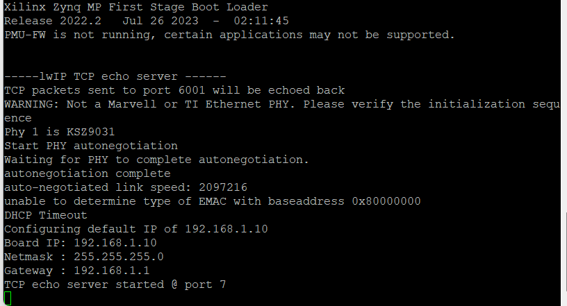
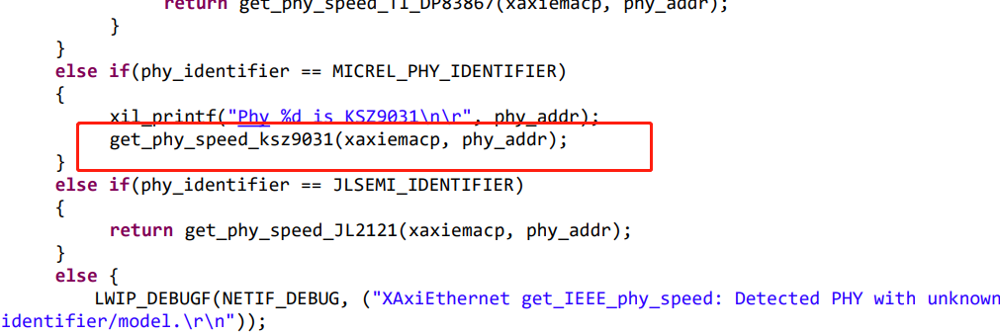
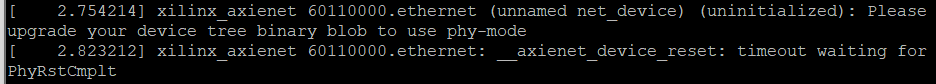
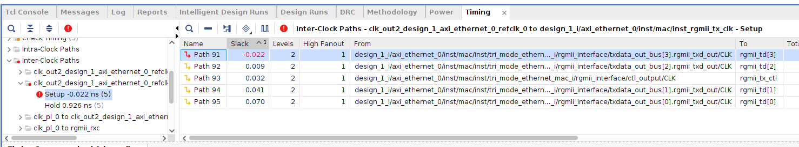

##### 20230804

- 参考 YYY 的以太网实现，写裸机驱动测例
- 修改文章


##### 20230803

- 写 phy 芯片驱动


##### 20230802

- 查看 axi-ethernet Linux 驱动源码，以及 Alinx 官方对 lwip 的修改，也许可以根据 lwip 写裸机环境的 phy 芯片驱动
- 修改文章，试图寻找共享调度器代码在系统中的位置


##### 20230801

- 写 axi-ethernet 以太网驱动，原始仓库中的 sleep 以及 poll_timeout 函数目前使用忙等实现


##### 20230731

- 根据 svd 生成的寄存器访问函数写以太网驱动


##### 20230730

- 在 zcu102 上跑 rCoreN
    - rCoreN 没有跑起来，开始以为是和之前一样的问题，但是突然想起来，rCoreN 里进行初始化的核锁死在了 0 号核，修改了初始化的方式之后，能够看到打印输出
    - 先把比特流给刷新一下，但是打开 vivado hardware manager 之后，不能连接开发板，还是直接用 axu15eg 完成实验吧，裂开
    - 把 axi-ethernet svd 写好


##### 20230729

- 写完 axi-ethernet 电子手册
- 修改论文
    - 修改图片
- 调试以太网和 dma 驱动
    - 对比 YYY 的仓库和我写的驱动，其中增加了 local_loopback 以及 gt_reset 相关函数
    - 先在 zcu102 上完成实验数据测试，之后在 axu15eg 上调试驱动，除了 axi-ethernet 驱动还涉及 phy 芯片的驱动
- 讨论论文
    - 把协程引入内核，支撑点：内核协程、用户态的协程被感知；协程控制块在文章中描述；协程控制块的 id、优先级、闭包，与堆栈、地址空间的关联；编译器控制的协程状态如何让内核感知
    - 给协程定义优先级属性，用户和内核采用协调一致的调度算法
    - 异步系统调用，ecall 与协程的状态修改的顺序，目前的结果还不完善，文章中不过于强调
    - 在结论中详细描述数据
    - 引言中存在的工作优缺点，没有进行相关的对比，详细描述长处和短处
    - 引言：库的形式还是内核的机制，通过 vDSO 将用户级线程（协程）和内核级线程，接口通过 vDSO，go 协程的栈空间优化在这里的问题，把语言、用户库、操作系统三者统一起来了，这是最大的意义（与协程引入内核相呼应）
    - 相关工作：第一部分rust异步状态机与 design 状态图联系起来
    - design：三个特点与工作的意义
    - 强调共享调度器与跳板的关系，sc 与跳板的关系
    - 协程与线程状态模型里，应该与线程的状态没什么关系，用 vcpu，状态图重新画
    - 共享调度器与图灵机模型
    - 线程创建与进程中主协程的创建绑定，线程退出与最后一个协程结束绑定
- 移植 rCore-N
    - 刷新比特流，将 PS、PL 串口连接起来
    - 修改 rCore-N fs 内的 stdio 输入输出改成用 sbi 提供的接口即可
    - 先在 axu15eg 上运行其他的测例


##### 20230728

- 先测试一下以太网的速度，板子上能够 ping 通，但是 iperf 客户端不能连接 wsl 里的服务端，估计是与使用 wsl 相关，因此只能将板子设为服务端，wsl 设为客户端进行测试

    - 只开一个线程：24Mbits/s
    - 两个线程：11.5Mbits/s、11.2Mbits/s，反向的速度类似
    - 没有记录 CPU 使用情况，并且线速为 100M

- 裸机环境下串口输出

    - 串口设备驱动，还是先用 opensbi 的串口吧，串口设备这一块还不太熟悉
    - 将裸机环境编译到 opensbi 内，没有看到输出，在 qemu 内没有看到输出，等了一段时间之后能够看到打印输出，但在真板子上还是无法看到
    - 在 entry.asm 中手动调用 ecall，在 qemu 中能够看到字符输出，在真板子上没有
    - 在opensbi 的 sbi_ecall.c 文件的 ecall_handler 函数中增加打印输出，在 entry.asm 中直接 ecall，并没有看到打印的内容，因此怀疑是没有跳转到指定位置
    - sbi_hart.c 中通过 mret 函数返回到指定的地址，在之前增加打印，能够看到输出，可能是链接 fw_payload 时出现了问题，将 fw_payload.elf 反汇编看到 .payload 段为 elf 格式的 magic 而不是裸机环境代码，因此用 objcopy 生成二级制代码，因此问题解决

- 写 axi_ethernet 以太网驱动

    - 无意中找到 csv 格式的 axi 以太网的寄存器手册
    - 看产品手册，如果想要尽快测试实验的话，可以不与 dma 模块连接起来，直接使用 AXI4-Stream Data FIFO 来完成实验数据的测试
    - 使用 windows 下的 XML Notepad 编辑，写到一半，因为操作错误，软件崩了，导致没有保存

    


##### 20230727

- 组会，学期总结
- 阅读 opensbi 的代码，学习如何修改
    - 移植 tmux，为多串口做准备，将 zcu102 上的 /usr/lib/locale 文件夹复制到 axu15eg 上，成功运行了之前静态编译的 tmux，分屏之后无法切换窗口，问题在于切换 pane（ctrl+b o） 和 window（ctrl+b n,p）
    - pmp 的区域应该是全打开了，预估不需要进行修改
    - 创建裸机环境，没有操作系统，用于调试设备驱动


##### 20230726

- 开会讨论
    - 优先移植 rCore-N，完成实验
    - 放平心态 debug
    - 跑通 Alinx 官方的例子
- 再按照官方例子跑一遍，忽略时序违例
    - 使用 333M ref_clk ，仍然是无法正常工作，不能输出结果
    - 使用 200M ref_clk，与上述相同
    - 观察到速度比较奇怪，仔细对比了 PL 和 PS 侧两端的 lwip 修改，发现教程的获取速度的函数没有返回
- 将官方测例移植到 rocket 上
    - 按照之前的方式连接好后，启动时没有设备初始化的操作，尽管 xxv 的驱动代码的 compatible 内有 “xlnx,axi-ethernet-1.00.a”，但是并不会匹配到总线上的设备
    - 切换回没有修改过以太网驱动的 linux commit，这次初始化时能够看到网卡初始化，但始终出现 
    - 对比了 linux-xlnx 的 __axienet_device_reset 函数，发现两者之间代码差距较大，移植 linux-xlnx 的驱动到 TKF 改过的 linux 中
        - netif_napi_add 函数最后需要多加一个 NAPI_POLL_WEIGHT 参数
        - 报错
        - 设备树中增加 phy-handle 属性之后，初始化时没有报错，但是在之后报错
        - 将 phy 设备树节点添加到 mdio 节点之后，报错
        - 根据这个帖子 [(24条消息) [linux kernel\] 内核下ksz9031驱动调试踩过的坑_mdio device at address 1 is missing_weixin_43771853的博客-CSDN博客](https://blog.csdn.net/weixin_43771853/article/details/115482565) 的信息，在内核 menuconfig 中把 Micrel PHY 驱动勾选上，之后仍然出现上述报错，在依次修改了设备树中 phy 节点的 reg 信息为 7， 0 之后，终于能正确的启动网卡
    - PC 和 rocket 相互之间 ping 通，并且能够通过 nc 发送消息
- 写学期总结


##### 20230725

- 暂时先不管这个时序问题了，先把 ysyx 以及 rCore-N 移植做完
- 做 ysyx，pa2 的 fact、mersenne、matrix-mul、mul-longlong 还不能通过，找 bug，之前写的 sltiu 指令解析存在错误，改成正确的之后，导致 div 以及其他的测例不能通过
- 寻求其他人的帮助，吴老师说时序应该不影响，问题在于其他地方
    - 仔细对比了用户手册的管脚，没有出现问题
- 与 yyy 讨论，关于 xxv 以太网驱动
    - 画板子，接时钟芯片
    - fmc 转 sfp 扩展板上可能有时钟
    - hack clock wizard（已经尝试过）
    - 物理 hack，跳线，可能导致信号质量爆炸


##### 20230724

- 先创建新的工程，将 ip 连接到 PS 侧，之后生成设备树，根据这个设备树，内核在初始化时，仍然无法匹配到，问题应该还是在 fpga 内部的实现
- 删除 ethernet 和 dma 模块，重新连接，生成比特流时出现错误
- 根据官方的以太网例子，在生成比特流时报了同样的错误，并且 lwip echo server 不能工作
- 阅读 AXI 1G/2.5G Ethernet IP 核手册，根据第 48 页，ref_clk 管脚在 7 系列的板子上使用 200M 的时钟，在 UltraScale+ 上需要使用 300-1300M 的时钟，上面频率不匹配的 critical warning 解决了，但仍然报告 design failed，“failed to meet the timeing requirements”，lwip echo server 仍然不能正常工作，直接使用官方提供的例子的 xsa 创建 vitis 项目也不行
- 打开 edit time constraints，根据报错信息，在 xdc 约束文件中设置对应管脚的 delay 信息，还是存在 setup 时序违例，不知道怎么 debug
- 根据手册 139 也设置 REFCLK_FREQUENCY 属性为 333.333M 仍然出现报错，这个时序问题暂时无法解决


##### 20230723

- 讨论：使用千兆以太网的接口，因此只能使用 AXI 1G/2.5G Ethernet IP 核
- 看了 Alinx 提供的例子的连接方式，要在 vitis 上进行测试，需要进行修改的部分较多，既然 petalinux 能够使用网口正常工作，那么 xilinx-linux 一定提供了相应的驱动，因此可以先不跑一遍官方例子，先进行连线
- rocket 使用 AXI 1G/2.5G Ethernet IP 核
    - 去掉了无用的 axi_gpio，增加 dma 和 ethernet，其 slave 接口连接到 rocket_mmio 模块，dma 的 master 接口连接到 AXI SmartConnect 模块，最终 AXI SmartConnect 的输出导出成外部接口连接在 rocker 的 l2 前端总线上
    - ethernet 和 dma 共有 4 个终端信号，连接到 ext_intrs 信号上
    - 在约束文件中绑定管脚，综合成功，但是关于 mdio 的连接方式出现问题，soc 里导出的 mdio 的三个输出管脚需要在 system_wrapper 中使用 IOBUF 转换成 inout 的管脚，成功生成了比特流，刷到板子上能够检测到设备以及驱动，但驱动不匹配，报错 "XXV MAC block lock not complete! Cross-check the MAC ref clock configuration"，但是能识别出设备，能够启动 lo 和 eth0，可以 ping 自己，但是不能 ping PC，PC ping 开发板会提示 "icmp_seq=3 Destination Host Unreachable"
    - 对比了 linux-xlnx 以及目前使用的网卡驱动，问题应该不在网卡驱动，在于设备树
    - [linux-xlnx/Documentation/devicetree/bindings/net/xilinx_axienet.txt at master · Xilinx/linux-xlnx (github.com)](https://github.com/Xilinx/linux-xlnx/blob/master/Documentation/devicetree/bindings/net/xilinx_axienet.txt)以及[Linux AXI Ethernet driver - Xilinx Wiki - Confluence (atlassian.net)](https://xilinx-wiki.atlassian.net/wiki/spaces/A/pages/18842485/Linux+AXI+Ethernet+driver)记录了设备树的写法，对比这部分内容修改 rocket 的设备树
    - 修改设备树之后，没有进行设备初始化，总线上没有检测到设备？？？


##### 20230722

- 启动时能看到网络相关的协议栈的信息的初始化，但是 reset 网卡时报错时钟问题
- WSL 每次启动会动态分配虚拟网卡地址，导致 license 不可用，修改了网卡之后，license 合法了，但是综合时出现未知的错误
    - 在[2023 WSL2 固定 mac 地址 - 哔哩哔哩 (bilibili.com)](https://www.bilibili.com/read/cv25182401)找到了一个方案，添加了一个固定 mac 地址的网卡，使得 license 合法，并且 wsl 能够联网，解决了许可证的问题，时钟的问题还需要进一步考虑
- 仿照 Alinx 的 GTH 高速收发器的约束文件绑定管脚，能够生成比特流，但是进入系统后网卡重置时提示时钟出错
- 使用 utility buffer 将输出的两个端口绑定到空闲的 LVDS 管脚上，仍然失败，utility buffer 的输出不能驱动这两个管脚，与直接手动生成差分时钟错误相同
- 管脚绑定到 200M 差分时钟，在 impl 时提示没有绑定合法位置，看到回答，GT 参考时钟需要放到专门的管脚上
- 可能的方案：
    - 修改当前的 IP 核的选项，将 GT subcore 不包括进去，另外进行处理
    - 另外使用时钟板提供时钟
    - 换成 AXI 1G/2.5G IP 核
- GTH 高速收发器可以是因为底板上有 125MHz 的差分晶振


##### 20230721

- vivado 的许可证和 license manager 没有同步
    - 删除了 vivado 安装目录下的许可证导致出现问题，因此重新安装了 vivado
    - 创建 license 时没有注意 hostid，因此导致生成的 license 不可用，并且不能仅仅在 license 中修改 hostid，否则会导致 CRC 失效，但是账户不能再重新申请 license，因此只能使用新的账户来申请了
    - 用 qq 邮箱一直无法通过，换了学校邮箱之后马上通过，使用正确的 hostid 终于解决了许可证的问题
- 生成比特流之后，在内核初始化阶段出现问题，在之前去掉 xxv 的 IP 之后也同样出现过，因为没有同步修改设备树，所以初始化时出现问题
- 修改了设备树之后，rocket linux 初始化之后，以太网的参考时钟仍然存在问题，遇到和之前一样的问题


##### 20230720

- 组会
    - 156.25MHz 的时钟有解决办法
- 解决 156.25MHz 参考时钟问题
    - 经过一轮尝试之后，发现是封装 dma 和 xxv 的模块导出的接口的问题
    - 使用 utility buffer 在 valid design 时没有报错，但在 impl 时提示没有连接顶层模块，因此使用 clock wizard 手动生成两个时钟 P+N，进行连接，但是在 impl 时报错不能驱动 xxv 的管脚
    - 参考了 alinx 官方的 gtx 高速收发器的例子后，能够成功 impl，但是由于许可证的问题导致不能生成比特流
    - 因为未知的原因，导致 vivado 中的 license 总是出现问题


##### 20230719

- 修改 IP 核配置，仅仅为 MAC，不包含 PCS/PMA
    - PCS/PMA 必须使用156.25MHz差分时钟，只使用 MAC 的话可以使用 156.25MHz 的单端时钟
    - 之前在修改了 soc 的 part 信息之后无法生成 vivado 项目的原因也是因为这个时钟绑定的管脚的问题
- 翻译文章
    - 修改了状态转换模型的图
    - 翻译完第三章的部分
    - 阅读论文的整体，进行修改


##### 20230718

- 修改 vivado 项目
    - 使用 OBUFDS 原语能够成功 synth，但是 impl 失败，报错 [Opt 31-1] OBUFDS OBUFDS_inst O pin is not connected to a top-level port. IBUFDS 和 OBUFDS 原语的输入输出只能连接到外部的管脚，不能连接到 FPGA 内部
    - 打开 elaborated design 配置 gt_ref_clk 时，不能选择 PL 200M 参考时钟的管脚
    - 时钟的问题，在内部使用 OBUFDS 出现上述报错，如果连接到顶层模块又会报错多个驱动，似乎没有什么好的解决办法了
- 把 PL 的串口输入输出连到 PL 的串口，方便之后的调试
- petalinux 的 rootfs 中可以配置 minicom，不需要手动移植，但是没有找到 tmux
- 使用单端时钟手动生成差分时钟，仍然不行
    - 使用 utility buffer IP 核只能生成 100MHz 的频率

##### 20230717

- 添加 xxv
    - 不修改 zcu102 的 part 和 board_part 参数生成 vivado 项目，在 settings 中修改 part 为 xczu15egvb1156-2-i，更新所有 IP
    - 修改 zynq 的配置，修改管脚约束，在设置 gt_ref_clk_clk_p 管脚时遇到问题，zcu102 使用了USER_MGT_SI570_CLOCK2_C_P 管脚（在 zcu102 手册中 clock generate 部分），这个在 axu15eg 上应该时没有提供的，因此可能需要使用 PL 侧的 200M 的差分时钟来生成
    - 在修改 clocking wazird IP 核时，因为管脚名称格式错误的原因出错
    - system_wrapper.v 中多了几个 AXI 的管脚，去掉之后，能够正常综合
    - 在约束文件中添加 create_clock -period 6.400 [get_ports gt_ref_clk_clk_p] 创建一个 156.25MHz 的时钟
    - 正常完成了 impl，但是 write_bitstream 还需要添加许可证，需要重新生成 soc，但是因为没有绑定 gt_ref_clk_clk_p 管脚失败了
    - 没有光纤模块，需要购买，可以买一个光电转换的接口
- PL 侧只有 200M 的差分时钟，而 xxv 需要的是 156.25M 的，因此在 block design 中到处一个 156.25M 的时钟，之后在 system_wrapper 中通过 OBUFDS 原语得到对应的差分时钟

##### 20230716

- 调试 axu15eg
    - ip a add 192.168.10.2/24 dev eth0 设置局域网内的 ip 地址
    - 把 S_AXI_HP0_FPD 和 M_AXI_HPM0_FPD 的数据位宽设置为 64 位，将 led 绑定到 rocket 复位信号
    - 启动了 rocket，在 pl 的串口看到了 opensbi 的输出信息，但是 opensbi 卡在了打印 Domain0 Region03 的位置，原因尚不明确
    - axu15eg 需要保持复位信号为低电平，与 zcu102 不同，因此 reset.sh 脚本中的 sleep 前后向 gpio 输出的值需要反过来，现在能够成功运行 rocket 并且进入 riscv-linux
- 写 ysyx riscv64M指令
- 交叉编译 tmux 和 minicom，但是出现问题，tmux 交叉编译出现 Conflicting types of forkpty，是因为用 apt 安装了 pkg-config
- 原本计划再另外创建一个分支用于添加 xxv，但使用 axi_xxv_nic 分支里 zcu102 的 soc.tcl 不能生成 vivado 项目，报错 ERROR: [BD 5-106] Arguments to the connect_bd_intf_net command cannot be empty. 因此在目前的分支上手动添加 xxv_ethernet
- 将 rocket 改成 4核 100M 之后，能够进行初始化，但是卡在了执行 run /init 部分，应该是修改了 plic 外部中断的原因
- tmux 移植到开发板上报错： need UTF-8 locale (LC_CTYPE) but have ANSI_X3.4-1968
- 不修改 part 和 board_part 参数，先生成 vivado 项目

##### 20230715

- 实现了所有的 riscv64I 指令，在运行 bit 测例时出现问题，lbu 访存地址越界，因为 add 指令实现导致的问题，结果是因为没有对 R 型指令进行解析（无语）
    - 不能通过 div（divw）、fact（mulw）、goldbach（remw）、hello-str、leap-year（remw）、matrix-mul、mersenne、mul-longlong、prime、recursion、shuixianhua、string、wanshu

##### 20230714

- 写 pa2 的指令解析，通过基础测试程序

##### 20230713

- 组会
- 发现 DDR 的 AXI 数据位宽存在问题，不应该与 system_wrapper 中的位宽对其，而是应该看 rocket 内的数据位宽
- 写 ysyx pa2

##### 20230712

- 画图
- 写小论文

##### 20230711

- 画图
- 写文章

##### 20230710

- 写 pa1

##### 20230709

- 组成原理的实验指导过于简单，以至于有点无从下手
- 计划跟着 ysyx 完成组成原理的实验

##### 20230708

- 将 fw_payload.bin 使用 load-and-reset 脚本写到内存之后，使用 devmem 读取 0x10000000 内存，确实写进去了
- 而使用 ila 抓取 araddr 为 0x10000000，rdata 为 00010297007e3023fa0e0e130000fe17，还不明确其具体的含义
    - 使用不同的 fw_payload.bin 抓取出来的 rdata 不同，但是总是只有一个周期
    - 估计 DDR 应该是能正常工作
- bootrom 为固件，其中有个打开 led 灯的操作，这里我没有绑定到 led，绑定 led，修改高低电平，查看 reset 时是否会出现 led 灯亮
- 跟换 led 的管脚到另一个 axi gpio 之后，led 灯并没有亮，因此推测问题出现在没有启动 rocket，并没有进行复位执行 bootrom 代码，但是 DDR 中搬运了东西

##### 20230706

- 组会
- 调试 rocketchip
    - system_wrapper 中增加 markdebug 属性，综合之后添加 debug 约束，导出硬件，在 vitis 中创建一个 hello 项目，编译运行之后，在 vivado 中打开 hardware manager 进行调试
    - 不能在 system-user.dtsi

##### 20230705

- 动态刷新 PL 侧比特流以及增加 PS 设备树节点的操作流程，以 PS 端操作 gpio 控制 PL led 为例
    - 在 vivado 中添加 axi_gpio ip 核，将管脚引出，并绑定到 led 上，synth、impl 生成比特流之后，导出硬件 xsa
    - 使用 xsct dt_overaly.tcl system_wrapper.xsa psu_cortexa53_0 /opt/device-tree-xlnx/ overlay 生成设备树，包括 pl.dtsi
    - 使用 dtc -O dtb -o pl.dtbo -b 0 -@ overlay/pl.dtsi 生成 dtbo
    - 创建 bitstream.bif 文件，使用 bootgen -image bitstream.bif -arch zynqmp -o ./system_wrapper.bit.bin -w 生成 bin 文件
    - 将 bin 与 dtbo 文件上传到 arm linux 里，在 arm 中使用 fpgautil -b system_wrapper.bit.bin -b pl.dtbo 刷新 PL 比特流以及增加 PS 侧设备树
    - 在 /sys/class/gpio 中可以看到新增的一个 gpiochip，只有一个管脚，对应着 PL 的 led，之后通过 sysfs 的方式，完成对 PL 端 led 灯的控制
- axu15eg 的手册上说 PL 端存在两个 led 灯，但是并没有看到第二个，这里应该是错误
- 接下来考虑用 gpio 来复位 rocket
- 写共享调度器文章
    - 标题不太准确
    - design 和 implementation 分开写，大致写了 design 部分

##### 20230704

- 写共享调度器文章
- 写组成原理实验
    - axu15eg 板子上的 key 和 led 较少，因此考虑使用串口来进行指令的输入和读取的数据输出
        - 串口正常工作
        - 写 alu 和 寄存器
- 换了内存条之后，synth 和 impl 没有出现问题，成功生成了比特流
    - 根据 bif 生成 bin 文件，因为 PS 和 PL 之间需要进行通信，因此需要把 uartlite 设备树节点增加到 PS 侧，需要生成 DTBO 文件
    - DTBO 文件用 fpgautil 刷新时，卡住，原因未知，导出新的硬件，用 petalinux 构建，看设备树节点中是否存在增加的串口节点
- 在 petalinux 中需要增加设备树节点
    - linux 初始化报错  Serial: 8250/16550 driver, 4 ports, IRQ sharing disabled，应该是 axi_uartlite 节点中的信息设置错误，目前注释掉这个节点
    - 使用 gpio 进行 load-and-reset 时，gpio 节点没有检测到，应该是内核编译时没有勾选驱动，仔细查找了之后发现，是 gpio-cell 设置不对，设置成 petalinux 生成的节点之后，在内核初始化时，卡住
    - 通过 fpgautil 工具来增加设备树节点之后，能够看到设备节点，但是都没有作用

##### 20230703

- impl zcu102 时，注释掉了约束中的 debug 相关的连接，因此总是出错，暂时先不管
- 尝试 PL 侧的开发，在 block design 中增加时钟 ip 核，之后利用引出的时钟，配置 led 灯闪烁，并进行动态刷新，经过测试没有问题
- 尝试连接 rocketchip
    - 在 block design 中增加 axi_uartlite 和 axi_uart16550 IP核，axi_uartlite 用于 PS 连接 PL，而 axi_uart16550 只在 PL 端使用
    - 在 PS 中增加一个 slave axi 的接口，由 PL 端来读取 PS 端 DDR 中的数据
- 还是使用脚本来生成 vivado 项目，之后在 block design 中修改 zynq 的配置
    - 综合时，总是因为内存问题出错，需要增加内存
    - impl soc 时，提示 IO 管脚过多，尝试把 DDR 的 AXI 接口从 128 位改成 32 位，如果对 system_wrapper 进行 synth 和 impl 不会出现这个问题

##### 20230702

- 查看 zcu102 的连接
    - 猜测两个 concat ip 核是用于调试，而 axi_uart16550 是为了测试串口的外部中断
    - axi_uartlite 则是 PS 与 PL 端的串口连接

##### 20230701

- 生成的 rocketchip_axu15eg.v 为 rocket 的软核，需要一层 system_wrapper 将其包括进去
- 直接修改 tcl 来生成 vivado 项目似乎难度太大，先从 vivado 中配置好之后再到处 tcl

##### 20230630

- 在 axu15eg 上配置 rocketchip
    - src/bd/soc.tcl 中配置了 ip

##### 20230629

- 开组会
- 写 uintr-rocket-chip 的 axu15eg 支持
    - vivado 中没有对应的 board part，修改 makefile 和 project_info.tcl 的 board_part 和 part 部分，执行 make init 和 make build，在 axu15eg/src/hdl 目录下生成 rocketchip_axu15eg.v 和 system_wrapper.v 文件

##### 20230628

- 使用 fpga_manager 动态刷新 PL
    - 终端显示成功刷上去了，但是并没有什么反应，也许是 PL 端的比特流存在问题，在 vivado 中进行仿真，发现，无论是否按下 key，led 始终为 0，测例实际上两个 GPIO 不是连接起来的，而是单独进行测试
    - 尝试在 linux 下通过 sysfs 操作 GPIO
        - 能够通过 GPIO 操作 PS 侧的 led 灯
        - devmem 工具可以直接读写寄存器
        - fpgautil 刷新 PL 之后，PL 侧的 led 灯从暗到常亮，done 指示灯从亮到不亮，使用 jtag 刷新之后现象相同，因此可以得出结论，使用 fpgautil 能够动态刷新 PL
- 生成 lrv 的 vivado 项目

##### 20230627

- PC 可以 ping 通板子，但是板子不能 ping 通 PC
    - 打开防火墙之后，能够 ping 通
- 没有真实的 ubuntu 机器操作 ext4，因此先制作 ramfs，之后在板子上的 arm 中把 rootfs 写到 sd 卡的 ext4 分区中
- 尝试访问外网
    - 尝试将 dhcp 移植到 rootfs 中，结果发现有 udhcpc 这个工具，插上网线，自动获取到 ip
    - 能够 ping 百度，有 wget 工具，但是接下来是主机怎么远程访问板子
        - ssh 远程访问应该没问题，在 wsl 中直接使用 ssh petalinux@ip地址即可访问开发板
        - 目前只是在同一个局域网中访问，其他的方式，暂时没有尝试
        - 通过 wget ifconfig.me 获取到公网ip，但是还需要路由器进行端口映射，才能通过公网ip访问
- 动态更新 PL，可以使用 fpgautil 工具，暂未尝试
    - 也许可以将比特流通过 ssh 上传到 arm 的 linux 中，之后使用 bootgen 工具手动生成 BOOT.bin 替换掉 sd 卡中的BOOT.bin，再 reset ，从而刷新 PL 侧比特流

##### 20230626

- 查找资料，尝试使用 Xilinx 的 xdevcfg 测试

##### 20230623

- 使用 2022.2 的版本，petalinux 能够正常编译（如果卡住，则 CTRL+C，再重新 petalinux-build）
- 正常启动 linux，登录时出现问题，应该是没有设置启动参数
    - 应该是 minicom 的问题，使用 putty 之后，能够正常登录
- 将 SD 卡分区，一部分分区用于启动，另一部分分区制作根文件系统
    - 卡在了向 sd 卡 ext4 分区制作根文件系统，使用 DiskGenius 可以向 ext4 写文件（需要收费，可以下载破解版）
    - DiskGenius 写 ext4 时，出现了奇怪的问题，petalinux 制作的根文件系统无法写入软连接，在使用 busybox 制作的根文件系统可以写入，已经能够持久化了
    - petalinux 制作的 rootfs 在 windows 下转变成快捷方式，而 busybox 制作的 rootfs 则不是
- 学习 PS 侧动态刷新 PL 侧比特流的方式

##### 20230622

- 使用petalinux 编译镜像，petalinux 2020.2 不支持 Ubuntu20.04
- 尝试手动编译linux、uboot等

##### 20230621

- 在 wsl 中使用 vivado 和 vitis，暂时没有出现问题
- 使用 petalinux 编译 linux 镜像运行
    - 可能版本存在问题，不知道需不需要更换 glibc，或者单独对 yocto 下载的某个包的路径进行更换

##### 20230620

- 使用 AXU15EG 的 PS 侧串口与 windows 进行通信
- 使用生成的 pac 写 xxv 驱动
- 使用 windows 下的 vivado 生成加入 xxv_ethernet 的比特流时，出现错误
    - 模块的名称过长
    - IO管脚没有放置
    - 决定在 wsl 中安装 vivado 2020.2，便于生成项目

##### 20230619

- 学习 pac
    - 先使用 svd2rust 生成对应的 lib.rs，再使用 form 移动到 src 目录中，最后使用 cargo fmt
- 阅读 xxvethernet 电子手册
    - 根据手册以及裸机仓库编写 svd 文件，生成 xxv pac 库

##### 20230616

- 写完大数据代码（史上最丑数据库）
- 写完大数据作业报告
- 学习 AXU15EG 开发板

##### 20230613

- 将 xxvethernet 主要的数据结构和宏翻译成 rust
- 遇到了问题：设备的参数可能是通过 tcl 来生成的，需要对比 tcl


##### 20230612

- 解决之前 rCoreN中的调度问题
- 写裸机网卡驱动
    - 粗心了导致一个问题，找了半天才发现
    - 将qemu中的设备树导出来，再添加相应的 xxv_ethernet 和 dma 节点信息，再转化成设备树文件，虽然qemu里没有这个设备，但是先保证能够正常解析设备树
    - 将裸机驱动中的头文件翻译成 rust

##### 20230525

- 组会
- 阅读 xilinx-qemu 源码
- 标画英语课论文文献

##### 20230524

- 把大数据大作业的大体写好了
- 查看微机接口实验的相关资料
    - 编译了 xilinx-xlnx，在 qemu 上跑，和 tkf 改过的 linux 一样，即使选中了 xilinx 网卡驱动，在加载时也没有打印对应的信息
    - 找了相关的信息，以及讨论，应该有两种解决方案
        - 使用 petalinux 工具
        - 使用 xilinx 下的 qemu

##### 20230523

- 写大数据的大作业
- 写微机接口的实验
    - 编译了新版的支持用户态中断的 qemu，并且编译了改过之后的 linux

##### 20230522

- 完成分布式系统实验
- 写大数据分析与内存计算的大作业

##### 20230419

- 完成 raft 第二个实验
- rust_main 函数的设备树地址传的是个奇怪的地址
    - 询问了 yyy，原来这是正确的地址
    - 正确的解析了 net，并且能够与上位机通信
- 写 poll 与 FFI 安全之间矛盾的说明文档

##### 20230418

- 跑通了 virtio 的网络测例
- raft 第二个实验 debug

##### 20230417

- 完成 raft 第一个实验
- 阅读关于 zcu102 的资料
- 阅读关于 rocket 的资料

##### 20230415

- 写 raft 

##### 20230414

- 完善共享调度器，位图更新方式
    - 无锁队列限制了每个优先级下的协程，这里必须想办法 dump 掉
    - 内核里的调度还存在着死循环的问题，需要找出 bug

##### 20230413

- 开组会
- 完善内核模块加载机制
- 完善共享调度器，改成无锁队列

##### 20230412

- 继续修改 ffi 问题，最内层的 poll 函数仍然需要保证 ffi 安全，因此失败了
    - rust 生成的 dylib 和 C 语言库略有不同, 其用法也发生了很大的变化.在目前, dylib 几乎只能作为 cargo 编译的中间产物使用, 就像 rlib 一样
- 阅读论文

##### 20230411

- 改成 so 之后，应该需要增加某些重定向操作，否则就会出现地址乱飞
- 上课
- 参考 rcore，在 rCoreN 上对 lkm 进行适配，能够获取到地址并且执行
- 可能是因为 Box 导致的 FFI 不安全，指针乱飞
    - 需要将旁指针转化为 pointer + length

##### 20230410

- 完善 rCoreN
- 完成英语课阅读要求
- 编译成 so 文件之后，似乎堆的使用出现了问题，还在找 bug
    - 排除了无锁队列的问题
    - 创建协程时，使用了堆出了问题


##### 20230409

- 继续修改共享调度器代码，更换工具链之后，生成了 so 文件
- 解析 so 文件符号表

##### 20230408

- 测试实验数据，找到问题
- 修改共享调度器代码

##### 20230406

- 开组会

##### 20230405

- 测试数据，写完技术报告
- 讨论测试结果
- 写 lrv fpga 部署指南

##### 20230404

- 上课做实验 
- 写技术报告、画图

##### 20230403

- 测试实验数据，增加测了几组数据
- 成功在 fpga 上部署了生成的比特流，取得了重大进展

##### 20230402

- 刷 verilog oj
- 阅读实验代码，查找问题，
    - 可能是改的异步写操作出现了问题，退回到原来分支后进行测试，仍然存在同样的问题
    - 最终定位到参数化测试的代码中变长 buffer

##### 20230331

- 学习 raft
- 学习 一生一芯，做中科大的 verilog oj

##### 20230330

- 开组会
- 构建 vivado 项目，经过一系列折腾终于生成了比特流

##### 20230329

- 换到 ubuntu 上，结果手贱点了更新显卡驱动，崩了
- 恢复环境，对着 tcl 手动构建 vivado 项目，目前正在构建 block design

##### 20230328

- 电脑崩了，重装环境

##### 20230327

- 查看部署 fpga 的流程
- 测试数据

##### 20230326

- 汇报共享调度器
- 看南大 pa0

##### 20230325

- 做英语 ppt

##### 20230324

- 做共享调度器 ppt
- 做英语作业 ppt

##### 20230323

- 开组会
- 写测试脚本
- 下午休息
- 晚上把测试脚本写完，测试代码解析参数
- 看 rCoreN 用户态中断的具体流程

##### 20230322

- 继续在 fpga 上测试
    - 测试部分数据
- 画图
- 讨论实验数据、apmr 的实验可以不需要
- 修改技术报告
- 修改代码，shell 增加参数
- 编写测试脚本

##### 20230321

- 试图解决在板子上shell响应慢的问题
- 阅读组成原理 lab4，但是还是直接接触 rocket-chip 的总线协议快一点
- 上微机接口实验课，仿真完好，但上板子就不显示
- 晚上会宿舍继续写微机接口的实验
- fpga 上测试 rCoreN 共享调度器

##### 20230320

- 尝试访问 fpga 板子
    - 能够成功访问板子了，并且能够运行 shell，但是运行 threads_arg 测例不行
    - 能够运行 async_pipe 和 connect_test 测例，但是堆的设置始终是个大麻烦
- async_write 阻塞了，需要将它改造成异步的形式
    - 参考 async_write 的形式改完之后，测试 connect_test 比之前略快，而且不会出现阻塞的情况了
- 完善系统调用生成的宏
    - 读写系统调用都是通过同一个接口进行访问
- 阅读资料 The Registers of Rust

##### 20230319

- 看 ostep

##### 20230318

- 看数字电子技术基础
- 看学生节晚会

##### 20230317

- 上课
- 写 chisel-tutorial

##### 20230316

- 组会
- 阅读论文 InfiniFS

##### 20230315

- 控制器添加立即数的逻辑
- addi 指令的时序已经是预期的形状，还有一些细节需要进行处理
- 完善 cpu 的功能，运行小段程序
- 思考并回复老师的意见
- 写完分布式系统导论 lab1 的博客
- 练习 chisel

##### 20230314

- 写组成原理 lab3，控制器部分
- 讨论 pipe aread 的逻辑
- 完成 alu 部件功能测试
- 控制器状态转移正确

##### 20230313

- 找分布式系统概论 lab1 bug，总算找到问题了
- 写组成原理 lab3
    - 写完寄存器堆
    - 写 ALU 逻辑部件

##### 20230312

- 写分布式系统导论 lab1，不熟悉 go 导致浪费了很多时间，一直在 debug

##### 20230311

- 看 MapReduce 论文
- 学习 go
- 学习分布式系统导论，还没太确定 lab1 如何完成

##### 20230310

- 看论文 LineFS
- 写分布式系统实验1

##### 20230309

- 开组会
- 看论文 LineFS

##### 20230308

- 改技术报告
- 看论文，准备课上汇报

##### 20230307

- 改 vdso 实现方式
- 内核中使用需要增加符号表，目前没有增加符号表，而是使用其他的方式
- 修改 Executor，使用无锁队列，使用用户态中断，消除轮询带来的开销
    - 不能二分查找
    - 仍然需要使用位图

##### 20230306

- 写论文 review
- 做实验
- 按照标准方式实现 vdso

##### 20230305

- 讨论技术报告相关问题

##### 20230304

- 修改技术报告文档、增加插图
- 讨论中断唤醒机制
- mpmc 无锁队列
- 用户态中断处理协程一直处于就绪状态

##### 20230303

- 安装 labeled-riscv-n，进行了仿真
- 看组成原理实验指导书
- 学习 rocket-chip

##### 20230302

- 开组会
- 阅读 riscv spec
- fork rv-n-ext

##### 20230301

- 修改共享调度器的形式
- 将同步和异步写改为真正意义上的统一

##### 20230228

- 写 ParaFS review
- 尝试第一轮改 rCore-N 内核，单核情况下正常，但多核仍然存在问题
- 共享调度器增加内核打印函数
- 成功把调度封装成协程，使得内核运行更加灵活
- 写英语作业

##### 20230227

- 看论文 ParaFS
- 思考改 rCore-N 

##### 20230226

- 看论文 FlatStore
- 思考 rCore-N 内核修改
- 思考后续大作业的内容

##### 20230225

- 写了指令译码
- 接下来将译码与寄存器堆合并起来形成译码阶段的顶层模块，写到一半发现每个阶段不应该有单独的顶层模块
- 写执行阶段
- 看论文

##### 20230224

- 上课
- 看英语作业---美国文化背景
- 做组成原理实验，思考 riscv 指令集模块化的具体表现，发现其他人在译码时基本上是暴力枚举

##### 20230223

- 修改技术报告
- 写作业
- 看组成原理课资料
- 和老师讨论技术报告和一些思路

##### 20230222

- 将 rCore-N 系统调用完善
- 将共享调度器 spawn 接口完善
- 思考如何实现调度框架，发现目前已经支持调度框架，可以替换调度算法
- 修改技术报告线程状态转换部分文档

##### 20230221

- 上算法课
- 安装编译 riscv-toolchain
- 使用新版的 rocket 编译了 project

##### 20230220

- 开组会，需要了解中断的硬件相关的实现
- 学习 RISCV 中 PLIC 中断控制器的实现细节以及 CLINT
- 配置 WSL 的代理，fork 了 Rocket-chip 仓库
- 晚上去图书馆看课外书 + 运动

##### 20230219

- 仔细看了提供的仓库，熟悉目前已有的工作进展
- 看 labeled riscv 论文

##### 20230217

- 写了 IF/ID 模块，仿真波形没有什么问题
- 写译码阶段，通用寄存器组的读取还有点点问题，
- 没有按照参考书的逻辑，用自己的逻辑重新写了一遍，通用寄存器的问题解决了
- 实现 ID 模块


##### 20230216

- 修复博客上传图片 bug
- 学习 vivado 的仿真
- 使用 jetbrain 连接 wsl，vscode 没有语法提示，vivado 使用 sublime_text 打开 verilog 文件
- 编写了一位全加器进行仿真，测试文件的编写还不熟练
- 初步写了一下 pc 模块，熟练度提升了，按照教程完善了这个模块，开始实现取指令部分

##### 20230215

- 速通 chisel，感觉不太行，下载了 chisel 的 pdf
- 学习 vivado，还不会使用这个软件
- 终于学会了怎么前仿真，需要写个博文

##### 20230214

- 在 WSL 中安装 java、scala、sbt 环境
- 搭建博客，写了第一篇环境安装的博文
- 学习 scala，参照教程用 chisel 写了一个简单的电路，生成了 verilog
- 学习基本的 chisel 语法

##### 20230213

- 开组会，讨论研究方向
- 学习 verilog 

##### 20230209

- 阅读文献

##### 20230208

- 写完文档主体部分1.0版本
- 思考任务调度模块

##### 20230207

- 写文档

##### 20230206

- 画出第四版的图示，终于通过了老师的审核
- 设计任务调度模块，用类型来表示任务的状态，而不是通过任务 id 所处的队列或者状态变量

##### 20230205

- 学习 fast-trap
- 画图，修改文档
- 学习 rust 嵌入式手册

##### 20230201

- 看论文 C20_Coroutines_on_MicrocontrollersWhat_We_Learned

##### 20230131

- 修改图片，提交给老师批改
- 踩了40分钟单车，开始燃脂

##### 20230130

- 和老师讨论图示
- 改用 Obsidian 来记录笔记，在笔记中可以直接插入 excalidraw 绘图，自动导出为 png，之后写 latex 时不需要手动导出
- 修改图片

##### 20230125

- 修改了系统调用的模块，达到比较满意的效果，模块化、自动化的程度较为满意，只需要在枚举类型中定义好 SyscallId 即可自动生成用户态的宏接口（包含注释说明参数类型）以及内核的 SyscallTrait 特性，内核可以通过依赖注入或者直接实现 syscall_handler 函数这两种方式使用。
- 继续完善陷入模块

##### 20230124

- 写文档

##### 20230123

- 用户态系统调用接口已经完善，参数提示也已经完善

- 内核系统调用，通过过程宏实现 SyscallTrait，之后手动写 handler 函数进行分发，结合了单例模式进行模块化

- 目前系统调用的形式为

    ```rust
    #[repr(usize)]
    #[derive(Debug, GenSysMacro, GenSysTrait)]
    pub enum SyscallId{
        #[arguments(args = "fd, buffer_ptr, buffer_len")]
    	Read = 4,
        #[arguments(args = "ffff")]
        Write = 5,
    }
    ```

##### 20230121

- 用派生宏实现系统调用，用户态的系统调用接口基本上可以，但是参数自动化还需要仔细斟酌，内核的系统调用分发的接口没有开始思考
- 用户态的系统调用已经实现，参数需要统一由用户自己转化成 usize，内核的接口，怎么模块化？？？

##### 20230118

- 画图

##### 20230117

- 写共享调度器文档，画图
- 整理代码，考虑模块化

##### 20230116

- 调试从内核进入到用户态，在从用户态陷入到内核进程
- 写共享调度器文档

##### 20230115

- 设计内核进程的上下文处理

##### 20230112

- 思考陷入的处理

##### 20230111

- 学习 jammdb

##### 20230110

- 看 RT-Thread 文档
- 写 xxos 代码，复习 riscv 特权处理

##### 20230109

- 看 RT-Thread 文档

##### 20230108

- 上午做家务代替今天的运动
- 阅读 NVM 相关的调研文献
- 阅读 RT-Thread 文档

##### 20230107

- 阅读文献 Kotlin Coroutines: Design and Implementation
- 开始第一天的运动