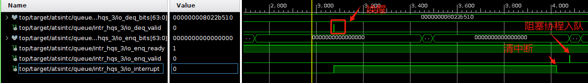
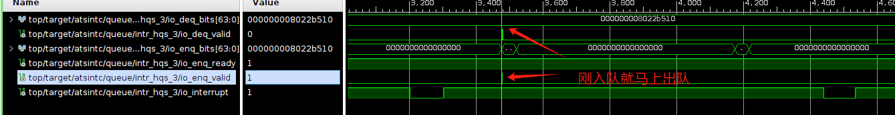
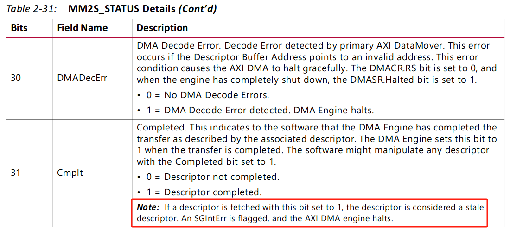

### 用于记录日常

##### 20240521

- 组会
- 整理论文实验数据
  - 共享调度器的论文代码和数据是分离的，做实验时没有注意，已经不想整理了
  - taic 的实验和代码都在仓库中，现在需要整理测试脚本
- 继续完善设计方案
- 讨论中断控制器设计方案

##### 20240520

- 写设计方案

##### 20240519

- 写 Executor 代码
- 写设计方案

##### 20240518

- 修改论文
- 写代码

##### 20240517

- 学习使用 python matplotlib、seaborn 画图
- 补充协程/线程内存占用对比实验
- 修改论文描述

##### 20240516

- 整理共享调度器的实验数据，使用 gnuplot 重新画图

##### 20240515

- 写代码

##### 20240514

- 组会
- 休息
- 创建了异步模块的组织
  - 创建 executor 仓库，目标是提供一个开箱即用的 executor，能够用在多个操作系统中

##### 20240513

- 写英文论文

##### 20240512

- 调整 latex 格式
- 与老师交流论文
- 整理论文参考文献

##### 20240511

- 写动态链接器
- overleaf 写论文

##### 20240510

- 修改论文
- 画图

##### 20240509

- overleaf 写论文
  - 调整图片字体、图例等
- 帮 ldh 调 bug
- 讨论中文论文
- 修改中文论文

##### 20240508

- 修改论文
- 听 LDH 实验报告
- 修DMA驱动bug
- overleaf 写论文

##### 20240507

- 组会
- 文献调研
  - SOSP: A SmartNIC-based Offloading Framework for Cloud Storage Pooling
  - SmartGate: Accelerate Cloud Gateway with SmartNIC
  - SuperNIC: An FPGA-Based, Cloud-Oriented SmartNIC
  - Software-Hardware Co-design of Heterogeneous SmartNIC System for Recommendation Model Inference and Training
  - Automated SmartNIC Offloading Insights for Network Functions
  - Tiara: A Scalable and Efficient Hardware Acceleration Architecture for Stateful Layer-4 Load Balancing
    - 结论：与 SmartNIC 的比较并不能显示出 ATSINTC 的灵活性
  - Process-Aware Interrupt Scheduling and Accounting（与自定义中断控制器无关）
  - Custom Interrupt Management for Real-Time and Embedded System Kernels
  - Development of Customized Interrupt Controller Logic
    - 自定义的中断控制器的目的不同
  - Efficient hybrid polling for ultra-low latency storage devices
- 写论文
  - 修改引言和相关工作部分

##### 20240506

- 画图
  - 多优先级连接的时延分布
  - 不同的核数对优先级的影响
    - 核越多，延迟反而越高
  - redis-benchmark 不同测试的时间复杂度对吞吐量的影响，但是不能测出具体每此请求的延时
- 尝试使用 YCSB 测试 redis 性能
  - 需要使用 bin/ycsb.sh 脚本，不能使用 bin 目录下的其他文件
  - 测试负载在 workload 目录下的 a、b、c、d、e、f
  - e 的测试报错 min or max is not a valid float
- 整理测试结果

##### 20240505

- 从葫芦岛回北京

##### 20240503

- 出发去葫芦岛放风

##### 20240502

- 做实验
  - embassy 中的获取时间的函数对测试的结果影响很大，需要将其直接设置为 0

##### 20240501

- 写实验
- 下午野餐

##### 20240430

- 组会
- 写实验代码
  - 在中断模式下，连续发包，会出现阻塞的情况，原因是上一次事务发送完毕，进入下一次事务，DMA 驱动修改寄存器时，这时上一次事务的中断信号拉高了，进入中断处理函数处理中断，中断处理函数的操作修改了 DMA 内部的寄存器，因此导致了阻塞，需要在发送事务之间使用关中断的锁
  - atsintc 的代码可能存在问题，清除网卡寄存器代码的位置对速度的影响很大
- 使用 ila 调试
  - 使用 `(* MARK_DEBUG="true" *)` 标记需要抓取的信号
  - 唤醒的逻辑是正确的
  - 交换 DMA from_hw 和 intr_handler 的顺序后，波形出现较大变化，且速度差距有 100Mbits/sec
  - 先 from_hw，后 intr_handler
  - 先 intr_handler 后 from_hw
  - 原因在于先清除中断后，在 from_hw 时需要读取 DMA 缓冲区描述符的 status 字段，导致会将中断信号拉高，详情见 DMA 手册
- 但问题还是没有得到解决，速度仍然比不上中断模式，并且不同的 MTU 下不一定能成功跑起来测试
  - 在提交一次缓冲区后马上让协程让权，这种模式比中断模式慢，是正常现象
  - 正确的做法应该是在没有空闲的缓冲区描述符时，才让出 CPU

##### 20240429

- 重新测试实验数据
  - 重写轮询发送实验代码

##### 20240428

- 讨论论文

##### 20240427

- 学习 linux
- 重构 vDSO
  - 学习 ELF 文件格式，尝试写 ELF 解析器

##### 20240426

- 学习 linux
- 编译 linux 内核
- 编译 buildroot，制作根文件系统
- 写 linux 设备树
- 上板测试

##### 20240425

- 中文版初稿润色
- 贴上图片

##### 20240424

- 写完中文版的论文初稿

##### 20240423

- 组会
- 帮助 ldh debug
  - 写了裸机测试，uipi_write 写的内容与 uipi_read 读的内容不一致，可能是我写的问题
  - 尝试使用 rocket-chip 自带的测试，发现我的环境与 uintr-rocket-chip 在 riscv-tests 的配置上存在区别，无法直接使用 verilator 进行验证
  - 发现只有 0 号核能够正常的运行 uintr 的裸机测试
- 写论文

##### 20240422

- 写论文

##### 20240421

- 整理 redis 测试结果
  - 画图
- 写论文
- 阅读 YYY 本科毕业论文

##### 20240420

- 在 arceos 中使用异步网卡驱动
  - 协议栈使用 receive、transmit 接口向异步网卡驱动提交缓冲区
  - 异步网卡驱动任务接收/发送缓冲区
  - 困难：在何处添加异步网卡驱动任务，新增了一个 trait 启动异步驱动，在网卡初始化时会创建一个线程运行异步网卡驱动
  - 单独的线程只要独占一个核
  - 收到了 PC 发送的包，但协议栈没有从缓冲区中取出包进行处理
  - 发现 redis 只能在 SMP=4 的条件下才能运行，因此创建一个线程独占 CPU 会导致无法运行（在 qemu 中也是如此，超过 4 可以运行）
  - 需要使用 rr 或者 cfs 调度器才能正常运行
  - 终于测试出结果

##### 20240419

- 写论文
- 阅读论文
  - Effective I/O Processing with Exception-Less System Calls for Low-Latency Devices
  - A novel hybrid scheme of interrupt enabling - disabling and polling (EDP) for high-speed computer networks
  - Approach to External Events of Real-Time Operating System Based on Polling
  - SR-IOV Based Network Interrupt-Free Virtualization with Event Based Polling

##### 20240418

- 写论文
- 阅读论文
  - Polling Watchdog: Combining Polling and Interrupts for Efficient Message Handling
  - Integrating Polling, Interrupts, and Thread Management
  - Improving Interrupt Handling in the nMPRA

##### 20240417

- 修改 arceos
  - 更新新的网卡驱动，无论是新的，还是之前旧的代码都没能跑起来 redis，可能是比特流有问题
  - 更换比特流之后，能够跑起来 redis
- 阅读论文
  - Fast Interrupt Handling Scheme By Using Interrupt Wake-Up Mechanism
  - Task-Aware Interrupt Controller: Priority Space Unification in Real-Time Systems
  - Responsive Multithreaded Processor for Distributed Real-Time Control
- 写论文

##### 20240416

- 组会
- 把 arceos 的修改局限在网卡的模块
  - 更新到最新的网卡驱动仓库，但还没有用到异步的部分
  - 写网卡驱动与上层协议栈的接口文档

##### 20240415

- 修改 arceos
  - 增加针对平台不同设备的中断注册逻辑
  - 增加外部中断分发
- 把之前测试的数据图画出来
- 开始写论文

##### 20240414

- 写文档
- 与 LX 讨论
- 修改 arceos
  - 在调度模块中增加了一个使用 atsintc 的调度器，通过 sched_atsintc feature 来使能
  - 在 axtask/src/api.rs 中增加了一个网卡阻塞队列，因为网卡阻塞的任务会进入到这个阻塞队列中
  - 把 smoltcp 中关于 Err(AxError::WouldBlock) 的部分使用 blocked 来让其成为阻塞状态
  - redis 中使用的 smoltcp 的 socket 均为 nonblocking，通过使能 async_smoltcp feature，把 block_on 中的判断给去掉，无论是否为 nonblocking，只要返回 WouldBlock 都进入 block 状态
  - 在 arceos 中增加中断处理的逻辑
    - 初始化时注册 dummy 外部中断处理
    - 添加 qemu 和 axu15eg 平台的外部中断号以及中断处理
    - 原本的外部中断处理函数的注册逻辑存在问题，与 scause 结合在一起，但不能与具体的中断号进行绑定

##### 20240413

- 学习 arceos 的启动以及任务切换
- 思考如何进行异步适配
- 增加了基本的异步的 feature

##### 20240412

- 整理昨天测试的数据，板子上的服务端会根据收到的数据包唤醒对应的协程，也就是说在服务端设置的优先级是没有意义的，客户端的请求没有优先级
- 写给陈老师的报告
- 修改 arceos

##### 20240411

- 看波形发现，无论是什么顺序，只要是中断信号高电平且 gateway 打开的状态，就会开始唤醒操作，因此硬件是没有问题的
- 显卡驱动存在问题，导致不能连接多个显示器，重新安装了驱动
- 使用协议栈创建 TCP 连接测试收包时延，依然比轮询模式快 5 微秒
- 使用协议栈测试多条优先级连接
- 发现做的东西与已有的库难以结合，测试上一篇小论文的实验有些基准测试测试不方便，中断处理协程的优先级是个严重的问题
- 测试完所有的基础测试，修改 arceos

##### 20240410

- 使用修改后的控制器测试数据
  - 修改后的硬件无法唤醒，原因是把控制器的中断输入没有连到中断线上，连接到了 MMIO 端口上，重新生成比特流
  - 成功把简单的测试跑起来了，把轮询和中断模式的速度要慢 < 100 us，慢的原因是因为没有及时将包给发出去
  - 先清除中断，后添加阻塞任务，会导致延迟很高
  - embassy-net 协议栈对异步的改造是存在问题的，在底层的 Device trait 中把阻塞的协程唤醒，这个操作是不正确的，在这一次调用时不能收到数据，但这一次 poll 并不会结束，此时就会同时同一个协程，一个标识是处于运行状态，另一个则已经处于就绪状态
  - embassy 的 read 方法，当没有收到数据时，返回 tcp::RecvError::Finished 也会返回 ready 状态，不会及时让出，导致一些无意义的循环，从而使得延时较高
  - 唤醒机制应该是没有问题，主要还是测试代码可能存在问题
  - 下午 gnome 的桌面环境崩了，换到了新的 ukeyling 的桌面
  - 控制器的接入的中断信号那部分还存在问题，先清除中断会导致延迟异常高，在注册了阻塞任务再清除中断后，会导致延迟高 20us，直接不清除中断添加到就绪队列中，延迟比轮询和中断模式都低

##### 20240409

- 组会
  - 吴老师写过一个在 linux 用户态根据虚拟地址拿到物理地址的函数
  - LX 给了一个 tokio 中跨越 await 锁的[链接](https://github.com/tokio-rs/tokio/blob/master/tokio/src/sync/mutex.rs)，需要将其移到 no_std 环境下
- DMA 自动把网卡缓冲区中的数据放到内存中
  - DMA 在一开始直接把每个描述符绑定到内存的缓冲区中，怎么自动启动这个过程。
- 硬件描述文档中没有详细描述队列的内部操作，从等待队列到就绪队列的描述，极端情况下，一个 CPU 放，一个 CPU 拿
- CPU、网卡、ATSINTC 中断控制器不协调的解决方案：中断请求可以丢，并且有相应的补救措施
  - 协调的问题是由于 ATSINTC 唤醒机制的不完善导致
  - 这一周浪费的时间，一直以为是因为协议栈导致的与 ATSINTC 之间的协调问题（协议栈任务与 TCP 连接任务之间的不协调，主要表现是协议栈能够正常响应 ping，一旦加入 TCP 连接任务后卡死）
  - 昨天详细 debug 后，发现是因为外设和 ATSINTC 之间存在不协调
- 讨论中断控制器的状态图并完善
- 修改中断控制器的硬件实现

##### 20240408

- 听本科毕设中期报告
- 画图
  - 昨天测试的数据，数量太少了，导致画出来的图不理想
  - 只能成功创建 4 条连接，导致体现不出来效果
  - 创建 8 条连接，但只有最后建立的 4 条连接能够正常收发数据，还没有找到原因
- 更新调度器独立仓库 readme
- 写 linux 用户态下使用 `ATSINTC` 的可行方案
- 思考怎么把异步的网卡驱动与 smoltcp 的同步接口进行结合
- 讨论
- 写 smoltcp 与异步驱动结合代码，存在以下问题
  - 在 poll_fn 函数的闭包中，不能把闭包内拿到的变量放到闭包外部，因此导致了需要通过两段 poll_fn 才可以让权
  - await 不会释放掉锁，因此只能手动释放，在手动释放锁之后，又需要重新从锁中拿到对应的变量
- debug `embassy`，发现了一个问题
  - 向中断控制器里注册阻塞任务时，它可能是没有执行完，然后这时来了一个包，因此我的任务不会退出去重新从调度器中拿被阻塞的任务
  - 按照 embassy 的例子来使用也会存在这个问题
  - 最终的表现是导致硬件调度器的队列持续添加协议栈对应的协程，取不到 tcp 的协程

##### 20240407

- 画图，分析之前的测试结果，画出延时分布图
- 分析使用 smoltcp、embassy 的协议栈的具体性能对比
  - 测量各自进行一次空 poll 的时间，以及协议栈底层 receive 函数需要的时钟周期
- 写多条优先级连接测试
  - 单条连接的测试能过
  - 但多条连接时，莫名其妙把 socket 中的 waker 给弄没了（协议栈在 check_accept 时只根据 lport 进行判断，因此导致出现错误，没有唤醒对应的协程）
  - 测试完多条优先级的连接

##### 20240406

- 继续写多优先级连接的测试
  - 终于把简单的异步协议栈用起来了
- 画图，分析之前的测试结果，画出延时分布图

##### 20240405

- 继续将 atsintc 与网络协议栈结合起来
  - 与 smoltcp 的结合异常困难
  - embassy-net 的协议栈用起来有一些问题，但是 ping 能够工作，暂时先用 ping 的 rtt 来代表测试结果
  - 使用 embassy 仓库中的例子的方式，在无法 receive 时，调用 waker().wake_by_ref()，这种方式使用协议栈，存在很大的问题，比 smoltcp 中的中断模式还慢
- 写多优先级连接的测试
  - 使用 lose-net-stack 来构建异步协议栈
  - rust await 对于时，并不会自动释放掉锁，这个我认为是有点奇怪的，但是又因为它必须把跨越 await 的数据放到堆上，并不知道哪些是有锁的
  - 但 rust 对于可变性的限制非常严格，因此这里还有点 bug

##### 20240404

- 将 embassy 与 atsintc 的设计结合起来
  - 只有接收的通道需要注册协程
  - 需要使用网卡的中断，而不是 DMA 的中断，但网卡产生不了中断，导致一直没有唤醒协程
  - 修改网卡的 ref_clk 为 200 MHz，重新综合布线，无效
  - 从网卡的中断状态寄存器来看，已经收到了包，但是没有产生中断
  - 把网卡的中断使用从 pac 提供的 write 函数改成了 modify 函数，产生了中断
  - 使用 embassy 提供的接口，在运行一段时间后，总是卡住，协程之间的步调协调似乎存在问题
    - socket 中收到了数据，将 socket 对应阻塞的任务唤醒，向 PC 发送了数据
    - 但后续板子向 PC 发送了一个 challenge ACK，导致 PC 发送了 FIN 包，后续卡住了
    - 根据 challenge ACK 中的提示，可能是接收时设置了 MTU 的大小，后续计算 payload 时，导致实际的 payload 与计算的不对（不是这个原因
    - 发出 challenge ACK 是因为 PC 端进行了重发，但是对应的包，板子已经发送了 ACK
    - 卡住的问题还是因为没有继续向外发送数据
    - 不应该盲目的参考 embassy 提供的例子中的代码
- embassy 中的网络协议栈可能还是用的有问题
- 还是使用 smoltcp 较初步的异步支持
  - smoltcp 中提供的异步是针对在 socket 之上的任务
  - 而 embassy 的异步则是针对底层的网卡提供的支持

##### 20240403

- 测试多优先级连接
  - 找到昨天出现 bug 的原因，无缘无故把其他核给开启了，其他核乱飞，导致了这个问题，之前测试过程中出现的问题，可能与这个现象相关
  - Embassy 中还值得学习的点是它对多线程的处理，我们的实现中，将 Future 严格限制了需要实现 Sync 和 Send，这里对不上
  - 使用 embassy-net 提供的异步实现，一方面是由于它的 Stack 没有实现 Sync 和 Send，所以需要自己手动实现
  - 在测试中需要定义好 `_embassy_time_now`，`_embassy_time_schedule_wake`，把测试程序跑起来了，但是卡住了
    - 原因是由于第一次执行 pending 后，没有加入到调度器中，因此导致程序卡住了，在 pending 之后直接加入到调度器中，成功把协议栈跑起来了
    - 但是没有看到多核能正常工作
    - 把 embassy 的协议栈跑起来了，成功建立了 TCP 连接

##### 20240402

- 组会
- 看 arceos 中 lwip 的封装实现
- 看 ethox 的实现
- 重新测试了协程切换的开销：69 cycle
- 写多条优先级连接的测试
  - 接入 smoltcp 后，存在 bug，需要发送时，无故调用了 channel_create，且对应的 channel 直接消失了

##### 20240401

- 分析单环路带负载后的性能差距
  - rocket-chip 中的缓存行硬编码为 64B，cache 的大小为：64 nSets × 4 nWays × 64 CacheBlockBytes = 16KB
  - 在矩阵规模增大到 8 时，矩阵占的空间为 8 row × 8 column × 8B = 512B
  - 在矩阵计算过程中，被中断了，导致不仅仅是上下文切换，还有缓存缺失的开销
- 写多环路带负载的测试
  - 多个线程同时操作了同一个描述符，增加了描述符的数量，并且只开启 2 个核
- 写 atsintc 测试
  - 测试了 push、fetch、switch cycle
  - 任务优先级测试
- 写带有优先级的网卡驱动测试
- 阅读论文：Refactor, Reduce, Recycle: Restructuring the I/O Stack for the Future of Storage

##### 20240331

- 阅读 async-rust-vs-rtos 以及 embassy
  - embassy 的核心价值在于 embassy/embassy-executor/src/raw 目录里定义的 waker 和 embassy/embassy-stm32/src/exti.rs 文件中的实现
  - embassy 测量的是从中断信号产生到对应阻塞的线程执行之间的时间，而我测量了中断上下文切换到真正进入中断处理函数之间的 cycle
  - 博客中提到了 RTOS 直接设置 flag 可能比找到 async waker 并触发更加迅速，且 RTOS 的中断处理延迟由于抢占的原因会更小
  - 博客中提到 Rust 的 unwrap 对于错误处理，可能会导致代码量更大，所以直接 panic
  - 但是对于 async 和 RTOS 两者之间的中断延迟差异，不太理解原因，也没有解释
  - 博客中提到中断上下文切换，唤醒线程需要的时间更少
  - 博客提到使用额外的 executor 进行抢占
  - 博客中提到 RTIC（fully interrupt-driven runtime），但对于两者不公平，RTIC 比 embassy 性能更优
- 写带计算负载的测试

##### 20240330

- 测试中断模式和 atsintc 模式下的单环路延迟
- 写测试中断延迟和 atsintc 延迟的代码
  - 中断延迟：从中断信号产生到进入中断处理程序需要的时间，需要 1us 的时间
  - atsintc fetch 和 push 的 cycle 测出来只有 3～5，之前测的数据是读 time 寄存器则是 40

##### 20240329

- 写单环路的测试
  - PC 端收不到包，换了简单的代码之后能够收到
  - 但板子上的服务器收到请求后，发出了两个包，很奇怪
  - 网卡接收很奇怪，总是卡住了，查看 status 寄存器，发现 DMA 已经 idle 了，在 channel wait 中加入 DMA 是否已经 idle 的判断，终于把环路通起来了
  - DMA 的驱动还是存在一个隐藏的 bug，提交缓冲区到硬件时，会出现卡死的情况
- 把 DMA 驱动的锁改掉

##### 20240328

- 写接收通道的测试
  - 轮循：不是一直轮循 DMA 的中断寄存器，而是轮循网卡中的队列
  - 接收的代码还存在问题，收到几个包后卡死，在网卡初始化，使能接收的中断后，先清除中断后，能正常工作了
  - 接收通道正常工作，但速度比发送慢很多
  - 轮循网卡缓冲区，一次提交之后不进行 wait，接收之前检查是否存在可用的缓冲区，这样把发送的速度提升了一倍多
  - 网卡接受无论是忙等还是批量等待，速度都没有提升

##### 20240327

- 测试 ATSINTC 模式各个阶段周期
  - 测试 submit 到进入中断处理任务需要的时间，在 <= 1514 时，没有进入中断处理函数中，直接完成了
  - 一旦进入到正常的中断处理过程中，实际上并不占优势，这里还存在优化的空间，中间增加了一层中断处理任务，通过中断处理任务唤醒被阻塞的任务，实际上可以直接唤醒阻塞任务
  - 类似于 Embassy 比 C 写的驱动好
- 继续完善网卡驱动
  - 与 ATSINTC 紧耦合，优化后，速度远超过轮循和中断模式，当发送的帧 > 1740 时，会把网卡的缓冲区打爆（代码错误）
  - 驱动不需要完善
- 修改后的代码测试性能
  - 由于测试的模式固定为发完一个再接着发送下一个，因此比轮循模式慢 2% ～ 3%，但是比中断模式快 2% ～ 8%
- 思考性能测试方案
  - 需要增加负载，形成环路
  - 先测试单边收

##### 20240326

- 组会
- 阅读论文 The Context-Switch Overhead Inflicted by Hardware Interrupts (and the Enigma of Do-Nothing Loops)
- 测试发送各个阶段的性能开销
  - 轮循模式：总共、提交、wait、回收，提交和回收的 cycle 基本上固定，wait cycle 随着 frame size 增大而增大

##### 20240325

- 网卡 + ATSINTC 的测试结果有点奇怪
  - 在发送的数据量较小时，吞吐量比轮循模式还高，数据量超过 512 字节后，吞吐量下降明显
  - 测试批量发送
- 画性能对比图
  - 学习 gnuplot 画图
- 阅读 LX 对 arceos 的修改
- 思考设计方案以及后续的指标测试
- 阅读论文 Less is More: Trading a little Bandwidth for Ultra-Low Latency in the Data Center

##### 20240324

- 修硬件唤醒 bug
  - 唤醒的次数没有问题，但是唤醒的数据存在问题
  - 且没有数据的时候，软件读会阻塞住
- atsintc 驱动中的 waker 存在问题
  - 唤醒的协程错误，但是取出的数据是正确的
  - 修改了 waker 后，单个发送测试能够正常工作
- 写 atsintc 驱动文档
- 写网卡 + ATSINTC 的综合测试代码
  - 测试1：发送一个，处理完毕后，发送下一个
  - 测试2：批量发送，批量处理

##### 20240323

- 写网卡的中断 + ATSINTC 测例
  - 完成单个传输测例
- 发现硬件中断唤醒存在问题

##### 20240322

- 调试 DMA 中断 + Future 模式
  - 阅读 xilinx axi-dma 裸机仓库，发现它对于 taildesc 的处理是，如果使能了 cyclic 模式，则在 taildesc 写一个无法访问的地方，按照此设置，不能正常工作
  - 关闭中断后，发现能够通过单次发送的测例
  - 在写 taildesc 前后加上打印发现
    - 在发送数据量较小时，DMA 传输很快完成，处理完中断后才写 taildesc
    - 数据量增大后，DMA 传输需要一定时间，写 taildesc 在发生中断之前，中间存在一些问题，但之前的纯中断模式能够正常工作
  - 还是没有找到 bug，先跳过去，反正最后的性能一定是比不上中断模式的
- 修改 atsintc 驱动
  - 接口和寄存器存在调整，因此新开了一个分支，暂时不与 LX  写的合并
  - 完善了 LX 之前写的不合理地方
- 增加 atsintc 驱动测试代码

##### 20240321

- 调试 DMA 中断模式
  - 去掉了 DMA channel 数据结构中的 ctrl 锁之后，在 submit 之后，不通过 wait 也能稳定产生中断了
  - 在中断处理例程中处理了中断，不能继续使用 wait 忙等，需要直接回收空间
  - 网卡、plic、cpu trap 之间的初始化顺序为 1. 设备；2. plic；3. trap
  - DMA 没有设置批处理，需要先等当前的中断请求处理完才能发下一个数据包
- 测试中断模式的性能
  - 直接中断处理
  - 中断合并处理
    - 合并模式下的 transfer 回收代码存在问题，因为回收是一次性把发送的数据都回收了，所以第一次回收会把后续 transfer 的描述符都回收了，后续 transfer 回收时会提示没有缓冲区可回收，但是不会影响正常工作
- 测试中断模式 + Rust Future 的性能
  - 将 Transfer 实现了 Future trait 后，在没有进入到 poll 函数时，已经发生了中断
  - 将帧长度调大后，发数据时卡死在了更新 taildesc，遇到了和之前一样的问题，目前还没找到是不是由于 channel 的锁导致的原因

##### 20240320

- 阅读 AXI Ethernet 1G/2.5G 手册以及 tri-mode-eth-mac 手册
  - tri-mode-eth-mac 手册提到了测试的方法，但 rgmii 的接口在 vivado 中无法 debug
- 继续完善 DMA 驱动
  - 直接使用裸指针，省略掉驱动中多余的转换操作，速度为 0.997 Gbits/sec
- 测试中断模式的网卡性能
  - plic 将中断发送给了 0 号核，导致其他的核收不到中断，plic、trap、设备初始化的顺序不对
  - 用 gpio 测试中断能够正常工作
  - 网卡发包，在 tx_submit 之后得到 transfer，若没有直接 wait，则不会触发中断，在 wait 过程中能够产生中断，还不明白原因
  - 而且多发几次包，可能出现一些奇怪的现象
  - 根据现象初步判断是中断上下文存在问题

##### 20240319

- 组会
- 写裸机环境网卡驱动测试代码，整合仓库代码
  - poll 轮循模式的速度也很慢，把填充字符的时间也算进去了，因此需要去掉这个时间
  - 去掉填充字符串的时间后，单次发送 9000 字节，速度为 0.268 Gbits/sec；去掉了不会打印的 log，0.272 Gbits/sec
  - 把缓冲区回收的操作注释掉后，保留块描述符队列的操作，单次发送 9000 字节，速度为 0.346 Gbits/sec，0.353 Gbits/sec
  - 得出的结论是 DMA 提交和回收的操作对于网卡收发的性能影响极大
  - 把提交时缓冲区的更新操作也省略掉后，网卡的性能飙到了 8.550 Gbits/sec，这个数据测出来不准确，因为不知道是不是都发出去了，从 PC 端抓包的数量也对不上，不知道是不是丢包之类的，还是说上一次的数据 DMA 还没传输完，下一次就开始了。
  - DMA 的接口需要支持一次提交多个 buffer 的操作
- 阅读网卡的手册和裸机驱动代码示例
  - 示例代码的轮循也是轮循 FIFO 的中断信号

##### 20240318

- 阅读论文 Optimizing Storage Performance with Calibrated Interrupts
- 学习 arceos
  - crate_interface! 宏实现组件之间的相互调用
- 完善设计文档
  - 读 TKF 毕业设计论文以及 uintr 设计规范
- 测试 DMA 接收通道性能
  - 接收通道因为 PC 会向外发送一些广播包，用 ila 抓信号不能确定具体传输的数据有多少，因此不方便测量接收通道的数据量
- iperf 测试网卡性能
  - TCP 协议无法建立连接，但是 redis 又能正常工作，PC 发出 SYN 包后没有收到 arceos 的回应，而 arceos 又等着网卡发送 ack
  - 这个问题应该与 arceos 中的 snoop_tcp_packet 相关，但 redis 也使用了这个函数，可能的问题还是在网卡驱动这里的适配
- 使用 arceos apps/net/bwbench 测试发送带宽： 0.230Gbits/s，速度很慢

##### 20240317

- 调试网卡接收通道
  - 每次 PC 发出一个数据包时，RJ45 接口的黄色显示灯会闪烁，证明网线没有问题，且数据包也发出来了，问题还是在板子这边
  - 网卡发出去，产生了中断，但是 pc 这边抓不到包
  - 对比了之前的约束，发现之前不小心删掉了 idelay 的设置，不确定是否是这个原因造成的
  - baremental 仓库里的代码存在问题，把 arceos 的代码刷到板子上后，发现能 ping 通了，昨天不通可能是因为约束文件的问题
  - 由于软件的代码导致的问题以后尤其需要注意
  - 运行的 redis 需要使用 TCP 协议，但是 PC 发出 SYN 包后，板子一直没有回复，应该是与网络协议栈的适配存在问题
- arceos 中的网卡仓库，在发送出数据包后，下一次收到包时，会先释放掉发出的包，但我没有 wait，导致 buffer 被释放掉，发送失败了，因此 TCP 协议一直失败，对于只有一应一答的 arp 和 ICMP 协议则能够正常工作
- 阅读论文 Optimizing Storage Performance with Calibrated Interrupts

##### 20240316

- 上板调试 arceos：axi-eth + ramdisk
  - 提示没有发现网卡设备，没有注册网卡设备，定义的 feature 没有使能，在 axidriver 目录下的 build.rs 中，feature 需要排在 virtio 前面
  - 进入到 probe_global 函数后，由于地址映射的问题，导致出现页错误
  - 上板子后发现，初始化 gc 任务时，lazy_init 报错，总是会出现这样的错误，不明白原因，改成多核之后发现正常了
  - dma 的地址映射仍然存在问题，原因是 driver_net 中的 init 函数使用了 axi-dma 的默认初始化函数
  - axi-dma 仓库中 create_channel 的函数存在 bug，成功之后也返回错误，并且由于 `?` 操作符的原因，在之前的测试中写的代码触发不了这个 bug
  - 解决上述问题后，成功注册了 axi-dma 网卡，跑起来了 redis
  - 由于 driver_net 仓库下的 axi-eth 适配存在一点问题，导致崩溃了
  - 有 `Pin<Box<[u8]>>` 转换成 `NetBufPtr` 时，`raw_ptr` 使用了 NonNull 与 core::ptr::null_mut 导致出错（使用 NonNull::dangling() 创建一个悬空的指针但不使用）
  - 没有错误，但是收不到包，从 arceos 的中断处理查找问题，找了半天没有找到实际的中断处理函数
  - 网卡这边收的通道提交了一个缓冲区后，陷入了死等，需要先在裸机环境下测试
- 裸机环境测试网卡收包，pc 这边已经发送出数据包了
  - 网卡收的通道始终产生不了中断，抓网卡的中断信号，没有拉高
  - 尝试抓 rgmii 的 rxd 信号和 rxc 信号
  - 阅读 Axi-Ethernet 手册和 embededsw 仓库的驱动示例代码

##### 20240315

- 完善 DMA 驱动
  - 修改 DMA 驱动，将 transaction 与 channel 结合起来，而不是绑定在整个 DMA 的数据结构上
  - 省略一些重复代码
  - 补充中断合并功能
- 在软件方面测量时钟周期与硬件测量对比明显不公平，中间很多读 MMIO 寄存器以及一些操作需要占据大部分的时钟周期
- ATSINTC 的中断处理与 PLIC 的不同之处在于，PLIC 对于一直处于高电平的中断信号会一直转发给 CPU，而 ATSINTC 只会在中断信号的上升沿进行处理
- ATSINTC 与目前的 DMA 和网卡的结合并不会对单次发送数据有显著的提升，在网卡这里得到的好处为a节省掉了中断切换和中断处理的开销
- 将 arceos 与 fpga 板子进行适配
  - 新增了 axu15eg platform，但编译出来的 elf 文件和 bin 文件里没有内容（会检查 platform 以及 platform_family，因此需要使用 riscv64-qemu-virt 的 family）
  - 增加 axi-ethernet 设备，与 arceos 结合时，目前是单独维护了一个 transfer 队列进行适配，中间遇到 cargo 缓存没有清除的问题，导致一直无法使用最新的 DMA 驱动，最终在依赖中指定 commit id

##### 20240314

- 上个学期测试的 DMA 性能是不准确的，与手册上的不符合
- 仔细阅读手册上的指导
- 参加柠檬微趣企业行
- 完善 DMA 驱动，并继续使用 ila 抓信号，测试结果如下：采样时钟为 300MHz，每个采样窗口的时间为 1s/300M = 3.33ns
  - 结果比较有规律，测量的采样窗口基本上处于线性增长的趋势
  - 在发送 10000 字节数据时，能够达到手册上的性能指标
  - 在发送 20000 字节数据时，能够达到 2674MB/s 的吞吐量，很奇怪
- 给 DMA 仓库添加完整的注释

##### 20240313

- 根据 xilinx embeddedsw 仓库修改 axi-dma 驱动，目前的缺陷
  - 目前的驱动对于 buffer descriptor 的状态管理不够完善，alloc 和 free 与 toHW 和 fromHW 紧耦合
  - buffer descriptor ring 的状态管理没有
  - 缺少中断合并的功能：需要设置 threshold 或者 delay timer counter
  - 所有用于传输的地址都必须是物理地址，在用户态使用还需要建立专门的缓冲区，或者在用户态维护地址映射关系
  - 缓存一致性、地址对齐
  - 恢复：软件记录当前的 BD，下一次可直接从当前 BD 开始
  - 同步互斥需要软件方面提供
- 完善目前的驱动
  - 由于一些设置的原因，导致出现了错误，根据手册的提示是因为没有设置描述符对应的缓冲区长度，但已经设置了

##### 20240312

- 组会
- 配置 ldh 可以运行的 FPGA 环境（uintr-rocket-chip）
  - 没有初始化 rocket-chip 子仓库，导致报错
- ila 抓信号，测 DMA 性能
  - 无法抓到 mm2s tlast 信号
  - 抓 arvalid 信号与 mm2s_introut 信号，比较第一次 arvalid 信号与 mm2s_introut 这两个信号测量中间的时间间隔
  - 没有把 mm2s_introut 线标记为 debug，导致不能看到信号，并且也产生不了中断
  - 标记了 debug 之后，还是无法产生中断
  - 同时抓 arvalid 与 mm2s_introut 信号，导致 DMA 的行为异常
  - 综合后，从网表中标记 debug
  - 由于采样窗口过短，导致不能看到 mm2s_introut 拉高的波形
  - 延长采样窗口后看到 tlast 信号
  - 最终的测试结果如下：

| 字节数 | 时钟周期 | 微秒 | arvalid - tlast（采样窗口） | 吞吐量（KB/s） |
| ----- | ------- | --- | ------------------------- | ------------- |
| 1000  | 189056  | 18905 | 910                     | 52.89         |
| 2000  | 188934  | 18893 | 1650                    | 105.86        |
| 4000  | 785     | 78    | > 4096                  | 51282.05      |
| 4096  | 800     | 80    | > 4096                  | 51200.00      |
| 8000  | 1100    | 110   | > 4096                  | 72727.27      |
| 8192  | 1130    | 113   | > 4096                  | 72495.58      |
| 10000 | 1240    | 124   | > 4096                  | 80645.16      |
| 20000 | 750     | 75    | 2300                    | 266666.67     |
| 25000 | 1000    | 100   | > 4096                  | 250000.00     |

- 根据 xilinx embeddedsw 仓库修改 axi-dma 驱动

##### 20240311

- 阅读 AXI-DMA 手册
  - MM2S 通道的吞吐量测试从 Memory Map 端的第一个 arvalid 信号到 stream 端的 tlast 信号
  - S2MM 通道的吞吐量测试从 stream 端的第一个 tvalid 信号到 Memory Map 端的最后一个 wlast 信号
- 讨论设计方案
  - 修改设计方案中的地址空间分配，将外部设备的地址划分到每个进程
- 测试 AXI-DMA 的性能
  - 使用 ila 抓 MM2S 通道的 arvalid 和 tlast 信号，使用 baremental 仓库里的测例
  - 只能抓到 MM 端的 arvalid  的信号和 stream control_tlast 信号（46 - 54 个采样窗口），抓不到 Stream 端的 tlast 信号
  - 抓 sg_arvalid 信号，但是不能抓到 mm2s_arvalid 和其他信号
  - 总是抓不到文档中提到的 tlast 信号
  - 且使用同步的 DMA 驱动测试代码，在启动时遇到了其他的问题

##### 20240310

- 去野生动物园
- 阅读 AXI-DMA 手册

##### 20240309
- 先把连接到 ATSINTC 的中断线断开，测试 plic 能不能正常工作
  - 运行裸机测试的时候，卡在了 dma 发送的通道，从对应的寄存器中读不到中断，一直没有产生中断
  - ldh 也遇到了同样收不到中断的问题，可能的原因是使用同一个 opensbi，没有让 s 态代理外部中断，查看 opensbi 代码，发现使能了 s 态代理中断
  - 测试了 arceos 里的 redis server，能够正常工作，但没有用到 PLIC 相关的代码
  - 把 ATSINTC 这个设备完全移除，还是不能收到中断信号
  - 时钟中断可以产生，但有些奇怪
- 把一个 gpio 连接到 rocket 和 ps 侧，ps 侧通过操作 gpio 来模拟产生中断
- 使用 ila 抓信号
  - 抓 gpio，ps 侧的操作可以看到波形变化
  - 抓 ext_intrs 信号线
  - 抓 plic 中的 gateways_gateway_5_io_interrupt 信号，中断信号已经发到 plic 的 gateway 了
  - 抓 core_io_interrupts_seip，查看外部中断信号是否发给了 CPU，信号被拉高了
  - 在 1 个核的情况下，突然发现能够触发中断，然后换成 4 个核之后又不能触发中断
  - 因为测试代码初始化的原因，导致了不能触发中断，修改后能够触发中断
- 在测试代码中注册好中断处理协程后，软件轮循读取中断处理协程，ps 侧操作 gpio 模拟产生中断，成功唤醒了阻塞的协程
  - 注册中断处理协程后，用网卡发送一个数据包，马上唤醒了阻塞在 dma 发送通道的协程

##### 20240308

- 测试硬件逻辑，LUT 占用率仍然是 80%
  - 使用 MMIO 寄存器来模拟产生外部中断，导致中断控制器里输入端的中断线没有连接到设备的中断线上，注释掉对应的 MMIO 寄存器之后，可以看到连接上了
  - `assign queue_io_intrs_0 = auto_int_in_0; // @[Nodes.scala 1210:84 LazyModule.scala 309:16]`
  - 上板子测试，ping 网卡，但是没有唤醒对应的协程，不能从中获取到中断处理协程，想起来是因为网卡没有初始化
  - 网卡初始化之后，还是没有唤醒协程，从发数据包来看，没有收到中断信号，从对应的寄存器中读不到相关信息
  - 一种可能的原因是外部中断线同时连到了 plic 和 atsintc 上，导致在生成 verilog 时出现问题，原本的使用 plic 的测例也不能正常工作

##### 20240307

- 花了半天的时间做了一个微信小程序来记录个人以及好友的读书详情
- 测试硬件逻辑
  - 在 verilator 中测试正常
  - 上板子测试，LUT: 53% -> 82%，优先级队列的基本功能仍然正常，但是外设的阻塞队列出队顺序不对， 按照这种情况，估计是由于资源占用过多导致的，并且外设里阻塞的协程是较高级的抽象，因此这个顺序没有影响
  - 把阻塞队列从 256 换成 128，LUT：82% -> 63%，原来不是出了问题，在 verilator 里的仿真结果也是顺序反过来了
  - 因为把队列的 position 固定死了为 0，所以它变成了栈，因此顺序反过来了，将队列从 DataArray 改成 PriorityQueue 后，顺序是正确的了，但 LUT 又回到了 81%，把 DataArray 的 length 接口暴露出来，用于g指定作为队列时的入队位置
- 尝试改 arceos 的驱动代码

##### 20240306

- 调试
  - 打开生成的 verilog 文件，看不到中断处理模块的入队和出队数据信号线
  - 主要的问题在与和优先级队列的连接方式，导致没有生成出队入队信号线
  - 将出队的接口连接到 MMIO 寄存器上，生成了对应的信号线，但是这个接口不需要连接到 MMIO 寄存器上，在写优先级队列时也存在同样的问题，应该是被 firrtl 优化了
- 写带有中断处理的优先级队列
  - 能够正常唤醒中断处理协程了
  - 但是不同的阻塞队列协程在入队时的顺序不对，查看波形，发现在注册中断处理协程时，入队下一个周期就马上入队了，因此顺序不正确
  - 接口对应的 interrupt 线在 verilog 中找不到，并且将阻塞队列的 deq.valid 直接连接到了 enq.ready，因此入队后会马上出队
  - 似乎是因为 chisel 提供的 queue 实现的原因，不管有没有使能，出队的 bits 总会指向队首的数据
  - 不考虑从设备的中断线传输到中断控制器这部分周期，中断控制器里的中断处理为 4 个时钟周期

##### 20240305

- 组会
- 将外部中断连接到中断控制器中
  - 在 LazyModule 类中添加 intnode（IntNexusNode）节点，在外层的 CanHavePeripheryATSINTC trait 中将这个 intnode 连接到 ibus.toPLIC
- 定义了 InterruptHandler 类，其中集成了队列，针对每个中断线，产生一个对应的中断处理模块
  - 提供一个 enq 接口，用于软件注册中断处理例程
  - 提供一个 deq 接口，连接到优先级队列的 enq0 接口，假定都为优先级最高，当外部中断信号被拉高时，将会产生一个信号，从内部集成的队列中取出中断处理例程，然后通过 deq 接口将其加入到优先级队列中
  - 入队正常工作
  - 出队还需要通过连接外设进行测试才可以
- 尝试直接在 rocket-chip 中直接找一个 gpio，将其连接到外部中断信号线上，直接在 verilator 中进行测试，而不用在真板子上测试（太耗时间）
  - 想复杂了，可以直接写 MMIO 寄存器，来模拟产生一个中断信号，验证基本的功能
  - 写完 MMIO 寄存器后，不能从优先级队列中取出中断处理例程，应该是入队的部分还存在问题，从波形中也看不到任何入队的操作

##### 20240304

- 突然想起昨天上板子测试，没有执行 make build 更换项目的 rocketchip-axu15eg.v，检查发现确实没有相关的优先级队列的代码
  - LUT: 33% -> 53%
  - 能够通过测试
- 写学期计划
- 完善设计文档
  - 画行为图
  - 补充接口的描述，在何时使用
- 测试硬件优先级队列出队、入队需要的 cycle，均在 40 个 cycle

##### 20240303

- 在 index block 中增加索引递增递减的功能，但是 position 计算错误，之前的写法有问题
- 基本的功能正常了，但是最后一个优先级的入队还存在问题，因为多了一个 eof 的索引，但是在计算时溢出了，导致计算的位置取到了优先级为 0 的索引
- 硬件优先级队列全部实现，并且连接到 rocket-chip 中，经过 verilator 验证，逻辑正常
- 合并 LX 的 pr
- 在 FPGA 上测试硬件优先级队列，与在 verilator 上的行为不符合，还需要用 ila 抓一下信号线才行
  - LUT 使用率为 33%

##### 20240302

- 写 index block，能够正常工作，将 index block 与 data array 连接在一起，正常工作

##### 20240301

- 硬件队列 debug，chisel 转化成 verilog 时，将 ready 和 valid 直接用组合逻辑连接在一起，导致了 `Combinational loop detected` 错误。
- 在单元测试时，能够正常工作，接入到 rocket-chip 时出现错误，查看波形，发现两边的 ReadyValid 接口部分信号线没有显示，mem 入队不正常，但 mem 出队的功能正常
- debug 硬件队列，出对和入队正常，能够在任意位置入队

##### 20240229

- 写 chisel 硬件代码实现，实现了一个高级的队列，能够在任意位置插入元素，从队头取出元素
- 修改简历
- 将自己实现的队列放到 rocket-chip 中出现错误：`Exception in thread "main" firrtl.transforms.CheckCombLoops$CombLoopException: : [module ExampleRocketSystem] Combinational loop detected`，可能是因为自己的队列中有些信号使用组合逻辑实现的

##### 20240228

- 开会讨论
- 阅读论文 EFFICIENT PRIORITY-QUEUE DATA STRUCTURE FOR HARDWARE IMPLEMENTATION
- 阅读代码 https://github.com/joonho3020/chisel-priorityqueue，代码并不是按照论文中描述的那样实现的，还是 用移位寄存器的方式，将输入信号广播到所有的数据块。
- 根据论文写优先级队列实现

##### 20240227

- 学习 SyetemVerilog，尝试把已有的优先级队列代码转换成 chisel 代码
- 找到了已有的 chisel 优先级队列实现，所以跳过学习 SystemVerilog
  - https://github.com/joonho3020/chisel-priorityqueue，根据 [Efficient Priority-Queue Data Structure for Hardware Implementation](https://ieeexplore.ieee.org/document/4380693) 实现的
  - [Chisel-based Implementation of High-performance Pipelined Priority Queue Generator](https://ieeexplore.ieee.org/document/9730477) 是 2022 年发表的
- 阅读论文 Chisel-based Implementation of High-performance Pipelined Priority Queue Generator
- 讨论设计方案
  - 阻塞队列抽象级别，针对网卡，出队入队、以及其他的原因导致的阻塞，如何使用一个比较抽象的接口来处理
  - 收发双方进行通信，处理流程

##### 20240226

- 组会
- 调试硬件
  - chisel 的 regfield 中的读采用 ReadyValidIO，而写采用 DecoupledIO，但这个不存在影响，DecoupledIO 是 ReadyValidIO 的子类
  - 目前的问题，无论是 queue 还是普通的寄存器，在 for 循环中连续的写，从 printf 和波形的结果来看，bits 只拉起了最后一次的数据
  - 在 for 循环中增加了无关的 printf 语句后，相当于增加了一点时间缓冲，输入的波形正常，每次写的 ReadyValidIO 接口的波形是正常的，输出的波形还不太正常，在 enq 的下一个周期，deq 马上会输出
  - 使用 queue 和寄存器都能够正常工作
- 同步小论文反馈意见
- 写硬件行为描述文档，画图
- 练字