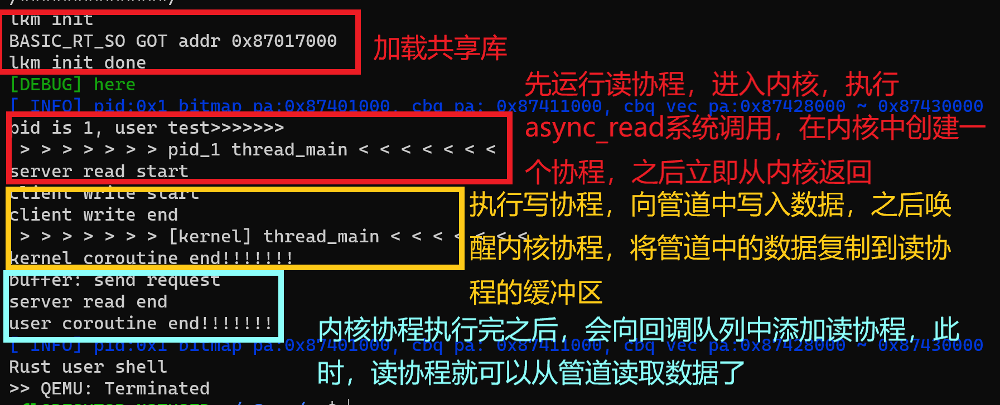
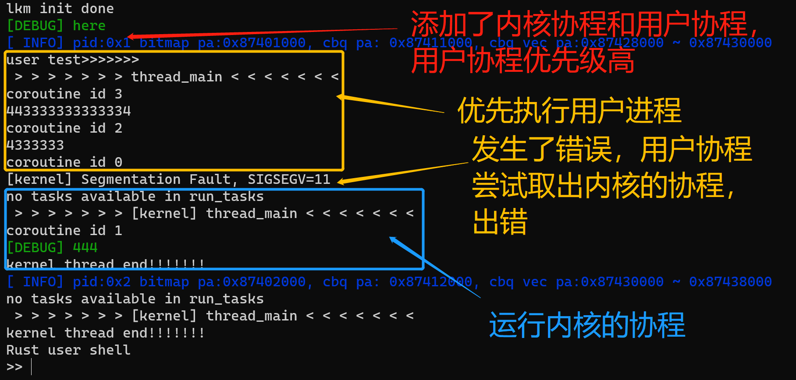
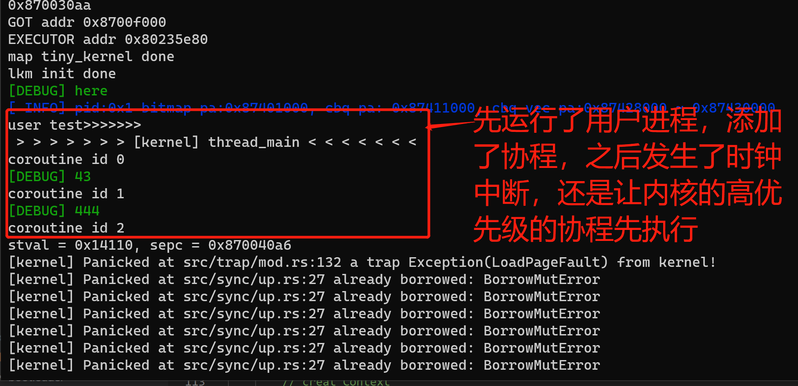
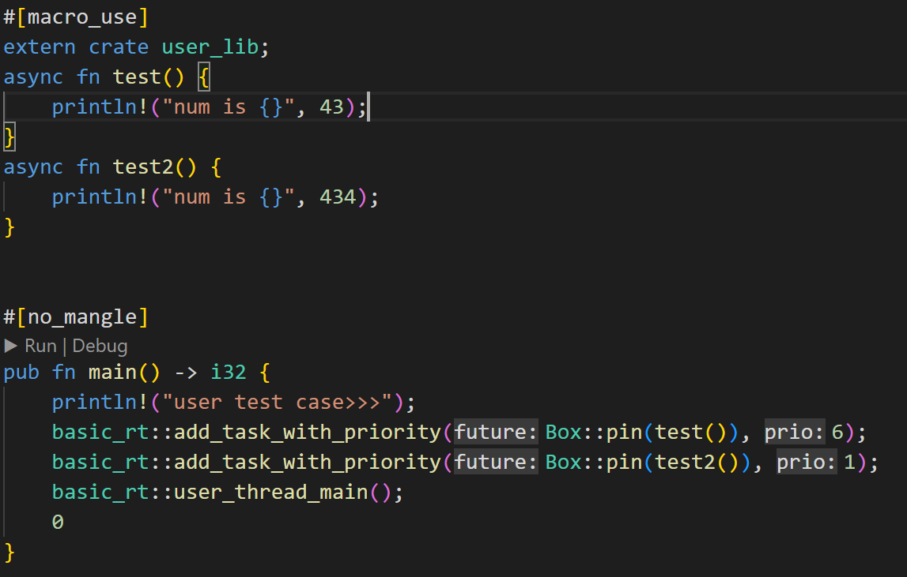
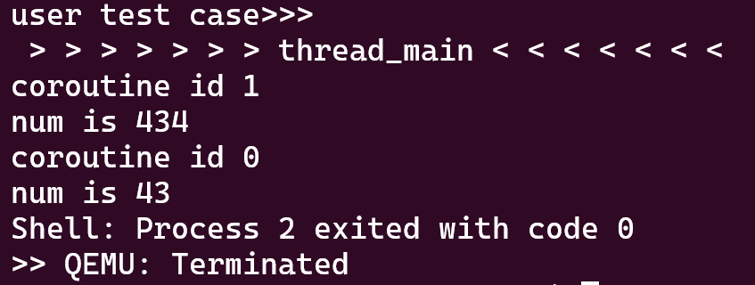

### 用于记录每天的日常

##### 20220909

- 组会
- 读完了日志文件系统实现这篇论文
- 

##### 20220908

- 参加学生成果开放周线下活动，系开学典礼
- 修改 ch5 接口，但是不知道为什么在处理 fork 系统调用时向 BTreemap 插入子进程时报错 “attempt to add with overflow”
- 阅读论文

##### 20220907

- 参加学生成果开放周线下活动

##### 20220906

- 修改 ch5 模块定义，使用 MANAGER 来管理进程
- 阅读论文

##### 20220905

- 开组会
- 调度器的代码修改完了，基本逻辑没有错误，但是因为是通过时钟中断的方式来更新位图，然后再进行调度，因此具有不确定性，在最后写的协程执行完，唤醒了创建的内核协程之后，如果这时没发生时钟中断，那用户进程的调度器因为取不出任务，因此会直接结束循环，然后内核执行刚刚唤醒的协程，这时唤醒了用户态读的协程，但是此时用户态的调度器已经结束工作了
    - 可以考虑下一步，将线程结合起来，在这里，实际上是直接根据协程的优先级来调度了，只通过一个函数调用来执行协程，可以将线程的部分添加进来


##### 20220904

- 修改共享调度器代码
    - 将 Executor 重命名为 Manager，只负责从中取出任务，以及添加任务
    - 将 BitMap 放到 TaskQueue 中；将 TaskQueue、TaskWaker 分出来
    - 在 UserTask 中添加 Waker，每个 task 都有一个 waker 对应，之前的方式就是完全脱离的，这种实现方式，使得 Manager 中不需要再添加 waker_cache，task 的推进交给自己的 execute 方法 
    - 不再单独设置回调队列，在 Manager 中设置一个 callback_queue，直接将 id 添加到这个队列中，在每次 fetch 取出任务时，会先将回调队列中的所有任务先唤醒
- 测试管道读写时，出现问题，还需要修改

##### 20220903

- 确定 ch5 的接口以及依赖的模块
- 整理周内阅读的文献
- 参与讨论异步os模块化，和杨德睿讨论了想法是否可行
- 修改共享调度器

##### 20220902

- 参加入学教育

##### 20220901

- 阅读文献
- ch5 模块化，修改 xtask 中的脚本，创建 ch5 的测试用例的 app.asm，之后再确定具体的模块

##### 20220831

- 阅读文献

- 实验测试，发现了一个问题，执行完的协程并没有删除，因此在运行另一个进程时，会报错，这应该是原来的代码的没有实现

    - | 堆大小 | 可创建的管道数 |
        | ------ | -------------- |
        | 0x8000 | 46             |
        | 0xa000 | 79             |

- 修改 bitmap，还没有完成

##### 20220830

- fork 了杨德睿的仓库，把 target 改成了 riscv64gc-unknown-none-elf
    - 目前是只有 ch1 分离出了 lab，运行 （`cargo qemu -c 1`）ch1 只会打印 rust-sbi 的信息，完成了 lab 之后运行（`cargo qemu -c 1 --lab`）会通过等级控制打印出 hello world；output 单例模式设置输出；
    - ch2 通过 xtask 里的脚本将 target/arch/debug/app.asm 里的内容添加到 env 这个（key, value）中，然后通过 global_asm!(include_str!(env!(APP_ASM))) 将任务的二进制数据直接与内核连接起来；ch2 增加了 write、exit 系统调用，`la t0, 1f` 此处的 1f 指的是后面的 label 1所标记的代码
    - ch4 的内容没有完成

##### 20220829

- 开组会、阅读学生手册

- 阅读王文智关于唤醒协程这部分的实现机制；之前的逻辑是错的，正确的逻辑应该是，写的协程结束之后，唤醒内核中将数据读到缓冲区的协程，然后再将读的协程添加到回调队列中

- 简单的异步管道读写测试通过了，测试的流程如下

    

- 这个简单的demo 目前还不够完善，~~write 协程执行完之后唤醒内核协程这个地方还需要加上动态获取内核协程 id，目前是写死的~~；~~用户态 Asyncall 这部分的参数约定还需要商榷~~

- 在 zotero 上创建一个阅读文献的组，但是发现这个软件需要花钱扩充存储空间，和廖东海讨论了一下，暂时没有什么好的软件可以共享读书笔记

- 将王文智的管道异步读写实验复现了，但是可以支持的环的长度有限，因该是我之前创建的 executor 池的原因导致可支持的协程数量减少了

##### 20220828

- 又想到了关于调度器改进的部分，当前是在内核初始化以及创建进程的时候分别对共享数据进行地址映射，和调度器 elf 文件是分离的，因此可以把 bitmap、cbq、cbq vec 等数据结构直接放到调度器整个的 elf 文件中
- 尝试把王文智读写管道的实验复现出来
    - ~~需要把系统调用改造成支持 6 个参数的系统调用，为了支持两套系统调用，规定大于 2000 的系统调用使用 6 个参数的~~
    - 对内核的 fs 模块内的 inode、pipe 等支持异步读写，创建内核协程，在 pipe 的 aread 实现的过程中，用到了共享库中的 WRMAP、cbq 以及 CUR_COROUTINE，这里还需要引进来，~~因为调度器的代码还不稳定，接口表的位置不固定，所以将共享调度器的接口封装成内核中的函数，方便使用~~
    - ~~在接口表中增加查询 WRMAP 接口，实现 async_sys_write 系统调用~~
    - 用户进程执行 async_sys_read 系统调用，接下来会执行 file.aread() 函数，创建一个内核协程，会通过这个内核协程将数据读取到缓冲区；
    - pipe 的 aread 方法中的实现逻辑：判断 pipe 的缓冲区的可读字节数是否为 0，若为 0 且 pipe 的写的端口是关闭的，则直接退出 loop 循环，否则就会向 WRMAP 中注册 (key, value)；若可读字节数不为 0，则直接读，并且退出 loop 循环，之后向回调队列中注册协程 id
    - 添加接口，向 WRMAP 中注册 (key, value) ------ (write_tid, read_tid)
    - 我觉得不用向回调队列中添加用户态的协程了，尝试运行了之后，出现了问题，先执行了 read 协程，然后就跳转去执行 write 协程，write 协程执行完之后，read 协程并没有继续执行；还是尝试向回调队列中添加用户态的 read 协程

##### 20220827

- 终于找到了 bug，创建了 executor 池之后调试发现，仍然是同一个 executor 来添加协程，可能是因为使用的 Arc 以及 vec! 来创建的，创建的仅仅是指针，实际上堆中还是只有一个 executor

    ```rust
    lazy_static!{
        pub static ref EXECUTOR: Vec<Arc<Mutex<Box<Executor>>>> = 
            vec![Arc::new(Mutex::new(Box::new(Executor::new()))); MAX_USER];
    }
    ```

    正确的写法

    ```rust
    lazy_static!{
        pub static ref EXECUTOR: Vec<Arc<Mutex<Box<Executor>>>> = 
            (0..MAX_USER).map(|_| 
                Arc::new(Mutex::new(Box::new(Executor::new())))
            ).collect::<Vec<Arc<Mutex<Box<Executor>>>>>();
    }
    ```

- 下午进行讨论会，发现杨德睿已经将地址空间给独立出来了，那么我可以在把内核地址空间映射共享数据的部分独立出来解耦合，然后再将杨德睿目前统一的进程、线程、协程的切换结合起来，那就可以把共享库给完全独立出来

##### 20220826

- 翻看了 osdi22 以及 osdi20 的目录，找了几篇感兴趣的文章
- 又开始重新看一次 rust语言教程
- 所有的进程都是使用的共享库的堆，也就是说数据结构不是分开的，那么可以类似于线程池一样，创建一个 executor 池，既然在内存中最大支持的用户进程为 16 个，那么在共享库中也可以通过这样的方式来实现，只是进程在创建协程的时候，就会需要知道自己的 pid，从而来维护对应的 executor
- 将单个 EXECUTOR 改成了使用 EXECUTOR 池，但是还是没有改变内核尝试取出用户态进程的协程这个 bug，应该是内部某个数据结构还是共用的，目前还没有找到

##### 20220825

- 共享调度器的 bitmap 优先级，最右侧的优先级是最高的，更新 global_bitmap 时也是按照这个规则，也就是 0 为最高优先级

- 我假设的内核也是一个进程，但是实际上并没有将其初始化为一个进程，但是在插入 prio_pid 时会插入 0，但是在 manager.rs fetch() 取出线程时并不是直接按照优先级来取，而是按照入队顺序来取，因此可能会取出 真正的第 0 个进程 initproc，正好 PRIO_PIDS 中有第 0 个进程的 id，所以就会跳转到 initproc 进程来执行，需要避免这种情况，还需要在 manager.rs 中增加判断逻辑，一旦 pid 为 0 且 PRIO_PIDS 中存在，那么就直接返回 None，然后在 run_task 的 loop 循环的 else 分支需要增加执行内核协程的部分

- 发生了时钟中断，先在 suspend_current_and_run_next() 之前先更新位图，然后在 run_task() 调度任务时，根据 PRIO_PIDS 来取出任务，然后执行

- 执行的结果与预期的不符合，打印更新的 global_bitmap 发现是因为 PRIO_PIDS 与实际的进程对应不上（原来 kernel — 0，test — 2，目前是 kernel — 1，test — 3），因此不能取出 PRIO_PIDS 中的优先级高的进程，因此只能顺序执行，因该是向 PRIO_PIDS 中插入 pid 时，下标计算错误，**错误原因：u_maps初始化时使用的 vec![0]，导致第 0 个元素永远都是 0，因此会导致所有的下标都会 +1**

- **又遇到了新的问题，在 run_task() 取出 initproc 进程时，因为它的 id 是 0，因此，此时会进入check_prio_pid() == true，一旦确定是要内核执行协程，则会导致返回 None，此时还需要将 initproc 进程插入到队列之中，这样才不会出错**

- 目前的结果是，一旦内核中创建了协程，尽管会有用户进程（没有协程），但是在 fetch_task 时，会优先执行内核的协程，接下来就是测试同时存在内核协程和用户协程，且用户协程的优先级更高的这种情况

- 需要解决的问题是如何在同一时刻，保证内核和用户进程都存在协程，~~首先尝试的是直接将 test.rs 测试的用户进程不用 shell 来加载，在内核中直接添加进来，然后再运行 run_task()；测试的过程中，因为先开启了时钟中断，这个时候就会直接更新位图，但是这时还没有执行 add_user_test，会导致内核的低优先级的协程先执行~~；因此需要在 lkm::init() 以及 task::add_user_test() 之后才开启中断，这个时候就能确保同时存在优先级不同的内核协程和用户协程，此时进行测试，确实是用户态的进程先执行了，但是却出现了问题，**用户协程执行器尝试取出内核的协程，导致用户进程崩溃**，目测是因为创建协程时，内核和用户进程创建的协程都是在同一个 EXECUTOR 上的；~~或者是 wakeup_all() 试图唤醒所有的协程这部分代码写错了~~

    

- 让内核协程的优先级更高，此时确实是内核限制性了，但是也会发生同样的错误，内核也会尝试取出用户协程执行，由于没有建立地址映射，所以提示 loadpagefault；

    

- EXECUTOR 可以取出其他进程的协程的 tid、task、future 等，但是取出的 future 进行 poll 推进时就会报错，理想的实现是每个进程的协程都属于各自的地址空间，也就是说每个进程都有一个 EXECUTOR，而不是共用同一个 EXECUTOR，那这样子又回到了一开始设想的地方，是否直接在每个进程的 PCB 中创建一个 EXECUTOR ？？？

    

##### 20220824

- 目前的问题就是有些共享库接口不会被编译，因此可以类似于中断实现的方式，直接写一段汇编代码来调用，实现方式：~~1. 写成一个依赖库，然后在内核中调用，这样可以将代码段映射出来，但是执行代码的过程中，有的数据是在堆上，但是堆不能直接映射到用户态的地址空间，因此这种方式不可行；~~2. 实现一个静态的 ELF 文件

- ~~在 _start() 函数中声明一个 vec，保存暴露出的接口的 usize，确确实实得到了符号的地址，也可以在符号表中查找到，证明确确实实被编译了，所以就可以大胆的使用 vdso 了，还需要解决的一个问题就是如何把这个 vec 暴露出来，使得可以内核和用户态可以直接查找到，既然可以用 vec，~~那也可以在 bss 中声明一个[usize]

- 不必使用系统调用来读取文件的符号表了，直接读取 GOT 表，或者称之为接口表？？？

- 内核协程与用户态协程统一调度

    - 统一调度发生的时机：在通过系统调用或者中断进入到内核，需要切换任务时，检查内核和用户进程的位图，然后取出最高优先级的进程，然后来执行，在manager.rs 中的 fetch() 中实现这部分
    - 更新位图的时机：在王文智的代码中，发生了始终中断，虽然有体现更新位图，但是被注释掉了，直接就运行 cpu_run 启动内核的协程执行器，此处不太明白，我觉得应该就是在取出下一个任务之前进行 update_bitmap() 即可
    - 遇到了新的问题，PRIO_PIDS 这个 BTreeSet 是在共享库中的，但是现在不确定是否在内核的堆中，内核无法得到这个数据结构，但是这个数据结构实际上就是保存最高优先级的task，因此可以直接通过一个固定长度的数组来完成对这个数据结构的改造，使得在内核中可以查找到这个数据结构，但是这个数据结构只会在内核态时才会使用，因此王文智的代码是在内核中来定义的，并且更新内核位图的代码也是在内核之中，但是这会在内核的 manager.rs 的 fetch() 函数增加一段紧耦合的代码，怎么将这部分的代码拆分开来呢？？？或者对这个 PRIO_PIDS 查询是否包含某个 pid 这个操作进行封装，我决定先采取封装这部分代码的形式，使得代码可以先跑通
    - ~~在发生时钟中断时更新 global_bitmap，在 fetch_task() 时检测优先级，取出优先级高的任务~~，目前还没有进行检验

- 设计内核协程与用户协程统一调度的实验，验证调度器是否正常工作

    - ~~首先在内核创建较低优先级的协程~~
    - ~~用户进程创建较高优先级协程之后，并不会先直接就执行，先执行一个较长的无效操作，使其能够触发时钟中断~~
    - ~~触发时钟中断之后，更新 global_bitmap，然后调度~~
    - ~~在调度的时候取出具有较高优先级协程所在的线程，然后切换线程，按照设想的，发生了时钟中断之后，原本是要切换到其他的线程，但是因为原来线程内部有较高优先级的协程，因此还是会回到原来的线程，然后继续执行协程~~


##### 20220823

- 尝试将调度器编译成动态链接库，但是报错，rust不支持编译成riscv动态链接库

    ```makefile
    cannot produce dylib for `basic_rt v0.1.0 (/home/zfl/rCore/basic_rt)` as the target `riscv64gc-unknown-none-elf` does not support these crate types
    ```

- 看南大蒋炎岩老师的课，补充一些关于链接的知识

##### 20220814

- 开始调度的部分

- 将共享内存的映射区域做了调整，并且对用户态和内核对共享内存区域的访问做了设计，使得内核和用户的访问相同，可以使用同一套代码，不用使用两个 bitmap（内核和用户创建的协程）

    - | 数据结构                            | 实际物理地址             |
        | ----------------------------------- | ------------------------ |
        | global bitmap                       | 0x874a0000 ~ 0x874a0fff  |
        | global cbq                          | 0x874a1000 ~ 0x874a1fff  |
        | global cbq vec                      | 0x874a2000 ~ 0x874a9fff  |
        | bitmap（kernel and user, total 16） | 0x87400000 ~ 0x8740ffff  |
        | cbq                                 | 0x87410000 ~ 0x8741ffff  |
        | cbq vec[0]                          | 0x87420000 ~ 0x87427ffff |
        | ......                              | ......                   |
        | cbq vec[15]                         | 0x87498000 ~ 0x874a0000  |

    - 访问 bitmap 使用的虚拟地址

        | 数据结构      | 虚拟地址    |
        | ------------- | ----------- |
        | BITMAP        | 0x8740_0000 |
        | cbq           | 0x8741_0000 |
        | cbq vec       | 0x8742_0000 |
        | global bitmap | 0x8743_0000 |

- 原有的代码已经支持内核以及用户进程协程优先级的调度，进行了测试，结果如下

    

    

- 将共享调度器的内核部分重构

##### 20220813

- 感觉之前进入了误区，觉得所有的代码应该是同一份，实际上应该是内核和用户态可以使用不同的代码，只是对同一个内存区域进行读写数据，然后将这个内存区域共享到内核和用户态中即可，这样用户态就可以通过函数调用访问共享区域的数据

- 内核和用户态两套代码，都定义在 basic_rt 中

    |          | 内核                                                         | 用户态                                                       |
    | -------- | ------------------------------------------------------------ | ------------------------------------------------------------ |
    | bitmap   | 对 0x87412000 处的内核 bitmap 进行操作，update_kernel_bitmap 更新系统位图（内核位图 \|= 所有的用户位图）时，会对内核中进程的优先级顺序进行调整 | update_user_bitmap 仅仅对各自的用户位图进行更新；check_bitmap_should_yield 检查内核与自己的优先级，如果内核的优先级高，则会让出 cou |
    | cbq      | 对系统的 cbq 进行操作                                        | 对各自的 cbq 操作                                            |
    | executor | 对协程进行管理，除此之外，还通过 WRMAP 来管理读写的协程      | 对协程进行管理                                               |

- 对于内核协程与用户协程的区分，实际上都是协程，并没有什么区别，区别只有在优先级上面，内核协程的优先级为 0，用户协程为其他的优先级，在目前看来，从文件系统读取 elf 加载共享库，完全可以用这种依赖来实现，只是需要对内核和用户地址空间建立映射，两套代码，同一块空间来管理优先级

- 内核协程与用户协程统一调度？？？目前内核和用户的协程分别在各自的 executor 中管理，但是所有的协程的 tid 都是在共享内存的区域之中，因此统一调度应该是可以的

##### 20220812

- 把之前的改动都恢复了，因为内核和用户进程使用的两套代码，但是都是对物理内存进行操作，实在是难以用 VDSO 的形式改动，一开始的想法是在自己的 rCore 上复现，奈何过程太复杂，又向尝试在学长代码的基础上进行更改，用 VDSO 形式来实现，但是工程量较大，倒还不如在自己的代码上复现，并且按照向老师说的构建出一个独立的 crate 出来
- 先构建一个 demo crate，然后看能不能将其编译在一个指定的位置，可以在 os 中引入外部的依赖库中的函数，在内核中重新定义一个内核的函数接口，并且指定编译的位置，之后便可以通过符号表来得到对应的函数位置，因此就可以将第三方库如 trampoline 一般加载进入内核以及用户态
- 将共享库中的每个函数在内核当中封装一次，然后指定编译的位置，这样类似于 trampoline 

##### 20220810

- 按照昨天的想法，把 bitmap 以及 cbq 解耦合，但是貌似想的太简单了，还是老老实实按照现有的实现复现出来吧
- 在我的代码的内核以及进程中把 cbq 以及 bitmap 的映射建立好
- 将调度器的接口设置好，就是通过一次系统调用来查询所有的接口，rust 编译器会自动优化掉那些没有被调用的接口，还没有找到正确的解决方案，只能通过设置 flag，在 _start() 函数中调用一次接口，来确保可以在符号表中找到接口的地址
- 在代码中增加支持 6 个参数的系统调用，并且添加异步系统调用

##### 20220809

- 继承学长代码，遇到了问题，编译出来之后，不能在符号表中找到对应的函数
    - 与陈志扬交流了一下，原来是因为被编译器内联展开了，所以找不到，但是还是需要调用一次，才可以在符号表中找到对应的函数，应该是没有调用的函数，编译器直接没有编译
- 在网上查找了 linux O(1) 调度算法，直接参考这个资料来对 cbq 以及 bitmap 进行修改，带来了一些问题，但是可以接受，如果成功了，对于整个共享调度器的实现以及模块化将会是一个重大的进展，目前的实现浪费了许多的空间，并且代码是高度耦合的


##### 20220808

- 组会

##### 20220718

- 尝试将 basic_rt 模块以 VSDO 接口提供给用户态进程

##### 20220715 ~ 20220717

- 继续对学长代码进行解读

##### 20220714

- 处理其他的事情，没有学习

##### 20220713

- 开始在rCore实验第八章的基础上，把学长的代码添加进来，这样子更加深入学习

##### 20220712

- 上午组会
- 下午、晚上因为某些事情心态爆炸了，没有学习

##### 20220711

- 上午在 rCore 中尝试了内核协程，但是只是类似函数调用，并没有建立协程与线程的关系
- 下午和晚上看学长的代码，然后进行了思考，跟学长交流了一下

##### 20220710

- 上午把老师提供的资料看完
- 下午在 std 环境下来尝试 async、await

##### 20220709

- 上午走亲戚
- 下午看资料，对状态机转换有了进一步的了解
- 晚上看资料

##### 20220708

- 看老师给的资料，加深昨天讨论的理解

##### 20220707

- 上午开会讨论
- 下午完成 lab5，之前是写的 eventfd，没有写银行家算法，因此多花了点时间
- 晚上休息

##### 20220706

- 上午完成训练营实验 lab1、lab2
- 下午完成 lab3、lab4
- 晚上运行 lab5，进入 user_shell 后出现乱码

##### 20220705

- 上午组会
- 下午去转移组织关系
- 晚上熟悉 github classroom

##### 20220704

- 看学长的代码，整理学长代码思路

##### 20220703

- 装了ubuntu 系统，总是找不到网卡，重装了 windows 和 wsl，恢复之前的环境
- 第九章做了很多尝试，但是在 wsl 还是没有显示出界面

##### 20220702

- 完成第九章的实验并更新笔记

##### 20220701

- 开始调研，学习了怎么使用工具（DBLP、connectede paper、stork 文献鸟）
- 参考他人代码，写贪吃蛇

##### 20220630

- 尝试 rCore 第九章的实验

##### 20220629

- rCore 第九章的调试
- 尝试 rCore 第九章的实验

##### 20220628

- 组会

##### 20220627

- 学习 `rust` 异步
- 了解学长的代码内容

##### 20220626

- 整理实验报告
- 学习 `rust`  异步

##### 20220625

- 处理调档的事情

##### 20220624

- 处理调档的事情

##### 20220623

- 完成了第九章

##### 20220622

- 完成了第八章