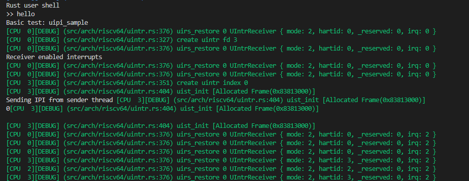
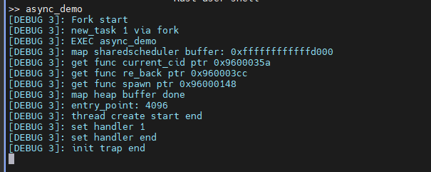
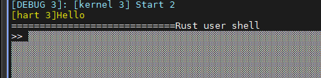
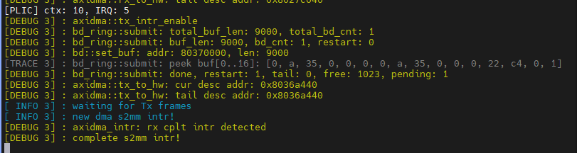
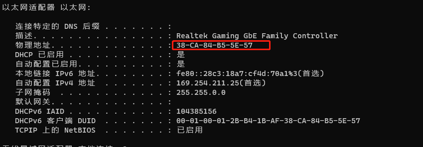

### 用于记录每天的日常

高优先级：
- [ ] 实现 RISC-V CPU


##### 20230911

- 修改论文
- 整理共享调度器上的一些概念性的思路


##### 20230910

- 写 DMA 驱动，在创建 DMA 时，直接创建 pin 住缓冲区，并将所有权转移给 DMA，DMA 重复使用这个缓冲区，不再申请其他的空间，从而避免内存泄漏，目前可以正常工作，目前可以持续的发送和接收
- 调试网络协议栈
    - 能够收到 NBNS 协议包，关闭 NetBIOS 之后，kernel 没有收到对应的包
    - PC 发出 TCP 包之后，kernel 这边没有收到对应的包，可能是 windows 的设置，也可能是 eth 的设置，打开 windows 的简单 TCPIP 服务之后，发出的 TCP 包仍然没有接收到，TCP 包中的目的 mac 地址和 IP 地址是正确的
    - 可能是因为 eth 的设置，导致只能接收到广播的包？？？打开 eth 的 PROMISC 选项后，收到了 TCP 包，并且解析正确，但是默认情况下，为什么不能接收发给自己的包？？？可能是没有开启直接连接模式，因此不能收到发给自己的包，查看手册，发现网卡初始化时，需要设置 mac 地址，这样才可以接收到发给自己的包，之前没有设置，所以不能收到
    - 目前开启 tcp 的测例监听端口号之后，因为 kernel 的逻辑，没有及时处理中断，导致 TCP 连接超时
    - 每次与中断相关的打印信息，都需要按键才能够进行，如果不进行则一直卡住，似乎是因为在内核中没有进行中断处理，必须要通过按键返回到用户态之后，才能触发中断，因此当测例阻塞在内核态时，不能处理中断，rCOre-tutorial-v3 中 UserEnvCall 中设置了 sstatus sie，允许内核发生中断，而 tCore 则没有进行处理
    - 进入内核打开 supervisor 中断，返回用户态关闭 supervisor 中断，增加内核中断返回的汇编代码，在内核中能够正确处理时钟中断和 DMA 发送的外部中断，成功建立 tcp 连接，完成测例，但没有对读取的数据进行验证
    - 在读取 socket 文件时，出现问题，产生缺页错误，copy_from_slice 函数没有设置长度，并且唤醒时，没有改变 task 的状态，因此不能被调度到
- 成功读取到 PC 发送的数据，并且 kernel 其他的功能正常，但是在 PC 端强制关闭发送程序时，产生了大量 RST 包，导致开发板上 DMA 产生了接收错误中断，并且代码没有针对这部分进行处理，导致死机，总体上能够正常工作
- 使用用户态中断唤醒协程还需要进行设计，尤其是在内核直接向用户进程发中断


##### 20230909

- 阅读 dma 手册和  [Rust 嵌入式魔法书 - DMA](https://docs.rust-embedded.org/embedonomicon/dma.html)
- 写 DMA 驱动
    - 目前 block descriptor 描述符中对 buf 的处理仅仅当作数组进行处理，并没有涉及所有权的内容


##### 20230908

- 查找 axi_dma 收包问题
    - axi_dma 每次收到一个包之后，重新提交新的 buf，并且需要注意写法，避免死锁，目前可以收到
    - 收到 PC 的 arp 包，并且进行回复，但下一次仍然收到了 arp 包，修改中断处理的逻辑，只针对需要回复的 arp 进行回复
    - 但下一次直接产生了内核缺页异常，反汇编出来产生错误的地址在 buddy_system_alloc 中，可能是因为网络包缓冲区大小并没有对齐
    - 可能是因为 pin 住的缓冲区没有被释放，接收和发送时，一直在添加新的 buf，内存不安全
- 阅读 YYY dma 开发日志和  [Rust 嵌入式魔法书 - DMA](https://docs.rust-embedded.org/embedonomicon/dma.html)
    - 目前 DMA 接收和发送中断处理函数中没有对缓冲区和描述符进行回收


##### 20230907

- 调试网络协议栈
    - 发送正常，可以连续发送多次包
    - 接收时，可以收到来自 pc 的 arp 包，并且回复给 PC，但是收到一次之后，就不能再收到其他的包了，dma 和网络中断处理函数的逻辑互相纠缠，并且接收包不能像发送时直接提交接收缓冲区，还需要研究 dma 的工作原理


##### 20230906

- plic 初始化，打开外部中断，添加 plic、dma 和 eth MMIO 地址映射
- 增加与网络相关的系统调用以及网络协议栈
    - 创建套接字之后，放到当前任务的文件描述符中


##### 20230905

- 组会
- 上板子跑 uintr 测试，执行 shell 时出现问题
    - trap_frame 所在的页没有添加 AD 权限，因此不能访问
    - do_exec 时需要加上 AD 权限，tCore 中涉及权限的地方比较松散，并没有像 rCore 那样比较集中
    - 修改 uintr mmio 地址之后，uipi_sample 通过测试


##### 20230904

- 直接使用 clone 创建子进程，在用户态传入 SIGCHLD 参数
- uintr_register_receiver 时出错，提示已经注册过，在 clone 时对其进行了初始化
- 线程 uipi_send 触发了异常，非法指令，ipc_bench 与 tcore 中 uipi 指令 func3 字段不一致
- 发送方 uipi_sender 之后，能够看到 irq，但是没有跳转到中断处理函数，可能是没有触发中断
- test_uintr 发送完毕之后，同样看不到接收，但是继续执行后，sbi 报错未处理中断，并且在 qemu 的日志中可以看到 u_software 的中断信息
- 看论文
- 需要使用修改过的 opensbi，在 M 态进行中断委托
- 编译器把 while 循环优化成死循环，所以没有结束


##### 20230903

- 修改内核里进程和协程的调度
- 增加全局位图的更新方式
- posix 创建线程还不太熟悉
- 使用 uintr 处理用户态中断
    - 用户态的 trap 和相关库函数需要自己实现


##### 20230902

- 修改共享调度器设计，简化设计，用原子操作避免锁的情况


##### 20230901

- 修改 rCoreN
    - getchar 得到 0 或 255，yield 时出现错误，跳转到未知的地址，产生异常，改成直接将结果返回到用户态，在用户态进行判断之后，没有出现对应的问题
    - 判断 sig 是否合法时，存在问题
    - 在 wait 时也调用了 do_yield，这里和 getchar 存在相同的问题
    - 只开一个核后正常工作了，应该是多核没有处理好
        - do_yield 时，先把 task 添加到就绪队列中了，这时其他的硬件线程可以取出 task，但是此时的上下文不正确，其他的硬件线程必须等完全切换完毕之后才可以取出对应的 task
        - 在 do_yield 时不把 cpu 当前的 task 取出来，在 idle 的循环时，才进行处理
    - 终于可以正常工作了，接下来是重新设计共享调度器的代码逻辑


##### 20230831

- 修改 rCoreN
    - 堆无法正常使用，查看汇编代码，跳转到 exchange_malloc 函数后陷入内核
    - 以为是工具链的问题，换了工具链，结果不能识别汇编中与用户态中断相关的寄存器和指令
    - 更换工具链之后，没有出现 exchange_malloc 
    - 分配协程 ID 时，使用 static AtomicUsize 进行分配，会出现页错误，可能是解析 elf 时没有添加对应的段
        - lkm 加载模块时，elf 段的结束地址没有向上取整
    - 打印出 shell 的提示符后，出现页错误
        - getchar 在内核  read 时出现错误
        - read 读出来 255，在 do_yield 时出现错误


##### 20230830

- 修改 rCoreN，直接进行大幅度修改
    - 用户态中断以进程为单位进行收发，目前的 rCoreN 不太好进行更改，直接在 TKF 的 tCore 上进行
- 开会讨论


##### 20230829

- 感冒，休息


##### 20230828

- 组会
- uintr spec 看起来有点迷，阅读 TKF 毕业论文
- 阅读 tCore 代码
- 修改后的 rCoreN 可以在 TKF 改过的 qemu 中进行测试，但是运行时出现了问题，qemu 直接被杀死了，与执行 poll_future 函数相关，暂时先不处理，直接在开发板上测试
- 根据 tCore/src/arch/riscv64/uintr.rs，在 rCoreN device 中增加用 UINTC 相关的设备驱动和数据结构


##### 20230827

- 阅读 TKF UINTC 设计


##### 20230826

- 单核执行 async_demo 时，在内核完成 sys_init_user_trap 系统调用后卡住，没有回到用户态，注释掉整段 init_user_trap 处理函数仍然是无法返回，开启多核之后能够执行协程，但是需要唤醒的时候卡住了，可能与 uintc 的改动相关 

- 阅读 x86 用户态中断设计


##### 20230825

- 用 ila 抓 wb_reg_pc，在写了 satp 寄存器，执行 sfence.vma 之后，又重新执行了 0x80200000（准确的是 csrw satp, a0 之后，执行了下一条指令就回到 0x80200000 执行），应该与 rocket 的缓存相关

    

- TKF 猜测可能是一直触发指令缺页异常，然后trap vector恰好是设置为这个地址了，读取 stvec 确实是 0x80200000
    - 为什么会触发指令异常，所有的内核代码的地址映射的权限可能出现问题了？？？在板子上还需要加 A/D 权限，之前忘记加了
- 加上权限之后，能够正常的进入 shell，但是一直输出一些灰白的东西
    - 修改串口时，没有错误处理
- 启动时，没有唤醒其他的核，使用 sbi_rt 中 hart_start 函数唤醒
- 执行 async_demo 时，在 push_trap_record 之后卡住了，打印调度过程

    - 能够提升需要唤醒的用户进程的优先级，但是不知道为什么，取不出来对应的 task_control_block（实际上是取出来了，下文提到的）
    - 没有用户态中断的测例能够运行，中断处理的线程唤醒了，但是一直在循环，在中断处理的函数入口打印不出东西，因此，推测是用户态中断没有正常工作，需要向 YYY 确认用户态软件中断是否正常工作
    - 现在的硬件应该可以触发软件中断，需要进一步检查问题


##### 20230824

- dma s2mm 的中断处理逻辑与 virtio 的有点区别，这里在 dma 初始化时，直接提交 rx_frame
- 编译后在 axu15eg 上运行不起来
    - 在 entry.asm 中直接使用 ecall 指令，能够打印出字符，说明进入了 entry，justfile 里设置的日志等级不对，导致没有输出
- 开启分页机制后，不能打印输出，在 sfence.vma 指令后直接使用 ecall，并且在 sbi 中增加输出，不能进入 sbi，像是 pc 飞了
- 没有想到其他的办法，也许只能用 ila 来抓 pc 了
    - 抓 rocket 的 io_imem_resp_bits_pc，设置触发条件为 >= 0x80200000 没有触发
    - 抓 wb_reg_pc


##### 20230823

- 对比 dma 的设置，采用了手册里的默认设置
- 在 ila 中可以观察到 araddr 从 0x8037000 ~ 0x80371200 之间，远达不到 example 中设置的 9000，不使用巨型帧，帧长度设置为 1518 之后，能够正常产生 mm2s 中断
    - 这里只是 dma 提交 buffer 出现的问题，还没有涉及到 eth，所以暂时还不清楚具体原因
- wireshark 抓包能够抓取发送过来的数据，收发正常
- 移植到 rCoreN 中
    - 添加 dma 和 eth 的依赖，device 中增加 dma 和 eth，并且进行初始化


##### 20230822

- 向 PC 发送数据包无法触发 mm2s 中断，fpga 第一次启动时，能够出现 eth interrupt 中断，打印出中断状态信息，发现第 0 位的 HardAcsCmplt 为 0，对比出现 interrupt 前后的中断状态寄存器信息，是出现了 RxMemOvr，但是之后一直中断处理函数中循环，打印出 irq_masked，因该是没有对收到的帧进行处理，所以一直出现 RxMemOvr 中断

    

- 关闭 eth 的接收功能，没有出现任何现象，不能产生 mm2s 中断

- 修改了 eth 初始化函数，不直接启动以太网，并且 dma 提交了 rx ring 之后再启动，可以看到先 eth 产生了 RxCplt 中断，之后 dma 产生 s2mm 中断，顺序符合逻辑，但是还是没有 mm2s 中断产生

- 阅读 axidma 手册，在 tx_to_hw 之后，打印出 control 和 status 寄存器的信息，是正确的，但是一直无法产生 mm2s 中断

- 用 ila 抓 M_AXI_MM2S 上的数据，抓不出来，vivado 里的实现应该没有问题


##### 20230821

- 在第一次启动时出现了 ethernet 的 interrupt 中断，之后的每次启动只出现 dma 的 s2mm 中断，好像上一次启动的的状态影响到了下一次，外设 reset 似乎存在问题
- 重新写的裸机环境有问题，直接在 rv-csr-test 上进行修改，再来测试
- 在 example 中应该先初始化 dma，再初始化 ethernet（参考 lwip 里初始化的先后顺序），这里能够检测到 s2mm 中断，并且对应的 rx_cplt 标志位是正确的
    - example 的逻辑还是存在问题，在等待 tx_frame 时仍然陷入死循环，可能是 local_loop_back 的问题
    - dma 只打开 rx 的中断，设置 rx ring，不管有没有进入 local_loopback，都能收到一个广播的包，这个是 windows 网卡的 mac 地址，也就是说，现在能够收到来自 windows 上的网络包，通过 wireshark 抓包，可以看到对应的 DHCP 请求
    - dma 只使能 tx 的中断，设置 tx ring 向外发送帧，不使用 local_loopback，偶然情况下，等待几分钟后出现 interrupt 中断
- 手册里的 TEMAC 的中断寄存器的地址与 Xilinx 官方的裸机驱动仓库不一致
- 阅读 axiethernet 手册和 tri-mode-eth-mac 手册，都没有提到 programming sequence
- 阅读 axidma 手册


##### 20230820

- 修改论文，画图
- 阅读 axi-ethernet 手册


##### 20230819

- 修改论文，讨论 background & motivation、 design 部分
- 阅读 axi-ethernet 手册


##### 20230818

- 修改论文 design 部分，画图


##### 20230817

- 写 local_loopback 函数

- axi_dma_example 中在 axi_ethernet 初始化设置好 link_speed 之后，出现1次或者2次 s2mm 中断，不明白为什么

    - submit 时， restart 为 1，pending 为 1

    - 卡在 wait tx frames 这里

        

    - 阅读 axi-dma 手册
    - 可能的问题在 plic 的中断处理函数部分，中断屏蔽码设置错误，与 xxv 不同，以太网也会发出中断
    
        - 修改中断处理部分的屏蔽码之后，能够收到 s2mm 中断 
        - 可能是裸机环境下，栈等设置出现问题

- 修改论文，design 部分开头以及协程控制块


##### 20230816

- 裸机环境下
    - 多核启动正常，串口输出在唤醒其他核时存在乱码
    - plic 设置1~6 中断源优先级为最低，每个核不能触发 M 态中断，S 态核 U 态中断任意优先级可以触发
- 写裸机环境网络驱动
    - 网卡初始化时，reset 时出现
        - 使用 linux-riscv 镜像测试，发现直接不能 ping 通，最后发现是因为两个网络适配器设置成了同一网段
        - 但是在初始化时，不需要ping，因此问题不在这里
    - 把 reset 函数中的 loop 那段函数注释掉，继续运行
    - 网卡寄存器读出来的数据全是 0xffff
        - 将 phy_addr 设置成正确的地址之后，能够正确的获取速度
        - 网卡应该是正常工作了


##### 20230814

- 组会


##### 20230804

- 参考 YYY 的以太网实现，写裸机驱动测例
- 修改文章


##### 20230803

- 写 phy 芯片驱动


##### 20230802

- 查看 axi-ethernet Linux 驱动源码，以及 Alinx 官方对 lwip 的修改，也许可以根据 lwip 写裸机环境的 phy 芯片驱动
- 修改文章，试图寻找共享调度器代码在系统中的位置


##### 20230801

- 写 axi-ethernet 以太网驱动，原始仓库中的 sleep 以及 poll_timeout 函数目前使用忙等实现


##### 20230731

- 根据 svd 生成的寄存器访问函数写以太网驱动


##### 20230730

- 在 zcu102 上跑 rCoreN
    - rCoreN 没有跑起来，开始以为是和之前一样的问题，但是突然想起来，rCoreN 里进行初始化的核锁死在了 0 号核，修改了初始化的方式之后，能够看到打印输出
    - 先把比特流给刷新一下，但是打开 vivado hardware manager 之后，不能连接开发板，还是直接用 axu15eg 完成实验吧，裂开
    - 把 axi-ethernet svd 写好


##### 20230729

- 写完 axi-ethernet 电子手册
- 修改论文
    - 修改图片
- 调试以太网和 dma 驱动
    - 对比 YYY 的仓库和我写的驱动，其中增加了 local_loopback 以及 gt_reset 相关函数
    - 先在 zcu102 上完成实验数据测试，之后在 axu15eg 上调试驱动，除了 axi-ethernet 驱动还涉及 phy 芯片的驱动
- 讨论论文
    - 把协程引入内核，支撑点：内核协程、用户态的协程被感知；协程控制块在文章中描述；协程控制块的 id、优先级、闭包，与堆栈、地址空间的关联；编译器控制的协程状态如何让内核感知
    - 给协程定义优先级属性，用户和内核采用协调一致的调度算法
    - 异步系统调用，ecall 与协程的状态修改的顺序，目前的结果还不完善，文章中不过于强调
    - 在结论中详细描述数据
    - 引言中存在的工作优缺点，没有进行相关的对比，详细描述长处和短处
    - 引言：库的形式还是内核的机制，通过 vDSO 将用户级线程（协程）和内核级线程，接口通过 vDSO，go 协程的栈空间优化在这里的问题，把语言、用户库、操作系统三者统一起来了，这是最大的意义（与协程引入内核相呼应）
    - 相关工作：第一部分rust异步状态机与 design 状态图联系起来
    - design：三个特点与工作的意义
    - 强调共享调度器与跳板的关系，sc 与跳板的关系
    - 协程与线程状态模型里，应该与线程的状态没什么关系，用 vcpu，状态图重新画
    - 共享调度器与图灵机模型
    - 线程创建与进程中主协程的创建绑定，线程退出与最后一个协程结束绑定
- 移植 rCore-N
    - 刷新比特流，将 PS、PL 串口连接起来
    - 修改 rCore-N fs 内的 stdio 输入输出改成用 sbi 提供的接口即可
    - 先在 axu15eg 上运行其他的测例


##### 20230728

- 先测试一下以太网的速度，板子上能够 ping 通，但是 iperf 客户端不能连接 wsl 里的服务端，估计是与使用 wsl 相关，因此只能将板子设为服务端，wsl 设为客户端进行测试
    - 只开一个线程：24Mbits/s
    - 两个线程：11.5Mbits/s、11.2Mbits/s，反向的速度类似
    - 没有记录 CPU 使用情况，并且线速为 100M
    
- 裸机环境下串口输出
    - 串口设备驱动，还是先用 opensbi 的串口吧，串口设备这一块还不太熟悉
    - 将裸机环境编译到 opensbi 内，没有看到输出，在 qemu 内没有看到输出，等了一段时间之后能够看到打印输出，但在真板子上还是无法看到
    - 在 entry.asm 中手动调用 ecall，在 qemu 中能够看到字符输出，在真板子上没有
    - 在opensbi 的 sbi_ecall.c 文件的 ecall_handler 函数中增加打印输出，在 entry.asm 中直接 ecall，并没有看到打印的内容，因此怀疑是没有跳转到指定位置
    - sbi_hart.c 中通过 mret 函数返回到指定的地址，在之前增加打印，能够看到输出，可能是链接 fw_payload 时出现了问题，将 fw_payload.elf 反汇编看到 .payload 段为 elf 格式的 magic 而不是裸机环境代码，因此用 objcopy 生成二级制代码，因此问题解决
    
- 写 axi_ethernet 以太网驱动
    - 无意中找到 csv 格式的 axi 以太网的寄存器手册
    - 看产品手册，如果想要尽快测试实验的话，可以不与 dma 模块连接起来，直接使用 AXI4-Stream Data FIFO 来完成实验数据的测试
    - 使用 windows 下的 XML Notepad 编辑，写到一半，因为操作错误，软件崩了，导致没有保存

    


##### 20230727

- 组会，学期总结
- 阅读 opensbi 的代码，学习如何修改
    - 移植 tmux，为多串口做准备，将 zcu102 上的 /usr/lib/locale 文件夹复制到 axu15eg 上，成功运行了之前静态编译的 tmux，分屏之后无法切换窗口，问题在于切换 pane（ctrl+b o） 和 window（ctrl+b n,p）
    - pmp 的区域应该是全打开了，预估不需要进行修改
    - 创建裸机环境，没有操作系统，用于调试设备驱动


##### 20230726

- 开会讨论
    - 优先移植 rCore-N，完成实验
    - 放平心态 debug
    - 跑通 Alinx 官方的例子
- 再按照官方例子跑一遍，忽略时序违例
    - 使用 333M ref_clk ，仍然是无法正常工作，不能输出结果
    - 使用 200M ref_clk，与上述相同
    - 观察到速度比较奇怪，仔细对比了 PL 和 PS 侧两端的 lwip 修改，发现教程的获取速度的函数没有返回
- 将官方测例移植到 rocket 上
    - 按照之前的方式连接好后，启动时没有设备初始化的操作，尽管 xxv 的驱动代码的 compatible 内有 “xlnx,axi-ethernet-1.00.a”，但是并不会匹配到总线上的设备
    - 切换回没有修改过以太网驱动的 linux commit，这次初始化时能够看到网卡初始化，但始终出现 
    - 对比了 linux-xlnx 的 __axienet_device_reset 函数，发现两者之间代码差距较大，移植 linux-xlnx 的驱动到 TKF 改过的 linux 中
        - netif_napi_add 函数最后需要多加一个 NAPI_POLL_WEIGHT 参数
        - 报错
        - 设备树中增加 phy-handle 属性之后，初始化时没有报错，但是在之后报错
        - 将 phy 设备树节点添加到 mdio 节点之后，报错
        - 根据这个帖子 [(24条消息) [linux kernel\] 内核下ksz9031驱动调试踩过的坑_mdio device at address 1 is missing_weixin_43771853的博客-CSDN博客](https://blog.csdn.net/weixin_43771853/article/details/115482565) 的信息，在内核 menuconfig 中把 Micrel PHY 驱动勾选上，之后仍然出现上述报错，在依次修改了设备树中 phy 节点的 reg 信息为 7， 0 之后，终于能正确的启动网卡
    - PC 和 rocket 相互之间 ping 通，并且能够通过 nc 发送消息
- 写学期总结


##### 20230725

- 暂时先不管这个时序问题了，先把 ysyx 以及 rCore-N 移植做完
- 做 ysyx，pa2 的 fact、mersenne、matrix-mul、mul-longlong 还不能通过，找 bug，之前写的 sltiu 指令解析存在错误，改成正确的之后，导致 div 以及其他的测例不能通过
- 寻求其他人的帮助，吴老师说时序应该不影响，问题在于其他地方
    - 仔细对比了用户手册的管脚，没有出现问题
- 与 yyy 讨论，关于 xxv 以太网驱动
    - 画板子，接时钟芯片
    - fmc 转 sfp 扩展板上可能有时钟
    - hack clock wizard（已经尝试过）
    - 物理 hack，跳线，可能导致信号质量爆炸


##### 20230724

- 先创建新的工程，将 ip 连接到 PS 侧，之后生成设备树，根据这个设备树，内核在初始化时，仍然无法匹配到，问题应该还是在 fpga 内部的实现
- 删除 ethernet 和 dma 模块，重新连接，生成比特流时出现错误
- 根据官方的以太网例子，在生成比特流时报了同样的错误，并且 lwip echo server 不能工作
- 阅读 AXI 1G/2.5G Ethernet IP 核手册，根据第 48 页，ref_clk 管脚在 7 系列的板子上使用 200M 的时钟，在 UltraScale+ 上需要使用 300-1300M 的时钟，上面频率不匹配的 critical warning 解决了，但仍然报告 design failed，“failed to meet the timeing requirements”，lwip echo server 仍然不能正常工作，直接使用官方提供的例子的 xsa 创建 vitis 项目也不行
- 打开 edit time constraints，根据报错信息，在 xdc 约束文件中设置对应管脚的 delay 信息，还是存在 setup 时序违例，不知道怎么 debug
- 根据手册 139 也设置 REFCLK_FREQUENCY 属性为 333.333M 仍然出现报错，这个时序问题暂时无法解决


##### 20230723

- 讨论：使用千兆以太网的接口，因此只能使用 AXI 1G/2.5G Ethernet IP 核
- 看了 Alinx 提供的例子的连接方式，要在 vitis 上进行测试，需要进行修改的部分较多，既然 petalinux 能够使用网口正常工作，那么 xilinx-linux 一定提供了相应的驱动，因此可以先不跑一遍官方例子，先进行连线
- rocket 使用 AXI 1G/2.5G Ethernet IP 核
    - 去掉了无用的 axi_gpio，增加 dma 和 ethernet，其 slave 接口连接到 rocket_mmio 模块，dma 的 master 接口连接到 AXI SmartConnect 模块，最终 AXI SmartConnect 的输出导出成外部接口连接在 rocker 的 l2 前端总线上
    - ethernet 和 dma 共有 4 个终端信号，连接到 ext_intrs 信号上
    - 在约束文件中绑定管脚，综合成功，但是关于 mdio 的连接方式出现问题，soc 里导出的 mdio 的三个输出管脚需要在 system_wrapper 中使用 IOBUF 转换成 inout 的管脚，成功生成了比特流，刷到板子上能够检测到设备以及驱动，但驱动不匹配，报错 "XXV MAC block lock not complete! Cross-check the MAC ref clock configuration"，但是能识别出设备，能够启动 lo 和 eth0，可以 ping 自己，但是不能 ping PC，PC ping 开发板会提示 "icmp_seq=3 Destination Host Unreachable"
    - 对比了 linux-xlnx 以及目前使用的网卡驱动，问题应该不在网卡驱动，在于设备树
    - [linux-xlnx/Documentation/devicetree/bindings/net/xilinx_axienet.txt at master · Xilinx/linux-xlnx (github.com)](https://github.com/Xilinx/linux-xlnx/blob/master/Documentation/devicetree/bindings/net/xilinx_axienet.txt)以及[Linux AXI Ethernet driver - Xilinx Wiki - Confluence (atlassian.net)](https://xilinx-wiki.atlassian.net/wiki/spaces/A/pages/18842485/Linux+AXI+Ethernet+driver)记录了设备树的写法，对比这部分内容修改 rocket 的设备树
    - 修改设备树之后，没有进行设备初始化，总线上没有检测到设备？？？


##### 20230722

- 启动时能看到网络相关的协议栈的信息的初始化，但是 reset 网卡时报错时钟问题
- WSL 每次启动会动态分配虚拟网卡地址，导致 license 不可用，修改了网卡之后，license 合法了，但是综合时出现未知的错误
    - 在[2023 WSL2 固定 mac 地址 - 哔哩哔哩 (bilibili.com)](https://www.bilibili.com/read/cv25182401)找到了一个方案，添加了一个固定 mac 地址的网卡，使得 license 合法，并且 wsl 能够联网，解决了许可证的问题，时钟的问题还需要进一步考虑
- 仿照 Alinx 的 GTH 高速收发器的约束文件绑定管脚，能够生成比特流，但是进入系统后网卡重置时提示时钟出错
- 使用 utility buffer 将输出的两个端口绑定到空闲的 LVDS 管脚上，仍然失败，utility buffer 的输出不能驱动这两个管脚，与直接手动生成差分时钟错误相同
- 管脚绑定到 200M 差分时钟，在 impl 时提示没有绑定合法位置，看到回答，GT 参考时钟需要放到专门的管脚上
- 可能的方案：
    - 修改当前的 IP 核的选项，将 GT subcore 不包括进去，另外进行处理
    - 另外使用时钟板提供时钟
    - 换成 AXI 1G/2.5G IP 核
- GTH 高速收发器可以是因为底板上有 125MHz 的差分晶振


##### 20230721

- vivado 的许可证和 license manager 没有同步
    - 删除了 vivado 安装目录下的许可证导致出现问题，因此重新安装了 vivado
    - 创建 license 时没有注意 hostid，因此导致生成的 license 不可用，并且不能仅仅在 license 中修改 hostid，否则会导致 CRC 失效，但是账户不能再重新申请 license，因此只能使用新的账户来申请了
    - 用 qq 邮箱一直无法通过，换了学校邮箱之后马上通过，使用正确的 hostid 终于解决了许可证的问题
- 生成比特流之后，在内核初始化阶段出现问题，在之前去掉 xxv 的 IP 之后也同样出现过，因为没有同步修改设备树，所以初始化时出现问题
- 修改了设备树之后，rocket linux 初始化之后，以太网的参考时钟仍然存在问题，遇到和之前一样的问题


##### 20230720

- 组会
    - 156.25MHz 的时钟有解决办法
- 解决 156.25MHz 参考时钟问题
    - 经过一轮尝试之后，发现是封装 dma 和 xxv 的模块导出的接口的问题
    - 使用 utility buffer 在 valid design 时没有报错，但在 impl 时提示没有连接顶层模块，因此使用 clock wizard 手动生成两个时钟 P+N，进行连接，但是在 impl 时报错不能驱动 xxv 的管脚
    - 参考了 alinx 官方的 gtx 高速收发器的例子后，能够成功 impl，但是由于许可证的问题导致不能生成比特流
    - 因为未知的原因，导致 vivado 中的 license 总是出现问题


##### 20230719

- 修改 IP 核配置，仅仅为 MAC，不包含 PCS/PMA
	- PCS/PMA 必须使用156.25MHz差分时钟，只使用 MAC 的话可以使用 156.25MHz 的单端时钟
	- 之前在修改了 soc 的 part 信息之后无法生成 vivado 项目的原因也是因为这个时钟绑定的管脚的问题
- 翻译文章
    - 修改了状态转换模型的图
    - 翻译完第三章的部分
    - 阅读论文的整体，进行修改


##### 20230718
- 修改 vivado 项目
	- 使用 OBUFDS 原语能够成功 synth，但是 impl 失败，报错 [Opt 31-1] OBUFDS OBUFDS_inst O pin is not connected to a top-level port. IBUFDS 和 OBUFDS 原语的输入输出只能连接到外部的管脚，不能连接到 FPGA 内部
	- 打开 elaborated design 配置 gt_ref_clk 时，不能选择 PL 200M 参考时钟的管脚
	- 时钟的问题，在内部使用 OBUFDS 出现上述报错，如果连接到顶层模块又会报错多个驱动，似乎没有什么好的解决办法了
- 把 PL 的串口输入输出连到 PL 的串口，方便之后的调试
- petalinux 的 rootfs 中可以配置 minicom，不需要手动移植，但是没有找到 tmux
- 使用单端时钟手动生成差分时钟，仍然不行
	- 使用 utility buffer IP 核只能生成 100MHz 的频率

##### 20230717
- 添加 xxv
	- 不修改 zcu102 的 part 和 board_part 参数生成 vivado 项目，在 settings 中修改 part 为 xczu15egvb1156-2-i，更新所有 IP
	- 修改 zynq 的配置，修改管脚约束，在设置 gt_ref_clk_clk_p 管脚时遇到问题，zcu102 使用了USER_MGT_SI570_CLOCK2_C_P 管脚（在 zcu102 手册中 clock generate 部分），这个在 axu15eg 上应该时没有提供的，因此可能需要使用 PL 侧的 200M 的差分时钟来生成
	- 在修改 clocking wazird IP 核时，因为管脚名称格式错误的原因出错
	- system_wrapper.v 中多了几个 AXI 的管脚，去掉之后，能够正常综合
	- 在约束文件中添加 create_clock -period 6.400 [get_ports gt_ref_clk_clk_p] 创建一个 156.25MHz 的时钟
	- 正常完成了 impl，但是 write_bitstream 还需要添加许可证，需要重新生成 soc，但是因为没有绑定 gt_ref_clk_clk_p 管脚失败了
	- 没有光纤模块，需要购买，可以买一个光电转换的接口
- PL 侧只有 200M 的差分时钟，而 xxv 需要的是 156.25M 的，因此在 block design 中到处一个 156.25M 的时钟，之后在 system_wrapper 中通过 OBUFDS 原语得到对应的差分时钟

##### 20230716
- 调试 axu15eg
	- ip a add 192.168.10.2/24 dev eth0 设置局域网内的 ip 地址
	- 把 S_AXI_HP0_FPD 和 M_AXI_HPM0_FPD 的数据位宽设置为 64 位，将 led 绑定到 rocket 复位信号
	- 启动了 rocket，在 pl 的串口看到了 opensbi 的输出信息，但是 opensbi 卡在了打印 Domain0 Region03 的位置，原因尚不明确
	- axu15eg 需要保持复位信号为低电平，与 zcu102 不同，因此 reset.sh 脚本中的 sleep 前后向 gpio 输出的值需要反过来，现在能够成功运行 rocket 并且进入 riscv-linux
- 写 ysyx riscv64M指令
- 交叉编译 tmux 和 minicom，但是出现问题，tmux 交叉编译出现 Conflicting types of forkpty，是因为用 apt 安装了 pkg-config
- 原本计划再另外创建一个分支用于添加 xxv，但使用 axi_xxv_nic 分支里 zcu102 的 soc.tcl 不能生成 vivado 项目，报错 ERROR: [BD 5-106] Arguments to the connect_bd_intf_net command cannot be empty. 因此在目前的分支上手动添加 xxv_ethernet
- 将 rocket 改成 4核 100M 之后，能够进行初始化，但是卡在了执行 run /init 部分，应该是修改了 plic 外部中断的原因
- tmux 移植到开发板上报错： need UTF-8 locale (LC_CTYPE) but have ANSI_X3.4-1968
- 不修改 part 和 board_part 参数，先生成 vivado 项目

##### 20230715
- 实现了所有的 riscv64I 指令，在运行 bit 测例时出现问题，lbu 访存地址越界，因为 add 指令实现导致的问题，结果是因为没有对 R 型指令进行解析（无语）
	- 不能通过 div（divw）、fact（mulw）、goldbach（remw）、hello-str、leap-year（remw）、matrix-mul、mersenne、mul-longlong、prime、recursion、shuixianhua、string、wanshu

##### 20230714
- 写 pa2 的指令解析，通过基础测试程序

##### 20230713
- 组会
- 发现 DDR 的 AXI 数据位宽存在问题，不应该与 system_wrapper 中的位宽对其，而是应该看 rocket 内的数据位宽
- 写 ysyx pa2

##### 20230712
- 画图
- 写小论文

##### 20230711
- 画图
- 写文章

##### 20230710
- 写 pa1

##### 20230709
- 组成原理的实验指导过于简单，以至于有点无从下手
- 计划跟着 ysyx 完成组成原理的实验

##### 20230708
- 将 fw_payload.bin 使用 load-and-reset 脚本写到内存之后，使用 devmem 读取 0x10000000 内存，确实写进去了
- 而使用 ila 抓取 araddr 为 0x10000000，rdata 为 00010297007e3023fa0e0e130000fe17，还不明确其具体的含义
	- 使用不同的 fw_payload.bin 抓取出来的 rdata 不同，但是总是只有一个周期
	- 估计 DDR 应该是能正常工作
- bootrom 为固件，其中有个打开 led 灯的操作，这里我没有绑定到 led，绑定 led，修改高低电平，查看 reset 时是否会出现 led 灯亮
- 跟换 led 的管脚到另一个 axi gpio 之后，led 灯并没有亮，因此推测问题出现在没有启动 rocket，并没有进行复位执行 bootrom 代码，但是 DDR 中搬运了东西

##### 20230706
- 组会
- 调试 rocketchip
	- system_wrapper 中增加 markdebug 属性，综合之后添加 debug 约束，导出硬件，在 vitis 中创建一个 hello 项目，编译运行之后，在 vivado 中打开 hardware manager 进行调试
	- 不能在 system-user.dtsi

##### 20230705
- 动态刷新 PL 侧比特流以及增加 PS 设备树节点的操作流程，以 PS 端操作 gpio 控制 PL led 为例
	- 在 vivado 中添加 axi_gpio ip 核，将管脚引出，并绑定到 led 上，synth、impl 生成比特流之后，导出硬件 xsa
	- 使用 xsct dt_overaly.tcl system_wrapper.xsa psu_cortexa53_0 /opt/device-tree-xlnx/ overlay 生成设备树，包括 pl.dtsi
	- 使用 dtc -O dtb -o pl.dtbo -b 0 -@ overlay/pl.dtsi 生成 dtbo
	- 创建 bitstream.bif 文件，使用 bootgen -image bitstream.bif -arch zynqmp -o ./system_wrapper.bit.bin -w 生成 bin 文件
	- 将 bin 与 dtbo 文件上传到 arm linux 里，在 arm 中使用 fpgautil -b system_wrapper.bit.bin -b pl.dtbo 刷新 PL 比特流以及增加 PS 侧设备树
	- 在 /sys/class/gpio 中可以看到新增的一个 gpiochip，只有一个管脚，对应着 PL 的 led，之后通过 sysfs 的方式，完成对 PL 端 led 灯的控制
- axu15eg 的手册上说 PL 端存在两个 led 灯，但是并没有看到第二个，这里应该是错误
- 接下来考虑用 gpio 来复位 rocket
- 写共享调度器文章
	- 标题不太准确
	- design 和 implementation 分开写，大致写了 design 部分

##### 20230704
- 写共享调度器文章
- 写组成原理实验
	- axu15eg 板子上的 key 和 led 较少，因此考虑使用串口来进行指令的输入和读取的数据输出
		- 串口正常工作
		- 写 alu 和 寄存器
- 换了内存条之后，synth 和 impl 没有出现问题，成功生成了比特流
	- 根据 bif 生成 bin 文件，因为 PS 和 PL 之间需要进行通信，因此需要把 uartlite 设备树节点增加到 PS 侧，需要生成 DTBO 文件
	- DTBO 文件用 fpgautil 刷新时，卡住，原因未知，导出新的硬件，用 petalinux 构建，看设备树节点中是否存在增加的串口节点
- 在 petalinux 中需要增加设备树节点
	- linux 初始化报错  Serial: 8250/16550 driver, 4 ports, IRQ sharing disabled，应该是 axi_uartlite 节点中的信息设置错误，目前注释掉这个节点
	- 使用 gpio 进行 load-and-reset 时，gpio 节点没有检测到，应该是内核编译时没有勾选驱动，仔细查找了之后发现，是 gpio-cell 设置不对，设置成 petalinux 生成的节点之后，在内核初始化时，卡住
	- 通过 fpgautil 工具来增加设备树节点之后，能够看到设备节点，但是都没有作用

##### 20230703
- impl zcu102 时，注释掉了约束中的 debug 相关的连接，因此总是出错，暂时先不管
- 尝试 PL 侧的开发，在 block design 中增加时钟 ip 核，之后利用引出的时钟，配置 led 灯闪烁，并进行动态刷新，经过测试没有问题
- 尝试连接 rocketchip
	- 在 block design 中增加 axi_uartlite 和 axi_uart16550 IP核，axi_uartlite 用于 PS 连接 PL，而 axi_uart16550 只在 PL 端使用
	- 在 PS 中增加一个 slave axi 的接口，由 PL 端来读取 PS 端 DDR 中的数据
- 还是使用脚本来生成 vivado 项目，之后在 block design 中修改 zynq 的配置
	- 综合时，总是因为内存问题出错，需要增加内存
	- impl soc 时，提示 IO 管脚过多，尝试把 DDR 的 AXI 接口从 128 位改成 32 位，如果对 system_wrapper 进行 synth 和 impl 不会出现这个问题

##### 20230702
- 查看 zcu102 的连接
	- 猜测两个 concat ip 核是用于调试，而 axi_uart16550 是为了测试串口的外部中断
	- axi_uartlite 则是 PS 与 PL 端的串口连接

##### 20230701
- 生成的 rocketchip_axu15eg.v 为 rocket 的软核，需要一层 system_wrapper 将其包括进去
- 直接修改 tcl 来生成 vivado 项目似乎难度太大，先从 vivado 中配置好之后再到处 tcl

##### 20230630
- 在 axu15eg 上配置 rocketchip
	- src/bd/soc.tcl 中配置了 ip

##### 20230629
- 开组会
- 写 uintr-rocket-chip 的 axu15eg 支持
	- vivado 中没有对应的 board part，修改 makefile 和 project_info.tcl 的 board_part 和 part 部分，执行 make init 和 make build，在 axu15eg/src/hdl 目录下生成 rocketchip_axu15eg.v 和 system_wrapper.v 文件

##### 20230628
- 使用 fpga_manager 动态刷新 PL
	- 终端显示成功刷上去了，但是并没有什么反应，也许是 PL 端的比特流存在问题，在 vivado 中进行仿真，发现，无论是否按下 key，led 始终为 0，测例实际上两个 GPIO 不是连接起来的，而是单独进行测试
	- 尝试在 linux 下通过 sysfs 操作 GPIO
		- 能够通过 GPIO 操作 PS 侧的 led 灯
		- devmem 工具可以直接读写寄存器
		- fpgautil 刷新 PL 之后，PL 侧的 led 灯从暗到常亮，done 指示灯从亮到不亮，使用 jtag 刷新之后现象相同，因此可以得出结论，使用 fpgautil 能够动态刷新 PL
- 生成 lrv 的 vivado 项目

##### 20230627
- PC 可以 ping 通板子，但是板子不能 ping 通 PC
	- 打开防火墙之后，能够 ping 通
- 没有真实的 ubuntu 机器操作 ext4，因此先制作 ramfs，之后在板子上的 arm 中把 rootfs 写到 sd 卡的 ext4 分区中
- 尝试访问外网
	- 尝试将 dhcp 移植到 rootfs 中，结果发现有 udhcpc 这个工具，插上网线，自动获取到 ip
	- 能够 ping 百度，有 wget 工具，但是接下来是主机怎么远程访问板子
		- ssh 远程访问应该没问题，在 wsl 中直接使用 ssh petalinux@ip地址即可访问开发板
		- 目前只是在同一个局域网中访问，其他的方式，暂时没有尝试
		- 通过 wget ifconfig.me 获取到公网ip，但是还需要路由器进行端口映射，才能通过公网ip访问
- 动态更新 PL，可以使用 fpgautil 工具，暂未尝试
	- 也许可以将比特流通过 ssh 上传到 arm 的 linux 中，之后使用 bootgen 工具手动生成 BOOT.bin 替换掉 sd 卡中的BOOT.bin，再 reset ，从而刷新 PL 侧比特流

##### 20230626
- 查找资料，尝试使用 Xilinx 的 xdevcfg 测试

##### 20230623
- 使用 2022.2 的版本，petalinux 能够正常编译（如果卡住，则 CTRL+C，再重新 petalinux-build）
- 正常启动 linux，登录时出现问题，应该是没有设置启动参数
	- 应该是 minicom 的问题，使用 putty 之后，能够正常登录
- 将 SD 卡分区，一部分分区用于启动，另一部分分区制作根文件系统
	- 卡在了向 sd 卡 ext4 分区制作根文件系统，使用 DiskGenius 可以向 ext4 写文件（需要收费，可以下载破解版）
	- DiskGenius 写 ext4 时，出现了奇怪的问题，petalinux 制作的根文件系统无法写入软连接，在使用 busybox 制作的根文件系统可以写入，已经能够持久化了
	- petalinux 制作的 rootfs 在 windows 下转变成快捷方式，而 busybox 制作的 rootfs 则不是
- 学习 PS 侧动态刷新 PL 侧比特流的方式

##### 20230622
- 使用petalinux 编译镜像，petalinux 2020.2 不支持 Ubuntu20.04
- 尝试手动编译linux、uboot等

##### 20230621
- 在 wsl 中使用 vivado 和 vitis，暂时没有出现问题
- 使用 petalinux 编译 linux 镜像运行
	- 可能版本存在问题，不知道需不需要更换 glibc，或者单独对 yocto 下载的某个包的路径进行更换

##### 20230620
- 使用 AXU15EG 的 PS 侧串口与 windows 进行通信
- 使用生成的 pac 写 xxv 驱动
- 使用 windows 下的 vivado 生成加入 xxv_ethernet 的比特流时，出现错误
	- 模块的名称过长
	- IO管脚没有放置
	- 决定在 wsl 中安装 vivado 2020.2，便于生成项目

##### 20230619
- 学习 pac
	- 先使用 svd2rust 生成对应的 lib.rs，再使用 form 移动到 src 目录中，最后使用 cargo fmt
- 阅读 xxvethernet 电子手册
	- 根据手册以及裸机仓库编写 svd 文件，生成 xxv pac 库

##### 20230616
- 写完大数据代码（史上最丑数据库）
- 写完大数据作业报告
- 学习 AXU15EG 开发板

##### 20230613
- 将 xxvethernet 主要的数据结构和宏翻译成 rust
- 遇到了问题：设备的参数可能是通过 tcl 来生成的，需要对比 tcl


##### 20230612
- 解决之前 rCoreN中的调度问题
- 写裸机网卡驱动
	- 粗心了导致一个问题，找了半天才发现
	- 将qemu中的设备树导出来，再添加相应的 xxv_ethernet 和 dma 节点信息，再转化成设备树文件，虽然qemu里没有这个设备，但是先保证能够正常解析设备树
	- 将裸机驱动中的头文件翻译成 rust

##### 20230525
- 组会
- 阅读 xilinx-qemu 源码
- 标画英语课论文文献

##### 20230524
- 把大数据大作业的大体写好了
- 查看微机接口实验的相关资料
	- 编译了 xilinx-xlnx，在 qemu 上跑，和 tkf 改过的 linux 一样，即使选中了 xilinx 网卡驱动，在加载时也没有打印对应的信息
	- 找了相关的信息，以及讨论，应该有两种解决方案
		- 使用 petalinux 工具
		- 使用 xilinx 下的 qemu

##### 20230523
- 写大数据的大作业
- 写微机接口的实验
	- 编译了新版的支持用户态中断的 qemu，并且编译了改过之后的 linux

##### 20230522
- 完成分布式系统实验
- 写大数据分析与内存计算的大作业

##### 20230419
- 完成 raft 第二个实验
- rust_main 函数的设备树地址传的是个奇怪的地址
	- 询问了 yyy，原来这是正确的地址
	- 正确的解析了 net，并且能够与上位机通信
- 写 poll 与 FFI 安全之间矛盾的说明文档

##### 20230418
- 跑通了 virtio 的网络测例
- raft 第二个实验 debug

##### 20230417
- 完成 raft 第一个实验
- 阅读关于 zcu102 的资料
- 阅读关于 rocket 的资料

##### 20230415
- 写 raft 

##### 20230414
- 完善共享调度器，位图更新方式
	- 无锁队列限制了每个优先级下的协程，这里必须想办法 dump 掉
	- 内核里的调度还存在着死循环的问题，需要找出 bug

##### 20230413
- 开组会
- 完善内核模块加载机制
- 完善共享调度器，改成无锁队列

##### 20230412
- 继续修改 ffi 问题，最内层的 poll 函数仍然需要保证 ffi 安全，因此失败了
	- rust 生成的 dylib 和 C 语言库略有不同, 其用法也发生了很大的变化.在目前, dylib 几乎只能作为 cargo 编译的中间产物使用, 就像 rlib 一样
- 阅读论文

##### 20230411
- 改成 so 之后，应该需要增加某些重定向操作，否则就会出现地址乱飞
- 上课
- 参考 rcore，在 rCoreN 上对 lkm 进行适配，能够获取到地址并且执行
- 可能是因为 Box 导致的 FFI 不安全，指针乱飞
	- 需要将旁指针转化为 pointer + length

##### 20230410
- 完善 rCoreN
- 完成英语课阅读要求
- 编译成 so 文件之后，似乎堆的使用出现了问题，还在找 bug
	- 排除了无锁队列的问题
	- 创建协程时，使用了堆出了问题


##### 20230409
- 继续修改共享调度器代码，更换工具链之后，生成了 so 文件
- 解析 so 文件符号表

##### 20230408
- 测试实验数据，找到问题
- 修改共享调度器代码

##### 20230406
- 开组会

##### 20230405
- 测试数据，写完技术报告
- 讨论测试结果
- 写 lrv fpga 部署指南

##### 20230404
- 上课做实验 
- 写技术报告、画图

##### 20230403
- 测试实验数据，增加测了几组数据
- 成功在 fpga 上部署了生成的比特流，取得了重大进展

##### 20230402
- 刷 verilog oj
- 阅读实验代码，查找问题，
	- 可能是改的异步写操作出现了问题，退回到原来分支后进行测试，仍然存在同样的问题
	- 最终定位到参数化测试的代码中变长 buffer

##### 20230331
- 学习 raft
- 学习 一生一芯，做中科大的 verilog oj

##### 20230330
- 开组会
- 构建 vivado 项目，经过一系列折腾终于生成了比特流

##### 20230329
- 换到 ubuntu 上，结果手贱点了更新显卡驱动，崩了
- 恢复环境，对着 tcl 手动构建 vivado 项目，目前正在构建 block design

##### 20230328
- 电脑崩了，重装环境

##### 20230327
- 查看部署 fpga 的流程
- 测试数据

##### 20230326
- 汇报共享调度器
- 看南大 pa0

##### 20230325
- 做英语 ppt

##### 20230324
- 做共享调度器 ppt
- 做英语作业 ppt

##### 20230323
- 开组会
- 写测试脚本
- 下午休息
- 晚上把测试脚本写完，测试代码解析参数
- 看 rCoreN 用户态中断的具体流程

##### 20230322
- 继续在 fpga 上测试
	- 测试部分数据
- 画图
- 讨论实验数据、apmr 的实验可以不需要
- 修改技术报告
- 修改代码，shell 增加参数
- 编写测试脚本

##### 20230321
- 试图解决在板子上shell响应慢的问题
- 阅读组成原理 lab4，但是还是直接接触 rocket-chip 的总线协议快一点
- 上微机接口实验课，仿真完好，但上板子就不显示
- 晚上会宿舍继续写微机接口的实验
- fpga 上测试 rCoreN 共享调度器

##### 20230320
- 尝试访问 fpga 板子
	- 能够成功访问板子了，并且能够运行 shell，但是运行 threads_arg 测例不行
	- 能够运行 async_pipe 和 connect_test 测例，但是堆的设置始终是个大麻烦
- async_write 阻塞了，需要将它改造成异步的形式
	- 参考 async_write 的形式改完之后，测试 connect_test 比之前略快，而且不会出现阻塞的情况了
- 完善系统调用生成的宏
	- 读写系统调用都是通过同一个接口进行访问
- 阅读资料 The Registers of Rust

##### 20230319
- 看 ostep

##### 20230318
- 看数字电子技术基础
- 看学生节晚会

##### 20230317
- 上课
- 写 chisel-tutorial

##### 20230316
- 组会
- 阅读论文 InfiniFS

##### 20230315
- 控制器添加立即数的逻辑
- addi 指令的时序已经是预期的形状，还有一些细节需要进行处理
- 完善 cpu 的功能，运行小段程序
- 思考并回复老师的意见
- 写完分布式系统导论 lab1 的博客
- 练习 chisel

##### 20230314
- 写组成原理 lab3，控制器部分
- 讨论 pipe aread 的逻辑
- 完成 alu 部件功能测试
- 控制器状态转移正确

##### 20230313
- 找分布式系统概论 lab1 bug，总算找到问题了
- 写组成原理 lab3
	- 写完寄存器堆
	- 写 ALU 逻辑部件

##### 20230312
- 写分布式系统导论 lab1，不熟悉 go 导致浪费了很多时间，一直在 debug

##### 20230311
- 看 MapReduce 论文
- 学习 go
- 学习分布式系统导论，还没太确定 lab1 如何完成

##### 20230310
- 看论文 LineFS
- 写分布式系统实验1

##### 20230309
- 开组会
- 看论文 LineFS

##### 20230308
- 改技术报告
- 看论文，准备课上汇报

##### 20230307
- 改 vdso 实现方式
- 内核中使用需要增加符号表，目前没有增加符号表，而是使用其他的方式
- 修改 Executor，使用无锁队列，使用用户态中断，消除轮询带来的开销
	- 不能二分查找
	- 仍然需要使用位图

##### 20230306
- 写论文 review
- 做实验
- 按照标准方式实现 vdso

##### 20230305
- 讨论技术报告相关问题

##### 20230304
- 修改技术报告文档、增加插图
- 讨论中断唤醒机制
- mpmc 无锁队列
- 用户态中断处理协程一直处于就绪状态

##### 20230303
- 安装 labeled-riscv-n，进行了仿真
- 看组成原理实验指导书
- 学习 rocket-chip

##### 20230302
- 开组会
- 阅读 riscv spec
- fork rv-n-ext

##### 20230301
- 修改共享调度器的形式
- 将同步和异步写改为真正意义上的统一

##### 20230228
- 写 ParaFS review
- 尝试第一轮改 rCore-N 内核，单核情况下正常，但多核仍然存在问题
- 共享调度器增加内核打印函数
- 成功把调度封装成协程，使得内核运行更加灵活
- 写英语作业

##### 20230227
- 看论文 ParaFS
- 思考改 rCore-N 

##### 20230226
- 看论文 FlatStore
- 思考 rCore-N 内核修改
- 思考后续大作业的内容

##### 20230225
- 写了指令译码
- 接下来将译码与寄存器堆合并起来形成译码阶段的顶层模块，写到一半发现每个阶段不应该有单独的顶层模块
- 写执行阶段
- 看论文

##### 20230224
- 上课
- 看英语作业---美国文化背景
- 做组成原理实验，思考 riscv 指令集模块化的具体表现，发现其他人在译码时基本上是暴力枚举

##### 20230223
- 修改技术报告
- 写作业
- 看组成原理课资料
- 和老师讨论技术报告和一些思路

##### 20230222
- 将 rCore-N 系统调用完善
- 将共享调度器 spawn 接口完善
- 思考如何实现调度框架，发现目前已经支持调度框架，可以替换调度算法
- 修改技术报告线程状态转换部分文档

##### 20230221
- 上算法课
- 安装编译 riscv-toolchain
- 使用新版的 rocket 编译了 project

##### 20230220
- 开组会，需要了解中断的硬件相关的实现
- 学习 RISCV 中 PLIC 中断控制器的实现细节以及 CLINT
- 配置 WSL 的代理，fork 了 Rocket-chip 仓库
- 晚上去图书馆看课外书 + 运动

##### 20230219
- 仔细看了提供的仓库，熟悉目前已有的工作进展
- 看 labeled riscv 论文

##### 20230217
- 写了 IF/ID 模块，仿真波形没有什么问题
- 写译码阶段，通用寄存器组的读取还有点点问题，
- 没有按照参考书的逻辑，用自己的逻辑重新写了一遍，通用寄存器的问题解决了
- 实现 ID 模块


##### 20230216
- 修复博客上传图片 bug
- 学习 vivado 的仿真
- 使用 jetbrain 连接 wsl，vscode 没有语法提示，vivado 使用 sublime_text 打开 verilog 文件
- 编写了一位全加器进行仿真，测试文件的编写还不熟练
- 初步写了一下 pc 模块，熟练度提升了，按照教程完善了这个模块，开始实现取指令部分

##### 20230215
- 速通 chisel，感觉不太行，下载了 chisel 的 pdf
- 学习 vivado，还不会使用这个软件
- 终于学会了怎么前仿真，需要写个博文

##### 20230214
- 在 WSL 中安装 java、scala、sbt 环境
- 搭建博客，写了第一篇环境安装的博文
- 学习 scala，参照教程用 chisel 写了一个简单的电路，生成了 verilog
- 学习基本的 chisel 语法

##### 20230213
- 开组会，讨论研究方向
- 学习 verilog 

##### 20230209
- 阅读文献

##### 20230208
- 写完文档主体部分1.0版本
- 思考任务调度模块

##### 20230207
- 写文档

##### 20230206
- 画出第四版的图示，终于通过了老师的审核
- 设计任务调度模块，用类型来表示任务的状态，而不是通过任务 id 所处的队列或者状态变量

##### 20230205
- 学习 fast-trap
- 画图，修改文档
- 学习 rust 嵌入式手册

##### 20230201
- 看论文 C20_Coroutines_on_MicrocontrollersWhat_We_Learned

##### 20230131
- 修改图片，提交给老师批改
- 踩了40分钟单车，开始燃脂

##### 20230130

- 和老师讨论图示
- 改用 Obsidian 来记录笔记，在笔记中可以直接插入 excalidraw 绘图，自动导出为 png，之后写 latex 时不需要手动导出
- 修改图片

##### 20230125

- 修改了系统调用的模块，达到比较满意的效果，模块化、自动化的程度较为满意，只需要在枚举类型中定义好 SyscallId 即可自动生成用户态的宏接口（包含注释说明参数类型）以及内核的 SyscallTrait 特性，内核可以通过依赖注入或者直接实现 syscall_handler 函数这两种方式使用。
- 继续完善陷入模块

##### 20230124

- 写文档

##### 20230123

- 用户态系统调用接口已经完善，参数提示也已经完善

- 内核系统调用，通过过程宏实现 SyscallTrait，之后手动写 handler 函数进行分发，结合了单例模式进行模块化

- 目前系统调用的形式为

  ```rust
  #[repr(usize)]
  #[derive(Debug, GenSysMacro, GenSysTrait)]
  pub enum SyscallId{
      #[arguments(args = "fd, buffer_ptr, buffer_len")]
  	Read = 4,
      #[arguments(args = "ffff")]
      Write = 5,
  }
  ```

##### 20230121

- 用派生宏实现系统调用，用户态的系统调用接口基本上可以，但是参数自动化还需要仔细斟酌，内核的系统调用分发的接口没有开始思考
- 用户态的系统调用已经实现，参数需要统一由用户自己转化成 usize，内核的接口，怎么模块化？？？

##### 20230118

- 画图

##### 20230117

- 写共享调度器文档，画图
- 整理代码，考虑模块化

##### 20230116

- 调试从内核进入到用户态，在从用户态陷入到内核进程
- 写共享调度器文档

##### 20230115

- 设计内核进程的上下文处理

##### 20230112

- 思考陷入的处理

##### 20230111

- 学习 jammdb

##### 20230110

- 看 RT-Thread 文档
- 写 xxos 代码，复习 riscv 特权处理

##### 20230109

- 看 RT-Thread 文档

##### 20230108

- 上午做家务代替今天的运动
- 阅读 NVM 相关的调研文献
- 阅读 RT-Thread 文档

##### 20230107

- 阅读文献 Kotlin Coroutines: Design and Implementation
- 开始第一天的运动

##### 20230106

- 开组会
- 观看演示，讨论
- 阅读参考文献 A coroutine framework for transaction processing

##### 20230105

- 阅读论文 A Survey of Asynchronous Programming Using Coroutines in the Internet of Things and Embedded Systems
- 阅读论文 Revisiting Coroutines
- 完善论文大纲

##### 20230104

- 和廖东海讨论实验的目的和模型
- 完善论文大纲，看参考文献

##### 20230101

- 创建 overleaf 项目，overleaf 同步 github 需要钱，所以还是通过 github 
- 创建 github 项目维护论文，学习 diff 的使用，目前只会基础的指令

##### 20221231

- 组合数学考试

##### 20221229

- 复习组合数学
- 完善共享调度器接口文档说明

##### 20221228

- 同步异步系统调用统一起来，用宏实现
- 增加了修改优先级的接口

##### 20221227

- 和老师讨论共享调度器

##### 20221226

- 共享调度器增加让权的功能，在执行完一个协程之后，判断其余进程的优先级，是否需要让出 CPU

##### 20221225

- 复习组合数学
- 研究 fast-trap

##### 20221224

- 复习组合数学第四章
- 进一步改造异步系统调用的形式，新增异步系统调用只需要在宏那里增加一行即可，但是与普通的系统调用不能同名，暂时没想到其他的思路
- 试图把协程队列改成无锁队列
- 今天一整天都比较恶心

##### 20221223

- 复习组合数学
- 初步改造异步系统调用

##### 20221222

- 学习 zCore 中系统调用怎么用异步实现的
  - trait 向下转换已经有实现的库， downcast_rs
  - 宏自动实现 trait，继承
  - zCore 中的 VDSO 是成熟的
  - 内核的系统调用拥有专门的对象，不是函数调用
  - 初步估计 rCore-N 系统调用接口统一也需要做类似的处理，但是也不一定是内容上的统一，形式上的统一或许可以用过程宏
- 复习组合数学第三章：鸽巢原理与容斥原理
- 写分布式数据库的操作手册

##### 20221221

- 阳了，所以前几天没有日志
- 尝试将系统调用的接口统一起来
  - 同步的系统调用是函数调用，异步系统调用则会生成 Future 对象，要统一起来，只能是同步向异步看齐
  - 还需要加强对 await 的理解，不同情形下 await 之后的代码可以继续执行还是阻塞着

- 复习组合数学

##### 20221217

- 刷完组合数学第一章课后题，看第二章

##### 20221216

- 组会

##### 20221215

- 写分布式数据库报告
- 对于 overleaf 和 zotero 工具的使用更加熟练，zotero 可以直接将文献导出成对应的 bibtex 格式的引用

##### 20221214

- 写分布式数据库报告

##### 20221213

- 组合数学出题，网上找资料，想题目，但是还是不出题目，不做 project 了，直接考试吧
- 调试前后端连接问题
- 开始写分布式数据库的报告，感觉不会写文章了，本来就写得少，还隔了这么久的时间，overleaf 工具还需要多熟悉熟悉，不熟练

##### 20221212

- 计算机网络 PPT 汇报
- 复习组合数学，学堂在线视频看完了，明天开始看课后习题

##### 20221211

- 回家
- 修改网络汇报 PPT
- 看学堂在线组合数学

##### 20221210

- 学堂在线复习组合数学

##### 20221209

- 开组会
- 学堂在线复习组合数学

##### 20221208

- 写计算机网络的大作业
- 调研 redox 的网络驱动，redox 中的系统调用是定义的宏来实现的
- 复习组合数学

##### 20221207

- 花了大量的时间来处理日期，不熟悉 java
- 终于完成了分布式数据库的大作业的后端部分
- 整理接口文档

##### 20221206

- 总算是把数据库给初始化了，感觉作业完成了 60% 了
- 做计算机网络大作业，调研 rCore 中的网络驱动
- 晚上继续做数据库大作业，初始化另外两个数据表，定义好 mongoDB 和 hdfs 的接口

##### 20221205

- 上午上课 + 配置 mongoDB 集群和 redis 缓存，将数据放到 hadoop 里面
- 下午配置 hdfs 和 mongdb 的映射
- 晚上初始化 mongodb，springboot 不能打开较大的文件

##### 20221204

- 上午复习组合数学 Burnside 引理和波利亚定理
- 下午做组合数学作业
- 晚上配置 mongoDB，测试 java 连接 mongoDB
- 配置 mongoDB shard 集群，没有成功

##### 20221203

- 做完计算机网络论文汇报 PPT
- 在容器中运行 java 程序访问 DBMS
- Docker 添加 mongoDB

##### 20221202

- 做分布式数据库大作业
- 做计算机网络论文汇报 PPT，把论文的 PPT 看完了，明天正式开始做

##### 20221201

- 复习组合数学

##### 20221130

- 搭建好 Hadoop 完全分布式集群
- 研究 fast-trap，但是遇到非常神奇的 bug，找不到原因
- 写计算机网络作业

##### 20221129

- 复习分布式数据库
- 预习组合数学
- 搭建 hadoop

##### 20221128

- 看计算机网络论文
- 复习分布式数据库系统
- 研究 fast-trap

##### 20221127

- 复习分布式数据库系统

##### 20221126

- 开会
- 初步实现任务调度模块


##### 20221125

- 组会
- 思考任务调度模块

##### 20221124

- 看论文

##### 20221123

- 写 wiki
- 准备看论文

##### 20221122

- 修缮代码，添加注释，想用 const_fn 填充接口表，不允许
- 写 wiki
- 学习 Rust 过程宏，只理解了一个函数式宏，其他两个不太会
- 看 Rust 语言圣经

##### 20221121

- 使用外部函数，但是在编译时，还是需要去找到对应的符号，可以在 lib.rs 中声明占位，但是反汇编时，发现是直接跳转到对应的地址去执行，动态链接还需要找到真正的函数位置，之后跳转过去，c 语言编译器会完成这个过程，会生成一个 GOT 表，但是 rust 对于 riscv 还不支持，因此手动的完成这个过程，因此通过模拟这个完成动态链接的过程
- 开始写报告，总结
- 把用户态的 syscall 模块化了

##### 20221120

- 开会讨论
- 复现了学长的实验，4096 个管道没有问题，还需要考虑异步的管道读写的问题
- 准备声明外部函数，完善动态连接的部分

##### 20221119

- 看计算机网络论文
- 看期末报告
- 写几个概念的关系

##### 20221118

- 组会
- 写组合数学作业
- 看计算机网络论文
- 继续思考几个概念的关系

##### 20221117

- 推进调度器
  - 内核支持协程调度，内核的堆也用同样的方式处理，内核的协程，用 PRIO_ARRAY 的最后一位来表示
  - 内核使用共享调度器的代码添加协程、运行协程，共享内存来选出优先级最高的协程运行，已经 ok
  - 编译时去掉一些测例，让用户进程可以使用的堆增大
  - 实现 pipe，pipe 的功能正常
  - Executor 取出协程时，先唤醒回调队列中的协程，再统一调度
  - 内核直接添加 cid 到用户进程的 Executor 失败
  - 思考进程、内核支持的线程、用户态线程、协程之间的关系

- 写高等计算机网络的作业
- 改了部分实验
- 看 linux 内核设计与实现

##### 20221116

- 看计算机网络论文
- 看 linux 内核设计与实现
- 思考进程、内核支持的线程、用户态线程、协程之间的关系

##### 20221115

- 看计算机网络论文
- 看 linux 内核设计与实现

##### 20221114

- 改完自然辩证法论文，提交了
- 看计算机网络论文

##### 20221113

- 时钟中断时，更新位图选出优先级最高的协程，这时已经不用更新位图了，每个 Executor 都记录了最高的优先级，因此只需要读取即可，但是在 fetch 中每次都进行地址转换，所需要的时间太久了，所以通过共享内存实现，并且更新通过原子指令来实现，这时候有了新的问题，这样可以选出最高的优先级进程，但是怎么找到对应的线程呢，这时候随便哪一个线程都可以，实际上选到了就表示还有协程没有执行完，而所有的线程都是在 poll_future 中，所以这个没有影响，在 fetch 时，最高优先级进程所属的线程即可，因此按照 ready_queue 中的顺序即可
- 下午改试卷
- 改了共享调度器，每次选出的线程所属的进程优先级最高

##### 20221112

- 写自然辩证法论文
- 继续测试了在内核里面扩容，确实是用的内核的堆，怎么直接在内核里面使用呢，难道使用固定大小的队列吗，还是说通过共享内存来实现呢
- Executor 中增加了位图，内核更新位图时，可以直接读取 Executor 的 bitmap

##### 20221111

- 组会
- 下午休息了一下
- 晚上写了自然辨证法论文，写了一半了
- 写共享调度器的代码，内核添加 cid 到回调队列，存在一点问题，扩容不好处理

##### 20221110

- 看论文 Rethinking File Mapping for Persistent Memory
- 写数据库作业
- 写自然辩证法论文
- 安装 Texlive，尝试了一下，成功了，但是自然辩证法的论文还是用 word 来写吧
- 推进 task_manage 代码，task_waker 怎么唤醒协程，之前是在 task_waker 中保存了 queue 的 Arc + Mutex 指针，但是现在不能加  Arc 指针了，记录 Executor 指针吗？？？似乎没有必要 waker 来唤醒了，直接读取回调队列，然后重新入队就可以了？？？之前内核是可以读写用户进程的 Executor 的，但是现在不可以了，怎么加到回调队列呢，回调队列用共享内存的形式？？？bitmap 可以这样子实现，但是回调队列是动态增长的，需要共享的话，那么共享代码又要有自己的堆，好奇怪啊。既然 Executor 有了两个虚拟地址，那么内核里面直接将固定的虚拟地址转换成物理地址，那就可以直接进行操作了，感觉用两个虚拟地址，内核直接操作用户进程的数据，貌似很方便，将 task_waker 集成到协程里面了


##### 20221109

- 看自然辩证法关于新实验主义的部分，基本上看完了
- 讨论了共享调度器，接下来的应该可以复现学长的实验了
- 批改实验2
- 看论文 Rethinking File Mapping for Persistent Memory

##### 20221108

- 看自然辩证法相关的书，还差最后的新实验主义部分，计划明天开始着手写论文
- 改调度器的代码，支持线程，之前总是在想实现一个用户态线程，但是我现在觉得，直接利用现成的创建线程的系统调用，但是就不好控制抢占了，因此还是得实现用户态的线程，始终卡在线程yield回来，结果发现是我自己多写了一个这个 options(noreturn)，这里会编译成 00 00，导致返回来执行这条语句，从而出错
- 看论文 Rethinking File Mapping for Persistent Memory
- 批改实验2，换了电脑重新配置了一下环境，明天再开始批改吧

##### 20221107

- 看书
- 该共享调度器代码，写线程返回的汇编代码，还有点问题

##### 20221106

- 上午和老师讨论
- 下午、晚上和同学吃饭
- 晚上回来之后看了一会儿书

##### 20221105

- 没有必要再单独写一个 crateio 发布帮助，知乎上有很好的[帮助](https://zhuanlan.zhihu.com/p/477390034)了，再看看之前已经发布的 crate 应该就没有什么障碍

##### 20221104

- 上午组会
- 下午写了两门作业
- 晚上还是开会，好想摆烂啊

##### 20221103

- ch8 线程部分增加的测例 threads、threads_arg 以及昨天增加的测例均可以通过了
- 接下来增加 mutex、semaphore 等同步互斥的机制
- MutexSpin 自旋锁需要支持内核线程，即使是改为占有者的 id，这样也不行
- 准备测试 semaphore，添加了 semaphore 相关的系统调用，mpsc_sem 测例可以通过
- 测试 MutexBlocking，添加了 Mutex 相关的系统调用，race_adder_mutex_blocking 可以过，但是花的时间好像有点长，应该是正常的吧（
- 测试 condvar，这个还存在一些问题，仔细看一下指导书吧，看能不能找到代替的方案，不行就改成有内核栈的吧（
- 想到了新的自旋的思路，就是回到用户态之后根据系统调用的返回值来自旋，和 wait 系统调用类似

##### 20221102

- 昨天记录了，但是没有提交日志
- 继续改 task-manager，完善了 wait 系统调用和 exit_code 这两个机制，但是似乎还有一点点问题，forktest2 不能通过，应该是 wait这里实现的有问题，tutorial 里面 wait 系统调用的那几个布尔运算写的挺简单的，但是换成我自己写的方式就很容易漏掉一些情况（艹）
- 新增了 forktest、forktest2、forktree、matrix 这几个测例，均可以通过，ch6 写文件有问题，ch7 信号 sig_tests 测例卡在 final_sig_test，其余的 sig 测例均可以通过
- 明天再写第八章的吧。。。

##### 20221101

- task-manage 模块应该改的差不多了？还没有添加 thread 相关的系统调用
- thread 相关的系统调用都添加了，还没有进行测试，需要先把这个 relation 给捋清楚

##### 20221031

- 继续改 task-manage 模块，把进程之间以及进程与线程之间的关系从 PCB、TCB 中移出来，大体上完成，还有一些 bug

##### 20221030

- 看完了计算机网络论文
- 晚上继续改 task-manage 模块，大致还是和以前一样，但是增加了线程之后，线程与进程之间的关系，也应该是通过 id 来维系，这里还需要进一步考虑，讨论了一下，进程之间的关系从 PCB zhong

##### 20221029

- 上午线下交流
- 把共享调度器堆的问题解决
- 思考 task-manage 的实现
  - 原来的章节只是关于进程的，可以用现有的，现在增加了线程之后，管理线程，manage 则管理线程，还需要增加一个数据结构管理进程
  - 添加了类型系统
  - 多核的情况下，对于进程控制块中的资源的使用，在考虑怎么样使用 Mutex 又不使用 Arc，避免 Arc 成为性能瓶颈；如果是单核的话，进程中的多个线程在都对 pcb 中的资源进行访问时，内核开中断的情况下会产生死锁，如果不开中断，则不会死锁；是不是在访问 Mutex 中的数据时都是用 try_lock ？？？

##### 20221028

- 开组会
- 看计算机网络的论文

##### 20221027

- 继续看书《科学究竟是什么》
- 廖指出了昨天改的代码中存在的问题，需要先获取 process，再获取 task_inner，不能在 fork 中直接 add_task，需要在系统调用处理的那里添加，这部分还没有明白什么逻辑，至少现在可以通过测例了，感觉合作还是非常的 nice 的
- 下午写完了数据库的作业
- 看高等计算机网络的论文

##### 20221026

- 改完了 lab1
- 继续改代码，把共享调度器的部分添加到 rCore-N 上面来，但是还存在很多问题，会死锁，需要和廖一起讨论一下
- 看 global_alloc trait 相关的讨论，我觉得应该可以在创建堆上的数据时，显示的指定使用哪个堆

##### 20221025

- 批改实验，但是脚本好像有问题，还不太会用
- 看自然辩证法的文章《科学究竟是什么》
- 思考关于 URL 的部分，URL 后面可以直接加数据
- 廖把多核的基础改好了，开始继续推进

##### 20221024

- 下午补写了中特的作业
- 然后同步廖东海的更新，但是在我这里不稳定出现死锁
- 看 Redox 相关的资料

##### 20221023

- 尝试 [Research Rabbit (researchrabbitapp.com)](https://researchrabbitapp.com)，维护 zotero 使用帮助
- 继续看计算机教育中缺失的一课
- 学习 riscv-N，但是 qemu 安装不上去，应该是 gcc 的版本太高了，编译失败，尝试安装 gcc8.4，编译了3个小时，对于一台6年的机器，这个速度还行吧（
- 重新思考 task-manage 模块
- 在别人的帮助下，终于把 rCore-N 给跑起来了，添加了协程运行时，还有共享调度器，但是还没有用进内核中

##### 20221022

- 上午交流
- 下午继续写组合数学作业
- 晚上看视频（计算机教育中缺失的一课）

##### 20221021

- 上午开组会
- 下午写了组合数学作业，还是挺难的
- 晚上把论文读完了，计划明天仔细阅读一下代码

##### 20221019

- 这几天太心急了，想尽快把写好了，导致没有记录，而且反而没有进展

##### 20221015

- 多核情况异界传送门已经正常，但是调度模块有问题，需要进行重写

##### 20221013

- 异界传送门在多核情况下的使用还是有问题，可能会要换成原来的纯代码的方式，不保存状态

##### 20221012

- 写了多核的部分

##### 20221011

- 完善段内存管理
- 将内核可加载模块写的更加好看一点

##### 20221010

- 将模块在内核中的实现划分开来
- 修改 kernel-vm 模块
  - 详细定义段内存管理，这里需要把 <u>异界传送门</u> 区分开

##### 20221006

* 写自然辩证法和中特作业
* 读高等计算机网络论文
* EXECUTOR 支持添加带优先级的协程，与编译器的斗争，但还是有缺陷，vec 只能
  * ```rust
    const VAL: Vec<CoroutineId> = vec_init();
    pub const fn new() -> Self {
        Self {
            tasks: BTreeMap::new(),
            ready_queue: [VAL; PRIO_NUM],
            block_queue: Vec::new(),
            waker_cache: BTreeMap::new(),
        }
    }
    ```
* 创建线程数据结构，切换到一段代码，然后执行，但是 yield_thread 返回时，报错如下，初步判定为不能直接将栈清空，因为里面还有一些东西，所以导致报错
  * ```
    [ERROR] unsupported trap: Exception(InstructionPageFault) stval = 0x1d517f5067170
    [ERROR] sepc = 0x1d517f5067170
    ```

##### 20221005
* 读论文

##### 20221004
* EXECUTOR 的处理和 HEAP 处理相同，目前可以添加协程运行了，但是还是只能够用 const fn 来声明，还是有缺陷
* 思考 XXOS 实现的细节

##### 20220930
* 取得重大进展，可以在共享代码中在用户进程自己堆中创建数据

##### 20220929
* 开始重新写代码，在杨德睿的地址空间模块上增加了将虚拟地址转化为所在的页的 ppn 的函数
* 用户态已经可以开始执行

##### 20220928
* 思考了统一调度的其他实现方式，具体见 xxos 开发文档

##### 20220927
* xxos 进一步推进到文件系统

##### 20220926
* 测试本科生的实验环境，发现几个问题
  * 子模块不太友好，git submodule update --init 总是报错没有权限，目前是直接 git clone 子模块到 ci-user
  * config 中 KERNEL_STACK_SIZE 设置 应该为 8192 * 2
  * 如果 qemu 的版本是 7.1.0 ，还需要更新 rustsbi-qemu.bin
  * time::read() 读出来的是一些奇怪的字符
* 阅读了协程的相关资料，leaf-future 以及 non-leaf-future
  * leaf-future 仅仅指的是由异步运行时创建的 future
  * non-leaf-future 指的是用 async/await 手动创建的 future
  * executor 如何来 poll，目前的想法是先把所有的 非阻塞的协程先执行了，然后再执行不断地 poll 那些被阻塞的协程，虽然非常低效，先这样子用吧，如果需要等到完成的时候 poll 一次的话，应该需要其他的机制进行配合
* 关于调度代码的部分，与廖东海进行了交流
* xxos 进一步推进

##### 20220922

* 思考调度器的模块化
* 看了 csapp 关于动态链接的部分
* 看论文

##### 20220921

* 白天上课
* 晚上写组合数学作业

##### 20220920

* 白天上课
* 晚上换了台电脑，配置了环境，继续完善 processor 接口

##### 20220919

- 上午上课
- 下午读论文，找到一篇文章，论文名字非常具有误导性
- 晚上写代码，看书

##### 20220918

- 尝试了一下昨天的想法，还是不太行
- 开始多核，从新开始写 os 吧
- 将第一张的环境设置好，开始多核初始化，目前只需要设置好每个核使用的栈，通过  AtomicBool 来保证同步，但是看了之前的版本是通过 send_ipi 来启动副核，我以为当前版本的 rustsbi-qemu 也是如此，结果尝试了很久都没有成功，最后问了杨德睿才知道，现在是通过 hsm 来启动了
  - `sbi_rt::hart_start(hartid, start_addr, opaque);` start_addr 是硬件线程进入内核的入口地址，opaque 会作为 a1 寄存器的值

##### 20220917

- 上午交流
- 下午改代码，MANAGER 的锁无法去掉，bitmap 只能放在 MANAGER 外面，因此 是否需要换一种实现方式呢，实际上 MANAGER 只是弹出优先级最高的，那在插入的时候就直接根据优先级来排序即可，这样 task_queue 不再需要 bitmap，剩下的事情就是内核如何知道用户进程的优先级了，还是得读共享内存，在外面用一个其他的数据结构，肯定可以这样子实现的，每次在插入的时候，只更新自己的优先级就可以

##### 20220916

- 上午组会
- 写组合数学作业

##### 20220915

- 之前想的是利用杨德睿开发的 commandext，但是总是失败，没办法，换成用 python 脚本来运行，实际上更应该采取这种方式，保证了不会变更原有代码，只需要添加脚本即可在 windows 上运行
- 在 manager 中添加了 task_num 来表示真正需要运行的协程数量，只会在添加协程以及写成运行完时才会更新
- 在代码修改之后，在更新位图时会陷入死锁，思考了一整天，好像没有什么好的解决办法，或者换一个调度的算法？？？

##### 20220914

- 写总结
- 想把tutorial 的代码移植到windows 上开发，失败了，没找到原因在哪里

##### 20220913

- 将开发环境切换到 windows,让之前的代码能够在 windows 上运行

##### 20220912

休息，放松

##### 20220911

- ch5 基本完成

##### 20220910

- 写 ch5 的代码，之前遇到的问题是因为栈设置很小，容易爆栈
- 在 exec 时，关于异界传送门这个地址映射，目前还需要斟酌一下

##### 20220909

- 组会
- 读完了日志文件系统实现这篇论文

##### 20220908

- 参加学生成果开放周线下活动，系开学典礼
- 修改 ch5 接口，但是不知道为什么在处理 fork 系统调用时向 BTreemap 插入子进程时报错 “attempt to add with overflow”
- 阅读论文

##### 20220907

- 参加学生成果开放周线下活动

##### 20220906

- 修改 ch5 模块定义，使用 MANAGER 来管理进程
- 阅读论文

##### 20220905

- 开组会
- 调度器的代码修改完了，基本逻辑没有错误，但是因为是通过时钟中断的方式来更新位图，然后再进行调度，因此具有不确定性，在最后写的协程执行完，唤醒了创建的内核协程之后，如果这时没发生时钟中断，那用户进程的调度器因为取不出任务，因此会直接结束循环，然后内核执行刚刚唤醒的协程，这时唤醒了用户态读的协程，但是此时用户态的调度器已经结束工作了
  - 可以考虑下一步，将线程结合起来，在这里，实际上是直接根据协程的优先级来调度了，只通过一个函数调用来执行协程，可以将线程的部分添加进来

##### 20220904

- 修改共享调度器代码
  - 将 Executor 重命名为 Manager，只负责从中取出任务，以及添加任务
  - 将 BitMap 放到 TaskQueue 中；将 TaskQueue、TaskWaker 分出来
  - 在 UserTask 中添加 Waker，每个 task 都有一个 waker 对应，之前的方式就是完全脱离的，这种实现方式，使得 Manager 中不需要再添加 waker_cache，task 的推进交给自己的 execute 方法
  - 不再单独设置回调队列，在 Manager 中设置一个 callback_queue，直接将 id 添加到这个队列中，在每次 fetch 取出任务时，会先将回调队列中的所有任务先唤醒
- 测试管道读写时，出现问题，还需要修改

##### 20220903

- 确定 ch5 的接口以及依赖的模块
- 整理周内阅读的文献
- 参与讨论异步os模块化，和杨德睿讨论了想法是否可行
- 修改共享调度器

##### 20220902

- 参加入学教育

##### 20220901

- 阅读文献
- ch5 模块化，修改 xtask 中的脚本，创建 ch5 的测试用例的 app.asm，之后再确定具体的模块

##### 20220831

- 阅读文献
- 实验测试，发现了一个问题，执行完的协程并没有删除，因此在运行另一个进程时，会报错，这应该是原来的代码的没有实现

  - | 堆大小 | 可创建的管道数 |
    | ------ | -------------- |
    | 0x8000 | 46             |
    | 0xa000 | 79             |
- 修改 bitmap，还没有完成

##### 20220830

- fork 了杨德睿的仓库，把 target 改成了 riscv64gc-unknown-none-elf
  - 目前是只有 ch1 分离出了 lab，运行 （`cargo qemu -c 1`）ch1 只会打印 rust-sbi 的信息，完成了 lab 之后运行（`cargo qemu -c 1 --lab`）会通过等级控制打印出 hello world；output 单例模式设置输出；
  - ch2 通过 xtask 里的脚本将 target/arch/debug/app.asm 里的内容添加到 env 这个（key, value）中，然后通过 global_asm!(include_str!(env!(APP_ASM))) 将任务的二进制数据直接与内核连接起来；ch2 增加了 write、exit 系统调用，`la t0, 1f` 此处的 1f 指的是后面的 label 1所标记的代码
  - ch4 的内容没有完成

##### 20220829

- 开组会、阅读学生手册
- 阅读王文智关于唤醒协程这部分的实现机制；之前的逻辑是错的，正确的逻辑应该是，写的协程结束之后，唤醒内核中将数据读到缓冲区的协程，然后再将读的协程添加到回调队列中
- 简单的异步管道读写测试通过了，测试的流程如下

  ``
- 这个简单的demo 目前还不够完善，~~write 协程执行完之后唤醒内核协程这个地方还需要加上动态获取内核协程 id，目前是写死的~~；~~用户态 Asyncall 这部分的参数约定还需要商榷~~
- 在 zotero 上创建一个阅读文献的组，但是发现这个软件需要花钱扩充存储空间，和廖东海讨论了一下，暂时没有什么好的软件可以共享读书笔记
- 将王文智的管道异步读写实验复现了，但是可以支持的环的长度有限，因该是我之前创建的 executor 池的原因导致可支持的协程数量减少了

##### 20220828

- 又想到了关于调度器改进的部分，当前是在内核初始化以及创建进程的时候分别对共享数据进行地址映射，和调度器 elf 文件是分离的，因此可以把 bitmap、cbq、cbq vec 等数据结构直接放到调度器整个的 elf 文件中
- 尝试把王文智读写管道的实验复现出来
  - ~~需要把系统调用改造成支持 6 个参数的系统调用，为了支持两套系统调用，规定大于 2000 的系统调用使用 6 个参数的~~
  - 对内核的 fs 模块内的 inode、pipe 等支持异步读写，创建内核协程，在 pipe 的 aread 实现的过程中，用到了共享库中的 WRMAP、cbq 以及 CUR_COROUTINE，这里还需要引进来，~~因为调度器的代码还不稳定，接口表的位置不固定，所以将共享调度器的接口封装成内核中的函数，方便使用~~
  - ~~在接口表中增加查询 WRMAP 接口，实现 async_sys_write 系统调用~~
  - 用户进程执行 async_sys_read 系统调用，接下来会执行 file.aread() 函数，创建一个内核协程，会通过这个内核协程将数据读取到缓冲区；
  - pipe 的 aread 方法中的实现逻辑：判断 pipe 的缓冲区的可读字节数是否为 0，若为 0 且 pipe 的写的端口是关闭的，则直接退出 loop 循环，否则就会向 WRMAP 中注册 (key, value)；若可读字节数不为 0，则直接读，并且退出 loop 循环，之后向回调队列中注册协程 id
  - 添加接口，向 WRMAP 中注册 (key, value) ------ (write_tid, read_tid)
  - 我觉得不用向回调队列中添加用户态的协程了，尝试运行了之后，出现了问题，先执行了 read 协程，然后就跳转去执行 write 协程，write 协程执行完之后，read 协程并没有继续执行；还是尝试向回调队列中添加用户态的 read 协程

##### 20220827

- 终于找到了 bug，创建了 executor 池之后调试发现，仍然是同一个 executor 来添加协程，可能是因为使用的 Arc 以及 vec! 来创建的，创建的仅仅是指针，实际上堆中还是只有一个 executor

  ```rust
  lazy_static!{
      pub static ref EXECUTOR: Vec<Arc<Mutex<Box<Executor>>>> = 
          vec![Arc::new(Mutex::new(Box::new(Executor::new()))); MAX_USER];
  }
  ```

  正确的写法

  ```rust
  lazy_static!{
      pub static ref EXECUTOR: Vec<Arc<Mutex<Box<Executor>>>> = 
          (0..MAX_USER).map(|_| 
              Arc::new(Mutex::new(Box::new(Executor::new())))
          ).collect::<Vec<Arc<Mutex<Box<Executor>>>>>();
  }
  ```
- 下午进行讨论会，发现杨德睿已经将地址空间给独立出来了，那么我可以在把内核地址空间映射共享数据的部分独立出来解耦合，然后再将杨德睿目前统一的进程、线程、协程的切换结合起来，那就可以把共享库给完全独立出来

##### 20220826

- 翻看了 osdi22 以及 osdi20 的目录，找了几篇感兴趣的文章
- 又开始重新看一次 rust语言教程
- 所有的进程都是使用的共享库的堆，也就是说数据结构不是分开的，那么可以类似于线程池一样，创建一个 executor 池，既然在内存中最大支持的用户进程为 16 个，那么在共享库中也可以通过这样的方式来实现，只是进程在创建协程的时候，就会需要知道自己的 pid，从而来维护对应的 executor
- 将单个 EXECUTOR 改成了使用 EXECUTOR 池，但是还是没有改变内核尝试取出用户态进程的协程这个 bug，应该是内部某个数据结构还是共用的，目前还没有找到

##### 20220825

- 共享调度器的 bitmap 优先级，最右侧的优先级是最高的，更新 global_bitmap 时也是按照这个规则，也就是 0 为最高优先级
- 我假设的内核也是一个进程，但是实际上并没有将其初始化为一个进程，但是在插入 prio_pid 时会插入 0，但是在 manager.rs fetch() 取出线程时并不是直接按照优先级来取，而是按照入队顺序来取，因此可能会取出 真正的第 0 个进程 initproc，正好 PRIO_PIDS 中有第 0 个进程的 id，所以就会跳转到 initproc 进程来执行，需要避免这种情况，还需要在 manager.rs 中增加判断逻辑，一旦 pid 为 0 且 PRIO_PIDS 中存在，那么就直接返回 None，然后在 run_task 的 loop 循环的 else 分支需要增加执行内核协程的部分
- 发生了时钟中断，先在 suspend_current_and_run_next() 之前先更新位图，然后在 run_task() 调度任务时，根据 PRIO_PIDS 来取出任务，然后执行
- 执行的结果与预期的不符合，打印更新的 global_bitmap 发现是因为 PRIO_PIDS 与实际的进程对应不上（原来 kernel — 0，test — 2，目前是 kernel — 1，test — 3），因此不能取出 PRIO_PIDS 中的优先级高的进程，因此只能顺序执行，因该是向 PRIO_PIDS 中插入 pid 时，下标计算错误，**错误原因：u_maps初始化时使用的 vec![0]，导致第 0 个元素永远都是 0，因此会导致所有的下标都会 +1**
- **又遇到了新的问题，在 run_task() 取出 initproc 进程时，因为它的 id 是 0，因此，此时会进入check_prio_pid() == true，一旦确定是要内核执行协程，则会导致返回 None，此时还需要将 initproc 进程插入到队列之中，这样才不会出错**
- 目前的结果是，一旦内核中创建了协程，尽管会有用户进程（没有协程），但是在 fetch_task 时，会优先执行内核的协程，接下来就是测试同时存在内核协程和用户协程，且用户协程的优先级更高的这种情况
- 需要解决的问题是如何在同一时刻，保证内核和用户进程都存在协程，~~首先尝试的是直接将 test.rs 测试的用户进程不用 shell 来加载，在内核中直接添加进来，然后再运行 run_task()；测试的过程中，因为先开启了时钟中断，这个时候就会直接更新位图，但是这时还没有执行 add_user_test，会导致内核的低优先级的协程先执行~~；因此需要在 lkm::init() 以及 task::add_user_test() 之后才开启中断，这个时候就能确保同时存在优先级不同的内核协程和用户协程，此时进行测试，确实是用户态的进程先执行了，但是却出现了问题，**用户协程执行器尝试取出内核的协程，导致用户进程崩溃**，目测是因为创建协程时，内核和用户进程创建的协程都是在同一个 EXECUTOR 上的；~~或者是 wakeup_all() 试图唤醒所有的协程这部分代码写错了~~

  ``
- 让内核协程的优先级更高，此时确实是内核限制性了，但是也会发生同样的错误，内核也会尝试取出用户协程执行，由于没有建立地址映射，所以提示 loadpagefault；

  ``
- EXECUTOR 可以取出其他进程的协程的 tid、task、future 等，但是取出的 future 进行 poll 推进时就会报错，理想的实现是每个进程的协程都属于各自的地址空间，也就是说每个进程都有一个 EXECUTOR，而不是共用同一个 EXECUTOR，那这样子又回到了一开始设想的地方，是否直接在每个进程的 PCB 中创建一个 EXECUTOR ？？？

##### 20220824

- 目前的问题就是有些共享库接口不会被编译，因此可以类似于中断实现的方式，直接写一段汇编代码来调用，实现方式：~~1. 写成一个依赖库，然后在内核中调用，这样可以将代码段映射出来，但是执行代码的过程中，有的数据是在堆上，但是堆不能直接映射到用户态的地址空间，因此这种方式不可行；~~2. 实现一个静态的 ELF 文件
- ~~在 _start() 函数中声明一个 vec，保存暴露出的接口的 usize，确确实实得到了符号的地址，也可以在符号表中查找到，证明确确实实被编译了，所以就可以大胆的使用 vdso 了，还需要解决的一个问题就是如何把这个 vec 暴露出来，使得可以内核和用户态可以直接查找到，既然可以用 vec，~~那也可以在 bss 中声明一个[usize]
- 不必使用系统调用来读取文件的符号表了，直接读取 GOT 表，或者称之为接口表？？？
- 内核协程与用户态协程统一调度

  - 统一调度发生的时机：在通过系统调用或者中断进入到内核，需要切换任务时，检查内核和用户进程的位图，然后取出最高优先级的进程，然后来执行，在manager.rs 中的 fetch() 中实现这部分
  - 更新位图的时机：在王文智的代码中，发生了始终中断，虽然有体现更新位图，但是被注释掉了，直接就运行 cpu_run 启动内核的协程执行器，此处不太明白，我觉得应该就是在取出下一个任务之前进行 update_bitmap() 即可
  - 遇到了新的问题，PRIO_PIDS 这个 BTreeSet 是在共享库中的，但是现在不确定是否在内核的堆中，内核无法得到这个数据结构，但是这个数据结构实际上就是保存最高优先级的task，因此可以直接通过一个固定长度的数组来完成对这个数据结构的改造，使得在内核中可以查找到这个数据结构，但是这个数据结构只会在内核态时才会使用，因此王文智的代码是在内核中来定义的，并且更新内核位图的代码也是在内核之中，但是这会在内核的 manager.rs 的 fetch() 函数增加一段紧耦合的代码，怎么将这部分的代码拆分开来呢？？？或者对这个 PRIO_PIDS 查询是否包含某个 pid 这个操作进行封装，我决定先采取封装这部分代码的形式，使得代码可以先跑通
  - ~~在发生时钟中断时更新 global_bitmap，在 fetch_task() 时检测优先级，取出优先级高的任务~~，目前还没有进行检验
- 设计内核协程与用户协程统一调度的实验，验证调度器是否正常工作

  - ~~首先在内核创建较低优先级的协程~~
  - ~~用户进程创建较高优先级协程之后，并不会先直接就执行，先执行一个较长的无效操作，使其能够触发时钟中断~~
  - ~~触发时钟中断之后，更新 global_bitmap，然后调度~~
  - ~~在调度的时候取出具有较高优先级协程所在的线程，然后切换线程，按照设想的，发生了时钟中断之后，原本是要切换到其他的线程，但是因为原来线程内部有较高优先级的协程，因此还是会回到原来的线程，然后继续执行协程~~

##### 20220823

- 尝试将调度器编译成动态链接库，但是报错，rust不支持编译成riscv动态链接库

  ```makefile
  cannot produce dylib for `basic_rt v0.1.0 (/home/zfl/rCore/basic_rt)` as the target `riscv64gc-unknown-none-elf` does not support these crate types
  ```
- 看南大蒋炎岩老师的课，补充一些关于链接的知识

##### 20220814

- 开始调度的部分
- 将共享内存的映射区域做了调整，并且对用户态和内核对共享内存区域的访问做了设计，使得内核和用户的访问相同，可以使用同一套代码，不用使用两个 bitmap（内核和用户创建的协程）

  - | 数据结构                            | 实际物理地址             |
    | ----------------------------------- | ------------------------ |
    | global bitmap                       | 0x874a0000 ~ 0x874a0fff  |
    | global cbq                          | 0x874a1000 ~ 0x874a1fff  |
    | global cbq vec                      | 0x874a2000 ~ 0x874a9fff  |
    | bitmap（kernel and user, total 16） | 0x87400000 ~ 0x8740ffff  |
    | cbq                                 | 0x87410000 ~ 0x8741ffff  |
    | cbq vec[0]                          | 0x87420000 ~ 0x87427ffff |
    | ......                              | ......                   |
    | cbq vec[15]                         | 0x87498000 ~ 0x874a0000  |
  - 访问 bitmap 使用的虚拟地址| 数据结构      | 虚拟地址    |
    | ------------- | ----------- |
    | BITMAP        | 0x8740_0000 |
    | cbq           | 0x8741_0000 |
    | cbq vec       | 0x8742_0000 |
    | global bitmap | 0x8743_0000 |
- 原有的代码已经支持内核以及用户进程协程优先级的调度，进行了测试，结果如下

  ``

  ``
- 将共享调度器的内核部分重构

##### 20220813

- 感觉之前进入了误区，觉得所有的代码应该是同一份，实际上应该是内核和用户态可以使用不同的代码，只是对同一个内存区域进行读写数据，然后将这个内存区域共享到内核和用户态中即可，这样用户态就可以通过函数调用访问共享区域的数据
- 内核和用户态两套代码，都定义在 basic_rt 中|          | 内核                                                                                                                                          | 用户态                                                                                                                              |
  | -------- | --------------------------------------------------------------------------------------------------------------------------------------------- | ----------------------------------------------------------------------------------------------------------------------------------- |
  | bitmap   | 对 0x87412000 处的内核 bitmap 进行操作，update_kernel_bitmap 更新系统位图（内核位图\|= 所有的用户位图）时，会对内核中进程的优先级顺序进行调整 | update_user_bitmap 仅仅对各自的用户位图进行更新；check_bitmap_should_yield 检查内核与自己的优先级，如果内核的优先级高，则会让出 cou |
  | cbq      | 对系统的 cbq 进行操作                                                                                                                         | 对各自的 cbq 操作                                                                                                                   |
  | executor | 对协程进行管理，除此之外，还通过 WRMAP 来管理读写的协程                                                                                       | 对协程进行管理                                                                                                                      |
- 对于内核协程与用户协程的区分，实际上都是协程，并没有什么区别，区别只有在优先级上面，内核协程的优先级为 0，用户协程为其他的优先级，在目前看来，从文件系统读取 elf 加载共享库，完全可以用这种依赖来实现，只是需要对内核和用户地址空间建立映射，两套代码，同一块空间来管理优先级
- 内核协程与用户协程统一调度？？？目前内核和用户的协程分别在各自的 executor 中管理，但是所有的协程的 tid 都是在共享内存的区域之中，因此统一调度应该是可以的

##### 20220812

- 把之前的改动都恢复了，因为内核和用户进程使用的两套代码，但是都是对物理内存进行操作，实在是难以用 VDSO 的形式改动，一开始的想法是在自己的 rCore 上复现，奈何过程太复杂，又向尝试在学长代码的基础上进行更改，用 VDSO 形式来实现，但是工程量较大，倒还不如在自己的代码上复现，并且按照向老师说的构建出一个独立的 crate 出来
- 先构建一个 demo crate，然后看能不能将其编译在一个指定的位置，可以在 os 中引入外部的依赖库中的函数，在内核中重新定义一个内核的函数接口，并且指定编译的位置，之后便可以通过符号表来得到对应的函数位置，因此就可以将第三方库如 trampoline 一般加载进入内核以及用户态
- 将共享库中的每个函数在内核当中封装一次，然后指定编译的位置，这样类似于 trampoline

##### 20220810

- 按照昨天的想法，把 bitmap 以及 cbq 解耦合，但是貌似想的太简单了，还是老老实实按照现有的实现复现出来吧
- 在我的代码的内核以及进程中把 cbq 以及 bitmap 的映射建立好
- 将调度器的接口设置好，就是通过一次系统调用来查询所有的接口，rust 编译器会自动优化掉那些没有被调用的接口，还没有找到正确的解决方案，只能通过设置 flag，在 _start() 函数中调用一次接口，来确保可以在符号表中找到接口的地址
- 在代码中增加支持 6 个参数的系统调用，并且添加异步系统调用

##### 20220809

- 继承学长代码，遇到了问题，编译出来之后，不能在符号表中找到对应的函数
  - 与陈志扬交流了一下，原来是因为被编译器内联展开了，所以找不到，但是还是需要调用一次，才可以在符号表中找到对应的函数，应该是没有调用的函数，编译器直接没有编译
- 在网上查找了 linux O(1) 调度算法，直接参考这个资料来对 cbq 以及 bitmap 进行修改，带来了一些问题，但是可以接受，如果成功了，对于整个共享调度器的实现以及模块化将会是一个重大的进展，目前的实现浪费了许多的空间，并且代码是高度耦合的

##### 20220808

- 组会

##### 20220718

- 尝试将 basic_rt 模块以 VSDO 接口提供给用户态进程

##### 20220715 ~ 20220717

- 继续对学长代码进行解读

##### 20220714

- 处理其他的事情，没有学习

##### 20220713

- 开始在rCore实验第八章的基础上，把学长的代码添加进来，这样子更加深入学习

##### 20220712

- 上午组会
- 下午、晚上因为某些事情心态爆炸了，没有学习

##### 20220711

- 上午在 rCore 中尝试了内核协程，但是只是类似函数调用，并没有建立协程与线程的关系
- 下午和晚上看学长的代码，然后进行了思考，跟学长交流了一下

##### 20220710

- 上午把老师提供的资料看完
- 下午在 std 环境下来尝试 async、await

##### 20220709

- 上午走亲戚
- 下午看资料，对状态机转换有了进一步的了解
- 晚上看资料

##### 20220708

- 看老师给的资料，加深昨天讨论的理解

##### 20220707

- 上午开会讨论
- 下午完成 lab5，之前是写的 eventfd，没有写银行家算法，因此多花了点时间
- 晚上休息

##### 20220706

- 上午完成训练营实验 lab1、lab2
- 下午完成 lab3、lab4
- 晚上运行 lab5，进入 user_shell 后出现乱码

##### 20220705

- 上午组会
- 下午去转移组织关系
- 晚上熟悉 github classroom

##### 20220704

- 看学长的代码，整理学长代码思路

##### 20220703

- 装了ubuntu 系统，总是找不到网卡，重装了 windows 和 wsl，恢复之前的环境
- 第九章做了很多尝试，但是在 wsl 还是没有显示出界面

##### 20220702

- 完成第九章的实验并更新笔记

##### 20220701

- 开始调研，学习了怎么使用工具（DBLP、connectede paper、stork 文献鸟）
- 参考他人代码，写贪吃蛇

##### 20220630

- 尝试 rCore 第九章的实验

##### 20220629

- rCore 第九章的调试
- 尝试 rCore 第九章的实验

##### 20220628

- 组会

##### 20220627

- 学习 `rust` 异步
- 了解学长的代码内容

##### 20220626

- 整理实验报告
- 学习 `rust`  异步

##### 20220625

- 处理调档的事情

##### 20220624

- 处理调档的事情

##### 20220623

- 完成了第九章

##### 20220622

- 完成了第八章
