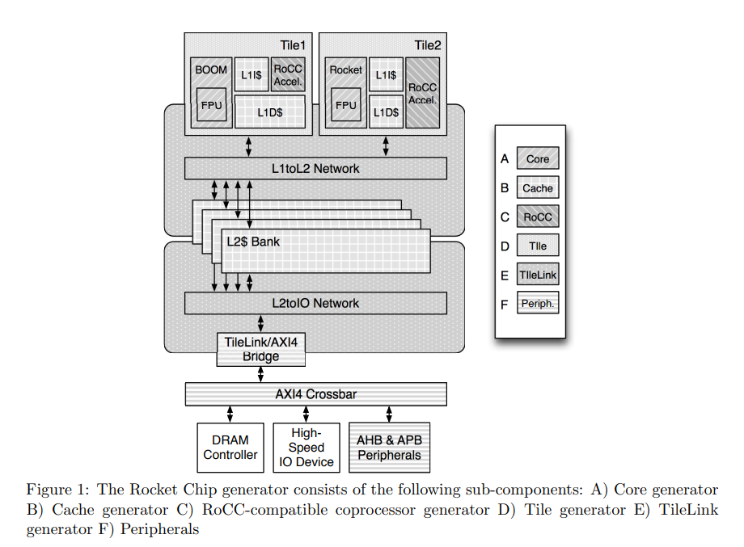
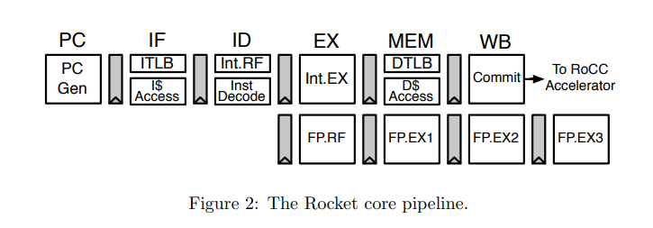

仓库地址：[chipsalliance/rocket-chip: Rocket Chip Generator (github.com)](https://github.com/chipsalliance/rocket-chip)

##### 仓库包含以下工具：
- 生成和测试 SoC 的工具
- 生成 RTL 的工具
- 

##### 子模块
- amba：使用外交生成 AMBA 协议的总线实现，包括AXI4、AHB-lite和APB
- config：提供了通过动态范围参数化库配置生成器的 Scala 接口
- coreplex：将来自其他包的各种组件粘贴在一起来生成一个完整的 core，包括：tiled rocket core、系统总线网络、一致性代理、调试设备、中断处理程序、面向外部的外围设备、时钟交叉器和从 TileLink 到外部总线协议(例如AXI或AHB)的转换器
- debug：包含外围设备的实现，包括 Debug 模块和各种 TL 从库
- groundtest：生成可合成的硬件测试器，它发射随机的内存访问流，对非核心内存层次结构进行压力测试
- jtag：提供了生成 jtag 总线接口的定义
- regmapper：生成带有标准化接口的从设备，用于访问它们的内存映射寄存器
- rocket：生成 rocket 的顺序流水线核心，以及L1指令和数据缓存。此库旨在由芯片生成器使用，该生成器实例化内存系统中的核心并将其连接到外部世界
- tile：包含了可以与 core 组合以构建 tile 的组件，例如fpu和加速器
- tilelink：使用外交来生成 tilelink 协议的总线实现。它还包含各种适配器和协议转换器
- system：调用 Chisel 来详细说明 core 的特定配置，附带适当的测试
- unittest：包含一个框架，用于生成单个模块的可合成硬件测试
- util：提供了各种常见的Scala和Chisel结构，可以在多个其他包中重用

- bootrom：第一阶段引导加载程序的源码
- csrc：用于 Verilator 模拟的 C 源代码
- vsim：Synopsys VCS 模拟编译和运行的目录
- vsrc：Verilog 源代码包含接口，控制和 VPI

### Technical Report

#### Rocket Chip supports three mechanisms for integrating accelerators
- 最简单和最紧密耦合的方案：扩展 RISC-V 并将加速器直接连接到 core pipeline
- 解耦合的方案：以协处理器的方式实现，通过 RoCC 接口接收指令和数据
- 完全解耦合的方案：以 tile 的形式，通过 TileLink 与内存系统连接

#### Rocket Core

#### TileLink
