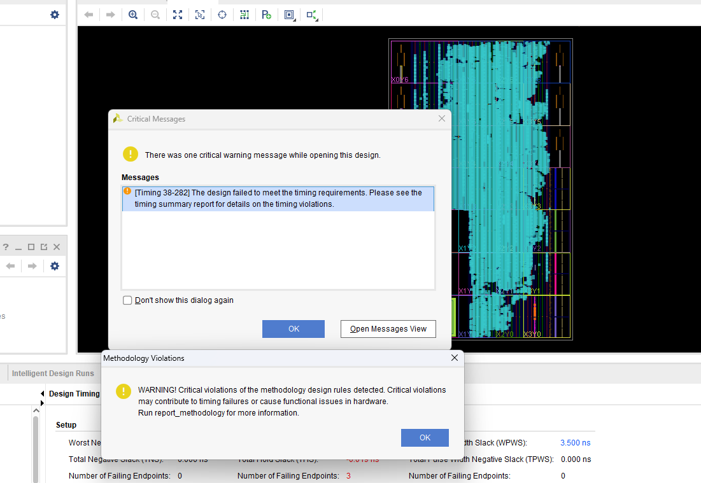

记录复现 rv-n-ext-impl 时遇到的问题。

**在尝试复现之前，建议先把 gcc 的版本降至 9，jdk 版本降至 1.8，不要试图使用更高版本的环境，否则会变得不幸。**


### Qemu 环境安装

按照这篇 [使用教程](https://gallium70.github.io/rv-n-ext-impl/ch6_0_user_guide.html) 的步骤进行操作，需要注意，在安装 qemu 时，配置参数需要增加额外的编译参数，指令如下：
```shell
../qemu/configure --target-list="riscv64-softmmu" --extra-cflags=-Wno-error  
make -j
```


### FPGA 部署

需要初始化 labled-RISC-V-N 子仓库，按照 [部署指南](https://github.com/LvNA-system/labeled-RISC-V/blob/master/fpga/README.md) 中的操作递归初始化时，会遇到 torture 下的 env 仓库无法初始化，需要将其 url 更新为 `https://github.com/riscv/riscv-test-env.git`。

接下来的步骤按照部署指南即可，需要注意，在执行 `make -j sw` 指令时，需要修改 `makefile.sw` 文件 112 行 交叉编译工具链为 `riscv64-unknown-linux-gnu-`，否则会出现错误。在其间，可能会遇到一些错误，部署指南上已经有相关的解决方案。

之后按照部署指南上的提示，即可运行模拟器，看到串口输出。


#### 构建 vivado 项目
按照 [部署指南](https://github.com/LvNA-system/labeled-RISC-V/blob/master/fpga/README.md#run-with-fpga) 的提示进行操作，目前仓库里已经增加了 zcu102 的补丁。

因为 `vivado` 安装在 `windows` 上，之前曾经在 `wsl` 上启动过 `windows` 下的 `vscode`，所以按照这个思路修改环境变量试图直接在 `wsl` 中启动 `window`s 下的 `vivado`，没有成功。

所以还是按照提示来进行，先在 lrv 的 fpga 目录中执行一遍 `make -C pardcore BOARD=zcu102` 指令，生成 pardcore，再下载到 windows 上。

因为我安装的 `vivado` 为 2022.2 版本，根据 [踩坑指南](https://github.com/Gallium70/labeled-RISC-V-reproduction-note#xilinx-%E7%9A%84%E5%B7%A5%E5%85%B7) 的提示，将所有 `tcl` 中的版本号改为 `2022.2`，而 `vivado2022.2` 上支持的 `zcu102` 的版本号是 3.4，而代码中的版本是 3.3，需要将 `mk.tcl` 以及 `board/zcu102/bd/prm.tcl` 中的版本号改成 3.4，再执行对应的 [makefile 指令](https://github.com/LvNA-system/labeled-RISC-V/blob/master/fpga/Makefile#L18)。这一步需要在 `windows` 中增加 `vivado` 的环境变量。

在产生了一堆警告之后，项目创建成功了。

```
PS E:\fpga> vivado -nolog -nojournal -notrace -mode batch -source board/zcu102/mk.tcl -tclargs myproject-zcu102

****** Vivado v2022.2 (64-bit)
  **** SW Build 3671981 on Fri Oct 14 05:00:03 MDT 2022
  **** IP Build 3669848 on Fri Oct 14 08:30:02 MDT 2022
    ** Copyright 1986-2022 Xilinx, Inc. All Rights Reserved.

source board/zcu102/mk.tcl -notrace
INFO: [BD_TCL-3] Currently there is no design <pardcore> in project, so creating one...
Wrote  : <E:\fpga\board\zcu102\build\myproject-zcu102\myproject-zcu102.srcs\sources_1\bd\pardcore\pardcore.bd>
INFO: [BD_TCL-4] Making design <pardcore> as current_bd_design.
INFO: [BD_TCL-5] Currently the variable <design_name> is equal to "pardcore".
INFO: [BD_TCL-6] Checking if the following IPs exist in the project's IP catalog:  xilinx.com:ip:c_shift_ram:12.0 xilinx.com:ip:xlconstant:1.1 xilinx.com:ip:xlslice:1.0  .
INFO: [BD_TCL-6] Checking if the following modules exist in the project's sources:  LvNAFPGATop  .
WARNING: [BD 5-670] It is required to provide a frequency value for a user created input clock port. Please use the <-freq_hz $freq_val> argument of the create_bd_port command. ie create_bd_port -dir I -type clk -freq_hz 100000000 clkin
INFO: [IP_Flow 19-5151] The Range '63:0' is present in all ports of the interface 'ila_csr_rw'. It is assumed that this is meant to declare an array of interface. If this is not the desired behaviour, switch of this feature by disabling the parameter 'ips.enableInterfaceArrayInference'.
INFO: [IP_Flow 19-5107] Inferred bus interface 'l2_frontend_bus_axi4_0' of definition 'xilinx.com:interface:aximm:1.0' (from Xilinx Repository).
INFO: [IP_Flow 19-5107] Inferred bus interface 'mem_axi4_0' of definition 'xilinx.com:interface:aximm:1.0' (from Xilinx Repository).
INFO: [IP_Flow 19-5107] Inferred bus interface 'mmio_axi4_0' of definition 'xilinx.com:interface:aximm:1.0' (from Xilinx Repository).
INFO: [IP_Flow 19-5107] Inferred bus interface 'debug_systemjtag_reset' of definition 'xilinx.com:signal:reset:1.0' (from Xilinx Repository).
INFO: [IP_Flow 19-5107] Inferred bus interface 'reset' of definition 'xilinx.com:signal:reset:1.0' (from Xilinx Repository).
INFO: [IP_Flow 19-5107] Inferred bus interface 'reset_to_hang_en' of definition 'xilinx.com:signal:reset:1.0' (from Xilinx Repository).
INFO: [IP_Flow 19-5107] Inferred bus interface 'clock' of definition 'xilinx.com:signal:clock:1.0' (from Xilinx Repository).
INFO: [IP_Flow 19-4728] Bus Interface 'clock': Added interface parameter 'ASSOCIATED_BUSIF' with value 'l2_frontend_bus_axi4_0'.
INFO: [IP_Flow 19-4728] Bus Interface 'clock': Added interface parameter 'ASSOCIATED_RESET' with value 'reset'.
INFO: [IP_Flow 19-234] Refreshing IP repositories
INFO: [IP_Flow 19-1704] No user IP repositories specified
INFO: [xilinx.com:ip:c_shift_ram:12.0-913] /c_shift_ram_1 Width has been set to manual on the GUI. It will not be updated during validation with a propagated value.
INFO: [xilinx.com:ip:c_shift_ram:12.0-913] /c_shift_ram_0 Width has been set to manual on the GUI. It will not be updated during validation with a propagated value.
WARNING: [BD 41-237] Bus Interface property AWUSER_WIDTH does not match between /LvNAFPGATop_0/l2_frontend_bus_axi4_0(0) and /S_AXI_DMA(5)
WARNING: [BD 41-237] Bus Interface property ARUSER_WIDTH does not match between /LvNAFPGATop_0/l2_frontend_bus_axi4_0(0) and /S_AXI_DMA(5)
WARNING: [BD 41-237] Bus Interface property WUSER_WIDTH does not match between /LvNAFPGATop_0/l2_frontend_bus_axi4_0(0) and /S_AXI_DMA(5)
WARNING: [BD 41-237] Bus Interface property RUSER_WIDTH does not match between /LvNAFPGATop_0/l2_frontend_bus_axi4_0(0) and /S_AXI_DMA(5)
WARNING: [BD 41-237] Bus Interface property BUSER_WIDTH does not match between /LvNAFPGATop_0/l2_frontend_bus_axi4_0(0) and /S_AXI_DMA(5)
CRITICAL WARNING: [BD 41-759] The input pins (listed below) are either not connected or do not have a source port, and they don't have a tie-off specified. These pins are tied-off to all 0's to avoid error in Implementation flow.
Please check your design and connect them as needed:
/LvNAFPGATop_0/l2_frontend_bus_axi4_0_awinstret
/LvNAFPGATop_0/l2_frontend_bus_axi4_0_arinstret

Wrote  : <E:\fpga\board\zcu102\build\myproject-zcu102\myproject-zcu102.srcs\sources_1\bd\pardcore\pardcore.bd>
INFO: [BD::TCL 103-2003] Currently there is no design <zynq_soc> in project, so creating one...
Wrote  : <E:\fpga\board\zcu102\build\myproject-zcu102\myproject-zcu102.srcs\sources_1\bd\zynq_soc\zynq_soc.bd>
INFO: [BD::TCL 103-2004] Making design <zynq_soc> as current_bd_design.
INFO: [BD::TCL 103-2005] Currently the variable <design_name> is equal to "zynq_soc".
INFO: [BD::TCL 103-2011] Checking if the following IPs exist in the project's IP catalog:  xilinx.com:ip:xlconcat:2.1 xilinx.com:ip:zynq_ultra_ps_e:3.4 xilinx.com:ip:clk_wiz:6.0 xilinx.com:ip:proc_sys_reset:5.0 xilinx.com:ip:axi_dma:7.1 xilinx.com:ip:axi_gpio:2.0 xilinx.com:ip:xlslice:1.0 xilinx.com:ip:axi_crossbar:2.1 xilinx.com:ip:axi_uart16550:2.0 xilinx.com:ip:axi_uartlite:2.0 xilinx.com:ip:axi_clock_converter:2.1  .
INFO: [BD::TCL 103-2020] Checking if the following modules exist in the project's sources:  axi_jtag_v1_0  .
create_bd_cell: Time (s): cpu = 00:00:04 ; elapsed = 00:00:19 . Memory (MB): peak = 2224.555 ; gain = 1032.250
INFO: [IP_Flow 19-5107] Inferred bus interface 's_axi' of definition 'xilinx.com:interface:aximm:1.0' (from Xilinx Repository).
INFO: [IP_Flow 19-5107] Inferred bus interface 's_axi_aresetn' of definition 'xilinx.com:signal:reset:1.0' (from Xilinx Repository).
INFO: [IP_Flow 19-5107] Inferred bus interface 's_axi_aclk' of definition 'xilinx.com:signal:clock:1.0' (from Xilinx Repository).
INFO: [IP_Flow 19-4728] Bus Interface 's_axi_aresetn': Added interface parameter 'POLARITY' with value 'ACTIVE_LOW'.
INFO: [IP_Flow 19-4728] Bus Interface 's_axi_aclk': Added interface parameter 'ASSOCIATED_BUSIF' with value 's_axi'.
INFO: [IP_Flow 19-4728] Bus Interface 's_axi_aclk': Added interface parameter 'ASSOCIATED_RESET' with value 's_axi_aresetn'.
INFO: [IP_Flow 19-234] Refreshing IP repositories
INFO: [IP_Flow 19-1704] No user IP repositories specified
WARNING: [BD 41-1306] The connection to interface pin </hier_prm_peripheral/GPIO_NOHYPE_SETTINGS/gpio_io_o> is being overridden by the user with net <GPIO_NOHYPE_SETTINGS_gpio_io_o>. This pin will not be connected as a part of interface connection <GPIO>.
WARNING: [BD 41-1306] The connection to interface pin </hier_prm_peripheral/pardcore_corerst/gpio_io_o> is being overridden by the user with net <axi_gpio_0_gpio_io_o>. This pin will not be connected as a part of interface connection <GPIO>.
WARNING: [BD 41-1306] The connection to interface pin </hier_uart/axi_uart16550_pardcore_1/sout> is being overridden by the user with net <axi_uart16550_1_sout>. This pin will not be connected as a part of interface connection <UART>.
WARNING: [BD 41-1306] The connection to interface pin </hier_uart/axi_uartlite_1/rx> is being overridden by the user with net <axi_uart16550_1_sout>. This pin will not be connected as a part of interface connection <UART>.
WARNING: [BD 41-1306] The connection to interface pin </hier_uart/axi_uart16550_pardcore_2/sout> is being overridden by the user with net <axi_uart16550_2_sout>. This pin will not be connected as a part of interface connection <UART>.
WARNING: [BD 41-1306] The connection to interface pin </hier_uart/axi_uartlite_2/rx> is being overridden by the user with net <axi_uart16550_2_sout>. This pin will not be connected as a part of interface connection <UART>.
WARNING: [BD 41-1306] The connection to interface pin </hier_uart/axi_uart16550_pardcore_3/sout> is being overridden by the user with net <axi_uart16550_3_sout>. This pin will not be connected as a part of interface connection <UART>.
WARNING: [BD 41-1306] The connection to interface pin </hier_uart/axi_uart16550_pardcore_4/sin> is being overridden by the user with net <axi_uart16550_3_sout>. This pin will not be connected as a part of interface connection <UART>.
WARNING: [BD 41-1306] The connection to interface pin </hier_uart/axi_uart16550_pardcore_3/sin> is being overridden by the user with net <axi_uart16550_4_sout>. This pin will not be connected as a part of interface connection <UART>.
WARNING: [BD 41-1306] The connection to interface pin </hier_uart/axi_uart16550_pardcore_4/sout> is being overridden by the user with net <axi_uart16550_4_sout>. This pin will not be connected as a part of interface connection <UART>.
WARNING: [BD 41-1306] The connection to interface pin </hier_uart/axi_uartlite_0/tx> is being overridden by the user with net <axi_uartlite_0_tx>. This pin will not be connected as a part of interface connection <UART>.
WARNING: [BD 41-1306] The connection to interface pin </hier_uart/axi_uartlite_pardcore_0/rx> is being overridden by the user with net <axi_uartlite_0_tx>. This pin will not be connected as a part of interface connection <UART>.
WARNING: [BD 41-1306] The connection to interface pin </hier_uart/axi_uart16550_pardcore_1/sin> is being overridden by the user with net <axi_uartlite_1_tx>. This pin will not be connected as a part of interface connection <UART>.
WARNING: [BD 41-1306] The connection to interface pin </hier_uart/axi_uartlite_1/tx> is being overridden by the user with net <axi_uartlite_1_tx>. This pin will not be connected as a part of interface connection <UART>.
WARNING: [BD 41-1306] The connection to interface pin </hier_uart/axi_uart16550_pardcore_2/sin> is being overridden by the user with net <axi_uartlite_2_tx>. This pin will not be connected as a part of interface connection <UART>.
WARNING: [BD 41-1306] The connection to interface pin </hier_uart/axi_uartlite_2/tx> is being overridden by the user with net <axi_uartlite_2_tx>. This pin will not be connected as a part of interface connection <UART>.
WARNING: [BD 41-1306] The connection to interface pin </hier_uart/axi_uartlite_0/rx> is being overridden by the user with net <axi_uartlite_pardcore_0_tx>. This pin will not be connected as a part of interface connection <UART>.
WARNING: [BD 41-1306] The connection to interface pin </hier_uart/axi_uartlite_pardcore_0/tx> is being overridden by the user with net <axi_uartlite_pardcore_0_tx>. This pin will not be connected as a part of interface connection <UART>.
Slave segment '/hier_prm_peripheral/GPIO_NOHYPE_SETTINGS/S_AXI/Reg' is being assigned into address space '/zynq_ultra_ps_e_0/Data' at <0x8000_4000 [ 4K ]>.
Slave segment '/M_AXI_SBUS/Reg' is being assigned into address space '/zynq_ultra_ps_e_0/Data' at <0x10_0000_0000 [ 64G ]>.
Slave segment '/hier_prm_peripheral/axi_dma_arm/S_AXI_LITE/Reg' is being assigned into address space '/zynq_ultra_ps_e_0/Data' at <0x8002_0000 [ 4K ]>.
Slave segment '/hier_prm_peripheral/axi_jtag_v1_0_0/s_axi/reg0' is being assigned into address space '/zynq_ultra_ps_e_0/Data' at <0x8001_1000 [ 4K ]>.
Slave segment '/hier_uart/axi_uartlite_0/S_AXI/Reg' is being assigned into address space '/zynq_ultra_ps_e_0/Data' at <0x8000_0000 [ 4K ]>.
Slave segment '/hier_uart/axi_uartlite_1/S_AXI/Reg' is being assigned into address space '/zynq_ultra_ps_e_0/Data' at <0x8000_1000 [ 4K ]>.
Slave segment '/hier_uart/axi_uartlite_2/S_AXI/Reg' is being assigned into address space '/zynq_ultra_ps_e_0/Data' at <0x8000_2000 [ 4K ]>.
Slave segment '/hier_uart/axi_uartlite_3/S_AXI/Reg' is being assigned into address space '/zynq_ultra_ps_e_0/Data' at <0x8000_3000 [ 4K ]>.
Slave segment '/hier_prm_peripheral/pardcore_corerst/S_AXI/Reg' is being assigned into address space '/zynq_ultra_ps_e_0/Data' at <0x8001_0000 [ 4K ]>.
Slave segment '/M_AXI_DMA/Reg' is being assigned into address space '/hier_parcore_peripheral/axi_dma_pardcore/Data_SG' at <0x000_0000_0000 [ 1T ]>.
Slave segment '/M_AXI_DMA/Reg' is being assigned into address space '/hier_parcore_peripheral/axi_dma_pardcore/Data_MM2S' at <0x000_0000_0000 [ 1T ]>.
Slave segment '/M_AXI_DMA/Reg' is being assigned into address space '/hier_parcore_peripheral/axi_dma_pardcore/Data_S2MM' at <0x000_0000_0000 [ 1T ]>.
Slave segment '/zynq_ultra_ps_e_0/SAXIGP2/HP0_DDR_LOW' is being assigned into address space '/hier_prm_peripheral/axi_dma_arm/Data_SG' at <0x0000_0000 [ 2G ]>.
Slave segment '/zynq_ultra_ps_e_0/SAXIGP2/HP0_DDR_LOW' is being assigned into address space '/hier_prm_peripheral/axi_dma_arm/Data_MM2S' at <0x0000_0000 [ 2G ]>.
Slave segment '/zynq_ultra_ps_e_0/SAXIGP2/HP0_DDR_LOW' is being assigned into address space '/hier_prm_peripheral/axi_dma_arm/Data_S2MM' at <0x0000_0000 [ 2G ]>.
Slave segment '/hier_parcore_peripheral/axi_dma_pardcore/S_AXI_LITE/Reg' is being assigned into address space '/S_AXI_MMIO' at <0x6001_0000 [ 4K ]>.
Slave segment '/hier_uart/axi_uart16550_pardcore_1/S_AXI/Reg' is being assigned into address space '/S_AXI_MMIO' at <0x6000_1000 [ 4K ]>.
Slave segment '/hier_uart/axi_uart16550_pardcore_2/S_AXI/Reg' is being assigned into address space '/S_AXI_MMIO' at <0x6000_2000 [ 4K ]>.
Slave segment '/hier_uart/axi_uart16550_pardcore_3/S_AXI/Reg' is being assigned into address space '/S_AXI_MMIO' at <0x6000_3000 [ 4K ]>.
Slave segment '/hier_uart/axi_uart16550_pardcore_4/S_AXI/Reg' is being assigned into address space '/S_AXI_MMIO' at <0x6000_4000 [ 4K ]>.
Slave segment '/hier_uart/axi_uartlite_pardcore_0/S_AXI/Reg' is being assigned into address space '/S_AXI_MMIO' at <0x6000_0000 [ 4K ]>.
Slave segment '/zynq_ultra_ps_e_0/SAXIGP2/HP0_DDR_LOW' is being assigned into address space '/S_AXI_MEM' at <0x8_0000_0000 [ 2G ]>.
Wrote  : <E:\fpga\board\zcu102\build\myproject-zcu102\myproject-zcu102.srcs\sources_1\bd\zynq_soc\zynq_soc.bd>
WARNING: [BD::TCL 103-2053] This Tcl script was generated from a block design that has not been validated. It is possible that design <zynq_soc> may result in errors during validation.
INFO: [Common 17-206] Exiting Vivado at Thu Mar 30 11:23:34 2023...
```

在进行综合时报了一堆错误，查看 errors，发现是因为 license 的原因，尝试获取 license。

直接点击生成比特流，自动运行了 implement 和 synthesis，但是在 synthesis 时出现了某些问题，查看 errors 发现，是因为内存用完了，在进行了多次综合子模块之后，总算把所有的模块综合出来了。在这里不要根据软件默认的提示选择 8 个线程，我选择了 4 个线程，在综合时没有出现内存用完的错误。

生成比特流时产生了警告，但是最终生成了 system_top.bit 文件。第一次没有开启压缩，导致生成的文件高达 250+M，在开启压缩之后，仅有 16M。



最后将 system_top.bit 文件上传到 zcu102 linux 系统的 /boot 目录，重启系统烧入比特流后，执行了 rCore-N，能够正常运行。至此，成功完成了部署。


