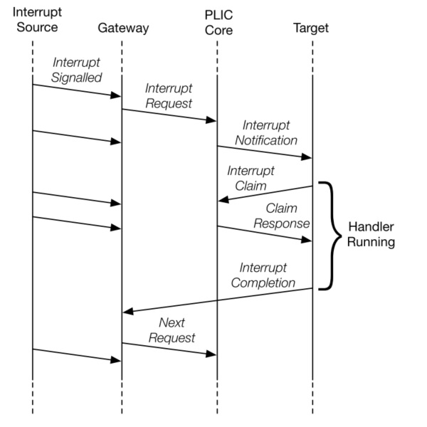
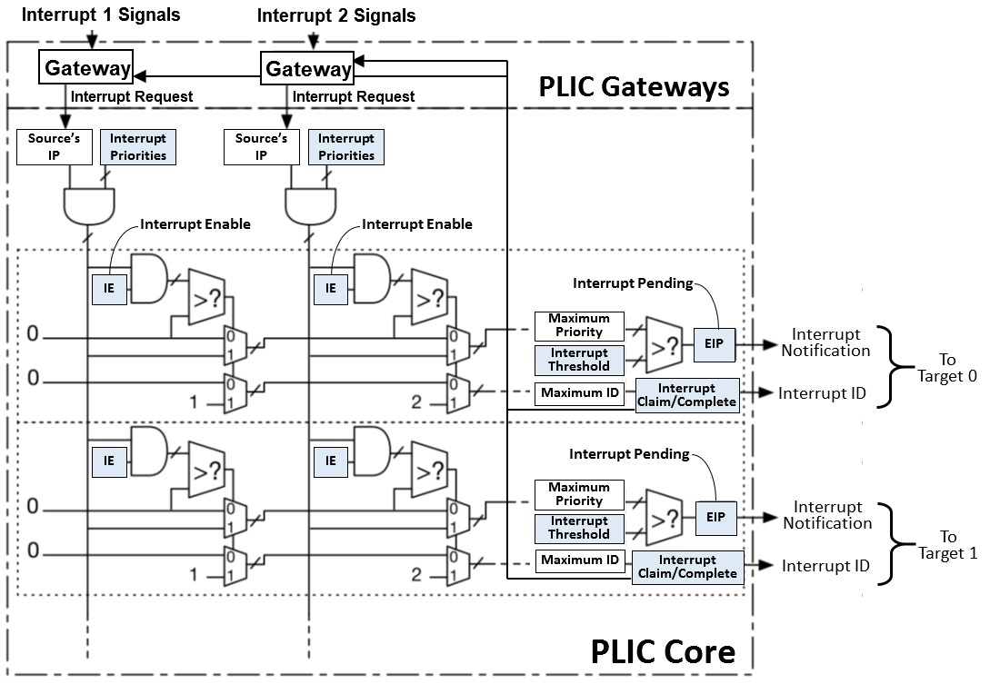

### PLIC 规范学习笔记

#### Interrupt Gateways

将全局中断信号转化成通用中断请求格式。同一时刻，同一中断源，只有一个中断被 PLIC 内核处理，在上一个中断被处理完成后，PLIC 内核发送中断完成消息后，gateway 才会转发下一个中断给 PLIC 内核。

#### Interrupt Notifications

每个 PLIC 内核通过 EIP 位表示是否存在中断等待处理。

中断多播保证能够最快得到响应。

EIP 中的值只保证在过去某一时刻存在中断，如果第一个目标响应了中断请求，但没有处理完成，则第二个目标仍可以响应中断，并且可以先于第一个目标 claim 中断，第一个目标 claim 时将会发现没有活跃的中断。

#### Interrupt Identifiers

每个中断一个 irq，从 1 开始，0 保留。当两个中断源的优先级相同时，id 越小优先级越高。

#### Interrupt Flow



#### RISC-V PLIC Operation Parameters



#### plic memory map

```
base + 0x000000: Reserved (interrupt source 0 does not exist)
base + 0x000004: Interrupt source 1 priority
base + 0x000008: Interrupt source 2 priority
...
base + 0x000FFC: Interrupt source 1023 priority
base + 0x001000: Interrupt Pending bit 0-31
base + 0x00107C: Interrupt Pending bit 992-1023
...
base + 0x002000: Enable bits for sources 0-31 on context 0
base + 0x002004: Enable bits for sources 32-63 on context 0
...
base + 0x00207C: Enable bits for sources 992-1023 on context 0
base + 0x002080: Enable bits for sources 0-31 on context 1
base + 0x002084: Enable bits for sources 32-63 on context 1
...
base + 0x0020FC: Enable bits for sources 992-1023 on context 1
base + 0x002100: Enable bits for sources 0-31 on context 2
base + 0x002104: Enable bits for sources 32-63 on context 2
...
base + 0x00217C: Enable bits for sources 992-1023 on context 2
...
base + 0x1F1F80: Enable bits for sources 0-31 on context 15871
base + 0x1F1F84: Enable bits for sources 32-63 on context 15871
base + 0x1F1FFC: Enable bits for sources 992-1023 on context 15871
...
base + 0x1FFFFC: Reserved
base + 0x200000: Priority threshold for context 0
base + 0x200004: Claim/complete for context 0
base + 0x200008: Reserved
...
base + 0x200FFC: Reserved
base + 0x201000: Priority threshold for context 1
base + 0x201004: Claim/complete for context 1
...
base + 0x3FFF000: Priority threshold for context 15871
base + 0x3FFF004: Claim/complete for context 15871
base + 0x3FFF008: Reserved
...
base + 0x3FFFFFC: Reserved
```

### rocket-chip plic 学习笔记

文件在目录 src/main/scala/device/tilelink/ 下。

Interrupt Gateway

```scala
class GatewayPLICIO extends Bundle {
  val valid = Bool(OUTPUT)
  val ready = Bool(INPUT)
  val complete = Bool(INPUT)
}

class LevelGateway extends Module {
  val io = new Bundle {
    val interrupt = Bool(INPUT)
    val plic = new GatewayPLICIO
  }

  val inFlight = Reg(init=Bool(false))
  when (io.interrupt && io.plic.ready) { inFlight := true }
  when (io.plic.complete) { inFlight := false }
  io.plic.valid := io.interrupt && !inFlight
}
```

MMIO 寄存器定义和一些常量

```scala
object PLICConsts
{
  def maxDevices = 1023
  def maxMaxHarts = 15872
  def priorityBase = 0x0
  def pendingBase = 0x1000
  def enableBase = 0x2000
  def hartBase = 0x200000

  def claimOffset = 4
  def priorityBytes = 4

  def enableOffset(i: Int) = i * ((maxDevices+7)/8)     // 计算 context i 的 enable 偏移
  def hartOffset(i: Int) = i * 0x1000
  def enableBase(i: Int):Int = enableOffset(i) + enableBase
  def hartBase(i: Int):Int = hartOffset(i) + hartBase

  // log2ceil 计算 log2(x)，暂时没明白这个计算的目的
  def size(maxHarts: Int): Int = {
    require(maxHarts > 0 && maxHarts <= maxMaxHarts, s"Must be: maxHarts=$maxHarts > 0 && maxHarts <= PLICConsts.maxMaxHarts=${PLICConsts.maxMaxHarts}")
    1 << log2Ceil(hartBase(maxHarts))
  }

  require(hartBase >= enableBase(maxMaxHarts))
}
```

