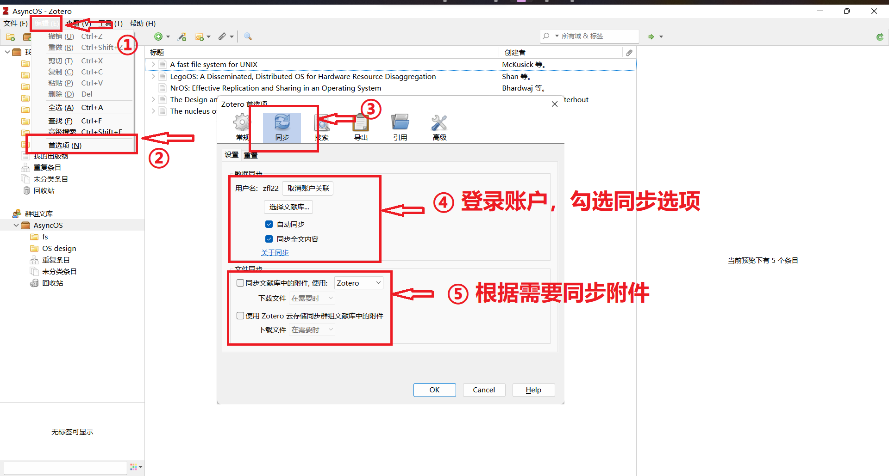
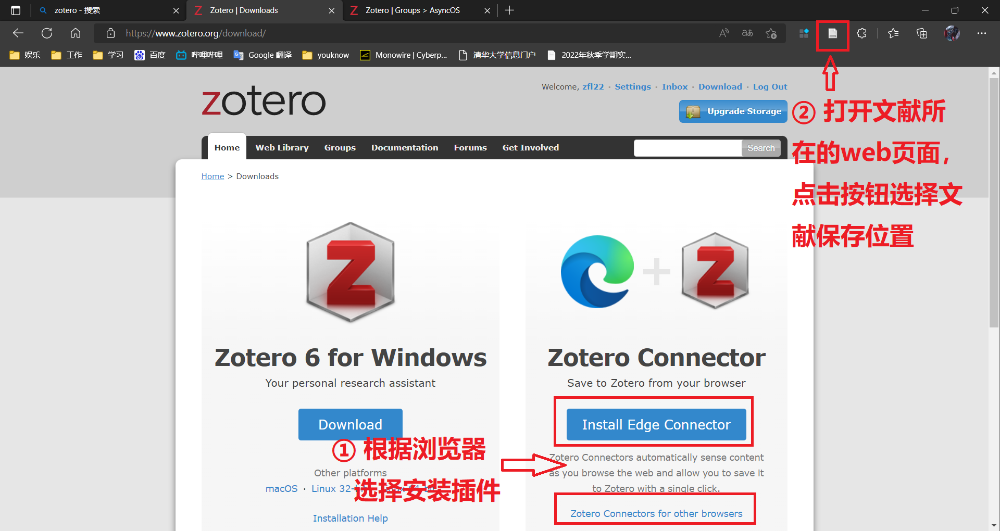
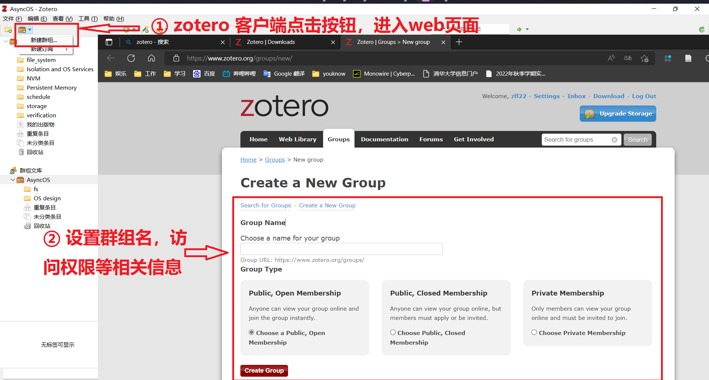
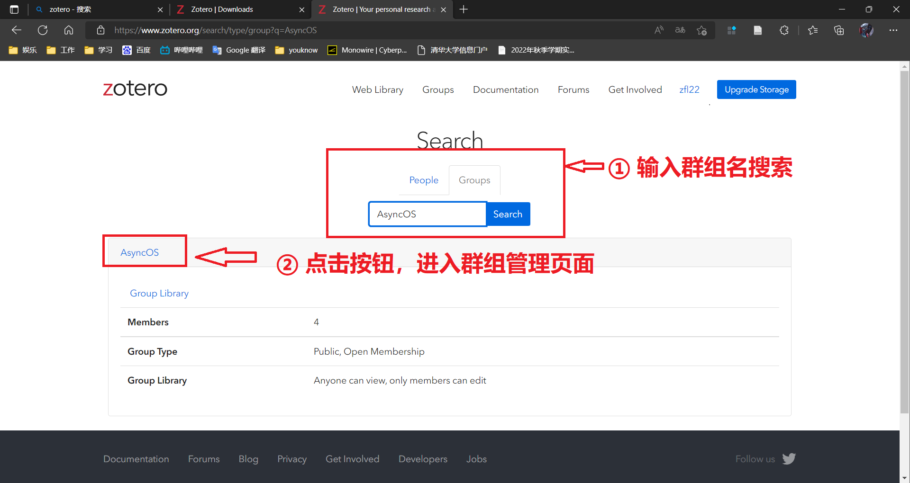
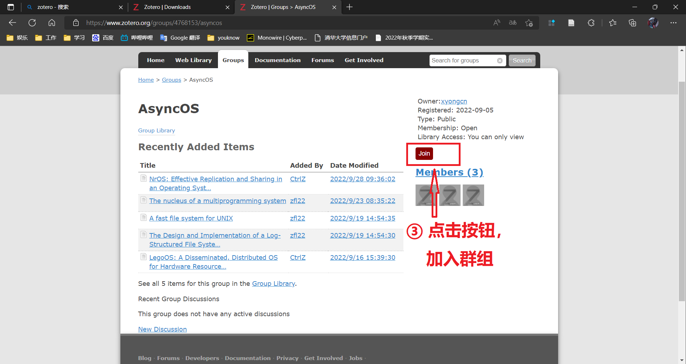
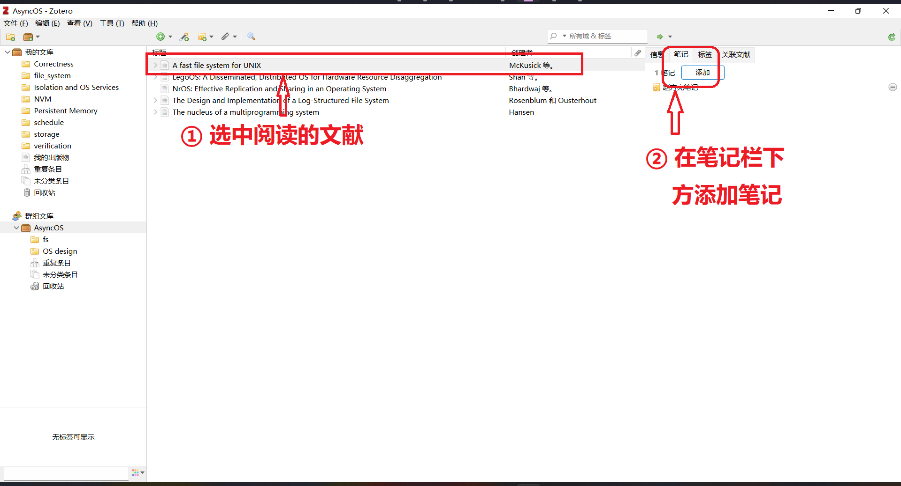

[TOC]

## zotero 文献<u>管理</u>、<u>共享</u>工具使用

### 下载以及安装

* 链接：[Zotero | Downloads](https://www.zotero.org/download/)

* 安装：默认设置即可

### 账户设置

### 通过插件从浏览器添加文献

* 在论文的官方网站或者其他网站打开的 pdf、markdown 等格式的，可以直接通过浏览器右上方的插件按钮即可直接选择保存分类目录

### 文献共享（需要添加组，或者创建组）

* 在软件左上方 "新建文献组" -> "新建群组"，进入网站之后，可以选择创建组，创建组之后共享文献（同上<u>通过插件从浏览器添加文献</u>）

* 通过搜索群组名加入已存在的群组

### 群组文献使用说明

1. 把文献添加到群组（同上<u>通过插件从浏览器添加文献</u>）

2. 单击文献，在右侧的笔记栏添加个人笔记，不要直接将自己的笔记当作文献添加进群组

    

3. 文献的链接部分，主要用于添加文献的代码仓库等

### Research Rabbit 配套插件

- 地址：[Research Rabbit (researchrabbitapp.com)](https://researchrabbitapp.com)

1. 注册之后，连接 zotero

   

2. 导入 zotero 文献

   

   

3. 查看文献相关工作等详细信息

   

   

   

