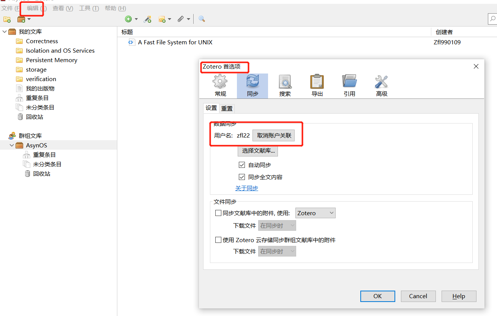
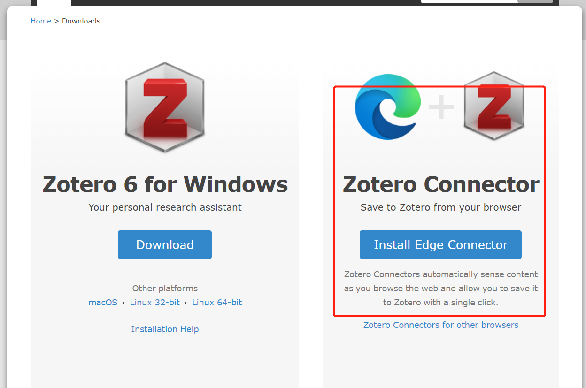
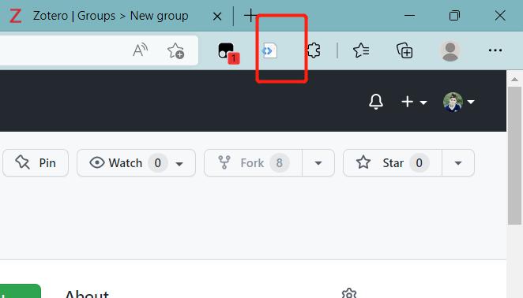
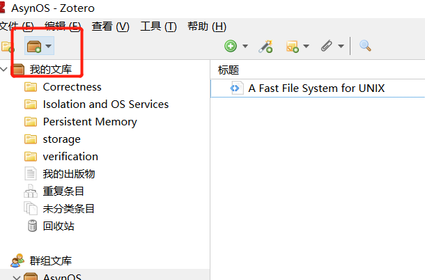
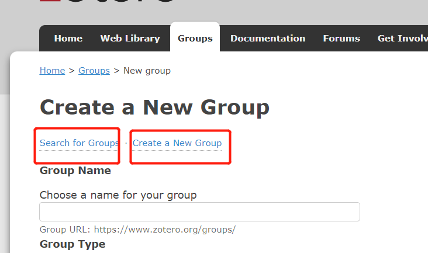

#### zotero 文献<u>管理</u>、<u>共享</u>工具使用

##### 下载以及安装

链接：[Zotero | Downloads](https://www.zotero.org/download/)

安装：默认设置即可

同步设置：软件上方 "编辑" -> "首选项" -> "同步"，输入账号信息

##### 文献管理（需要在下载安装界面，安装 Zotero Connector 浏览器插件）

在论文的官方网站或者其他网站打开的 pdf、markdown 等格式的，可以直接通过浏览器右上方的插件按钮即可直接选择保存分类目录

##### 文献共享（需要添加组，或者创建组）

在软件左上方 "新建文献组" -> "新建群组"，进入网站之后，可以选择创建组、或者搜索已经存在的组加入其中进行共享

添加组之后共享文献同上述文献管理

