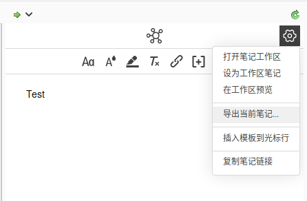

[TOC]

## zotero 文献<u>管理</u>、<u>共享</u>工具使用

### 下载以及安装

* 链接：[Zotero | Downloads](https://www.zotero.org/download/)

* 安装：默认设置即可

### 账户设置

### 通过插件从浏览器添加文献

* 在论文的官方网站或者其他网站打开的 pdf、markdown 等格式的，可以直接通过浏览器右上方的插件按钮即可直接选择保存分类目录

### 文献共享（需要添加组，或者创建组）

* 在软件左上方 "新建文献组" -> "新建群组"，进入网站之后，可以选择创建组，创建组之后共享文献（同上<u>通过插件从浏览器添加文献</u>）

* 通过搜索群组名加入已存在的群组

### 群组文献使用说明

1. 把文献添加到群组（同上<u>通过插件从浏览器添加文献</u>）（若插件添加文献后，信息不全，则需要手动补全 DOI 等信息）

2. 单击文献，在右侧的笔记栏添加个人笔记，不要直接将自己的笔记当作文献添加进群组

    

3. 文献的链接部分，主要用于添加文献的代码仓库等

### Research Rabbit 配套插件

- 地址：[Research Rabbit (researchrabbitapp.com)](https://researchrabbitapp.com)

1. 注册之后，连接 zotero

   

2. 导入 zotero 文献

   

   

3. 查看文献相关工作等详细信息

   

   

   
### zotero 插件

#### `pdf-translate` 
安装操作详见 https://github.com/windingwind/zotero-pdf-translate#readme

#### `better notes` 插件

安装操作与 `pdf-translate` 相同，github 仓库 https://github.com/windingwind/zotero-better-notes

##### 笔记同步

创建笔记后将其导出至目的路径下，需要设置自动同步。此后，记录文献笔记可直接在 zotero 中进行，并且目的路径下的文件也会进行同步，可以手动将本地备份的文件推送到 github

1. 导出笔记

2. 选择本地位置，可以是本地的 github 仓库，之后再手动推送至 github，这样即可保证 zotero 一份笔记，github 存在另一份备份。
   
3. 一旦导出的文件设置好同步之后，还可以利用 zotero 软件本身的多设备同步的特性。在图书馆看论文时，在 ipad 或者便携设备上记录的笔记，zotero 软件本身将会自动同步到宿舍的电脑上，宿舍电脑上的 zotero 再同步到宿舍电脑的本地仓库中（宿舍电脑需要打开 zotero）。

