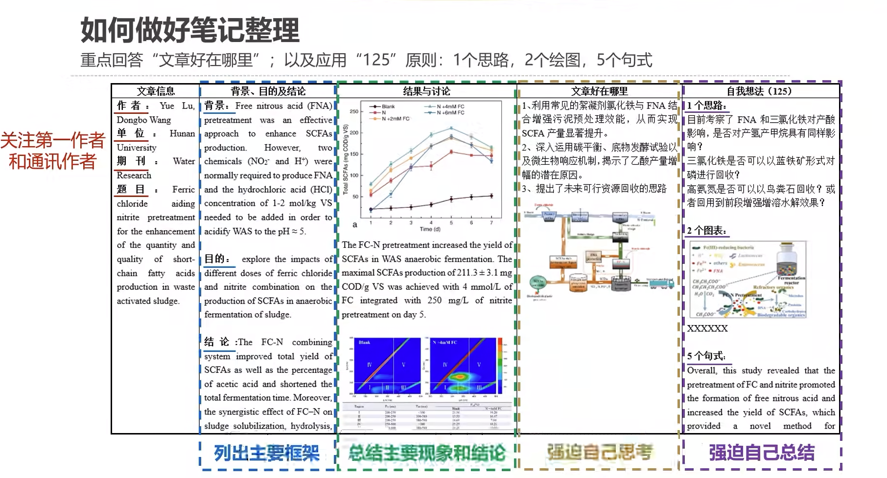

### 具备的素质

编成能力

英语能力

探索的好奇心

看论文的耐心

主动找答案的能力

### 选题

研究热门的方向、新的问题，新的研究方向、基于现成的题目，站在巨人的肩膀上

### 工具

sci 检索

DBLP 英文论文仓库

google scholar（科学上网）

github 找到论文源代码

### 文献阅读

硕博学位论文

领域大牛的文献综述（在展望与未来部分会提出领域当前的不足）

行业顶端最新论文

其他领域的前沿论文（其他领域的研究方法）

逻辑写作能力（多阅读顶刊）

缩小搜索范围 

- stork文献鸟（Storkapp.me）
- Connected Papers（Connectedpapers.com）
  - Prior Works：最常被引用的论文
  - Derivative Works：领域最新进展的垫脚石

计算机领域的核心期刊

- 计算机学报
- 软件学报
- 计算机科学与技术学报
- 计算机研究与发展
- 自动化学报
- 电子学报
- 通信学报
- 中国科学
